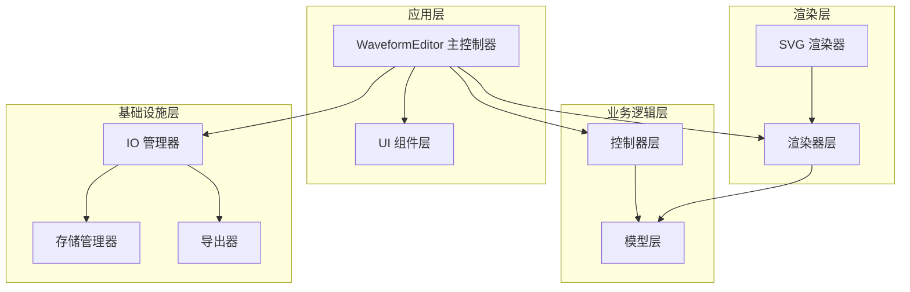
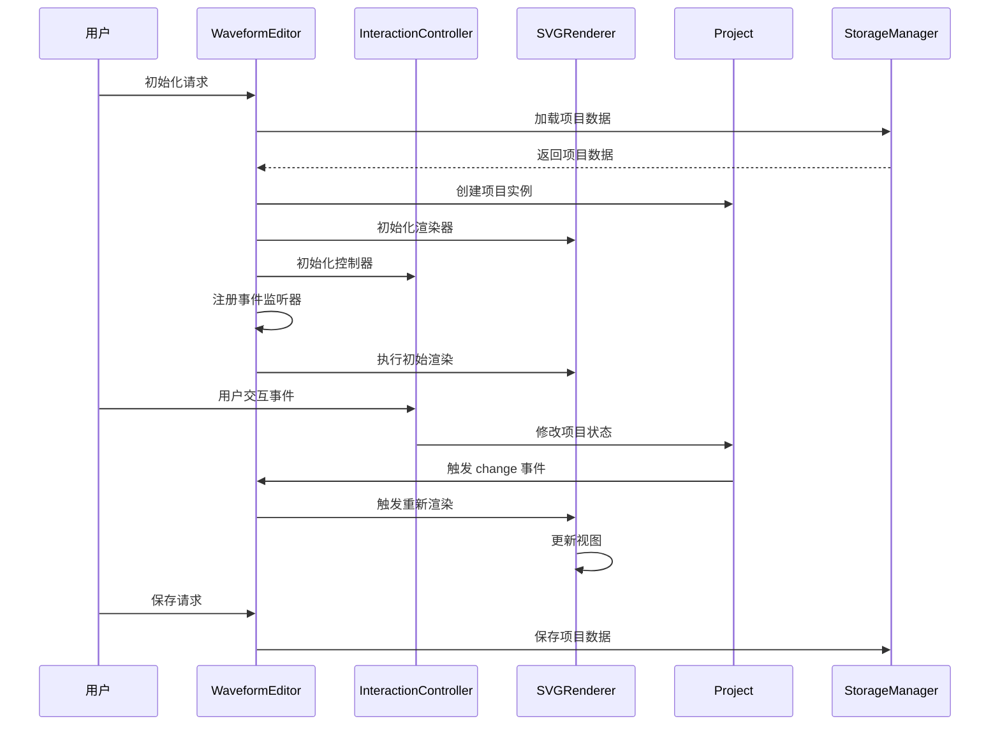
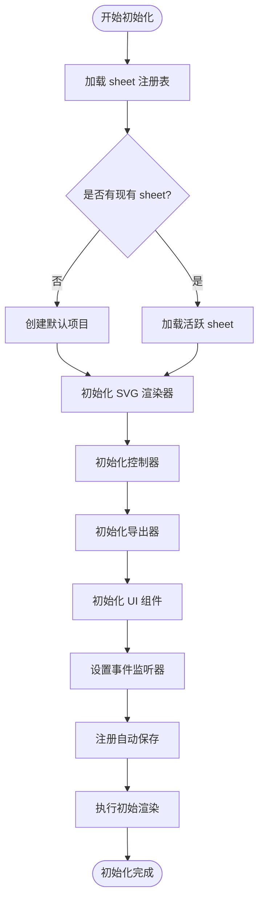
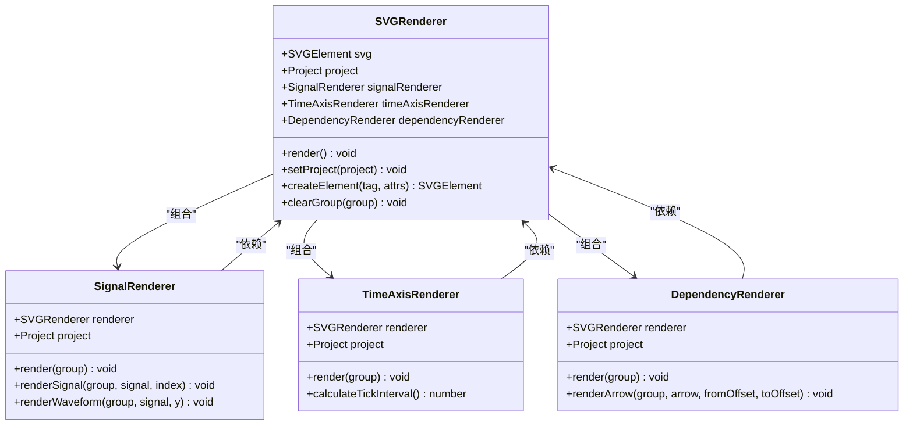
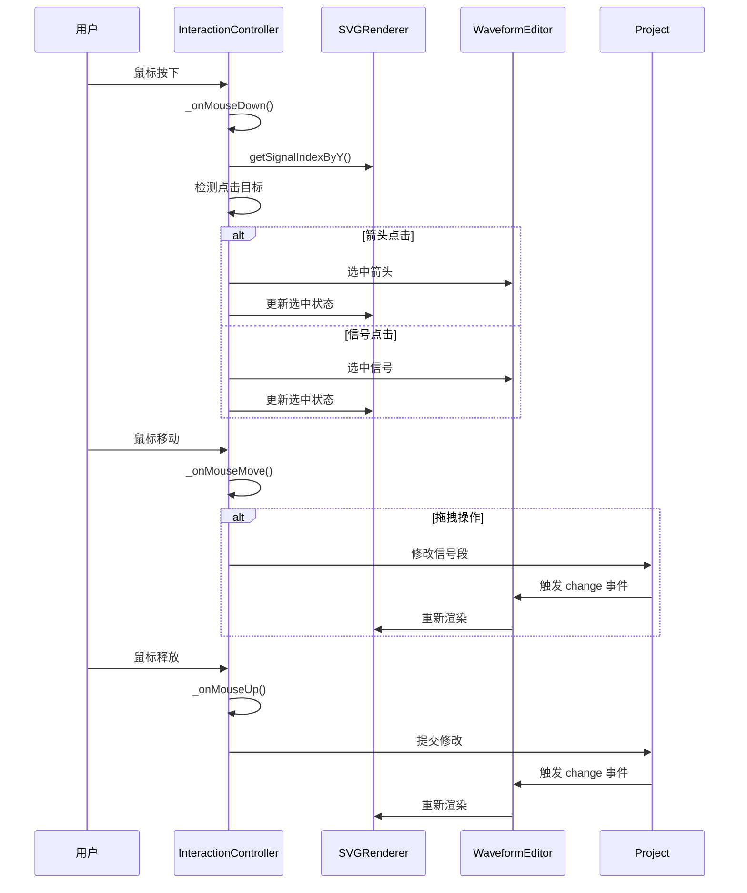
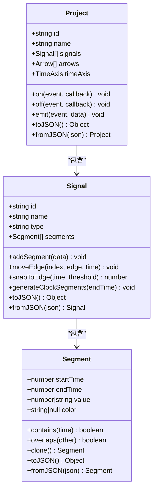
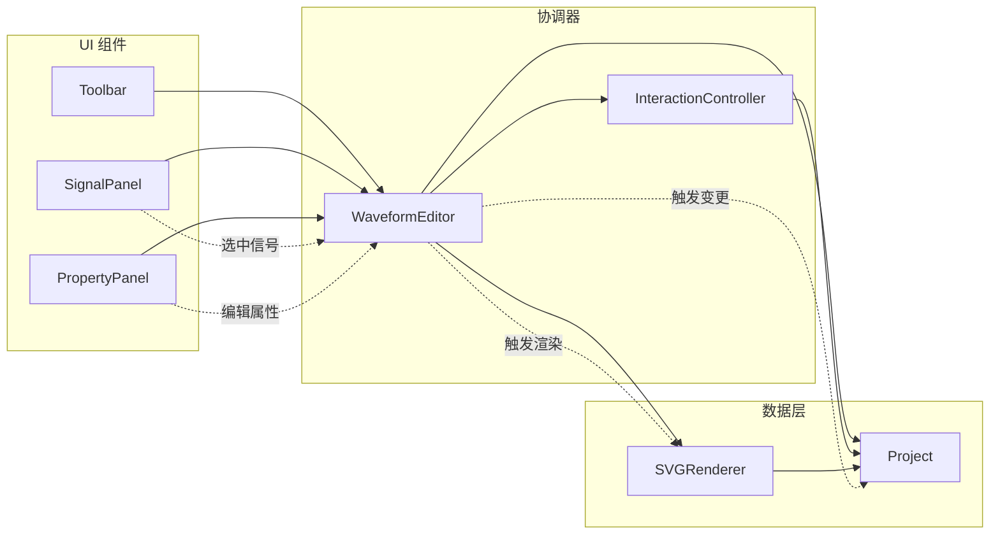
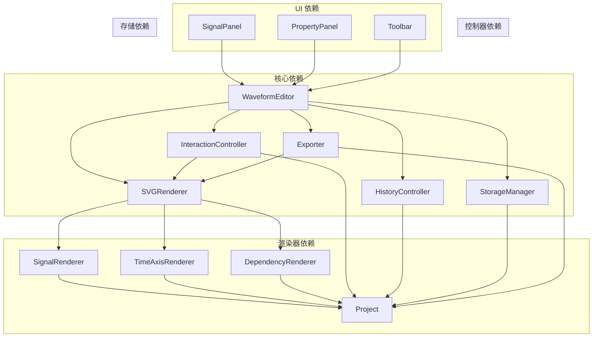

# 组件协调与调度机制

<cite>
**本文档引用的文件**
- [src/main.js](file://src/main.js)
- [src/controllers/InteractionController.js](file://src/controllers/InteractionController.js)
- [src/controllers/HistoryController.js](file://src/controllers/HistoryController.js)
- [src/renderers/SVGRenderer.js](file://src/renderers/SVGRenderer.js)
- [src/renderers/SignalRenderer.js](file://src/renderers/SignalRenderer.js)
- [src/renderers/DependencyRenderer.js](file://src/renderers/DependencyRenderer.js)
- [src/renderers/TimeAxisRenderer.js](file://src/renderers/TimeAxisRenderer.js)
- [src/ui/Toolbar.js](file://src/ui/Toolbar.js)
- [src/ui/SignalPanel.js](file://src/ui/SignalPanel.js)
- [src/ui/PropertyPanel.js](file://src/ui/PropertyPanel.js)
- [src/io/StorageManager.js](file://src/io/StorageManager.js)
- [src/io/Exporter.js](file://src/io/Exporter.js)
- [src/models/Project.js](file://src/models/Project.js)
- [src/models/Signal.js](file://src/models/Signal.js)
</cite>

## 目录
1. [简介](#简介)
2. [项目结构](#项目结构)
3. [核心组件](#核心组件)
4. [架构概览](#架构概览)
5. [详细组件分析](#详细组件分析)
6. [依赖关系分析](#依赖关系分析)
7. [性能考虑](#性能考虑)
8. [故障排除指南](#故障排除指南)
9. [结论](#结论)

## 简介

波形图编辑器是一个基于 Web 技术的可视化编辑工具，采用模块化架构设计。该系统的核心是主控制器 WaveformEditor，它负责协调渲染器、控制器、UI 组件和存储管理器之间的协作关系。系统通过清晰的组件边界和标准化的消息传递协议，实现了高效的组件间通信和状态管理。

## 项目结构

项目采用功能模块化的组织方式，主要分为以下层次：

**图表来源**
- [src/main.js:1-819](file://src/main.js#L1-L819)
- [src/renderers/SVGRenderer.js:1-547](file://src/renderers/SVGRenderer.js#L1-L547)

**章节来源**
- [src/main.js:1-819](file://src/main.js#L1-L819)

## 核心组件

### WaveformEditor 主控制器

WaveformEditor 是整个系统的中枢控制器，负责组件初始化、状态管理和协调工作。其核心职责包括：

- **组件初始化顺序管理**：严格按照项目加载、渲染器初始化、控制器初始化、UI 组件初始化的顺序进行
- **状态协调**：维护项目状态、选中状态和渲染状态的同步
- **消息路由**：作为组件间通信的中介，处理事件转发和状态同步
- **生命周期管理**：负责组件的创建、更新和销毁

### 渲染器体系

渲染器采用分层架构，每个渲染器专注于特定的渲染任务：

- **SVGRenderer**：主渲染器，协调各子渲染器的工作
- **SignalRenderer**：专门负责信号波形的渲染
- **TimeAxisRenderer**：负责时间轴的渲染
- **DependencyRenderer**：负责依赖箭头的渲染

### 控制器体系

控制器负责处理用户交互和业务逻辑：

- **InteractionController**：处理用户交互事件，如鼠标点击、拖拽等
- **HistoryController**：管理撤销/重做操作的历史记录

### UI 组件体系

UI 组件提供用户界面交互：

- **Toolbar**：工具栏组件
- **SignalPanel**：信号面板，显示和管理信号列表
- **PropertyPanel**：属性面板，显示和编辑选中对象的属性

### IO 管理器

IO 管理器负责数据持久化和导入导出：

- **StorageManager**：管理项目数据的存储和检索
- **Exporter**：负责数据导出功能

**章节来源**
- [src/main.js:21-44](file://src/main.js#L21-L44)
- [src/renderers/SVGRenderer.js:10-40](file://src/renderers/SVGRenderer.js#L10-L40)
- [src/controllers/InteractionController.js:6-27](file://src/controllers/InteractionController.js#L6-L27)

## 架构概览

系统采用 MVC（Model-View-Controller）模式的变体，结合事件驱动的设计模式：

**图表来源**
- [src/main.js:49-132](file://src/main.js#L49-L132)
- [src/controllers/InteractionController.js:52-82](file://src/controllers/InteractionController.js#L52-L82)
- [src/models/Project.js:199-202](file://src/models/Project.js#L199-L202)

## 详细组件分析

### WaveformEditor 初始化流程

WaveformEditor 的初始化遵循严格的顺序，确保组件间的依赖关系得到正确处理：

**图表来源**
- [src/main.js:49-132](file://src/main.js#L49-L132)

**章节来源**
- [src/main.js:49-132](file://src/main.js#L49-L132)

### 渲染器协调机制

SVGRenderer 作为主渲染器，负责协调各个子渲染器的工作：

**图表来源**
- [src/renderers/SVGRenderer.js:10-40](file://src/renderers/SVGRenderer.js#L10-L40)
- [src/renderers/SignalRenderer.js:6-16](file://src/renderers/SignalRenderer.js#L6-L16)
- [src/renderers/TimeAxisRenderer.js:6-15](file://src/renderers/TimeAxisRenderer.js#L6-L15)
- [src/renderers/DependencyRenderer.js:7-12](file://src/renderers/DependencyRenderer.js#L7-L12)

**章节来源**
- [src/renderers/SVGRenderer.js:10-40](file://src/renderers/SVGRenderer.js#L10-L40)
- [src/renderers/SignalRenderer.js:6-16](file://src/renderers/SignalRenderer.js#L6-L16)

### 交互控制器工作机制

InteractionController 负责处理用户的所有交互操作：

**图表来源**
- [src/controllers/InteractionController.js:84-184](file://src/controllers/InteractionController.js#L84-L184)
- [src/controllers/InteractionController.js:186-252](file://src/controllers/InteractionController.js#L186-L252)

**章节来源**
- [src/controllers/InteractionController.js:84-184](file://src/controllers/InteractionController.js#L84-L184)
- [src/controllers/InteractionController.js:186-252](file://src/controllers/InteractionController.js#L186-L252)

### 数据模型协调

Project 模型作为数据中心，负责管理所有波形数据的状态：

**图表来源**
- [src/models/Project.js:8-34](file://src/models/Project.js#L8-L34)
- [src/models/Signal.js:7-29](file://src/models/Signal.js#L7-L29)
- [src/models/Signal.js:14-28](file://src/models/Signal.js#L14-L28)

**章节来源**
- [src/models/Project.js:8-34](file://src/models/Project.js#L8-L34)
- [src/models/Signal.js:7-29](file://src/models/Signal.js#L7-L29)

### UI 组件协调

UI 组件通过 WaveformEditor 进行协调，实现状态同步：

**图表来源**
- [src/ui/Toolbar.js:1-6](file://src/ui/Toolbar.js#L1-L6)
- [src/ui/SignalPanel.js:1-164](file://src/ui/SignalPanel.js#L1-L164)
- [src/ui/PropertyPanel.js:1-507](file://src/ui/PropertyPanel.js#L1-L507)

**章节来源**
- [src/ui/Toolbar.js:1-6](file://src/ui/Toolbar.js#L1-L6)
- [src/ui/SignalPanel.js:1-164](file://src/ui/SignalPanel.js#L1-L164)
- [src/ui/PropertyPanel.js:1-507](file://src/ui/PropertyPanel.js#L1-L507)

## 依赖关系分析

系统采用松耦合的设计，通过接口和事件实现组件间的解耦：

**图表来源**
- [src/main.js:10-16](file://src/main.js#L10-L16)
- [src/renderers/SVGRenderer.js:34-36](file://src/renderers/SVGRenderer.js#L34-L36)
- [src/controllers/InteractionController.js:7-11](file://src/controllers/InteractionController.js#L7-L11)

**章节来源**
- [src/main.js:10-16](file://src/main.js#L10-L16)
- [src/renderers/SVGRenderer.js:34-36](file://src/renderers/SVGRenderer.js#L34-L36)

## 性能考虑

系统在设计时充分考虑了性能优化：

### 渲染优化
- **增量渲染**：只更新发生变化的部分，避免全量重绘
- **虚拟滚动**：大量信号时采用虚拟滚动技术
- **GPU 加速**：利用 CSS transform 和 SVG 的硬件加速能力

### 内存管理
- **对象池**：复用 SVG 元素对象，减少内存分配
- **事件委托**：使用事件委托减少事件监听器数量
- **懒加载**：延迟加载非必要的组件

### 事件处理
- **节流/防抖**：对高频事件（如窗口大小变化）进行节流处理
- **RAF 优化**：使用 requestAnimationFrame 优化动画性能

## 故障排除指南

### 常见问题及解决方案

**问题：渲染异常或显示错误**
- 检查 SVG 元素是否存在且正确初始化
- 验证项目数据的完整性和一致性
- 确认渲染器配置参数的正确性

**问题：交互响应迟缓**
- 检查事件监听器是否过多或重复绑定
- 验证是否有不必要的重排重绘
- 确认是否启用了适当的节流机制

**问题：数据丢失或损坏**
- 检查 StorageManager 的数据存储状态
- 验证项目序列化/反序列化的正确性
- 确认历史记录的完整性

**章节来源**
- [src/main.js:226-241](file://src/main.js#L226-L241)
- [src/io/StorageManager.js:138-164](file://src/io/StorageManager.js#L138-L164)

## 结论

波形图编辑器的组件协调机制体现了现代前端架构的最佳实践。通过明确的职责分离、标准化的消息传递协议和灵活的扩展点设计，系统实现了高度的模块化和可维护性。

### 设计优势

1. **清晰的层次结构**：从主控制器到具体组件的层级设计，便于理解和维护
2. **松耦合设计**：通过事件和接口实现组件间的解耦，提高系统的灵活性
3. **标准化协议**：统一的事件处理和状态管理模式，降低组件间的复杂度
4. **可扩展性**：良好的扩展点设计，支持新功能的快速集成

### 改进建议

1. **性能监控**：添加性能指标监控，及时发现性能瓶颈
2. **错误边界**：增强错误处理机制，提高系统的健壮性
3. **测试覆盖**：增加单元测试和集成测试，确保代码质量
4. **文档完善**：补充详细的 API 文档和架构说明

该系统为复杂的波形图编辑需求提供了坚实的技术基础，其设计理念和实现方式可以作为其他可视化编辑器项目的参考模板。