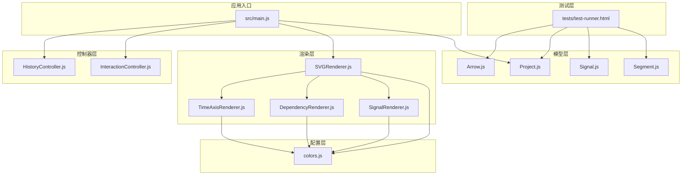
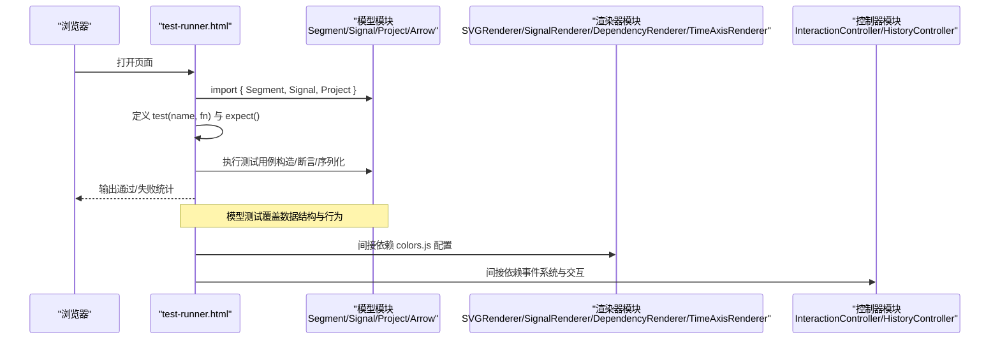
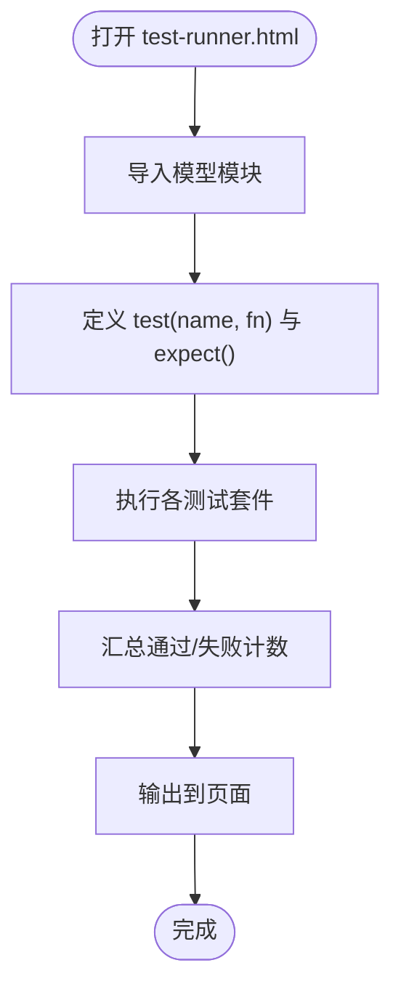
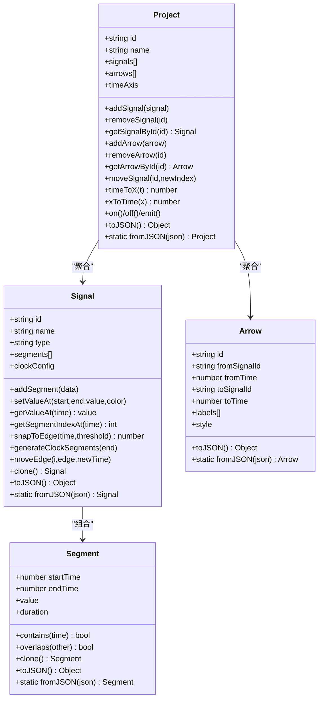
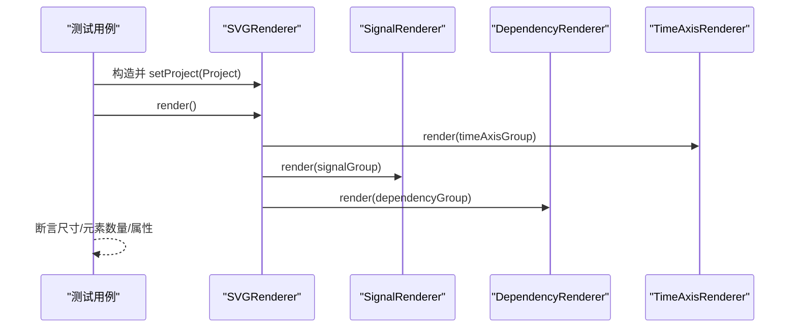
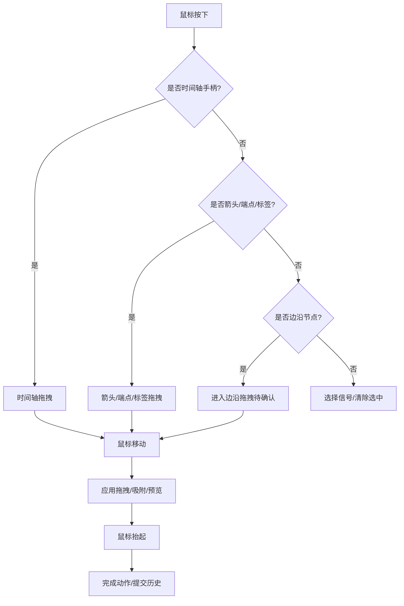
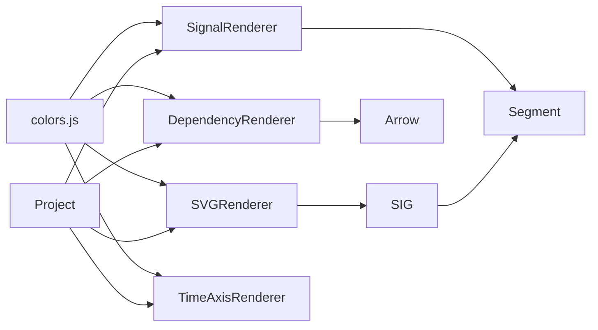

# 测试与质量保证

<cite>
**本文引用的文件**   
- [tests/test-runner.html](file://tests/test-runner.html)
- [src/main.js](file://src/main.js)
- [src/models/Segment.js](file://src/models/Segment.js)
- [src/models/Signal.js](file://src/models/Signal.js)
- [src/models/Project.js](file://src/models/Project.js)
- [src/models/Arrow.js](file://src/models/Arrow.js)
- [src/renderers/SVGRenderer.js](file://src/renderers/SVGRenderer.js)
- [src/renderers/SignalRenderer.js](file://src/renderers/SignalRenderer.js)
- [src/renderers/DependencyRenderer.js](file://src/renderers/DependencyRenderer.js)
- [src/renderers/TimeAxisRenderer.js](file://src/renderers/TimeAxisRenderer.js)
- [src/controllers/InteractionController.js](file://src/controllers/InteractionController.js)
- [src/controllers/HistoryController.js](file://src/controllers/HistoryController.js)
- [src/config/colors.js](file://src/config/colors.js)
</cite>

## 目录
1. [简介](#简介)
2. [项目结构](#项目结构)
3. [核心组件](#核心组件)
4. [架构总览](#架构总览)
5. [详细组件分析](#详细组件分析)
6. [依赖分析](#依赖分析)
7. [性能考虑](#性能考虑)
8. [故障排查指南](#故障排查指南)
9. [结论](#结论)
10. [附录](#附录)

## 简介
本文件面向波形图编辑器的测试与质量保证，系统性地阐述测试框架设计与实现、测试套件组织、测试运行器使用方法、覆盖率与性能指标建议、质量门禁标准、测试用例编写指南及自动化流程，并给出测试数据准备与测试环境配置方法。内容兼顾模型与渲染器两类组件，帮助开发者快速建立可靠的测试体系。

## 项目结构
- 测试入口与运行器位于 tests/test-runner.html，负责加载模型与渲染器模块，执行断言与统计结果。
- 源码主要分为模型层（Segment、Signal、Project、Arrow）、渲染层（SVGRenderer、SignalRenderer、DependencyRenderer、TimeAxisRenderer）、控制器层（InteractionController、HistoryController）与配置层（colors.js）。
- 应用入口 src/main.js 负责装配项目、渲染器、控制器、UI 组件与事件绑定，是端到端测试的重要目标。

**图表来源**
- [tests/test-runner.html:16-309](file://tests/test-runner.html#L16-L309)
- [src/models/Segment.js:1-94](file://src/models/Segment.js#L1-L94)
- [src/models/Signal.js:1-343](file://src/models/Signal.js#L1-L343)
- [src/models/Project.js:1-245](file://src/models/Project.js#L1-L245)
- [src/models/Arrow.js:1-114](file://src/models/Arrow.js#L1-L114)
- [src/renderers/SVGRenderer.js:1-547](file://src/renderers/SVGRenderer.js#L1-L547)
- [src/renderers/SignalRenderer.js:1-501](file://src/renderers/SignalRenderer.js#L1-L501)
- [src/renderers/DependencyRenderer.js:1-290](file://src/renderers/DependencyRenderer.js#L1-L290)
- [src/renderers/TimeAxisRenderer.js:1-132](file://src/renderers/TimeAxisRenderer.js#L1-L132)
- [src/controllers/InteractionController.js:1-800](file://src/controllers/InteractionController.js#L1-L800)
- [src/controllers/HistoryController.js:1-56](file://src/controllers/HistoryController.js#L1-L56)
- [src/config/colors.js:1-83](file://src/config/colors.js#L1-L83)
- [src/main.js:1-819](file://src/main.js#L1-L819)

**章节来源**
- [tests/test-runner.html:16-309](file://tests/test-runner.html#L16-L309)
- [src/main.js:1-819](file://src/main.js#L1-L819)

## 核心组件
- 测试运行器 test-runner.html
  - 提供基础断言工具 expect（toBe、notToBe、toBeGreaterThan）与 test(name, fn) 包装器。
  - 集成 Segment、Signal、Project 的单元测试套件，输出通过/失败计数与失败详情。
  - 适合本地开发调试与快速回归验证。
- 模型层
  - Segment：波形段数据结构与序列化。
  - Signal：信号模型，包含段合并、时钟生成、值查询、边界吸附、移动边沿等。
  - Project：项目聚合，包含信号、箭头、时间轴、事件系统与序列化。
  - Arrow：依赖箭头，支持多标签、样式与方向。
- 渲染层
  - SVGRenderer：协调各子渲染器，维护尺寸、裁剪与主容器。
  - SignalRenderer：渲染波形、跳变沿、X/Z 态、总线样式与分隔符。
  - DependencyRenderer：渲染依赖箭头、标签与命中区域。
  - TimeAxisRenderer：渲染时间轴刻度与拖拽手柄。
- 控制器层
  - InteractionController：交互逻辑（拖拽、创建箭头、编辑标签、时间轴缩放、删除等）。
  - HistoryController：撤销/重做栈管理。
- 配置层
  - colors.js：集中管理颜色与渲染配置，供渲染器与交互使用。

**章节来源**
- [tests/test-runner.html:25-55](file://tests/test-runner.html#L25-L55)
- [src/models/Segment.js:1-94](file://src/models/Segment.js#L1-L94)
- [src/models/Signal.js:1-343](file://src/models/Signal.js#L1-L343)
- [src/models/Project.js:1-245](file://src/models/Project.js#L1-L245)
- [src/models/Arrow.js:1-114](file://src/models/Arrow.js#L1-L114)
- [src/renderers/SVGRenderer.js:1-547](file://src/renderers/SVGRenderer.js#L1-L547)
- [src/renderers/SignalRenderer.js:1-501](file://src/renderers/SignalRenderer.js#L1-L501)
- [src/renderers/DependencyRenderer.js:1-290](file://src/renderers/DependencyRenderer.js#L1-L290)
- [src/renderers/TimeAxisRenderer.js:1-132](file://src/renderers/TimeAxisRenderer.js#L1-L132)
- [src/controllers/InteractionController.js:1-800](file://src/controllers/InteractionController.js#L1-L800)
- [src/controllers/HistoryController.js:1-56](file://src/controllers/HistoryController.js#L1-L56)
- [src/config/colors.js:1-83](file://src/config/colors.js#L1-L83)

## 架构总览
测试与被测代码的交互关系如下：

**图表来源**
- [tests/test-runner.html:16-309](file://tests/test-runner.html#L16-L309)
- [src/models/Segment.js:1-94](file://src/models/Segment.js#L1-L94)
- [src/models/Signal.js:1-343](file://src/models/Signal.js#L1-L343)
- [src/models/Project.js:1-245](file://src/models/Project.js#L1-L245)
- [src/models/Arrow.js:1-114](file://src/models/Arrow.js#L1-L114)
- [src/renderers/SVGRenderer.js:1-547](file://src/renderers/SVGRenderer.js#L1-L547)
- [src/renderers/SignalRenderer.js:1-501](file://src/renderers/SignalRenderer.js#L1-L501)
- [src/renderers/DependencyRenderer.js:1-290](file://src/renderers/DependencyRenderer.js#L1-L290)
- [src/renderers/TimeAxisRenderer.js:1-132](file://src/renderers/TimeAxisRenderer.js#L1-L132)
- [src/controllers/InteractionController.js:1-800](file://src/controllers/InteractionController.js#L1-L800)
- [src/controllers/HistoryController.js:1-56](file://src/controllers/HistoryController.js#L1-L56)
- [src/config/colors.js:1-83](file://src/config/colors.js#L1-L83)

## 详细组件分析

### 测试运行器 test-runner.html
- 设计要点
  - 采用模块化导入，直接 import 源码中的模型类进行测试。
  - 提供轻量断言 expect，覆盖相等性、不等性与数值比较。
  - 以 DOM 动态输出测试结果，便于本地查看。
- 使用方法
  - 在浏览器中打开 tests/test-runner.html，即可运行全部模型测试。
  - 如需新增测试，可在相应测试套件区域追加 test(...) 调用。
- 适用范围
  - 适合模型层与渲染器依赖配置层的单元测试。
  - 不包含端到端测试（如与 UI 交互、文件导入导出等）。

**图表来源**
- [tests/test-runner.html:16-309](file://tests/test-runner.html#L16-L309)

**章节来源**
- [tests/test-runner.html:16-309](file://tests/test-runner.html#L16-L309)

### 模型测试策略
- Segment 测试关注点
  - 构造参数默认值与传入值一致性。
  - 持续时间计算、包含判断、重叠检测。
  - 克隆与序列化往返一致性。
  - 非法起止时间的异常抛出。
- Signal 测试关注点
  - 构造与默认属性、时钟信号生成。
  - 段添加与自动合并、值设置区间、边界吸附。
  - 值查询、索引定位、移动边沿。
  - 克隆与序列化往返。
- Project 测试关注点
  - 构造与默认属性、信号/箭头增删改查。
  - 事件系统（on/off/emit）与变更通知。
  - 时间轴转换（timeToX/xToTime）、信号顺序移动。
  - 序列化往返。
- Arrow 测试关注点
  - 构造与 ID 生成、标签集合管理。
  - 样式与方向属性、序列化往返。

**图表来源**
- [src/models/Segment.js:1-94](file://src/models/Segment.js#L1-L94)
- [src/models/Signal.js:1-343](file://src/models/Signal.js#L1-L343)
- [src/models/Project.js:1-245](file://src/models/Project.js#L1-L245)
- [src/models/Arrow.js:1-114](file://src/models/Arrow.js#L1-L114)

**章节来源**
- [tests/test-runner.html:57-304](file://tests/test-runner.html#L57-L304)
- [src/models/Segment.js:1-94](file://src/models/Segment.js#L1-L94)
- [src/models/Signal.js:1-343](file://src/models/Signal.js#L1-L343)
- [src/models/Project.js:1-245](file://src/models/Project.js#L1-L245)
- [src/models/Arrow.js:1-114](file://src/models/Arrow.js#L1-L114)

### 渲染器测试策略
- 配置与尺寸
  - 验证渲染器配置项（边距、信号高度、波形高度）对尺寸计算的影响。
  - 验证时间轴扩展与时钟信号同步更新。
- 信号渲染
  - 验证不同电平（0/1/Z/X/总线）渲染路径与样式。
  - 验证跳变沿节点、分隔符遮罩与命中区域。
- 依赖箭头
  - 验证多箭头同起点/同终点偏移、方向与样式。
  - 验证标签文本与命中区域。
- 时间轴
  - 验证刻度间隔计算与标签渲染。

**图表来源**
- [src/renderers/SVGRenderer.js:284-314](file://src/renderers/SVGRenderer.js#L284-L314)
- [src/renderers/SignalRenderer.js:22-316](file://src/renderers/SignalRenderer.js#L22-L316)
- [src/renderers/DependencyRenderer.js:18-84](file://src/renderers/DependencyRenderer.js#L18-L84)
- [src/renderers/TimeAxisRenderer.js:21-108](file://src/renderers/TimeAxisRenderer.js#L21-L108)

**章节来源**
- [src/renderers/SVGRenderer.js:194-243](file://src/renderers/SVGRenderer.js#L194-L243)
- [src/renderers/SignalRenderer.js:201-316](file://src/renderers/SignalRenderer.js#L201-L316)
- [src/renderers/DependencyRenderer.js:93-265](file://src/renderers/DependencyRenderer.js#L93-L265)
- [src/renderers/TimeAxisRenderer.js:47-131](file://src/renderers/TimeAxisRenderer.js#L47-L131)

### 交互与历史测试策略
- 交互控制器
  - 验证时间轴拖拽、箭头创建/端点/标签拖拽、分隔符拖拽、删除键处理。
  - 验证吸附逻辑与预览渲染。
- 历史控制器
  - 验证撤销/重做栈容量、动作执行与清空。

**图表来源**
- [src/controllers/InteractionController.js:84-337](file://src/controllers/InteractionController.js#L84-L337)
- [src/controllers/HistoryController.js:13-55](file://src/controllers/HistoryController.js#L13-L55)

**章节来源**
- [src/controllers/InteractionController.js:84-337](file://src/controllers/InteractionController.js#L84-L337)
- [src/controllers/HistoryController.js:13-55](file://src/controllers/HistoryController.js#L13-L55)

## 依赖分析
- 模块耦合
  - 渲染器依赖配置层（colors.js）提供颜色与渲染配置。
  - SVGRenderer 协调 SignalRenderer、DependencyRenderer、TimeAxisRenderer。
  - 交互控制器依赖模型与渲染器进行状态更新与渲染触发。
- 外部依赖
  - 浏览器原生 SVG API 与事件系统。
  - 本地存储（localStorage）用于模板与项目持久化（在应用入口中体现）。

**图表来源**
- [src/config/colors.js:1-83](file://src/config/colors.js#L1-L83)
- [src/renderers/SVGRenderer.js:5-40](file://src/renderers/SVGRenderer.js#L5-L40)
- [src/renderers/SignalRenderer.js:4](file://src/renderers/SignalRenderer.js#L4)
- [src/renderers/DependencyRenderer.js:5](file://src/renderers/DependencyRenderer.js#L5)
- [src/renderers/TimeAxisRenderer.js:4](file://src/renderers/TimeAxisRenderer.js#L4)
- [src/models/Project.js:5-34](file://src/models/Project.js#L5-L34)
- [src/models/Signal.js:5](file://src/models/Signal.js#L5)
- [src/models/Arrow.js:5](file://src/models/Arrow.js#L5)

**章节来源**
- [src/config/colors.js:1-83](file://src/config/colors.js#L1-L83)
- [src/renderers/SVGRenderer.js:5-40](file://src/renderers/SVGRenderer.js#L5-L40)
- [src/renderers/SignalRenderer.js:4](file://src/renderers/SignalRenderer.js#L4)
- [src/renderers/DependencyRenderer.js:5](file://src/renderers/DependencyRenderer.js#L5)
- [src/renderers/TimeAxisRenderer.js:4](file://src/renderers/TimeAxisRenderer.js#L4)
- [src/models/Project.js:5-34](file://src/models/Project.js#L5-L34)
- [src/models/Signal.js:5](file://src/models/Signal.js#L5)
- [src/models/Arrow.js:5](file://src/models/Arrow.js#L5)

## 性能考虑
- 单元测试性能
  - 优先使用小规模数据集（少量信号/段）构造测试，避免长时间渲染。
  - 对涉及时间轴扩展与时钟生成的测试，控制 end 时间与周期，减少循环次数。
- 渲染器性能
  - 批量断言尺寸与元素数量，避免逐像素比对。
  - 对复杂贝塞尔曲线与标签渲染，可通过断言路径数量与命中区域数量评估。
- 交互性能
  - 拖拽边缘滚动与吸附逻辑应避免高频重绘，测试中模拟合理位移步长。
- 建议指标（通用参考）
  - 单个测试用例执行时间：< 100ms（不含浏览器渲染刷新）。
  - 模型序列化/反序列化往返耗时：< 50ms（中等规模数据）。
  - 渲染器 render() 调用耗时：< 200ms（中等规模数据）。

[本节为通用指导，无需具体文件来源]

## 故障排查指南
- 测试失败定位
  - 查看 test-runner.html 页面输出的失败用例名称与错误信息，结合断言点定位问题。
  - 对异常场景（如非法起止时间）重点检查模型校验逻辑与错误消息。
- 渲染问题
  - 若尺寸异常，检查时间轴宽度、边距与信号数量的乘积关系。
  - 若箭头重叠或标签错位，检查同起点/同终点分组与偏移计算。
- 交互问题
  - 若吸附无效，检查 snapToEdge 的阈值与段边界遍历。
  - 若撤销/重做异常，检查 HistoryController 的动作栈与执行回调。

**章节来源**
- [tests/test-runner.html:25-55](file://tests/test-runner.html#L25-L55)
- [src/renderers/SVGRenderer.js:194-243](file://src/renderers/SVGRenderer.js#L194-L243)
- [src/renderers/DependencyRenderer.js:41-77](file://src/renderers/DependencyRenderer.js#L41-L77)
- [src/controllers/InteractionController.js:200-251](file://src/controllers/InteractionController.js#L200-L251)
- [src/controllers/HistoryController.js:13-55](file://src/controllers/HistoryController.js#L13-L55)

## 结论
本测试与质量保证文档建立了以 test-runner.html 为核心的模型与渲染器测试框架，明确了测试套件组织、断言工具、运行方式与质量门禁建议。通过覆盖数据结构、渲染路径与交互逻辑的关键行为，能够有效保障波形图编辑器的稳定性与可维护性。建议逐步引入端到端测试与自动化流水线，持续提升覆盖率与反馈效率。

[本节为总结，无需具体文件来源]

## 附录

### 测试套件组织与命名规范
- 目录结构
  - tests/models：模型层测试（Segment、Signal、Project、Arrow）
  - tests/renderers：渲染器测试（SVGRenderer、SignalRenderer、DependencyRenderer、TimeAxisRenderer）
  - tests/test-runner.html：统一的测试运行器与基础断言工具
- 命名规范
  - 测试文件以被测模块名命名，如 tests/models/Signal.test.js。
  - 测试用例以“模块: 场景描述”命名，如 “Signal: addSegment merges correctly”。

**章节来源**
- [tests/test-runner.html:16-309](file://tests/test-runner.html#L16-L309)

### 测试运行器使用方法
- 本地运行
  - 在浏览器中打开 tests/test-runner.html，查看结果。
- 扩展测试
  - 在对应测试套件区域追加 test(...) 调用，使用 expect() 断言。
  - 如需新增断言能力，可在 test-runner.html 中扩展 expect 返回对象的方法。

**章节来源**
- [tests/test-runner.html:25-55](file://tests/test-runner.html#L25-L55)

### 代码覆盖率与质量门禁建议
- 覆盖率目标（建议）
  - 模型层：语句覆盖率 ≥ 85%，分支覆盖率 ≥ 70%
  - 渲染器层：语句覆盖率 ≥ 80%，分支覆盖率 ≥ 60%
  - 交互与历史：语句覆盖率 ≥ 75%，分支覆盖率 ≥ 50%
- 质量门禁
  - 任何测试失败不得合并。
  - 新功能必须伴随相应测试用例。
  - 关键路径（序列化/反序列化、渲染主流程、交互动作）必须通过。

[本节为通用建议，无需具体文件来源]

### 性能测试指标与自动化流程
- 指标
  - 单次渲染耗时（渲染器）：≤ 200ms（中等规模）
  - 序列化/反序列化：≤ 50ms（中等规模）
  - 交互响应：从鼠标按下到渲染完成 ≤ 100ms（含浏览器刷新）
- 自动化流程
  - CI 阶段：拉取代码 → 安装依赖 → 运行 test-runner.html → 生成报告 → 上传覆盖率。
  - 建议使用静态服务器托管 tests/test-runner.html，配合 headless 浏览器执行。

[本节为通用建议，无需具体文件来源]

### 测试数据准备与测试环境配置
- 测试数据
  - 使用最小化数据构造测试（少量信号、短时间轴、简单段序列）。
  - 对时钟信号，提供明确周期、相位与占空比。
  - 对箭头，提供清晰的起点/终点与标签集合。
- 环境配置
  - 使用现代浏览器（Chrome/Firefox）运行 test-runner.html。
  - 如需与应用入口联动，可将 src/main.js 的初始化逻辑在测试中以相同方式调用，或通过注入模板数据进行验证。

**章节来源**
- [src/main.js:138-210](file://src/main.js#L138-L210)
- [src/main.js:49-132](file://src/main.js#L49-L132)