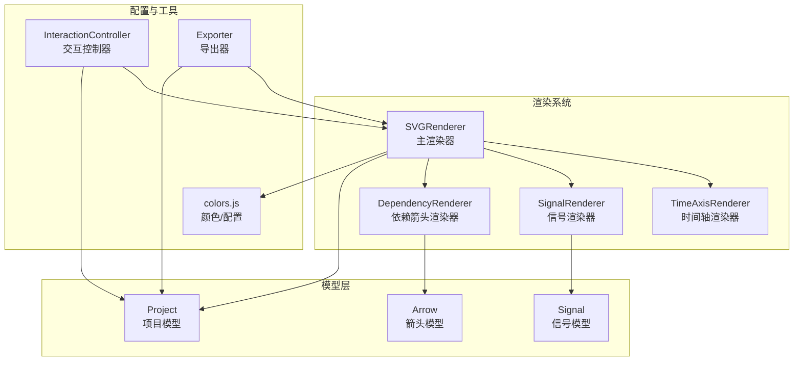
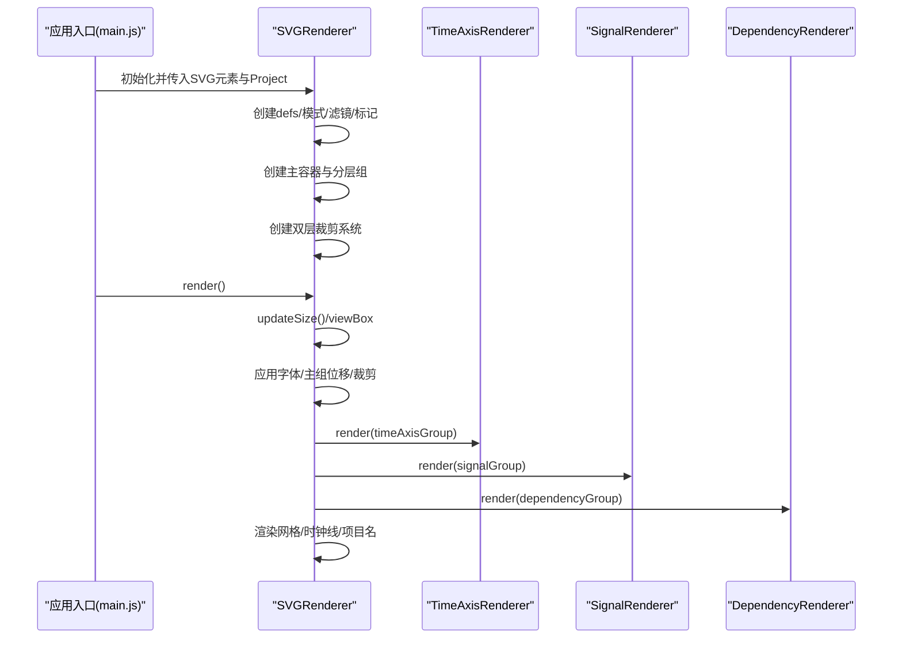
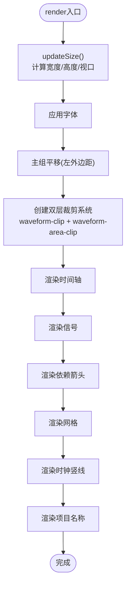
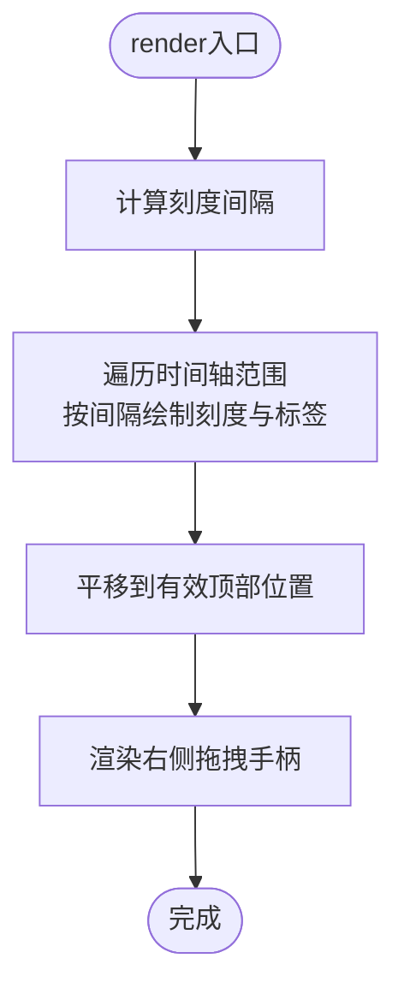
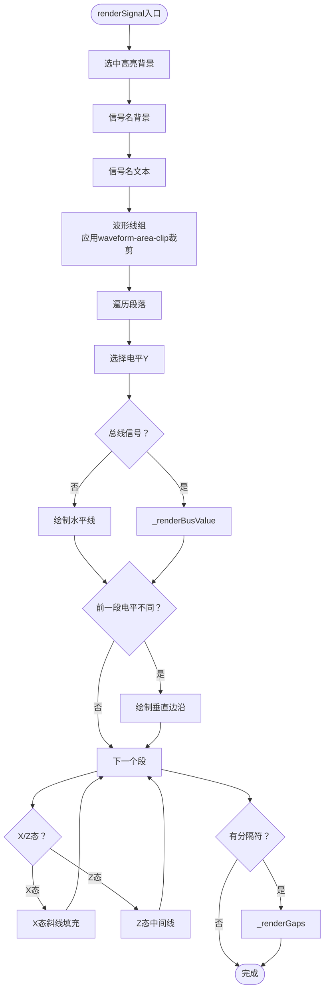
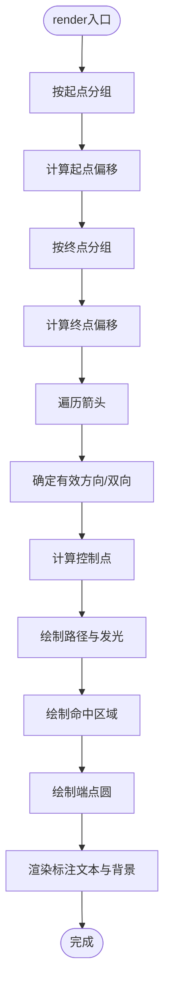
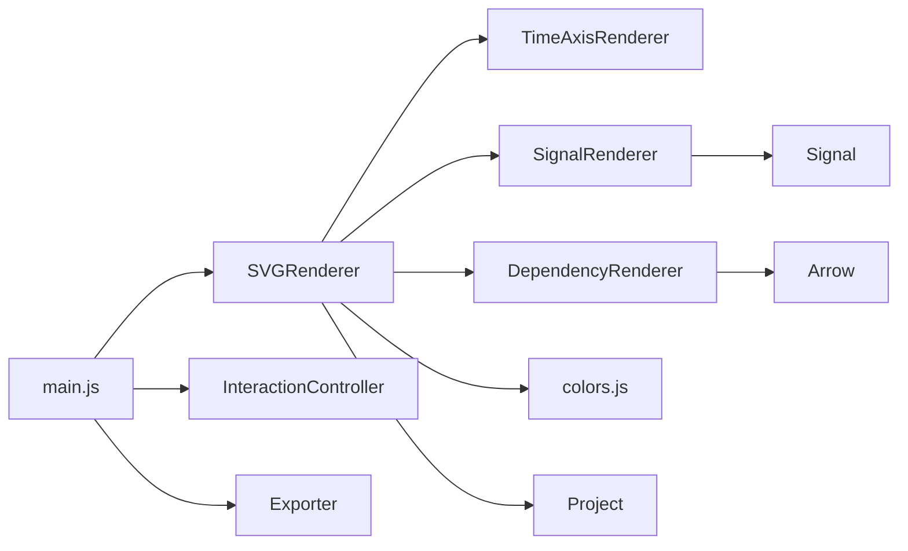

# SVG主渲染器

<cite>
**本文档引用的文件**
- [SVGRenderer.js](file://src/renderers/SVGRenderer.js)
- [SignalRenderer.js](file://src/renderers/SignalRenderer.js)
- [TimeAxisRenderer.js](file://src/renderers/TimeAxisRenderer.js)
- [DependencyRenderer.js](file://src/renderers/DependencyRenderer.js)
- [colors.js](file://src/config/colors.js)
- [Project.js](file://src/models/Project.js)
- [Signal.js](file://src/models/Signal.js)
- [Arrow.js](file://src/models/Arrow.js)
- [main.js](file://src/main.js)
- [InteractionController.js](file://src/controllers/InteractionController.js)
- [SignalPanel.js](file://src/ui/SignalPanel.js)
- [Exporter.js](file://src/io/Exporter.js)
</cite>

## 更新摘要
**变更内容**
- 新增waveform-area-clip机制章节，详细说明防止波形线超出0ns左边界的技术实现
- 更新裁剪机制部分，增加双层裁剪系统的说明
- 补充波形渲染精度提升的相关内容

## 目录
1. [简介](#简介)
2. [项目结构](#项目结构)
3. [核心组件](#核心组件)
4. [架构总览](#架构总览)
5. [详细组件分析](#详细组件分析)
6. [依赖关系分析](#依赖关系分析)
7. [性能考量](#性能考量)
8. [故障排查指南](#故障排查指南)
9. [结论](#结论)
10. [附录](#附录)

## 简介
本文件面向SVG主渲染器（SVGRenderer）的实现与使用，系统性阐述其作为渲染系统中枢的设计理念与工作机制。SVGRenderer负责：
- 管理SVG画布与命名空间
- 组织与协调子渲染器（时间轴、信号、依赖箭头）
- 统一处理渲染配置、边距与尺寸更新、视口设置
- 控制渲染流程顺序与时机，确保各层有序叠加与交互层可见性
- **新增**：实现waveform-area-clip机制，防止波形线渲染超出0ns左边界，提升渲染精度和视觉效果

通过本文档，读者可以深入理解主渲染器如何在复杂波形编辑场景中承担"总控"的角色，并掌握其初始化、结构创建、分层组织与渲染调度的完整脉络。

## 项目结构
渲染系统采用"主渲染器 + 子渲染器"的分层架构：
- 主渲染器：集中管理SVG画布、配置、尺寸与分层结构，协调子渲染器
- 子渲染器：各自负责特定领域的渲染逻辑
  - 时间轴渲染器：绘制时间刻度与拖拽手柄
  - 信号渲染器：绘制波形、跳变沿、总线样式、X/Z态、分隔符等
  - 依赖箭头渲染器：绘制带标注的贝塞尔箭头，支持双向与偏移避让



**图表来源**
- [SVGRenderer.js:10-40](file://src/renderers/SVGRenderer.js#L10-L40)
- [TimeAxisRenderer.js:6-15](file://src/renderers/TimeAxisRenderer.js#L6-L15)
- [SignalRenderer.js:6-16](file://src/renderers/SignalRenderer.js#L6-L16)
- [DependencyRenderer.js:7-12](file://src/renderers/DependencyRenderer.js#L7-L12)
- [Project.js:8-34](file://src/models/Project.js#L8-L34)
- [Signal.js:7-29](file://src/models/Signal.js#L7-L29)
- [Arrow.js:5-45](file://src/models/Arrow.js#L5-L45)
- [colors.js:5-50](file://src/config/colors.js#L5-L50)
- [InteractionController.js:6-27](file://src/controllers/InteractionController.js#L6-L27)
- [Exporter.js:1-13](file://src/io/Exporter.js#L1-L13)

**章节来源**
- [SVGRenderer.js:10-40](file://src/renderers/SVGRenderer.js#L10-L40)
- [main.js:49-132](file://src/main.js#L49-L132)

## 核心组件
- SVGRenderer：主渲染器，负责画布、分层、配置、尺寸与渲染流程
- TimeAxisRenderer：时间轴渲染器，负责刻度、标签与拖拽手柄
- SignalRenderer：信号渲染器，负责波形、跳变沿、总线、X/Z态、分隔符
- DependencyRenderer：依赖箭头渲染器，负责贝塞尔箭头、标注、端点与偏移避让

**章节来源**
- [SVGRenderer.js:10-40](file://src/renderers/SVGRenderer.js#L10-L40)
- [TimeAxisRenderer.js:6-15](file://src/renderers/TimeAxisRenderer.js#L6-L15)
- [SignalRenderer.js:6-16](file://src/renderers/SignalRenderer.js#L6-L16)
- [DependencyRenderer.js:7-12](file://src/renderers/DependencyRenderer.js#L7-L12)

## 架构总览
SVGRenderer作为中枢，统一管理以下方面：
- 命名空间与SVG根元素属性
- defs区与公共图形资源（pattern、filter、marker）
- 主容器与分层组（时间轴、信号、交互、依赖箭头）
- 渲染配置（边距、信号行高、波形高度等）
- 尺寸与视口更新（宽度、高度、viewBox）
- 渲染流程顺序（时间轴 → 信号 → 依赖箭头 → 网格/时钟线/项目名）
- **新增**：双层裁剪系统，确保波形渲染精度



**图表来源**
- [main.js:94-94](file://src/main.js#L94-L94)
- [SVGRenderer.js:284-314](file://src/renderers/SVGRenderer.js#L284-L314)
- [TimeAxisRenderer.js:21-77](file://src/renderers/TimeAxisRenderer.js#L21-L77)
- [SignalRenderer.js:22-31](file://src/renderers/SignalRenderer.js#L22-L31)
- [DependencyRenderer.js:18-84](file://src/renderers/DependencyRenderer.js#L18-L84)

## 详细组件分析

### SVGRenderer：主渲染器
职责与设计要点：
- 初始化与命名空间：设置SVG命名空间，创建defs与主容器，建立分层组
- 资源定义：X态pattern、箭头发光滤镜、正/反向箭头标记
- 分层组织：时间轴组、信号组、交互组、依赖箭头组，确保交互层可见性
- 渲染配置：边距、信号行高、波形高度、跳变沿宽度等
- 尺寸与视口：根据信号数量、时间轴范围、标题位置动态计算宽度/高度/viewBox
- 渲染流程：时间轴 → 信号 → 依赖箭头 → 网格/时钟线/项目名
- **新增**：双层裁剪系统，防止波形线超出0ns左边界
- 辅助能力：Y坐标换算、信号索引定位、元素创建、清空组

关键算法与流程：
- updateSize：自动扩展时间轴以填满容器宽度（拖拽时跳过），计算有效底部边距，设置width/height/viewBox
- **新增**：_updateClipPath：创建双层裁剪系统，包括waveform-clip和waveform-area-clip
- _renderGrid/_renderClockGridLines：水平网格线与时钟周期竖线
- _renderProjectName：项目名称文本与可编辑输入框（foreignObject）
- _createXPattern/_createGlowFilter/_createArrowMarkers：公共资源定义



**图表来源**
- [SVGRenderer.js:284-314](file://src/renderers/SVGRenderer.js#L284-L314)
- [SVGRenderer.js:194-243](file://src/renderers/SVGRenderer.js#L194-L243)
- [SVGRenderer.js:319-344](file://src/renderers/SVGRenderer.js#L319-L344)
- [SVGRenderer.js:393-419](file://src/renderers/SVGRenderer.js#L393-L419)
- [SVGRenderer.js:424-522](file://src/renderers/SVGRenderer.js#L424-L522)

**章节来源**
- [SVGRenderer.js:10-40](file://src/renderers/SVGRenderer.js#L10-L40)
- [SVGRenderer.js:59-100](file://src/renderers/SVGRenderer.js#L59-L100)
- [SVGRenderer.js:105-189](file://src/renderers/SVGRenderer.js#L105-L189)
- [SVGRenderer.js:194-243](file://src/renderers/SVGRenderer.js#L194-L243)
- [SVGRenderer.js:284-314](file://src/renderers/SVGRenderer.js#L284-L314)
- [SVGRenderer.js:319-344](file://src/renderers/SVGRenderer.js#L319-L344)
- [SVGRenderer.js:393-419](file://src/renderers/SVGRenderer.js#L393-L419)
- [SVGRenderer.js:424-522](file://src/renderers/SVGRenderer.js#L424-L522)

### 双层裁剪系统：waveform-area-clip机制

**新增功能**：SVGRenderer实现了先进的双层裁剪系统，专门解决波形线渲染超出0ns左边界的问题。

#### 裁剪系统架构
- **waveform-clip**：主裁剪区域，覆盖整个波形区域（包含信号名区域）
- **waveform-area-clip**：专用裁剪区域，仅覆盖时间轴区域[0, width]，防止波形线超出0ns左边界

#### 技术实现细节
```javascript
// 创建主裁剪区域（覆盖信号名 + 时间轴）
const rect = clipPath.querySelector('#waveform-clip-rect');
rect.setAttribute('x', -leftMargin);  // 从负值开始，包含信号名区域
rect.setAttribute('y', '0');
rect.setAttribute('width', leftMargin + width);
rect.setAttribute('height', height);

// 创建专用裁剪区域（仅覆盖时间轴区域）
const areaRect = waveAreaClip.querySelector('#waveform-area-clip-rect');
areaRect.setAttribute('x', '0');      // 从0开始，防止超出0ns左边界
areaRect.setAttribute('y', '0');
areaRect.setAttribute('width', width);
areaRect.setAttribute('height', height);
```

#### 渲染精度提升效果
- **视觉准确性**：确保波形线在0ns左侧不会出现溢出，提升视觉精度
- **边界处理**：通过专用裁剪区域精确控制波形线的边界行为
- **兼容性**：不影响其他渲染元素，仅针对波形线进行精确裁剪

**章节来源**
- [SVGRenderer.js:319-360](file://src/renderers/SVGRenderer.js#L319-L360)
- [SignalRenderer.js:90-95](file://src/renderers/SignalRenderer.js#L90-L95)

### TimeAxisRenderer：时间轴渲染器
职责与设计要点：
- 绘制时间轴背景与底部线
- 计算刻度间隔（目标像素间距80，映射到时间间隔）
- 绘制刻度线与标签（时间+单位）
- 右侧拖拽手柄（扩展时间轴），三条竖线提示拖拽

关键算法：
- _calculateTickInterval：基于scale与目标像素间距选择最近的整数间隔



**图表来源**
- [TimeAxisRenderer.js:21-77](file://src/renderers/TimeAxisRenderer.js#L21-L77)
- [TimeAxisRenderer.js:114-131](file://src/renderers/TimeAxisRenderer.js#L114-L131)

**章节来源**
- [TimeAxisRenderer.js:6-15](file://src/renderers/TimeAxisRenderer.js#L6-L15)
- [TimeAxisRenderer.js:21-77](file://src/renderers/TimeAxisRenderer.js#L21-L77)
- [TimeAxisRenderer.js:114-131](file://src/renderers/TimeAxisRenderer.js#L114-L131)

### SignalRenderer：信号渲染器
职责与设计要点：
- 渲染每个信号的名称背景、信号名文本
- 渲染波形线段（按电平与颜色策略）
- 跳变沿处理：垂直边沿与总线跳变的X交叉线
- X态与Z态特殊处理：X态斜线填充，Z态中间线
- 总线信号：菱形/梯形路径填充与数值标签
- 分隔符（gap）：波浪斜线与透明命中区域
- 边沿节点：用于拖拽编辑的窄矩形命中区域
- **新增**：波形线组应用waveform-area-clip裁剪，防止超出0ns左边界

关键算法：
- renderWaveform：遍历段落，按值选择电平Y，绘制线段与跳变沿，处理X/Z与总线
- _renderBusValue：计算路径形状，按需填充斜线或纯色，绘制上下边框与数值标签
- _renderEdgeNodes：为每个段起点绘制边沿节点



**图表来源**
- [SignalRenderer.js:39-144](file://src/renderers/SignalRenderer.js#L39-L144)
- [SignalRenderer.js:201-316](file://src/renderers/SignalRenderer.js#L201-L316)
- [SignalRenderer.js:372-474](file://src/renderers/SignalRenderer.js#L372-L474)
- [SignalRenderer.js:479-500](file://src/renderers/SignalRenderer.js#L479-L500)

**章节来源**
- [SignalRenderer.js:6-16](file://src/renderers/SignalRenderer.js#L6-L16)
- [SignalRenderer.js:22-31](file://src/renderers/SignalRenderer.js#L22-L31)
- [SignalRenderer.js:39-144](file://src/renderers/SignalRenderer.js#L39-L144)
- [SignalRenderer.js:201-316](file://src/renderers/SignalRenderer.js#L201-L316)
- [SignalRenderer.js:372-474](file://src/renderers/SignalRenderer.js#L372-L474)
- [SignalRenderer.js:479-500](file://src/renderers/SignalRenderer.js#L479-L500)

### DependencyRenderer：依赖箭头渲染器
职责与设计要点：
- 按起点/终点分组，计算同起点/同终点的偏移，避免重叠
- 计算贝塞尔曲线控制点，生成平滑S形曲线
- 支持正向/反向/双向箭头，选中时发光效果
- 渲染端点圆与透明命中区域，支持拖拽编辑
- 渲染标注文本与背景，支持多标签

关键算法：
- render：分组去重叠，逐箭头渲染
- _calculateControlPoints：依据水平距离与方向确定控制点
- renderArrow：计算起点/终点坐标，生成路径与标注



**图表来源**
- [DependencyRenderer.js:18-84](file://src/renderers/DependencyRenderer.js#L18-L84)
- [DependencyRenderer.js:93-265](file://src/renderers/DependencyRenderer.js#L93-L265)
- [DependencyRenderer.js:277-289](file://src/renderers/DependencyRenderer.js#L277-L289)

**章节来源**
- [DependencyRenderer.js:7-12](file://src/renderers/DependencyRenderer.js#L7-L12)
- [DependencyRenderer.js:18-84](file://src/renderers/DependencyRenderer.js#L18-L84)
- [DependencyRenderer.js:93-265](file://src/renderers/DependencyRenderer.js#L93-L265)
- [DependencyRenderer.js:277-289](file://src/renderers/DependencyRenderer.js#L277-L289)

### 渲染配置系统与尺寸更新机制
- 配置来源：集中于colors.js中的RENDER_CONFIG与ARROW_CONFIG，SVGRenderer在构造时合并基础配置并设置边距
- 边距策略：leftMargin（与信号面板宽度同步）、topMargin（标题在顶部时追加）、rightMargin、bottomMargin（标题在顶部时减少）
- 尺寸计算：宽度=时间轴宽度+左右边距；高度=信号行高×信号数+信号间距×(信号数-1)+上下边距
- 视口设置：width/height=viewBox
- 自动扩展：窗口resize或拖拽时间轴时，若容器宽度大于当前时间轴宽度，则扩展时间轴至填满容器

**章节来源**
- [colors.js:30-50](file://src/config/colors.js#L30-L50)
- [SVGRenderer.js:22-28](file://src/renderers/SVGRenderer.js#L22-L28)
- [SVGRenderer.js:194-243](file://src/renderers/SVGRenderer.js#L194-L243)
- [SVGRenderer.js:203-226](file://src/renderers/SVGRenderer.js#L203-L226)

### 视口与命名空间管理
- 命名空间：统一使用SVG命名空间，确保所有SVG元素创建与操作一致
- 视口：通过viewBox精确控制坐标系，配合width/height实现缩放与平移
- **新增**：双层裁剪系统，包括waveform-clip和waveform-area-clip，防止波形线超出边界

**章节来源**
- [SVGRenderer.js:31-31](file://src/renderers/SVGRenderer.js#L31-L31)
- [SVGRenderer.js:239-241](file://src/renderers/SVGRenderer.js#L239-L241)
- [SVGRenderer.js:319-360](file://src/renderers/SVGRenderer.js#L319-L360)

### 与交互与导出的集成
- 交互控制器：通过InteractionController响应用户输入，驱动项目数据变更，随后触发渲染
- 导出器：Exporter基于当前渲染结果导出SVG/PNG/JSON/独立HTML，内部会克隆SVG并移除foreignObject以适配PNG导出

**章节来源**
- [InteractionController.js:6-27](file://src/controllers/InteractionController.js#L6-L27)
- [Exporter.js:15-82](file://src/io/Exporter.js#L15-L82)
- [Exporter.js:98-187](file://src/io/Exporter.js#L98-L187)

## 依赖关系分析
- SVGRenderer依赖colors.js提供的渲染配置与颜色常量
- 子渲染器依赖主渲染器提供的配置、命名空间与辅助方法（如Y坐标换算、元素创建、清空组）
- 项目模型（Project/Signal/Arrow）为渲染提供数据源，包含时间轴转换、信号索引、箭头集合等
- 应用入口main.js负责初始化渲染器、控制器与UI组件，并在事件触发时调用渲染



**图表来源**
- [SVGRenderer.js:5-8](file://src/renderers/SVGRenderer.js#L5-L8)
- [SignalRenderer.js:4](file://src/renderers/SignalRenderer.js#L4)
- [DependencyRenderer.js:5](file://src/renderers/DependencyRenderer.js#L5)
- [Project.js:5-6](file://src/models/Project.js#L5-L6)
- [Signal.js:5](file://src/models/Signal.js#L5)
- [Arrow.js:5](file://src/models/Arrow.js#L5)
- [main.js:4-16](file://src/main.js#L4-L16)

**章节来源**
- [SVGRenderer.js:5-8](file://src/renderers/SVGRenderer.js#L5-L8)
- [SignalRenderer.js:4](file://src/renderers/SignalRenderer.js#L4)
- [DependencyRenderer.js:5](file://src/renderers/DependencyRenderer.js#L5)
- [Project.js:5-6](file://src/models/Project.js#L5-L6)
- [Signal.js:5](file://src/models/Signal.js#L5)
- [Arrow.js:5](file://src/models/Arrow.js#L5)
- [main.js:4-16](file://src/main.js#L4-L16)

## 性能考量
- 渲染顺序与分层：时间轴在最底层，信号居中，依赖箭头在信号之上，交互层最后，避免重复绘制与遮挡问题
- **新增**：双层裁剪优化，通过专用裁剪区域精确控制波形线渲染，减少无效绘制
- 资源复用：defs中的pattern/filter/marker在多处共享，避免重复创建
- 自动扩展：在容器宽度变化时才扩展时间轴，避免频繁重算
- 事件节流：窗口resize使用定时器节流，降低频繁渲染成本

## 故障排查指南
- 项目名称输入框不可编辑：检查foreignObject是否被移除或未正确插入
- 依赖箭头重叠：确认起点/终点分组与偏移计算逻辑是否生效
- **新增**：波形线超出0ns左边界：检查waveform-area-clip裁剪区域是否正确设置
- 时间轴拖拽无效：确认InteractionController的拖拽状态与SVGRenderer的拖拽标志
- 导出PNG异常：确认Exporter是否移除了foreignObject并正确绘制背景

**章节来源**
- [SVGRenderer.js:424-522](file://src/renderers/SVGRenderer.js#L424-L522)
- [DependencyRenderer.js:23-77](file://src/renderers/DependencyRenderer.js#L23-L77)
- [SVGRenderer.js:319-360](file://src/renderers/SVGRenderer.js#L319-L360)
- [InteractionController.js:84-107](file://src/controllers/InteractionController.js#L84-L107)
- [Exporter.js:38-82](file://src/io/Exporter.js#L38-L82)

## 结论
SVGRenderer作为渲染系统的核心中枢，通过清晰的分层结构、统一的命名空间与配置、严谨的渲染顺序与尺寸管理，实现了复杂波形图的高效渲染与良好交互体验。其与子渲染器、项目模型、交互控制器与导出器的协同，构成了完整的可视化编辑链路。

**新增功能价值**：waveform-area-clip机制的引入显著提升了波形渲染的精度和视觉效果，通过双层裁剪系统精确控制波形线的边界行为，确保在0ns左侧不会出现溢出，为用户提供更加准确和专业的波形编辑体验。

开发者在扩展新功能时，应遵循主渲染器的分层与配置约定，特别是注意waveform-area-clip等新增裁剪机制的使用，确保渲染一致性与性能表现。

## 附录
- 项目初始化流程：main.js负责加载/迁移数据、创建默认项目、实例化渲染器与控制器、绑定事件、初始渲染
- 信号面板同步：SignalPanel根据渲染器配置动态计算padding，保证信号名与波形垂直对齐
- 导出能力：支持SVG/PNG/JSON/独立HTML导出，满足不同使用场景

**章节来源**
- [main.js:49-132](file://src/main.js#L49-L132)
- [SignalPanel.js:13-26](file://src/ui/SignalPanel.js#L13-L26)
- [Exporter.js:15-96](file://src/io/Exporter.js#L15-L96)
- [Exporter.js:200-297](file://src/io/Exporter.js#L200-L297)