# 依赖箭头渲染器

<cite>
**本文档引用的文件**
- [DependencyRenderer.js](file://src/renderers/DependencyRenderer.js)
- [Arrow.js](file://src/models/Arrow.js)
- [InteractionController.js](file://src/controllers/InteractionController.js)
- [colors.js](file://src/config/colors.js)
- [SVGRenderer.js](file://src/renderers/SVGRenderer.js)
- [Project.js](file://src/models/Project.js)
- [main.js](file://src/main.js)
- [PropertyPanel.js](file://src/ui/PropertyPanel.js)
</cite>

## 更新摘要
**变更内容**
- 改进弧线高度计算算法，优化同信号箭头的控制点位置
- 实现不对称控制点计算算法，解决S形弯曲视觉问题
- 优化控制点坐标计算，cp1更高、cp2更低的设计
- 增强曲线平滑度，提升箭头视觉质量
- 优化cp2控制点的垂直偏移，使末端切线更接近水平

## 目录
1. [简介](#简介)
2. [项目结构](#项目结构)
3. [核心组件](#核心组件)
4. [架构概览](#架构概览)
5. [详细组件分析](#详细组件分析)
6. [依赖关系分析](#依赖关系分析)
7. [性能考虑](#性能考虑)
8. [故障排除指南](#故障排除指南)
9. [结论](#结论)

## 简介

依赖箭头渲染器是波形图编辑器中专门负责渲染信号间依赖关系箭头的核心组件。它实现了复杂的贝塞尔曲线路径计算、智能的碰撞检测和防重叠机制，以及丰富的交互功能，包括箭头创建、编辑、删除和拖拽调整。

该渲染器采用SVG技术栈，通过数学算法精确计算箭头路径，支持直角和弧线两种曲线模式，确保在复杂的时序依赖关系可视化中提供清晰、准确的视觉表达。最新的优化改进了弧线高度计算和控制点位置，实现了不对称控制点算法，解决了同信号箭头呈现S形状的视觉问题，显著提升了箭头曲线的平滑度和视觉质量。

## 项目结构

波形图编辑器采用模块化架构，依赖箭头渲染器位于渲染器层次结构的专用层：

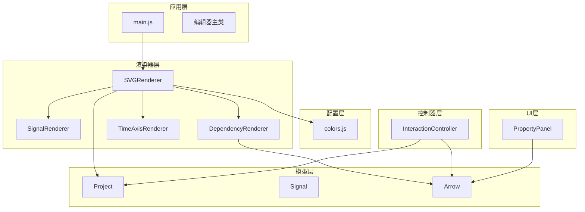

**图表来源**
- [main.js:49-132](file://src/main.js#L49-L132)
- [SVGRenderer.js:10-40](file://src/renderers/SVGRenderer.js#L10-L40)

**章节来源**
- [main.js:49-132](file://src/main.js#L49-L132)
- [SVGRenderer.js:10-40](file://src/renderers/SVGRenderer.js#L10-L40)

## 核心组件

### 依赖箭头渲染器 (DependencyRenderer)

DependencyRenderer是专门负责依赖关系箭头渲染的核心类，具有以下关键特性：

- **智能曲线计算**：支持直角和弧线两种模式的贝塞尔曲线路径计算
- **动态控制点算法**：根据箭头类型和位置自动计算最优控制点，实现不对称设计
- **智能碰撞检测**：自动处理同一起点或多箭头的重叠问题
- **双向箭头支持**：支持单向和双向箭头的智能方向判断
- **动态样式配置**：支持颜色、线宽、虚线模式等自定义样式
- **交互式标签系统**：支持多个可拖拽的文字标注

### 箭头模型 (Arrow)

Arrow模型封装了依赖箭头的所有数据属性和行为：

- **几何属性**：起点信号、终点信号、时间戳
- **方向属性**：自动、正向、反向三种方向模式
- **曲线属性**：曲线类型（弧线/直线）、曲率参数
- **样式属性**：颜色、线宽、箭头大小、虚线模式
- **标签系统**：支持多个可编辑的文字标注

### 交互控制器 (InteractionController)

InteractionController处理用户的所有交互操作：

- **箭头创建**：Alt+拖拽创建新的依赖关系
- **箭头编辑**：端点拖拽、标签移动、整体移动
- **删除操作**：键盘删除键删除选中的箭头
- **选择管理**：箭头选择、取消选择、批量操作

### 属性面板 (PropertyPanel)

PropertyPanel提供用户友好的界面来配置箭头属性：

- **曲线类型选择**：弧线或直线模式切换
- **曲率调节**：0.2-3.0范围内的曲率控制
- **样式配置**：颜色、线宽、虚线模式设置
- **标签管理**：添加、删除、编辑文字标注

**章节来源**
- [DependencyRenderer.js:7-305](file://src/renderers/DependencyRenderer.js#L7-L305)
- [Arrow.js:5-122](file://src/models/Arrow.js#L5-L122)
- [InteractionController.js:6-1420](file://src/controllers/InteractionController.js#L6-L1420)
- [PropertyPanel.js:320-453](file://src/ui/PropertyPanel.js#L320-L453)

## 架构概览

依赖箭头渲染器在整个系统架构中扮演着重要的视觉表达角色：

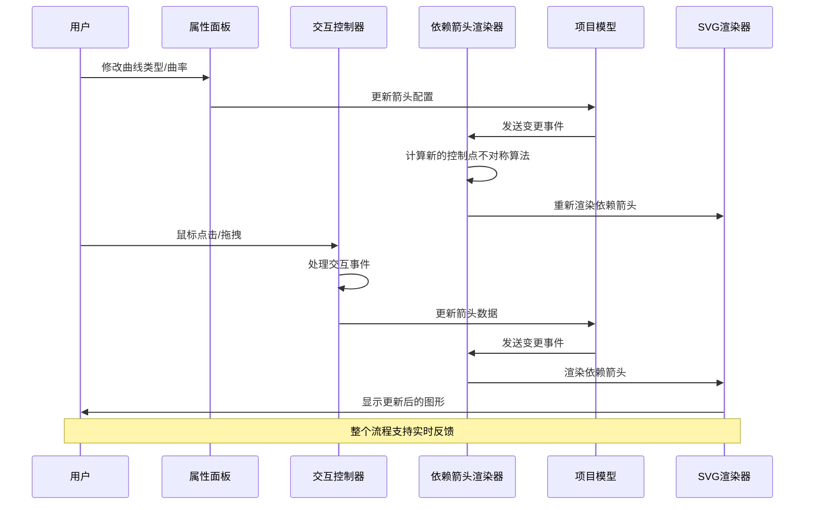

**图表来源**
- [PropertyPanel.js:403-417](file://src/ui/PropertyPanel.js#L403-L417)
- [InteractionController.js:84-184](file://src/controllers/InteractionController.js#L84-L184)
- [DependencyRenderer.js:18-84](file://src/renderers/DependencyRenderer.js#L18-L84)

### 渲染层次结构

依赖箭头渲染器在SVG渲染器的层次结构中位于特定的渲染层：

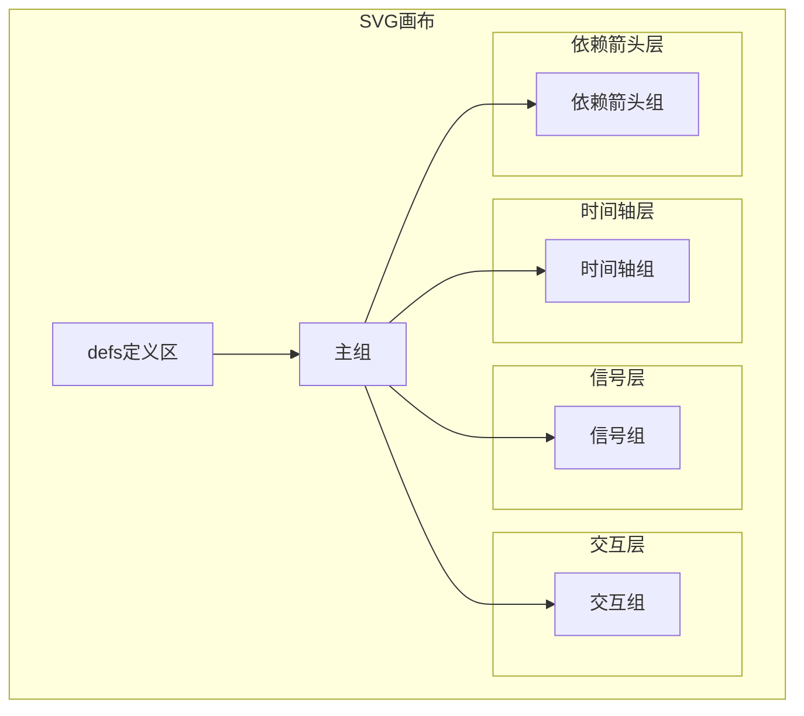

**图表来源**
- [SVGRenderer.js:76-100](file://src/renderers/SVGRenderer.js#L76-L100)

## 详细组件分析

### 智能曲线计算算法

依赖箭头渲染器的核心算法基于贝塞尔曲线数学，实现了精确的路径计算和智能的控制点生成。最新的优化改进了弧线高度计算和控制点位置，实现了不对称控制点算法，解决了视觉伪影问题。

#### 控制点计算算法

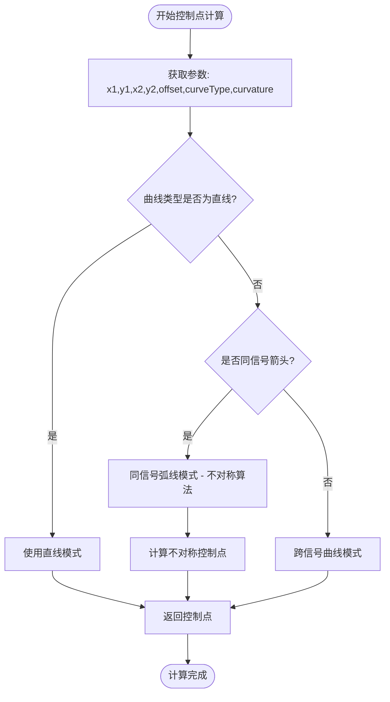

**图表来源**
- [DependencyRenderer.js:277-304](file://src/renderers/DependencyRenderer.js#L277-L304)

#### 直线模式控制点计算

当选择直线模式时，控制点直接位于起点和终点的连线上：

- **cp1位置**：起点的33%处
- **cp2位置**：起点的67%处
- **效果**：贝塞尔曲线退化为直线段

#### 同信号弧线模式（优化版）

对于连接同一信号的箭头，使用向上的弧线，经过优化以解决视觉伪影问题：

- **弧线高度**：35-80像素之间，受水平距离影响
- **cp1控制点**：水平距离的30%，垂直向上偏移
- **cp2控制点**：水平距离的25%，垂直向上偏移，但偏移量仅为弧高的15%
- **曲率缩放**：通过curvature参数调整弧线高度
- **视觉优化**：cp2的垂直偏移减小，使末端切线更接近水平，减少S形弯曲的视觉伪影
- **不对称设计**：cp1比cp2更高，形成自然的弧形曲线

#### 跨信号曲线模式

对于跨越不同信号的箭头，使用水平方向的曲线：

- **控制偏移**：水平距离的70%，最大200像素
- **垂直偏移**：支持同起点多箭头的垂直偏移
- **曲率缩放**：通过curvature参数调整控制偏移

### 箭头方向判断逻辑

依赖箭头的方向判断是算法的核心部分：

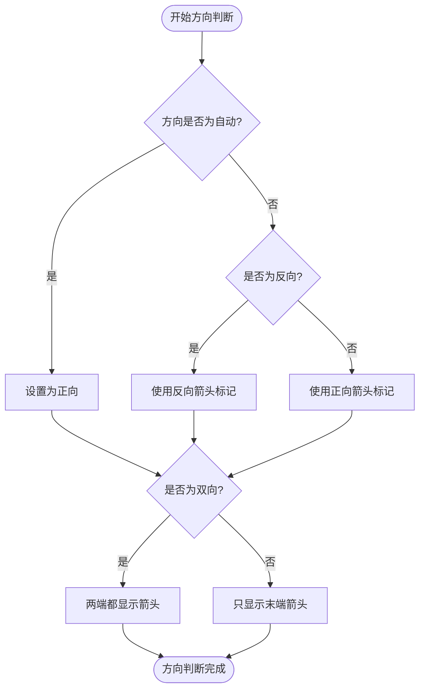

**图表来源**
- [DependencyRenderer.js:112-127](file://src/renderers/DependencyRenderer.js#L112-L127)

### 碰撞检测与防重叠机制

依赖箭头渲染器实现了智能的碰撞检测和防重叠算法：

#### 同起点箭头防重叠

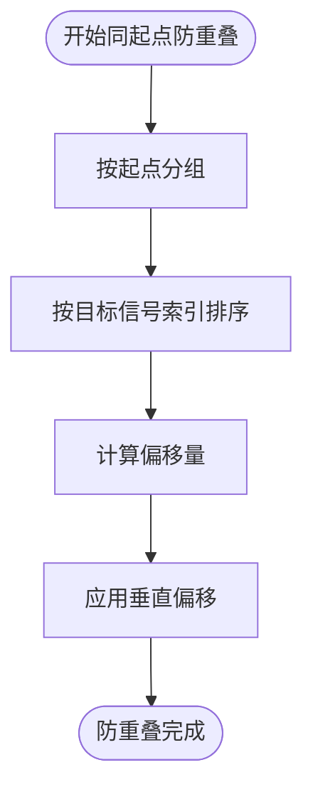

**图表来源**
- [DependencyRenderer.js:24-77](file://src/renderers/DependencyRenderer.js#L24-L77)

#### 同终点箭头防重叠

同终点箭头使用不同的偏移系数，确保视觉上的平衡：

- 同起点偏移系数：1.0
- 同终点偏移系数：0.5
- 固定间距：20像素

### 样式配置系统

依赖箭头渲染器提供了丰富的样式配置选项：

#### 颜色配置

| 配置项 | 默认值 | 用途 |
|--------|--------|------|
| defaultStroke | #0078D7 | 默认箭头颜色 |
| selectedStroke | #FF6B00 | 选中状态颜色 |
| hoverStroke | #005A9E | 悬停状态颜色 |

#### 线条配置

| 配置项 | 默认值 | 用途 |
|--------|--------|------|
| defaultStrokeWidth | 1.5 | 默认线宽 |
| selectedStrokeWidth | 2.5 | 选中线宽 |
| hitAreaWidth | 10 | 命中区域宽度 |

#### 箭头标记配置

| 配置项 | 默认值 | 用途 |
|--------|--------|------|
| defaultMarkerSize | 4 | 箭头大小 |
| markerWidth | 10 | 箭头标记宽度 |
| markerHeight | 10 | 箭头标记高度 |

### 交互功能实现

#### 箭头创建交互

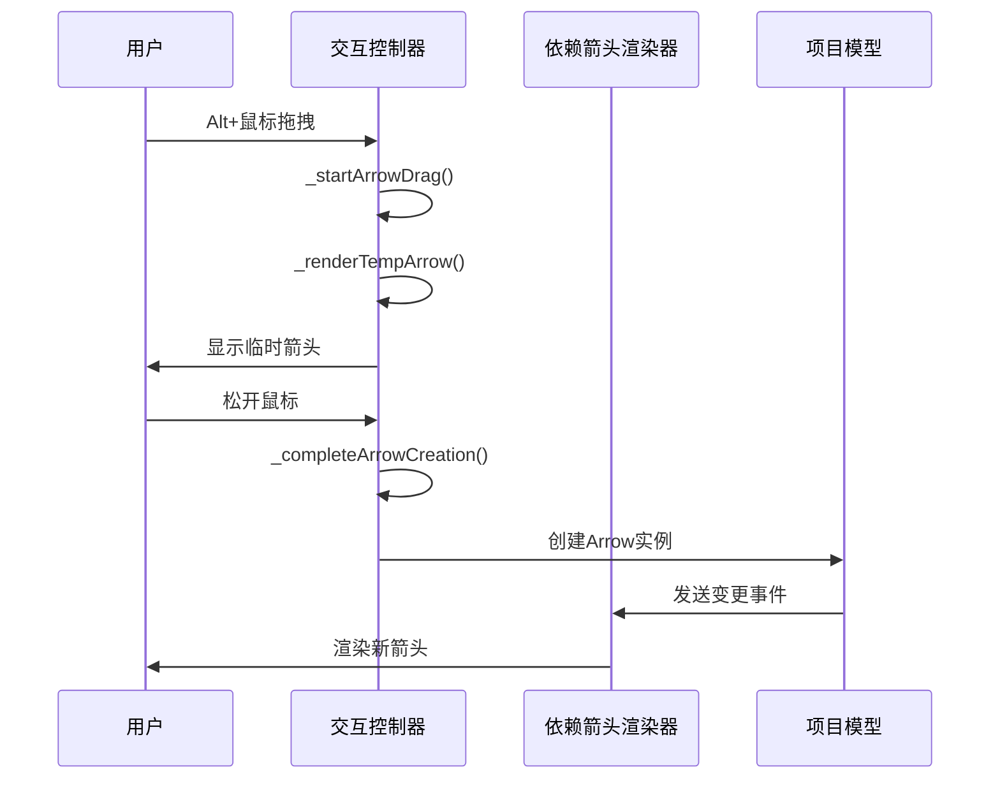

**图表来源**
- [InteractionController.js:572-756](file://src/controllers/InteractionController.js#L572-L756)

#### 箭头编辑交互

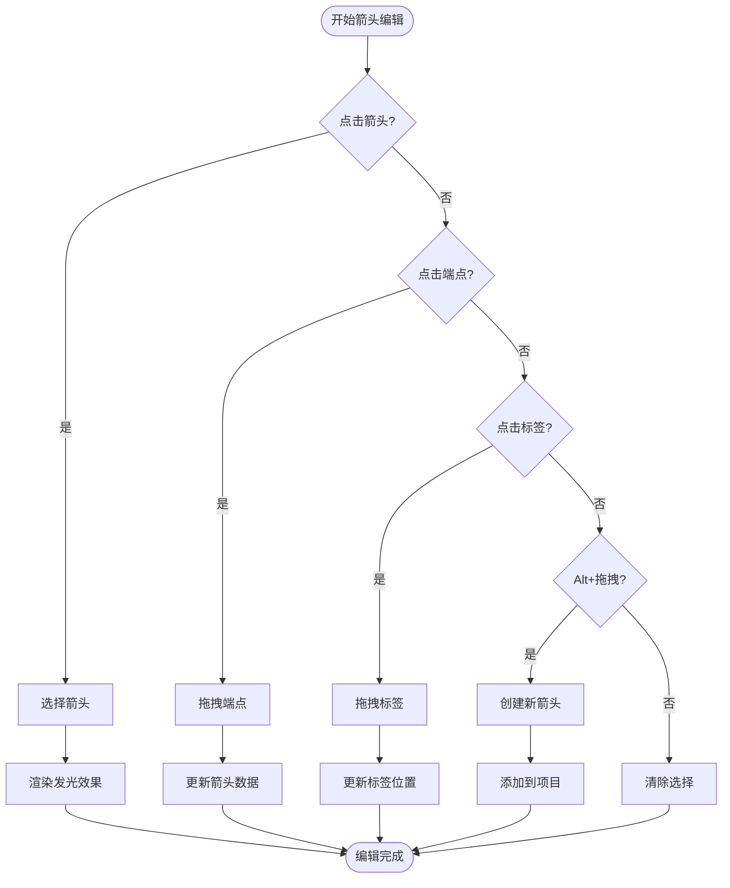

**图表来源**
- [InteractionController.js:119-132](file://src/controllers/InteractionController.js#L119-L132)

### 标签系统实现

依赖箭头渲染器支持多标签系统，每个标签都是独立的可编辑元素：

#### 标签渲染流程

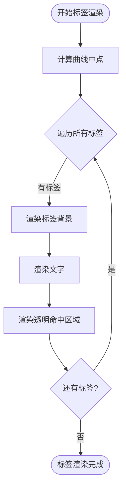

**图表来源**
- [DependencyRenderer.js:210-264](file://src/renderers/DependencyRenderer.js#L210-L264)

#### 标签拖拽功能

标签支持独立的拖拽操作，通过透明的命中区域实现精确的拖拽控制：

- **命中区域**：透明矩形，便于精确点击
- **拖拽预览**：实时更新标签位置
- **坐标转换**：将屏幕坐标转换为SVG坐标系

### SVG路径优化

依赖箭头渲染器采用了多种SVG路径优化技术：

#### 贝塞尔曲线优化

- **控制点计算**：基于水平距离动态计算控制点偏移
- **曲线平滑**：使用数学公式确保曲线的平滑度
- **性能优化**：避免重复计算，缓存中间结果
- **视觉优化**：优化同信号箭头的控制点位置，减少S形弯曲的视觉伪影

#### 光晕效果实现

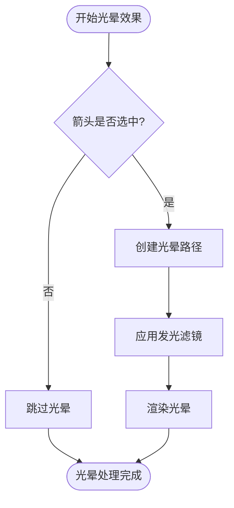

**图表来源**
- [DependencyRenderer.js:148-162](file://src/renderers/DependencyRenderer.js#L148-L162)

## 依赖关系分析

### 组件耦合度分析

依赖箭头渲染器与其他组件的依赖关系如下：

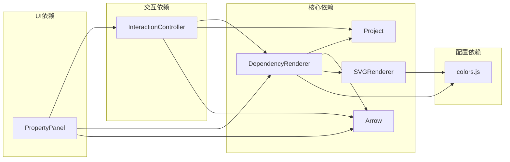

**图表来源**
- [DependencyRenderer.js:5-12](file://src/renderers/DependencyRenderer.js#L5-L12)
- [InteractionController.js:1-6](file://src/controllers/InteractionController.js#L1-L6)

### 数据流分析

依赖箭头渲染器的数据流遵循单向数据流原则：

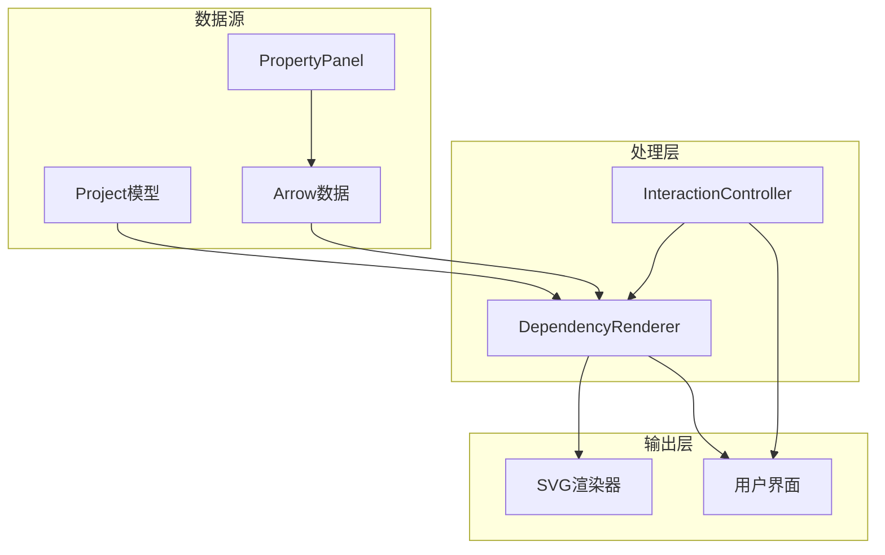

**图表来源**
- [Project.js:86-110](file://src/models/Project.js#L86-L110)
- [InteractionController.js:104-109](file://src/controllers/InteractionController.js#L104-L109)

### 错误处理机制

依赖箭头渲染器实现了完善的错误处理机制：

#### 空指针保护

- **信号索引验证**：确保信号存在且有效
- **箭头ID验证**：防止无效箭头ID导致的渲染错误
- **坐标计算保护**：处理边界情况和异常坐标

#### 异常恢复

- **渲染失败回退**：遇到错误时跳过有问题的箭头
- **状态恢复**：错误发生后恢复到安全状态
- **日志记录**：记录错误信息便于调试

**章节来源**
- [DependencyRenderer.js:94-98](file://src/renderers/DependencyRenderer.js#L94-L98)
- [InteractionController.js:770-854](file://src/controllers/InteractionController.js#L770-L854)

## 性能考虑

### 渲染性能优化

依赖箭头渲染器采用了多项性能优化策略：

#### 渲染批次处理

- **批量渲染**：一次渲染所有箭头，减少DOM操作次数
- **分组处理**：按起点和终点分组，提高查找效率
- **缓存机制**：缓存计算结果，避免重复计算

#### 内存管理

- **对象复用**：复用DOM元素，减少内存分配
- **事件清理**：及时清理事件监听器
- **垃圾回收**：定期清理无用对象

### 交互性能优化

#### 事件处理优化

- **事件委托**：使用事件委托减少事件监听器数量
- **节流处理**：对频繁触发的事件进行节流
- **防抖处理**：对鼠标移动等事件进行防抖

#### 动画性能

- **硬件加速**：利用CSS3硬件加速
- **最小重绘**：只重绘必要的元素
- **帧率控制**：保持稳定的渲染帧率

## 故障排除指南

### 常见问题及解决方案

#### 箭头渲染异常

**问题症状**：
- 箭头显示不完整
- 箭头位置错误
- 箭头样式异常

**可能原因**：
- 信号索引计算错误
- 时间坐标转换异常
- 样式配置错误
- 控制点计算异常

**解决步骤**：
1. 检查信号是否存在且有效
2. 验证时间戳是否在有效范围内
3. 确认样式配置参数正确
4. 查看控制台错误信息
5. 验证曲线类型和曲率设置

#### 交互功能失效

**问题症状**：
- 无法创建新箭头
- 箭头无法拖拽
- 标签无法编辑
- 曲线类型切换无效

**可能原因**：
- 事件监听器未正确绑定
- 交互状态管理错误
- DOM元素缺失
- 属性面板事件绑定问题

**解决步骤**：
1. 检查SVG元素是否正确创建
2. 验证事件监听器是否绑定成功
3. 确认交互状态变量正确更新
4. 检查属性面板的事件绑定
5. 查看浏览器开发者工具中的事件监听器

#### 性能问题

**问题症状**：
- 页面响应缓慢
- 渲染卡顿
- 内存占用过高

**可能原因**：
- 渲染循环过长
- DOM元素过多
- 事件处理不当
- 控制点计算重复

**解决步骤**：
1. 分析渲染时间消耗
2. 减少不必要的DOM操作
3. 实施虚拟滚动
4. 优化事件处理逻辑
5. 检查控制点计算缓存

### 调试技巧

#### 开发者工具使用

- **元素检查**：使用浏览器开发者工具检查SVG元素
- **性能分析**：使用性能面板分析渲染性能
- **内存监控**：监控内存使用情况
- **网络分析**：检查资源加载情况

#### 日志记录

依赖箭头渲染器在关键位置添加了详细的日志记录：

```javascript
// 示例：渲染过程中的日志
console.log(`渲染箭头: ${arrow.id}`);
console.log(`起点: (${startX}, ${startY})`);
console.log(`终点: (${endX}, ${endY})`);
console.log(`控制点: (${cp1.x}, ${cp1.y}), (${cp2.x}, ${cp2.y})`);
console.log(`曲线类型: ${arrow.curveType}, 曲率: ${arrow.curvature}`);
```

**章节来源**
- [DependencyRenderer.js:18-84](file://src/renderers/DependencyRenderer.js#L18-L84)
- [InteractionController.js:84-184](file://src/controllers/InteractionController.js#L84-L184)

## 结论

依赖箭头渲染器是波形图编辑器中实现复杂时序依赖关系可视化的关键组件。它通过精心设计的算法和架构，实现了以下核心功能：

### 技术成就

1. **智能的曲线计算算法**：支持直角和弧线两种模式，基于数学原理自动计算最优控制点
2. **精确的贝塞尔曲线生成**：确保箭头路径的精确性和美观性
3. **智能的碰撞检测**：自动处理多箭头重叠问题，提供良好的视觉体验
4. **丰富的交互功能**：支持创建、编辑、删除、拖拽等多种用户操作
5. **灵活的样式配置**：提供全面的样式定制选项，包括曲线类型和曲率调节
6. **用户友好的界面**：通过属性面板直观地控制箭头的各种属性
7. **视觉质量优化**：最新的不对称控制点算法，解决了同信号箭头的S形弯曲视觉问题，显著提升了箭头曲线的平滑度和视觉质量

### 设计优势

- **模块化设计**：清晰的职责分离，便于维护和扩展
- **性能优化**：采用多种优化技术，确保流畅的用户体验
- **错误处理**：完善的错误处理机制，提高系统稳定性
- **可扩展性**：良好的架构设计，便于添加新功能
- **用户友好**：直观的界面设计，降低学习成本
- **视觉优化**：持续改进的视觉质量，提供更好的用户体验

### 应用价值

依赖箭头渲染器不仅是一个技术实现，更是时序依赖关系可视化的重要工具。它帮助用户：
- 直观地理解复杂的时序关系
- 高效地编辑和管理依赖关系
- 通过曲线类型和曲率调节获得最佳视觉效果
- 提升波形图编辑的工作效率

通过持续的优化和改进，依赖箭头渲染器将继续为用户提供优秀的可视化体验，成为波形图编辑器不可或缺的重要组成部分。

**更新** 本次更新重点关注了弧线高度计算和控制点位置的优化，特别是针对同信号箭头的S形弯曲视觉问题进行了专门改进。通过实现不对称控制点计算算法，将cp1设置为更高的位置，cp2设置为更低的位置，有效解决了箭头呈现S形状的问题，显著提升了箭头曲线的平滑度和视觉质量。