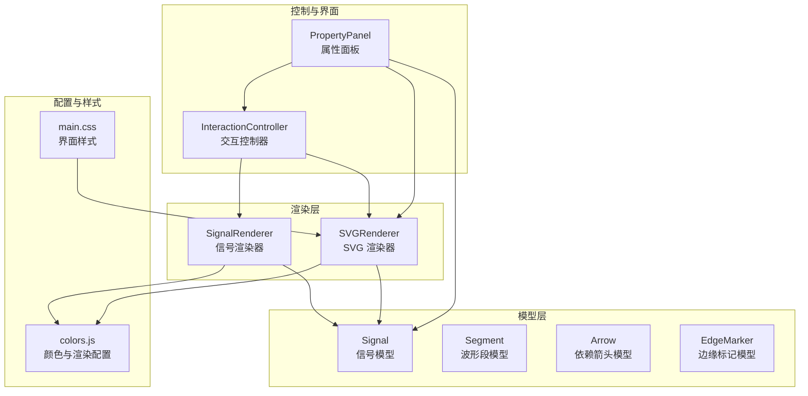
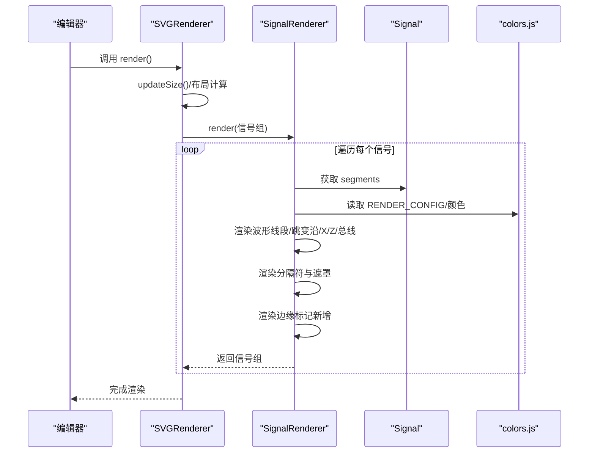
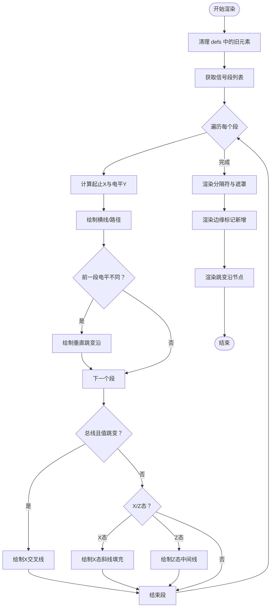
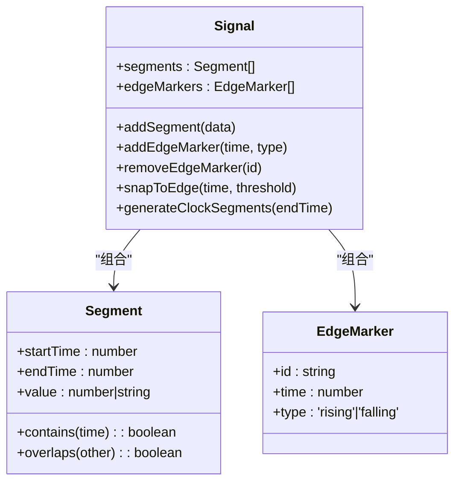
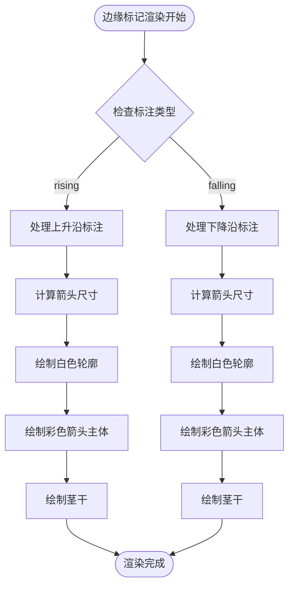
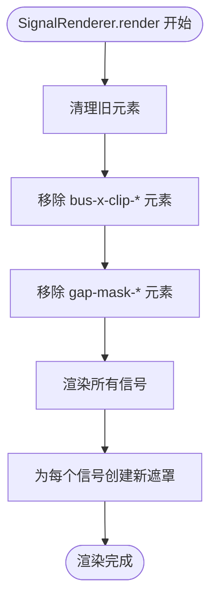
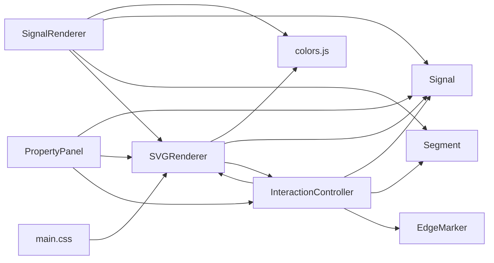

# 信号渲染器

<cite>
**本文引用的文件**
- [SignalRenderer.js](file://src/renderers/SignalRenderer.js)
- [SVGRenderer.js](file://src/renderers/SVGRenderer.js)
- [colors.js](file://src/config/colors.js)
- [Signal.js](file://src/models/Signal.js)
- [Segment.js](file://src/models/Segment.js)
- [InteractionController.js](file://src/controllers/InteractionController.js)
- [PropertyPanel.js](file://src/ui/PropertyPanel.js)
- [main.css](file://styles/main.css)
</cite>

## 更新摘要
**变更内容**
- 新增边缘标记渲染功能，支持上升沿和下降沿的可视化标注
- 添加白色轮廓和箭头渲染的视觉效果
- 更新信号渲染器以支持边缘标记的动态渲染
- 增强交互控制器以支持边缘标记的创建和管理
- **新增：清理间隙遮罩以防止切换项目时的视觉伪影，保持渲染一致性**

## 目录
1. [简介](#简介)
2. [项目结构](#项目结构)
3. [核心组件](#核心组件)
4. [架构总览](#架构总览)
5. [详细组件分析](#详细组件分析)
6. [边缘标记渲染功能](#边缘标记渲染功能)
7. [间隙遮罩清理机制](#间隙遮罩清理机制)
8. [依赖关系分析](#依赖关系分析)
9. [性能考量](#性能考量)
10. [故障排查指南](#故障排查指南)
11. [结论](#结论)
12. [附录](#附录)

## 简介
本文件面向"信号渲染器"的技术文档，系统性阐述 SignalRenderer 的职责与实现细节，包括：
- 波形信号的线条绘制、高低电平显示、分隔符处理与 X/Z 态渲染
- 信号线段生成、连接点处理、时钟信号的特殊渲染逻辑
- **新增：边缘标记渲染功能，支持上升沿和下降沿的可视化标注**
- **新增：间隙遮罩清理机制，防止项目切换时的视觉伪影**
- 信号样式配置、颜色管理、字体设置与响应式布局
- 信号选择状态、悬停效果与交互反馈
- 关键算法、SVG 路径生成规则与性能优化策略

## 项目结构
本项目采用模块化组织，渲染层与模型层分离，渲染器负责将模型数据转换为 SVG 视觉元素，控制器负责交互与状态管理，UI 面板负责用户配置与属性编辑。

**图表来源**
- [SignalRenderer.js:1-592](file://src/renderers/SignalRenderer.js#L1-L592)
- [SVGRenderer.js:1-563](file://src/renderers/SVGRenderer.js#L1-L563)
- [colors.js:1-83](file://src/config/colors.js#L1-L83)
- [Signal.js:1-378](file://src/models/Signal.js#L1-L378)
- [Segment.js:1-94](file://src/models/Segment.js#L1-L94)
- [InteractionController.js:1-1534](file://src/controllers/InteractionController.js#L1-L1534)
- [PropertyPanel.js:1-507](file://src/ui/PropertyPanel.js#L1-L507)
- [main.css:1-551](file://styles/main.css#L1-L551)

## 核心组件
- SignalRenderer：负责单个信号的完整渲染，包括波形线段、跳变沿、X/Z 态、总线样式、分隔符、**边缘标记**与命中区域等。
- SVGRenderer：负责 SVG 画布、尺寸计算、裁剪区域、网格与时钟竖线、字体与主渲染流程调度。
- Signal/Segment：信号与波形段的数据模型，提供值查询、吸附、合并等能力。
- colors.js：集中管理颜色、渲染配置与电平到 Y 坐标的映射。
- InteractionController：处理鼠标交互，包括边沿拖拽、分隔符拖拽、箭头创建与端点拖拽、选择状态切换等。
- PropertyPanel：提供信号与项目属性编辑入口，联动渲染器刷新。

## 架构总览
SignalRenderer 作为 SVGRenderer 的子渲染器之一，接收项目数据与渲染配置，将每个 Signal 的 segments 转换为 SVG 线段、路径与文本，并处理交互命中区域与遮罩裁剪。

**图表来源**
- [SVGRenderer.js:284-314](file://src/renderers/SVGRenderer.js#L284-L314)
- [SignalRenderer.js:22-31](file://src/renderers/SignalRenderer.js#L22-L31)
- [colors.js:27-50](file://src/config/colors.js#L27-L50)

## 详细组件分析

### SignalRenderer：信号渲染核心
- 渲染入口与分组
  - render(group)：清空旧组，遍历项目信号，逐个调用 renderSignal。
  - **新增：渲染前清理机制**：在渲染开始时清理上一次渲染的 bus X 态 clipPath 和分隔符 mask，防止项目切换时的视觉伪影。
  - renderSignal(group, signal, index)：创建信号组，绘制选中高亮背景、信号名背景与名称文本，生成波形线组与分隔符组。
- 波形渲染
  - renderWaveform(group, signal, y)：遍历 segments，计算起止 X 坐标与电平 Y 坐标，按值类型绘制横线或路径。
  - 连接点处理：若前一段电平不同，则绘制垂直跳变沿；若为总线且值发生跳变，则绘制 X 交叉线。
  - 特殊态处理：
    - X 态：使用 pattern 填充矩形并叠加边框。
    - Z 态：在中间线上绘制粗线以突出高阻态。
  - 总线样式：_renderBusValue() 支持菱形/梯形路径、斜线填充、双线边框与数值标签。
- 分隔符处理
  - _renderGaps()：在波形区域绘制波浪斜线，同时创建透明命中区域，支持拖拽调整分隔符时间。
  - 渲染遮罩：为波形线组应用 mask，裁剪掉分隔符区域，使波形线不穿过斜线。
- 跳变沿节点
  - _renderEdgeNodes()：为每个段起点绘制窄矩形命中区域，用于边沿拖拽交互。
- 选择与悬停
  - 选中高亮：在信号组顶部绘制半透明蓝色背景。
  - 悬停与交互：通过命中区域与 CSS 类实现悬停高亮与拖拽反馈。

**图表来源**
- [SignalRenderer.js:22-33](file://src/renderers/SignalRenderer.js#L22-L33)
- [SignalRenderer.js:201-324](file://src/renderers/SignalRenderer.js#L201-L324)
- [SignalRenderer.js:372-482](file://src/renderers/SignalRenderer.js#L372-L482)
- [SignalRenderer.js:152-193](file://src/renderers/SignalRenderer.js#L152-L193)
- [SignalRenderer.js:484-592](file://src/renderers/SignalRenderer.js#L484-L592)

**章节来源**
- [SignalRenderer.js:22-33](file://src/renderers/SignalRenderer.js#L22-L33)
- [SignalRenderer.js:39-152](file://src/renderers/SignalRenderer.js#L39-L152)
- [SignalRenderer.js:201-324](file://src/renderers/SignalRenderer.js#L201-L324)
- [SignalRenderer.js:372-482](file://src/renderers/SignalRenderer.js#L372-L482)
- [SignalRenderer.js:152-193](file://src/renderers/SignalRenderer.js#L152-L193)
- [SignalRenderer.js:484-592](file://src/renderers/SignalRenderer.js#L484-L592)

### SVGRenderer：画布与布局
- 尺寸与视口
  - updateSize()：根据信号数量、边距与时间轴宽度动态计算 SVG 宽高与 viewBox，支持标题在顶部时的额外上边距。
- 信号定位
  - getSignalY(index)/getSignalIndexByY(y)：基于 RENDER_CONFIG 计算信号行 Y 坐标与反向查询。
- 裁剪与网格
  - _updateClipPath()：为波形区域设置裁剪路径，防止超出时间轴右侧。
  - _renderGrid()：水平网格线，分隔信号行。
  - _renderClockGridLines()：按时钟周期绘制虚线竖线。
- 字体与主渲染
  - render()：应用项目字体，移动主组，渲染时间轴、信号、依赖箭头、网格与时钟竖线、项目名称。

**章节来源**
- [SVGRenderer.js:194-243](file://src/renderers/SVGRenderer.js#L194-L243)
- [SVGRenderer.js:258-279](file://src/renderers/SVGRenderer.js#L258-L279)
- [SVGRenderer.js:319-344](file://src/renderers/SVGRenderer.js#L319-L344)
- [SVGRenderer.js:393-419](file://src/renderers/SVGRenderer.js#L393-L419)
- [SVGRenderer.js:349-388](file://src/renderers/SVGRenderer.js#L349-L388)
- [SVGRenderer.js:284-314](file://src/renderers/SVGRenderer.js#L284-L314)

### Signal/Segment：数据模型与算法
- Signal
  - addSegment()/setValueAt()：插入新段并合并重叠区域，随后合并相邻同值段，保证连续性与最小化段数。
  - snapToEdge(time, threshold)：返回最近的段边界时间，用于交互吸附。
  - generateClockSegments(endTime)：按时钟配置生成周期性高低电平段。
  - **新增：edgeMarkers 属性管理**：支持边缘标记的添加、删除和序列化。
- Segment
  - contains(time)/overlaps(other)：判断时间包含与区间重叠，支撑段合并与插入逻辑。

**图表来源**
- [Signal.js:62-133](file://src/models/Signal.js#L62-L133)
- [Signal.js:202-220](file://src/models/Signal.js#L202-L220)
- [Signal.js:226-252](file://src/models/Signal.js#L226-L252)
- [Segment.js:42-53](file://src/models/Segment.js#L42-L53)

**章节来源**
- [Signal.js:62-133](file://src/models/Signal.js#L62-L133)
- [Signal.js:202-220](file://src/models/Signal.js#L202-L220)
- [Signal.js:226-252](file://src/models/Signal.js#L226-L252)
- [Segment.js:42-53](file://src/models/Segment.js#L42-L53)

### 颜色与样式配置
- COLORS：统一管理波形颜色（正常/高阻/X）、信号名颜色、界面颜色与交互颜色。
- RENDER_CONFIG：统一管理信号行高度、波形高度、顶部偏移、跳变沿宽度、总线线宽等。
- getLevelY()/getLevelColor()：根据电平值映射到 Y 坐标与颜色，支持 X/Z 与总线字符串值。

**章节来源**
- [colors.js:5-25](file://src/config/colors.js#L5-L25)
- [colors.js:30-37](file://src/config/colors.js#L30-L37)
- [colors.js:58-69](file://src/config/colors.js#L58-L69)
- [colors.js:76-83](file://src/config/colors.js#L76-L83)

### 交互与反馈
- InteractionController
  - 边沿拖拽：检测 .edge-node 命中区域，记录原始段与时间，拖拽过程中实时更新段边界，完成后合并相邻段。
  - 分隔符拖拽：检测 .gap-hit-area 命中区域，拖拽时更新 gap.time，支持删除。
  - **新增：边缘标记管理**：检测时间范围内的跳变沿，自动识别上升沿和下降沿，支持批量添加/删除边缘标记。
  - 箭头创建/端点拖拽/文字拖拽：吸附到最近跳变沿，渲染临时路径与预览，完成后持久化。
- PropertyPanel
  - 提供信号类型、颜色、时钟参数、时间轴范围与缩放等编辑入口，联动渲染器刷新。

**章节来源**
- [InteractionController.js:497-567](file://src/controllers/InteractionController.js#L497-L567)
- [InteractionController.js:535-544](file://src/controllers/InteractionController.js#L535-L544)
- [InteractionController.js:572-756](file://src/controllers/InteractionController.js#L572-L756)
- [InteractionController.js:1214-1260](file://src/controllers/InteractionController.js#L1214-L1260)
- [PropertyPanel.js:126-177](file://src/ui/PropertyPanel.js#L126-L177)

## 边缘标记渲染功能

### 功能概述
边缘标记渲染功能为波形图提供了可视化的跳变沿标注，支持上升沿和下降沿两种类型的箭头标注。该功能通过在跳变沿位置添加白色轮廓和彩色箭头来增强波形图的可读性和专业性。

### 技术实现

#### 数据结构
- **EdgeMarker 对象**：包含 `id`、`time` 和 `type` 属性
  - `id`：唯一标识符
  - `time`：跳变沿的时间坐标
  - `type`：标注类型，'rising' 或 'falling'

#### 渲染算法
- **动态箭头尺寸**：根据时钟周期的像素宽度动态调整箭头大小，周期越密（像素越小）箭头越小
- **白色轮廓效果**：先绘制白色轮廓，再绘制彩色箭头主体，提高对比度
- **对称布局**：箭头位于波形垂直中线，上升沿箭头向上，下降沿箭头向下
- **茎干设计**：使用白色茎干提供更好的视觉层次

**图表来源**
- [SignalRenderer.js:484-563](file://src/renderers/SignalRenderer.js#L484-L563)

### 交互功能
- **批量管理**：支持在指定时间范围内批量添加/删除指定类型的边缘标记
- **智能识别**：自动识别上升沿（0→1或Z→1）和下降沿（1→0或1→Z）
- **历史记录**：支持撤销/重做边缘标记操作
- **吸附机制**：边缘标记位置与波形段边界精确对齐

**章节来源**
- [SignalRenderer.js:484-563](file://src/renderers/SignalRenderer.js#L484-L563)
- [Signal.js:60-77](file://src/models/Signal.js#L60-L77)
- [InteractionController.js:1214-1260](file://src/controllers/InteractionController.js#L1214-L1260)

## 间隙遮罩清理机制

### 功能概述
为了防止项目切换时出现视觉伪影，SignalRenderer 在每次渲染开始前都会清理上一次渲染遗留的间隙遮罩元素。这确保了不同项目间的渲染一致性，避免了旧项目的遮罩影响新项目的显示效果。

### 技术实现

#### 清理策略
- **bus X 态 clipPath 清理**：清理以 `bus-x-clip-` 开头的所有 clipPath 元素
- **分隔符 mask 清理**：清理以 `gap-mask-` 开头的所有 mask 元素
- **时机选择**：在 render() 方法开始时执行清理，确保新渲染环境的纯净性

#### 渲染流程中的遮罩管理
- **动态创建**：每个信号的遮罩都是动态创建的，使用 `gap-mask-${signal.id}` 的唯一标识
- **自动清理**：清理逻辑会移除所有旧的 gap-mask 元素，防止跨项目污染
- **bus X 态隔离**：bus X 态的 clipPath 也独立清理，避免总线渲染的视觉干扰

**图表来源**
- [SignalRenderer.js:22-33](file://src/renderers/SignalRenderer.js#L22-L33)
- [SignalRenderer.js:103-136](file://src/renderers/SignalRenderer.js#L103-L136)

### 性能与稳定性保障
- **内存安全**：清理旧元素防止 defs 区域无限增长
- **渲染一致性**：确保每个新渲染都有干净的 SVG 环境
- **跨项目隔离**：避免项目间元素相互影响
- **DOM 操作优化**：使用 querySelectorAll 一次性获取并批量移除

**章节来源**
- [SignalRenderer.js:22-33](file://src/renderers/SignalRenderer.js#L22-L33)
- [SignalRenderer.js:103-136](file://src/renderers/SignalRenderer.js#L103-L136)

## 依赖关系分析

**图表来源**
- [SignalRenderer.js:4-16](file://src/renderers/SignalRenderer.js#L4-L16)
- [SVGRenderer.js:5-8](file://src/renderers/SVGRenderer.js#L5-L8)
- [InteractionController.js:1-5](file://src/controllers/InteractionController.js#L1-L5)
- [PropertyPanel.js:1-12](file://src/ui/PropertyPanel.js#L1-L12)
- [main.css:1-551](file://styles/main.css#L1-L551)

**章节来源**
- [SignalRenderer.js:4-16](file://src/renderers/SignalRenderer.js#L4-L16)
- [SVGRenderer.js:5-8](file://src/renderers/SVGRenderer.js#L5-L8)
- [InteractionController.js:1-5](file://src/controllers/InteractionController.js#L1-L5)
- [PropertyPanel.js:1-12](file://src/ui/PropertyPanel.js#L1-L12)
- [main.css:1-551](file://styles/main.css#L1-L551)

## 性能考量
- 减少 DOM 操作
  - render() 中先清空组，再批量追加元素，避免频繁重排。
  - 使用 defs 中的 pattern 与 mask，避免重复创建复杂图形。
  - **新增：边缘标记缓存**：边缘标记渲染结果缓存在单独的 edge-markers 组中，避免与其他元素混合。
  - **新增：清理机制优化**：批量清理旧元素，避免逐个查询的性能开销。
- 算法优化
  - Signal.addSegment() 插入时仅处理重叠段，随后一次性合并相邻同值段，降低段数量。
  - getLevelY()/getLevelColor() 为 O(1) 查询，避免在渲染循环中重复计算。
  - **新增：边缘标记动态尺寸计算**：根据时钟周期自适应调整箭头大小，避免不必要的重绘。
  - **新增：遮罩清理去重**：使用 querySelectorAll 一次性获取所有匹配元素，提高清理效率。
- 响应式布局
  - updateSize() 动态计算宽度与高度，结合 viewBox 与 transform，避免强制重绘。
  - **新增：边缘标记自适应缩放**：箭头尺寸随时间轴缩放而动态调整。
  - **新增：遮罩自适应**：每个信号使用独立的遮罩 ID，避免冲突。
- 交互反馈
  - 命中区域使用透明 rect，减少视觉干扰；CSS hover 与 active 状态提升交互体验。

**章节来源**
- [Signal.js:87-133](file://src/models/Signal.js#L87-L133)
- [Signal.js:138-155](file://src/models/Signal.js#L138-L155)
- [colors.js:58-83](file://src/config/colors.js#L58-L83)
- [SVGRenderer.js:194-243](file://src/renderers/SVGRenderer.js#L194-L243)
- [SignalRenderer.js:497-506](file://src/renderers/SignalRenderer.js#L497-L506)

## 故障排查指南
- 波形线未显示或被裁剪
  - 检查 _updateClipPath() 是否正确设置裁剪区域，确认 leftMargin 与时间轴宽度匹配。
  - **章节来源**
    - [SVGRenderer.js:319-344](file://src/renderers/SVGRenderer.js#L319-L344)
- X/Z 态显示异常
  - 确认 pattern "x-pattern" 是否在 defs 中创建，X 态使用斜线填充，Z 态使用中间线。
  - **章节来源**
    - [SVGRenderer.js:105-122](file://src/renderers/SVGRenderer.js#L105-L122)
    - [SignalRenderer.js:329-356](file://src/renderers/SignalRenderer.js#L329-L356)
    - [SignalRenderer.js:361-375](file://src/renderers/SignalRenderer.js#L361-L375)
- 总线样式不正确
  - 检查 _renderBusValue() 的路径生成与 clipPath，确认跳变沿两侧留白 gap。
  - **章节来源**
    - [SignalRenderer.js:377-482](file://src/renderers/SignalRenderer.js#L377-L482)
- 分隔符遮罩问题
  - 确认 mask 的白色可见区域与黑色遮罩多边形路径，以及 maskId 的唯一性。
  - **新增：遮罩清理问题**：如果发现旧项目的遮罩影响新项目，检查清理逻辑是否正常执行。
  - **章节来源**
    - [SignalRenderer.js:100-141](file://src/renderers/SignalRenderer.js#L100-L141)
- 边沿拖拽无效
  - 检查 .edge-node 命中区域与 InteractionController 的 dragStart 类型判定。
  - **章节来源**
    - [InteractionController.js:497-567](file://src/controllers/InteractionController.js#L497-L567)
    - [SignalRenderer.js:568-592](file://src/renderers/SignalRenderer.js#L568-L592)
- **新增：边缘标记不显示**
  - 检查信号的 edgeMarkers 数组是否正确设置，确认渲染组 "edge-markers" 是否创建。
  - **章节来源**
    - [SignalRenderer.js:144-149](file://src/renderers/SignalRenderer.js#L144-L149)
    - [SignalRenderer.js:484-563](file://src/renderers/SignalRenderer.js#L484-L563)
- **新增：边缘标记尺寸异常**
  - 检查时钟信号配置和周期计算，确认箭头尺寸缩放因子的计算逻辑。
  - **章节来源**
    - [SignalRenderer.js:497-506](file://src/renderers/SignalRenderer.js#L497-L506)
- **新增：项目切换后视觉伪影**
  - 检查 SignalRenderer.render() 中的清理逻辑，确认旧的 gap-mask 和 bus-x-clip 元素是否被正确移除。
  - **章节来源**
    - [SignalRenderer.js:22-33](file://src/renderers/SignalRenderer.js#L22-L33)

## 结论
SignalRenderer 通过清晰的模块划分与稳健的算法设计，实现了对波形信号的高效渲染与良好交互体验。其核心优势在于：
- 数据驱动的段级渲染与跳变沿智能连接
- X/Z 态与总线样式的差异化处理
- 基于遮罩与命中区域的交互反馈
- **新增：边缘标记渲染功能，提供专业的上升沿/下降沿标注**
- **新增：间隙遮罩清理机制，确保项目切换时的渲染一致性**
- 与 SVGRenderer 的解耦协作与响应式布局

**新增功能总结**：
- 边缘标记渲染提供了专业的波形标注能力
- 自适应箭头尺寸确保在不同缩放级别下的最佳视觉效果
- 白色轮廓设计提高了标注的可读性和对比度
- 批量管理和智能识别简化了用户的标注操作
- 清理机制有效防止了项目切换时的视觉伪影
- 动态遮罩管理确保了渲染环境的纯净性

建议在扩展新特性时遵循现有模式：优先在模型层进行数据合并与验证，在渲染层进行可视化表达与交互命中区域补充，同时确保清理机制的完整性。

## 附录

### 关键算法与规则
- 电平到 Y 坐标映射：getLevelY(value, signalY)，支持 0/1/Z/X 与总线字符串。
- 颜色映射：getLevelColor(value)，区分正常、高阻、不定与总线。
- 段合并：addSegment() 插入重叠段后合并相邻同值段，确保连续性。
- 边沿吸附：snapToEdge(time, threshold) 返回最近边界时间，提升交互精度。
- **新增：边缘标记尺寸计算**：根据时钟周期像素宽度动态调整箭头大小，确保视觉一致性。
- **新增：遮罩清理算法**：使用 querySelectorAll 批量清理旧元素，避免跨项目污染。

**章节来源**
- [colors.js:58-83](file://src/config/colors.js#L58-L83)
- [Signal.js:87-133](file://src/models/Signal.js#L87-L133)
- [Signal.js:138-155](file://src/models/Signal.js#L138-L155)
- [Signal.js:202-220](file://src/models/Signal.js#L202-L220)
- [SignalRenderer.js:497-506](file://src/renderers/SignalRenderer.js#L497-L506)
- [SignalRenderer.js:22-33](file://src/renderers/SignalRenderer.js#L22-L33)