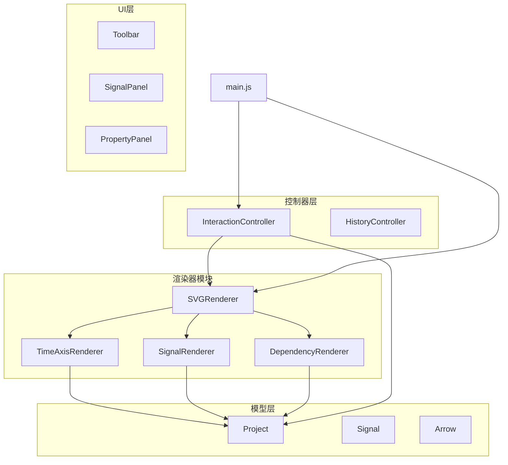
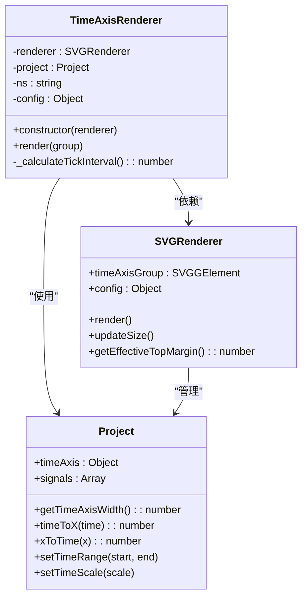
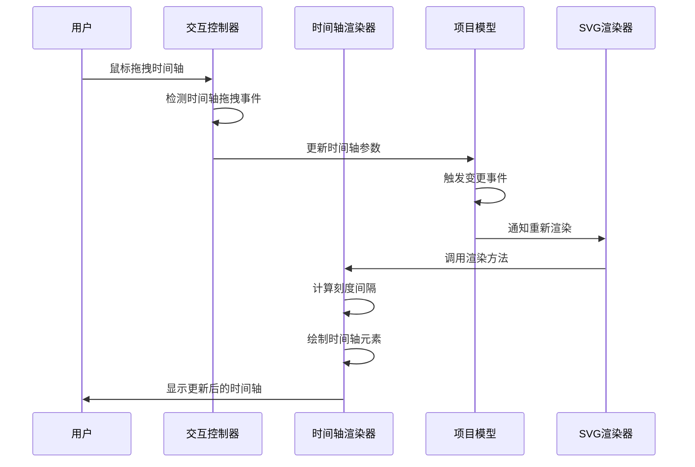
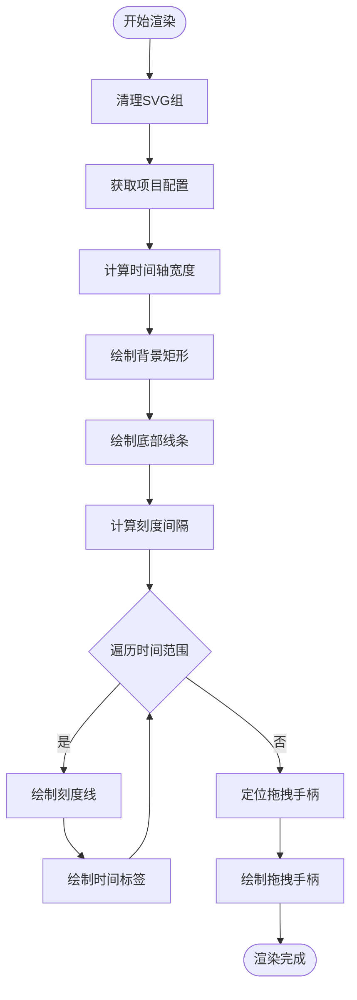
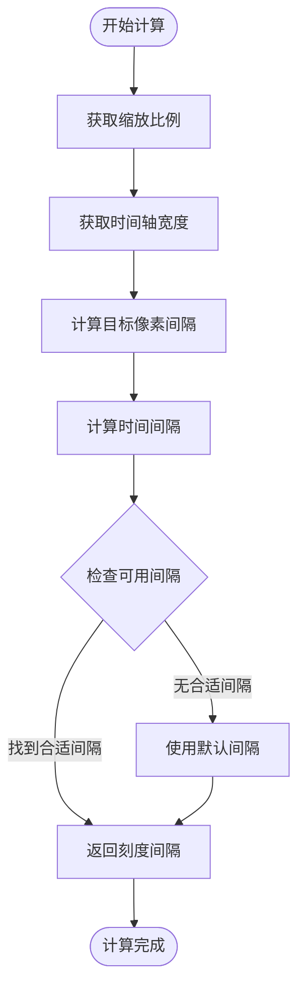
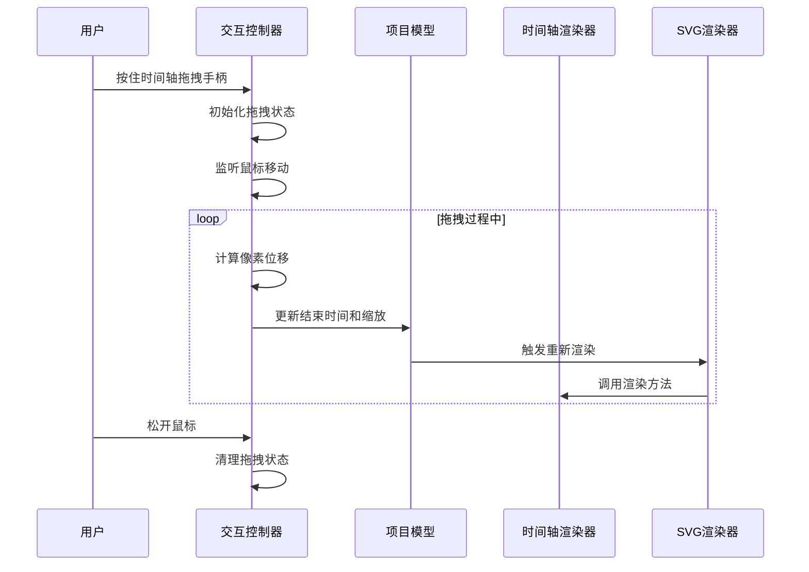
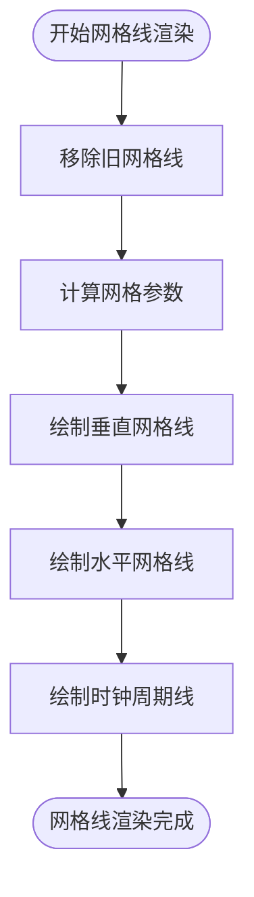
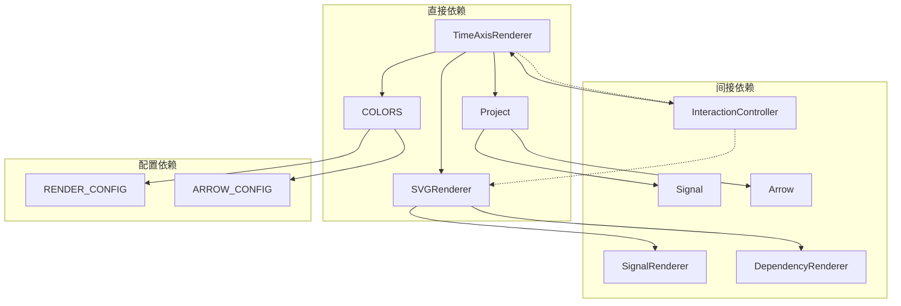

# 时间轴渲染器

<cite>
**本文档引用的文件**
- [TimeAxisRenderer.js](file://src/renderers/TimeAxisRenderer.js)
- [Project.js](file://src/models/Project.js)
- [SVGRenderer.js](file://src/renderers/SVGRenderer.js)
- [InteractionController.js](file://src/controllers/InteractionController.js)
- [colors.js](file://src/config/colors.js)
- [main.js](file://src/main.js)
</cite>

## 目录
1. [简介](#简介)
2. [项目结构](#项目结构)
3. [核心组件](#核心组件)
4. [架构概览](#架构概览)
5. [详细组件分析](#详细组件分析)
6. [依赖关系分析](#依赖关系分析)
7. [性能考虑](#性能考虑)
8. [故障排除指南](#故障排除指南)
9. [结论](#结论)

## 简介

时间轴渲染器是波形图编辑器中的关键组件，负责时间轴的可视化显示和交互控制。该组件实现了时间刻度绘制、网格线生成、时间标签显示和缩放控制等功能，为用户提供直观的时间维度导航体验。

时间轴渲染器采用模块化设计，与项目模型、SVG渲染器和交互控制器紧密协作，形成了完整的波形图显示系统。通过精确的坐标转换算法和智能的刻度计算机制，确保了时间轴在不同缩放级别下的准确性和可读性。

## 项目结构

时间轴渲染器位于渲染器模块中，与其他渲染器组件共同构成波形图的视觉呈现层：



**图表来源**
- [SVGRenderer.js:1-547](file://src/renderers/SVGRenderer.js#L1-L547)
- [TimeAxisRenderer.js:1-132](file://src/renderers/TimeAxisRenderer.js#L1-L132)
- [Project.js:1-245](file://src/models/Project.js#L1-L245)

**章节来源**
- [SVGRenderer.js:1-547](file://src/renderers/SVGRenderer.js#L1-L547)
- [TimeAxisRenderer.js:1-132](file://src/renderers/TimeAxisRenderer.js#L1-L132)
- [Project.js:1-245](file://src/models/Project.js#L1-L245)

## 核心组件

### 时间轴渲染器类结构

时间轴渲染器采用面向对象的设计模式，封装了时间轴的所有渲染逻辑：



**图表来源**
- [TimeAxisRenderer.js:6-132](file://src/renderers/TimeAxisRenderer.js#L6-L132)
- [Project.js:8-245](file://src/models/Project.js#L8-L245)
- [SVGRenderer.js:10-547](file://src/renderers/SVGRenderer.js#L10-L547)

### 时间轴配置系统

时间轴渲染器与项目配置紧密集成，支持灵活的时间轴参数设置：

| 配置项 | 类型 | 默认值 | 描述 |
|--------|------|--------|------|
| unit | string | 'ns' | 时间单位标识符 |
| scale | number | 10 | 缩放比例（像素/单位时间） |
| start | number | 0 | 开始时间 |
| end | number | 100 | 结束时间 |

**章节来源**
- [Project.js:25-30](file://src/models/Project.js#L25-L30)
- [TimeAxisRenderer.js:49-49](file://src/renderers/TimeAxisRenderer.js#L49-L49)

## 架构概览

时间轴渲染器在整个系统架构中扮演着关键角色，连接了数据层、渲染层和用户交互层：



**图表来源**
- [InteractionController.js:84-365](file://src/controllers/InteractionController.js#L84-L365)
- [TimeAxisRenderer.js:21-108](file://src/renderers/TimeAxisRenderer.js#L21-L108)
- [SVGRenderer.js:284-314](file://src/renderers/SVGRenderer.js#L284-L314)

## 详细组件分析

### 时间轴渲染算法

时间轴渲染器实现了完整的渲染流程，包括背景绘制、刻度生成、标签显示和交互元素添加：

#### 渲染流程详解



**图表来源**
- [TimeAxisRenderer.js:21-108](file://src/renderers/TimeAxisRenderer.js#L21-L108)

#### 刻度间隔计算算法

时间轴渲染器采用智能的刻度间隔计算算法，确保在不同缩放级别下都有合适的刻度密度：



**图表来源**
- [TimeAxisRenderer.js:114-131](file://src/renderers/TimeAxisRenderer.js#L114-L131)

### 坐标转换系统

时间轴渲染器提供了精确的坐标转换机制，支持时间到像素坐标的双向转换：

#### 坐标转换公式

时间轴渲染器实现了以下核心转换函数：

1. **时间到像素转换**：
   ```
   x = (time - start) × scale
   ```

2. **像素到时间转换**：
   ```
   time = start + x ÷ scale
   ```

3. **时间轴宽度计算**：
   ```
   width = (end - start) × scale
   ```

这些转换函数确保了时间轴在缩放、平移和窗口调整时的准确性。

**章节来源**
- [Project.js:159-170](file://src/models/Project.js#L159-L170)
- [Project.js:149-152](file://src/models/Project.js#L149-L152)

### 交互功能实现

时间轴渲染器支持多种用户交互操作，主要包括拖拽缩放、平移操作和时间定位：

#### 拖拽缩放机制



**图表来源**
- [InteractionController.js:87-107](file://src/controllers/InteractionController.js#L87-L107)
- [InteractionController.js:342-365](file://src/controllers/InteractionController.js#L342-L365)

#### 边缘滚动优化

为了提升用户体验，时间轴渲染器实现了智能的边缘滚动功能：

- **触发条件**：当鼠标接近屏幕右侧边缘时激活
- **滚动速度**：基于距离边缘的距离动态调整
- **持续时间**：使用requestAnimationFrame实现流畅动画
- **停止条件**：鼠标离开边缘或松开鼠标

**章节来源**
- [InteractionController.js:370-401](file://src/controllers/InteractionController.js#L370-L401)

### 网格线生成机制

时间轴渲染器不仅绘制时间轴本身，还集成了网格线生成功能：

#### 网格线类型

1. **时间刻度网格线**：垂直虚线，对应时间刻度位置
2. **时钟周期网格线**：基于第一个时钟信号的周期生成
3. **背景网格线**：与信号行对齐的水平网格线

#### 网格线渲染流程



**图表来源**
- [SVGRenderer.js:393-419](file://src/renderers/SVGRenderer.js#L393-L419)
- [SVGRenderer.js:349-388](file://src/renderers/SVGRenderer.js#L349-L388)

**章节来源**
- [SVGRenderer.js:393-419](file://src/renderers/SVGRenderer.js#L393-L419)
- [SVGRenderer.js:349-388](file://src/renderers/SVGRenderer.js#L349-L388)

## 依赖关系分析

时间轴渲染器与系统其他组件存在密切的依赖关系：



**图表来源**
- [TimeAxisRenderer.js:4-14](file://src/renderers/TimeAxisRenderer.js#L4-L14)
- [Project.js:5-7](file://src/models/Project.js#L5-L7)
- [SVGRenderer.js:5-8](file://src/renderers/SVGRenderer.js#L5-L8)

### 循环依赖检测

经过分析，时间轴渲染器的依赖关系保持了良好的层次结构，没有发现循环依赖问题：

- **向上依赖**：TimeAxisRenderer → Project → Signal/Arrow
- **横向依赖**：SVGRenderer协调各渲染器
- **向下依赖**：InteractionController使用TimeAxisRenderer

这种设计确保了组件职责清晰，便于维护和扩展。

**章节来源**
- [TimeAxisRenderer.js:4-14](file://src/renderers/TimeAxisRenderer.js#L4-L14)
- [SVGRenderer.js:33-36](file://src/renderers/SVGRenderer.js#L33-L36)

## 性能考虑

时间轴渲染器在设计时充分考虑了性能优化：

### 渲染性能优化

1. **DOM操作最小化**：使用SVG组元素批量操作
2. **坐标计算缓存**：避免重复的数学计算
3. **条件渲染**：只在必要时更新时间轴元素
4. **事件节流**：拖拽过程中的事件处理优化

### 内存管理

- **元素复用**：通过清理组元素实现内存回收
- **事件监听器管理**：及时移除不需要的事件监听
- **状态变量清理**：拖拽完成后及时清理状态信息

### 用户体验优化

- **平滑动画**：使用requestAnimationFrame实现流畅效果
- **智能缩放**：自动适应窗口大小变化
- **响应式设计**：支持触摸设备和桌面设备

## 故障排除指南

### 常见问题及解决方案

#### 时间轴显示异常

**问题描述**：时间轴显示不完整或出现重叠

**可能原因**：
1. 时间轴宽度计算错误
2. 缩放比例设置不当
3. 边界处理逻辑问题

**解决步骤**：
1. 检查项目时间轴配置
2. 验证坐标转换函数
3. 确认SVG尺寸更新逻辑

#### 拖拽功能失效

**问题描述**：无法拖拽时间轴进行缩放

**可能原因**：
1. 事件监听器未正确绑定
2. 拖拽状态管理错误
3. 坐标计算精度问题

**解决步骤**：
1. 检查鼠标事件处理逻辑
2. 验证拖拽状态变量
3. 确认坐标转换准确性

#### 性能问题

**问题描述**：渲染卡顿或响应迟缓

**可能原因**：
1. DOM操作过于频繁
2. 事件处理效率低
3. 计算复杂度过高

**解决步骤**：
1. 优化DOM操作批次
2. 实施事件节流机制
3. 减少不必要的重绘

**章节来源**
- [InteractionController.js:84-365](file://src/controllers/InteractionController.js#L84-L365)
- [SVGRenderer.js:194-243](file://src/renderers/SVGRenderer.js#L194-L243)

## 结论

时间轴渲染器作为波形图编辑器的核心组件，展现了优秀的架构设计和实现质量。通过精确的坐标转换算法、智能的刻度计算机制和完善的交互功能，为用户提供了直观、高效的时间维度导航体验。

该组件的主要优势包括：

1. **模块化设计**：清晰的职责分离和接口定义
2. **性能优化**：高效的渲染算法和内存管理
3. **用户体验**：流畅的交互响应和智能的辅助功能
4. **可扩展性**：良好的架构为未来功能扩展奠定基础

时间轴渲染器的成功实现为整个波形图编辑器系统的稳定性、可维护性和用户体验提供了坚实保障。其设计模式和实现技巧可以为类似的时间序列可视化项目提供有价值的参考。