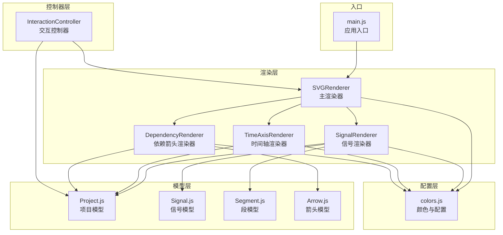
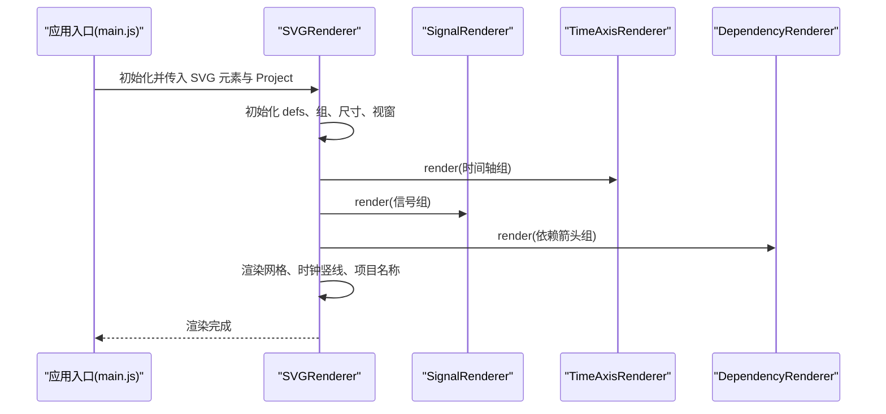
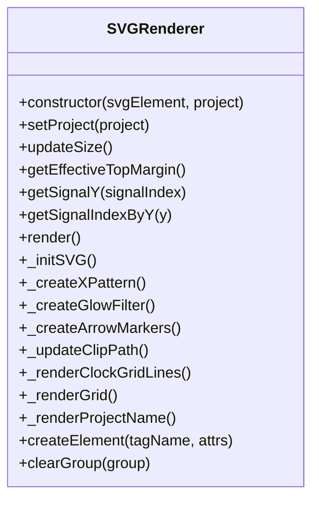
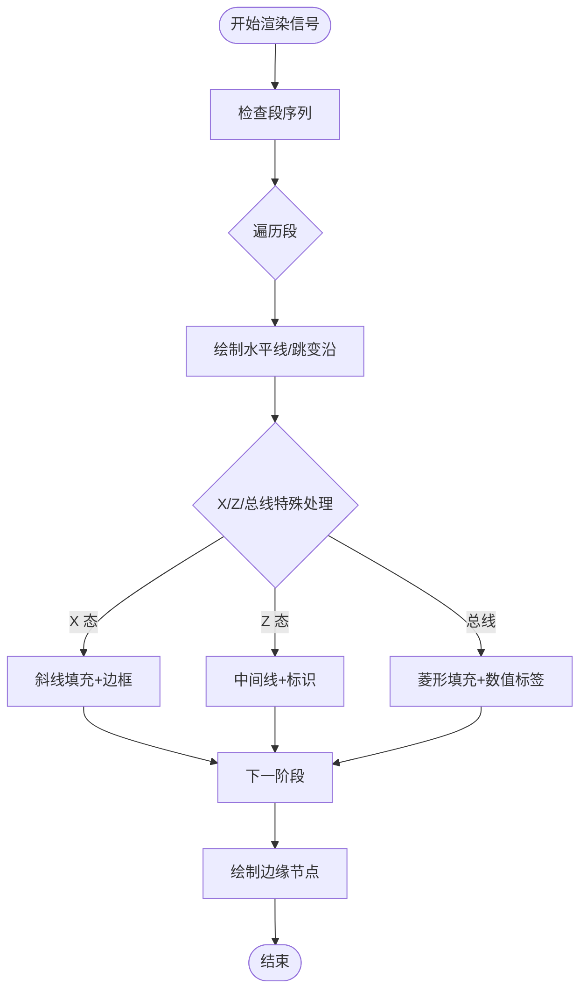
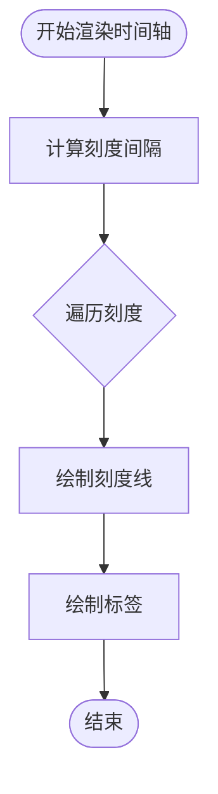
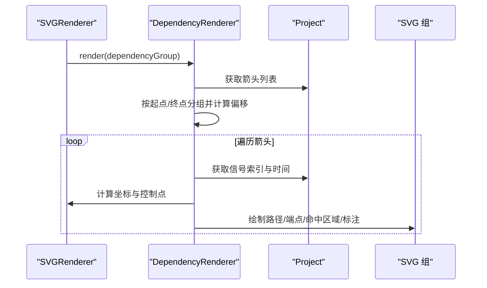
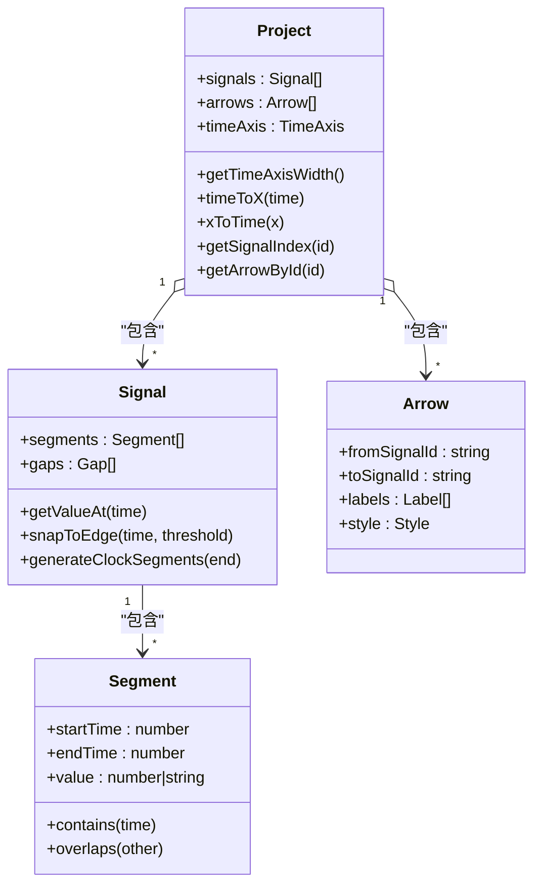
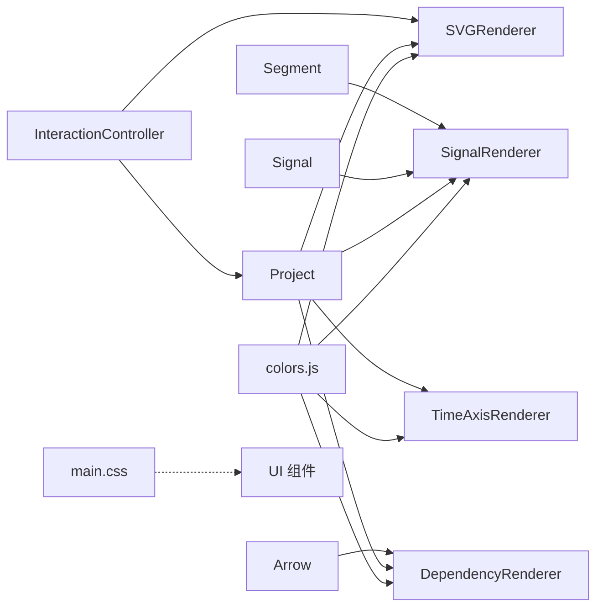

# 渲染系统

<cite>
**本文档引用的文件**
- [SVGRenderer.js](file://src/renderers/SVGRenderer.js)
- [SignalRenderer.js](file://src/renderers/SignalRenderer.js)
- [TimeAxisRenderer.js](file://src/renderers/TimeAxisRenderer.js)
- [DependencyRenderer.js](file://src/renderers/DependencyRenderer.js)
- [colors.js](file://src/config/colors.js)
- [Project.js](file://src/models/Project.js)
- [Signal.js](file://src/models/Signal.js)
- [Segment.js](file://src/models/Segment.js)
- [Arrow.js](file://src/models/Arrow.js)
- [InteractionController.js](file://src/controllers/InteractionController.js)
- [main.js](file://src/main.js)
- [main.css](file://styles/main.css)
</cite>

## 目录
1. [简介](#简介)
2. [项目结构](#项目结构)
3. [核心组件](#核心组件)
4. [架构总览](#架构总览)
5. [详细组件分析](#详细组件分析)
6. [依赖关系分析](#依赖关系分析)
7. [性能考量](#性能考量)
8. [故障排查指南](#故障排查指南)
9. [结论](#结论)

## 简介
本文件面向波形图编辑器的渲染系统，重点解释基于 SVG 的渲染架构设计与实现细节。系统采用“主渲染器 + 子渲染器”的分层架构：
- 主渲染器 SVGRenderer 负责管理 SVG 画布、协调各子渲染器、维护全局配置与尺寸计算、执行整体渲染流程。
- 子渲染器分别负责：
  - SignalRenderer：渲染波形信号（含跳变沿、X/Z 态、总线值、分隔符等）。
  - TimeAxisRenderer：渲染时间轴与刻度标签、拖拽手柄。
  - DependencyRenderer：渲染信号间依赖箭头（含贝塞尔曲线、端点、标注等）。

此外，文档还涵盖渲染优化策略、性能考虑、响应式设计实现、SVG 元素创建与样式应用、动画效果以及渲染流程图与关键算法说明，帮助开发者快速理解并高效扩展渲染系统。

## 项目结构
渲染系统位于 src/renderers 目录，配合 src/config/colors.js 提供统一的颜色与渲染配置，数据模型位于 src/models，交互逻辑位于 src/controllers，入口位于 src/main.js。

图表来源
- [SVGRenderer.js:1-547](file://src/renderers/SVGRenderer.js#L1-L547)
- [SignalRenderer.js:1-501](file://src/renderers/SignalRenderer.js#L1-L501)
- [TimeAxisRenderer.js:1-132](file://src/renderers/TimeAxisRenderer.js#L1-L132)
- [DependencyRenderer.js:1-290](file://src/renderers/DependencyRenderer.js#L1-L290)
- [colors.js:1-83](file://src/config/colors.js#L1-L83)
- [Project.js:1-245](file://src/models/Project.js#L1-L245)
- [Signal.js:1-343](file://src/models/Signal.js#L1-L343)
- [Segment.js:1-94](file://src/models/Segment.js#L1-L94)
- [Arrow.js:1-114](file://src/models/Arrow.js#L1-L114)
- [InteractionController.js:1-1420](file://src/controllers/InteractionController.js#L1-L1420)
- [main.js:1-819](file://src/main.js#L1-L819)

章节来源
- [main.js:1-132](file://src/main.js#L1-L132)
- [SVGRenderer.js:1-100](file://src/renderers/SVGRenderer.js#L1-L100)

## 核心组件
- SVGRenderer：主渲染器，负责 SVG 画布初始化、分组结构、全局样式与尺寸计算、整体渲染调度、网格与时钟竖线、项目名称渲染、X 态填充模式、箭头发光滤镜与箭头标记定义等。
- SignalRenderer：信号渲染器，负责每个信号的名称、波形线、跳变沿、X/Z 态、总线值、分隔符、边缘节点、遮罩与裁剪等。
- TimeAxisRenderer：时间轴渲染器，负责时间轴背景、刻度线、标签、拖拽手柄与刻度间隔计算。
- DependencyRenderer：依赖箭头渲染器，负责箭头路径（贝塞尔曲线）、端点、标注、命中区域、防重叠偏移、发光滤镜等。

章节来源
- [SVGRenderer.js:10-547](file://src/renderers/SVGRenderer.js#L10-L547)
- [SignalRenderer.js:6-501](file://src/renderers/SignalRenderer.js#L6-L501)
- [TimeAxisRenderer.js:6-132](file://src/renderers/TimeAxisRenderer.js#L6-L132)
- [DependencyRenderer.js:7-290](file://src/renderers/DependencyRenderer.js#L7-L290)

## 架构总览
渲染系统采用“主渲染器协调 + 子渲染器分工”的模式：
- 主渲染器持有项目数据与 SVG DOM，负责全局尺寸、视窗、裁剪、网格、时钟竖线、项目名称等。
- 子渲染器各自管理自己的 SVG 组与元素，按需创建、更新、清理。
- 通过 Project 模型提供的 timeToX/xToTime、信号索引与时间轴范围等接口，实现像素与时间的双向映射。

图表来源
- [main.js:89-132](file://src/main.js#L89-L132)
- [SVGRenderer.js:284-314](file://src/renderers/SVGRenderer.js#L284-L314)
- [SignalRenderer.js:22-31](file://src/renderers/SignalRenderer.js#L22-L31)
- [TimeAxisRenderer.js:21-78](file://src/renderers/TimeAxisRenderer.js#L21-L78)
- [DependencyRenderer.js:18-84](file://src/renderers/DependencyRenderer.js#L18-L84)

## 详细组件分析

### SVGRenderer 主渲染器
- 职责
  - 管理 SVG 命名空间与 defs 区域，创建 X 态填充 pattern、箭头发光滤镜、箭头标记。
  - 维护全局配置（边距、信号高度、波形高度等），计算并设置 SVG 宽高与 viewBox。
  - 维护主组、时间轴组、信号组、交互组、依赖箭头组的层级与裁剪。
  - 渲染网格、时钟竖线、项目名称（含编辑输入框与 SVG 文本）。
  - 提供工具方法：createElement、clearGroup、坐标转换（时间↔像素）、信号行 Y 坐标计算与索引查找。
- 关键算法
  - updateSize：根据容器宽度与时间轴范围自动扩展时间轴，确保填满容器宽度；标题在顶部时动态增加上边距。
  - _renderClockGridLines：以第一个时钟信号周期为基准，绘制贯穿所有信号行的虚线竖线。
  - _renderGrid：绘制水平网格线，分隔各信号行。
  - _renderProjectName：使用 SVG text 与 foreignObject 输入框组合，实现导出兼容与交互编辑。
- 性能要点
  - 通过 defs 中的 pattern、filter、marker 实现复用，避免重复创建。
  - 使用 clipPath 限制波形与箭头超出时间轴右侧，减少无效绘制。
  - 仅在必要时更新元素属性，避免全量重建。

图表来源
- [SVGRenderer.js:10-547](file://src/renderers/SVGRenderer.js#L10-L547)

章节来源
- [SVGRenderer.js:15-100](file://src/renderers/SVGRenderer.js#L15-L100)
- [SVGRenderer.js:194-243](file://src/renderers/SVGRenderer.js#L194-L243)
- [SVGRenderer.js:319-344](file://src/renderers/SVGRenderer.js#L319-L344)
- [SVGRenderer.js:349-388](file://src/renderers/SVGRenderer.js#L349-L388)
- [SVGRenderer.js:393-419](file://src/renderers/SVGRenderer.js#L393-L419)
- [SVGRenderer.js:424-522](file://src/renderers/SVGRenderer.js#L424-L522)

### SignalRenderer 信号渲染器
- 职责
  - 渲染每个信号的名称、背景、波形线、跳变沿、X/Z 态、总线值、分隔符与边缘节点。
  - 使用 mask 与 clipPath 实现分隔符区域裁剪与总线 X 态斜线填充。
  - 支持选中高亮背景与透明命中区域，便于交互。
- 关键算法
  - renderWaveform：遍历段序列，按值类型与信号类型绘制直线、垂直跳变沿、X/Z 特殊处理、总线菱形填充与数值标签。
  - _renderBusValue：根据是否跳变沿两侧留白，生成带缺口的菱形路径，结合 clipPath 与斜线填充实现 X 态。
  - _renderEdgeNodes：为每个段起点绘制窄矩形命中区域，便于拖拽编辑。
  - _renderGaps：绘制两条波浪斜线与透明命中区域，支持拖拽调整分隔符位置。
- 性能要点
  - 通过 mask 与 clipPath 减少重复路径绘制。
  - 仅在需要时创建与更新 defs 中的 mask/clipPath。
  - 对总线 X 态使用斜线 pattern，避免复杂几何计算。

图表来源
- [SignalRenderer.js:201-316](file://src/renderers/SignalRenderer.js#L201-L316)
- [SignalRenderer.js:372-474](file://src/renderers/SignalRenderer.js#L372-L474)
- [SignalRenderer.js:479-500](file://src/renderers/SignalRenderer.js#L479-L500)

章节来源
- [SignalRenderer.js:22-144](file://src/renderers/SignalRenderer.js#L22-L144)
- [SignalRenderer.js:201-316](file://src/renderers/SignalRenderer.js#L201-L316)
- [SignalRenderer.js:372-474](file://src/renderers/SignalRenderer.js#L372-L474)
- [SignalRenderer.js:479-500](file://src/renderers/SignalRenderer.js#L479-L500)

### TimeAxisRenderer 时间轴渲染器
- 职责
  - 渲染时间轴背景、底部线、刻度线与标签。
  - 计算刻度间隔，确保每 50-100 像素一个刻度。
  - 渲染右侧拖拽手柄，支持扩展时间轴。
- 关键算法
  - _calculateTickInterval：根据当前缩放比例与目标像素密度，选择最近的整数间隔。
- 性能要点
  - 仅在渲染时创建必要元素，避免重复 DOM 操作。
  - 拖拽手柄使用透明命中区域，提升交互体验。

图表来源
- [TimeAxisRenderer.js:21-78](file://src/renderers/TimeAxisRenderer.js#L21-L78)
- [TimeAxisRenderer.js:114-131](file://src/renderers/TimeAxisRenderer.js#L114-L131)

章节来源
- [TimeAxisRenderer.js:21-78](file://src/renderers/TimeAxisRenderer.js#L21-L78)
- [TimeAxisRenderer.js:114-131](file://src/renderers/TimeAxisRenderer.js#L114-L131)

### DependencyRenderer 依赖箭头渲染器
- 职责
  - 渲染信号间依赖箭头，支持正向、反向、双向箭头。
  - 计算贝塞尔曲线控制点，生成平滑 S 形曲线。
  - 支持端点拖拽、标注文本、命中区域、发光滤镜与防重叠偏移。
- 关键算法
  - render：按起点/终点分组，计算同起点/同终点的偏移量，避免重叠。
  - renderArrow：计算起点/终点坐标，确定有效方向与箭头标记，生成路径与命中区域。
  - _calculateControlPoints：根据水平距离与方向计算控制点，限制最大偏移。
- 性能要点
  - 使用透明命中区域与 marker-end/marker-start，避免重复路径。
  - 选中时使用滤镜 glow，仅在选中时渲染，降低常态渲染成本。

图表来源
- [DependencyRenderer.js:18-84](file://src/renderers/DependencyRenderer.js#L18-L84)
- [DependencyRenderer.js:93-182](file://src/renderers/DependencyRenderer.js#L93-L182)
- [DependencyRenderer.js:277-289](file://src/renderers/DependencyRenderer.js#L277-L289)

章节来源
- [DependencyRenderer.js:18-84](file://src/renderers/DependencyRenderer.js#L18-L84)
- [DependencyRenderer.js:93-182](file://src/renderers/DependencyRenderer.js#L93-L182)
- [DependencyRenderer.js:277-289](file://src/renderers/DependencyRenderer.js#L277-L289)

### 数据模型与渲染协作
- Project：提供时间轴范围、缩放、时间与像素互转、信号/箭头管理、事件通知。
- Signal/Segment：提供段序列、值查询、吸附跳变沿、合并相邻段、生成时钟段等。
- Arrow：描述信号间依赖关系，支持多标签、样式配置、方向与双向箭头。

图表来源
- [Project.js:8-245](file://src/models/Project.js#L8-L245)
- [Signal.js:7-343](file://src/models/Signal.js#L7-L343)
- [Segment.js:5-94](file://src/models/Segment.js#L5-L94)
- [Arrow.js:5-114](file://src/models/Arrow.js#L5-L114)

章节来源
- [Project.js:150-170](file://src/models/Project.js#L150-L170)
- [Signal.js:164-220](file://src/models/Signal.js#L164-L220)
- [Arrow.js:39-44](file://src/models/Arrow.js#L39-L44)

## 依赖关系分析
- 渲染器依赖关系
  - SVGRenderer 依赖 colors.js 提供颜色与配置，依赖 Project 提供数据与坐标转换。
  - SignalRenderer 依赖 Signal/Segment，依赖 colors.js 与 Project。
  - TimeAxisRenderer 依赖 Project 与 colors.js。
  - DependencyRenderer 依赖 Arrow 与 Project，依赖 colors.js。
- 控制器与渲染器
  - InteractionController 通过 Project 与 SVGRenderer 协作，驱动渲染更新与交互反馈。
- 样式与主题
  - colors.js 集中管理颜色与配置，main.css 提供 UI 样式与交互高亮。

图表来源
- [colors.js:1-83](file://src/config/colors.js#L1-L83)
- [SVGRenderer.js:5-8](file://src/renderers/SVGRenderer.js#L5-L8)
- [SignalRenderer.js:4](file://src/renderers/SignalRenderer.js#L4)
- [TimeAxisRenderer.js:4](file://src/renderers/TimeAxisRenderer.js#L4)
- [DependencyRenderer.js:5](file://src/renderers/DependencyRenderer.js#L5)
- [InteractionController.js:1-6](file://src/controllers/InteractionController.js#L1-L6)
- [main.css:1-551](file://styles/main.css#L1-L551)

章节来源
- [colors.js:5-50](file://src/config/colors.js#L5-L50)
- [InteractionController.js:52-82](file://src/controllers/InteractionController.js#L52-L82)

## 性能考量
- 渲染优化
  - 复用 SVG 元素：通过 defs 中的 pattern、filter、marker 实现复用，减少重复创建。
  - 裁剪与遮罩：使用 clipPath 限制波形与箭头绘制范围；使用 mask 裁剪分隔符区域，避免多余绘制。
  - 透明命中区域：使用透明 stroke 或 rect 作为命中区域，避免影响视觉效果。
  - 选中高亮：仅在选中时渲染 glow 滤镜，常态不渲染滤镜，降低开销。
- 响应式设计
  - updateSize 动态计算 SVG 宽高与 viewBox，标题在顶部时增加上边距，底部标题减少底部边距。
  - 时间轴拖拽手柄支持边缘滚动，自动扩展时间轴，适配窗口尺寸变化。
- 交互性能
  - 临时箭头与端点预览仅在交互过程中创建，完成后清理。
  - 边沿拖拽磁吸到时钟信号跳变沿，减少用户操作误差与重绘次数。

章节来源
- [SVGRenderer.js:319-344](file://src/renderers/SVGRenderer.js#L319-L344)
- [SVGRenderer.js:194-243](file://src/renderers/SVGRenderer.js#L194-L243)
- [InteractionController.js:342-401](file://src/controllers/InteractionController.js#L342-L401)
- [InteractionController.js:669-723](file://src/controllers/InteractionController.js#L669-L723)

## 故障排查指南
- 渲染异常
  - 确认 SVG 元素存在且已初始化，检查命名空间与 defs 是否创建成功。
  - 若网格或时钟竖线不显示，检查 updateSize 与 _updateClipPath 的调用顺序。
- 信号渲染问题
  - X/Z 态未正确显示：检查 X 态 pattern 与 Z 态线的绘制顺序与颜色。
  - 总线值渲染异常：检查菱形路径、clipPath 与斜线填充的生成逻辑。
- 依赖箭头问题
  - 箭头方向错误：检查 direction 与 marker 的设置，确认 isBidirectional 与有效方向。
  - 箭头重叠：检查起点/终点分组与偏移计算逻辑。
- 交互问题
  - 时间轴拖拽无效：检查 _timeAxisDragging 标志与拖拽状态机。
  - 箭头端点拖拽吸附异常：检查 snapToEdge 与预览坐标的更新。

章节来源
- [SVGRenderer.js:59-100](file://src/renderers/SVGRenderer.js#L59-L100)
- [SignalRenderer.js:321-348](file://src/renderers/SignalRenderer.js#L321-L348)
- [DependencyRenderer.js:112-128](file://src/renderers/DependencyRenderer.js#L112-L128)
- [InteractionController.js:84-107](file://src/controllers/InteractionController.js#L84-L107)
- [InteractionController.js:257-282](file://src/controllers/InteractionController.js#L257-L282)

## 结论
该渲染系统以 SVGRenderer 为核心，通过清晰的职责划分与统一的配置管理，实现了高性能、可交互、可扩展的波形图渲染。主渲染器负责全局协调与优化，子渲染器专注各自领域，配合 Project 模型的数据驱动与 InteractionController 的交互逻辑，形成完整的渲染与编辑闭环。通过裁剪、遮罩、复用与滤镜等技术手段，系统在保证视觉质量的同时兼顾性能与响应速度。