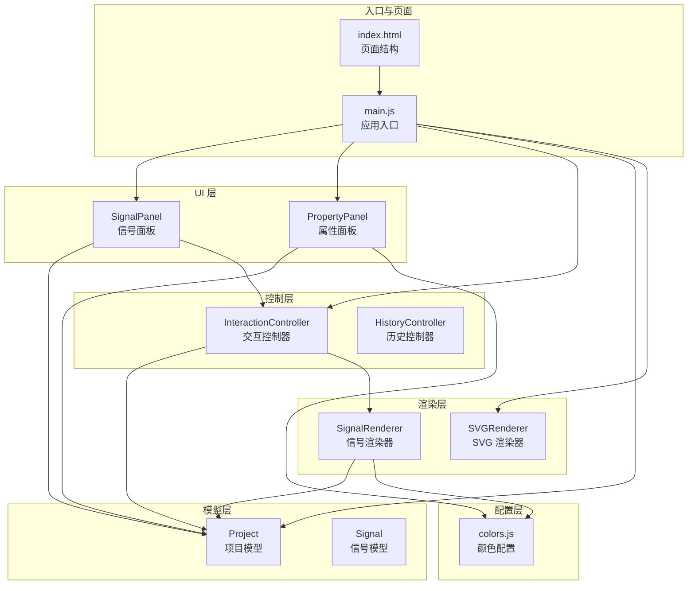
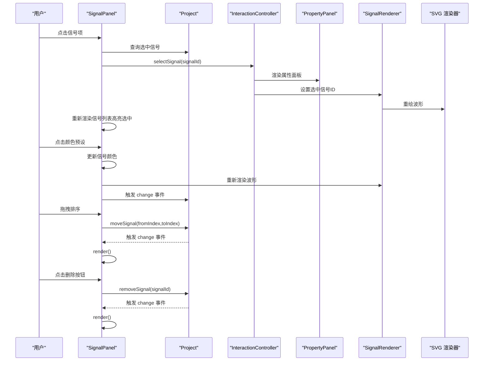
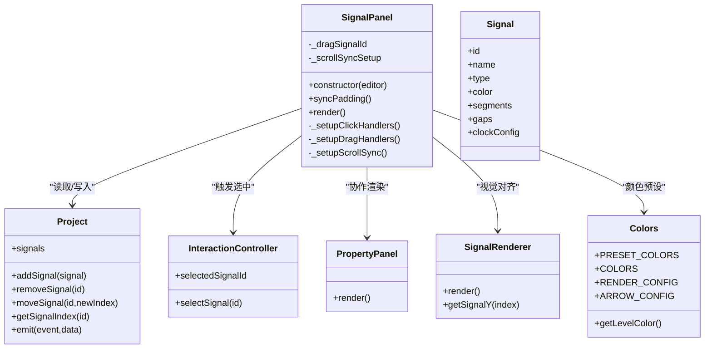
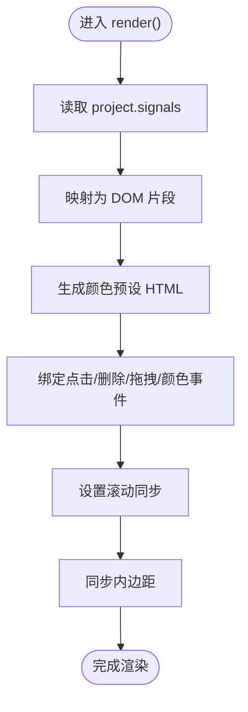
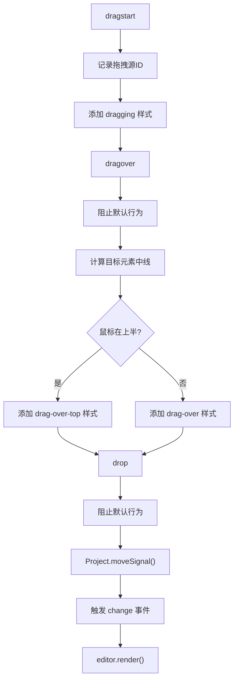
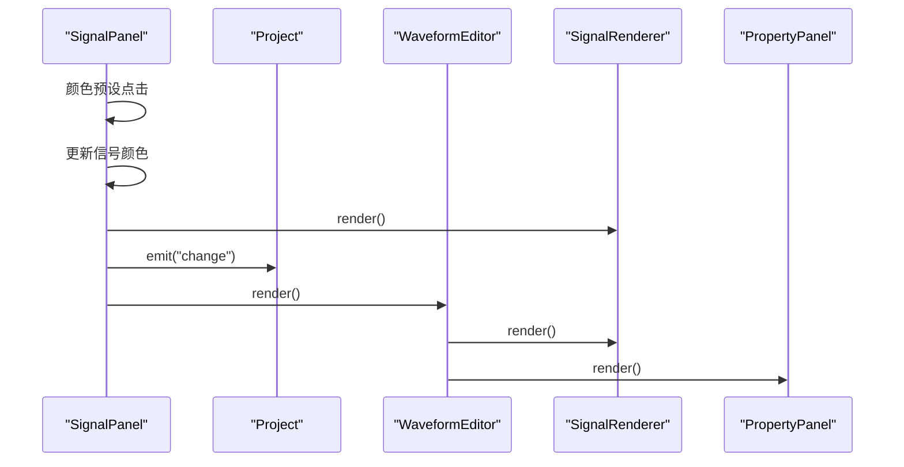
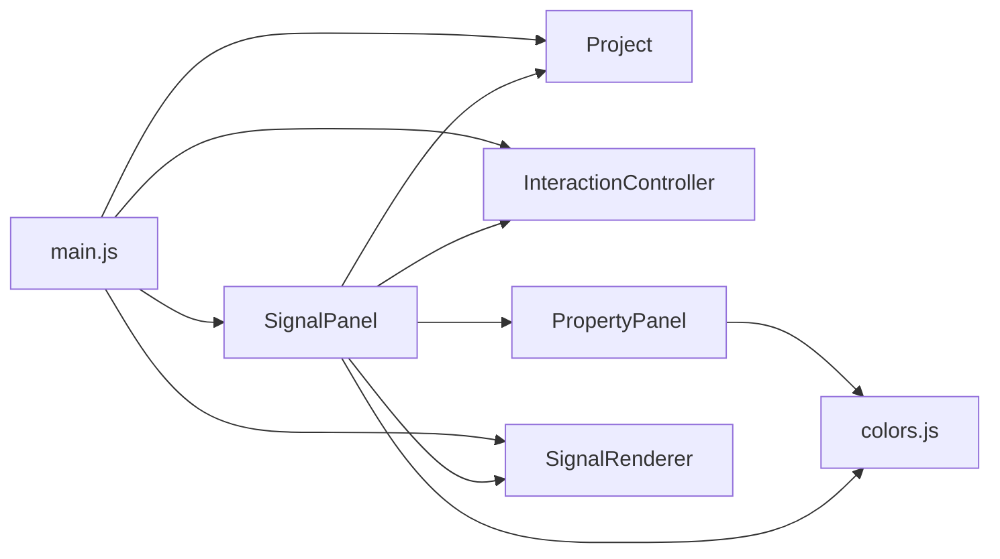

# 信号面板

<cite>
**本文档引用的文件**
- [SignalPanel.js](file://src/ui/SignalPanel.js)
- [Signal.js](file://src/models/Signal.js)
- [Project.js](file://src/models/Project.js)
- [main.js](file://src/main.js)
- [PropertyPanel.js](file://src/ui/PropertyPanel.js)
- [SignalRenderer.js](file://src/renderers/SignalRenderer.js)
- [InteractionController.js](file://src/controllers/InteractionController.js)
- [colors.js](file://src/config/colors.js)
- [main.css](file://styles/main.css)
- [index.html](file://index.html)
</cite>

## 更新摘要
**变更内容**
- 新增标准化颜色预设系统，集成七种预定义颜色选项
- 更新信号面板颜色选择功能，支持快速颜色预设
- 扩展属性面板颜色管理，提供统一的颜色选择体验
- 集成颜色配置管理系统，提升界面一致性

## 目录
1. [简介](#简介)
2. [项目结构](#项目结构)
3. [核心组件](#核心组件)
4. [架构总览](#架构总览)
5. [详细组件分析](#详细组件分析)
6. [颜色预设系统](#颜色预设系统)
7. [依赖关系分析](#依赖关系分析)
8. [性能考量](#性能考量)
9. [故障排查指南](#故障排查指南)
10. [结论](#结论)
11. [附录](#附录)

## 简介
本文件面向波形图编辑器的"信号面板"组件，系统性说明 SignalPanel 类的实现架构、渲染机制与用户交互处理；详述信号的显示、排序、添加、删除与编辑能力；解释信号面板与项目模型的数据绑定与实时同步；阐述响应式设计与可访问性支持；并提供自定义配置与扩展开发指南及具体使用示例。

**更新** 新增标准化颜色预设系统，提供七种预定义颜色选项，提升用户界面的一致性和可用性。

## 项目结构
信号面板位于 UI 层，与项目模型、渲染器、交互控制器协同工作：
- UI 层：SignalPanel、PropertyPanel、Toolbar、SignalRenderer
- 模型层：Project、Signal、Segment、Arrow
- 控制层：InteractionController、HistoryController
- 配置层：colors.js 集中管理颜色配置
- 入口：main.js 负责初始化与事件绑定
- 样式：main.css 提供信号面板的布局与交互样式

**图表来源**
- [main.js:115-117](file://src/main.js#L115-L117)
- [SignalPanel.js:1-186](file://src/ui/SignalPanel.js#L1-L186)
- [PropertyPanel.js:1-567](file://src/ui/PropertyPanel.js#L1-L567)
- [Project.js:1-245](file://src/models/Project.js#L1-L245)
- [Signal.js:1-367](file://src/models/Signal.js#L1-L367)
- [SignalRenderer.js:1-590](file://src/renderers/SignalRenderer.js#L1-L590)
- [InteractionController.js:1-200](file://src/controllers/InteractionController.js#L1-L200)
- [colors.js:1-83](file://src/config/colors.js#L1-L83)
- [index.html:45-74](file://index.html#L45-L74)

**章节来源**
- [index.html:45-74](file://index.html#L45-L74)
- [main.js:115-117](file://src/main.js#L115-L117)

## 核心组件
- SignalPanel：负责信号列表的渲染、滚动同步、拖拽排序、点击选择与删除操作，**新增颜色预设选择功能**。
- Project：持有信号集合，提供增删改查、移动信号、事件通知等能力。
- Signal：表示单个信号及其段、时钟配置、分隔符等，**支持颜色属性管理**。
- PropertyPanel：与 SignalPanel 协作，展示与编辑信号/项目属性，**集成颜色预设系统**。
- SignalRenderer：将信号与分隔符渲染到 SVG，支撑信号面板的视觉对齐，**使用统一颜色配置**。
- InteractionController：处理鼠标/键盘交互，驱动选中与渲染更新。
- colors.js：集中管理颜色配置，提供标准化的颜色预设系统。
- main.js：应用入口，初始化各组件并建立事件绑定。

**章节来源**
- [SignalPanel.js:1-186](file://src/ui/SignalPanel.js#L1-L186)
- [Project.js:1-245](file://src/models/Project.js#L1-L245)
- [Signal.js:1-367](file://src/models/Signal.js#L1-L367)
- [PropertyPanel.js:1-567](file://src/ui/PropertyPanel.js#L1-L567)
- [SignalRenderer.js:1-590](file://src/renderers/SignalRenderer.js#L1-L590)
- [InteractionController.js:1-200](file://src/controllers/InteractionController.js#L1-L200)
- [colors.js:1-83](file://src/config/colors.js#L1-L83)
- [main.js:115-117](file://src/main.js#L115-L117)

## 架构总览
SignalPanel 通过 editor 引用访问 Project，并基于 Project 中的 signals 列表进行渲染。渲染完成后，SignalPanel 为每个信号项绑定点击、删除、拖拽事件，并维护与波形画布的滚动同步。**新增颜色预设选择功能，支持七种预定义颜色的快速选择**。PropertyPanel 与 SignalPanel 协作，实现信号属性的双向绑定与实时更新。SignalRenderer 负责将信号与分隔符绘制到 SVG，确保信号面板与波形区域的视觉对齐。

**图表来源**
- [SignalPanel.js:69-87](file://src/ui/SignalPanel.js#L69-L87)
- [SignalPanel.js:89-186](file://src/ui/SignalPanel.js#L89-L186)
- [Project.js:117-124](file://src/models/Project.js#L117-L124)
- [Project.js:56-62](file://src/models/Project.js#L56-L62)
- [PropertyPanel.js:32-60](file://src/ui/PropertyPanel.js#L32-L60)
- [SignalRenderer.js:49-61](file://src/renderers/SignalRenderer.js#L49-L61)
- [InteractionController.js:790-795](file://src/controllers/InteractionController.js#L790-L795)

## 详细组件分析

### SignalPanel 类实现与渲染机制
- 构造与状态
  - 保存 editor 引用、DOM 元素引用、拖拽状态与滚动同步标志。
- 动态内边距同步
  - 通过 renderer.config 与渲染器的信号高度、间距、顶部外边距，计算 signal-list 的 paddingTop，使信号名与波形区域对齐。
- 滚动同步
  - 将波形画布与信号列表的 scrollTop 绑定，保证两者垂直滚动一致。
- 渲染逻辑
  - 读取 editor.project.signals，逐项生成信号项 DOM，包含名称、拖拽句柄、删除按钮、**颜色预设选择器**。
  - 为每个信号项绑定点击、删除按钮点击、拖拽事件，**以及颜色预设点击事件**。
  - 渲染完成后调用同步方法，确保视觉对齐。
- 用户交互
  - 点击信号项：调用 editor.selectSignal，触发属性面板与波形重绘。
  - 删除按钮：从 Project 中移除信号，若删除的是当前选中信号则清空选中状态，然后重新渲染。
  - 拖拽排序：基于 HTML5 拖拽 API，计算插入位置（上半/下半），调用 Project.moveSignal，触发 change 事件，再重新渲染。
  - **颜色预设选择：点击颜色预设色块，更新信号颜色，触发波形重绘和项目变更通知**。

**更新** 新增颜色预设选择功能，提供七种预定义颜色供用户快速选择。

**图表来源**
- [SignalPanel.js:1-186](file://src/ui/SignalPanel.js#L1-L186)
- [Project.js:1-245](file://src/models/Project.js#L1-L245)
- [Signal.js:1-367](file://src/models/Signal.js#L1-L367)
- [InteractionController.js:790-795](file://src/controllers/InteractionController.js#L790-L795)
- [PropertyPanel.js:32-60](file://src/ui/PropertyPanel.js#L32-L60)
- [SignalRenderer.js:22-31](file://src/renderers/SignalRenderer.js#L22-L31)
- [colors.js:1-83](file://src/config/colors.js#L1-L83)

**章节来源**
- [SignalPanel.js:13-26](file://src/ui/SignalPanel.js#L13-L26)
- [SignalPanel.js:31-43](file://src/ui/SignalPanel.js#L31-L43)
- [SignalPanel.js:45-67](file://src/ui/SignalPanel.js#L45-L67)
- [SignalPanel.js:69-87](file://src/ui/SignalPanel.js#L69-L87)
- [SignalPanel.js:89-186](file://src/ui/SignalPanel.js#L89-L186)

### 信号列表渲染流程
- 读取 Project.signals
- 为每个信号生成 DOM 片段，包含：
  - 信号项容器（可拖拽）
  - 拖拽句柄（标题提示）
  - 信号名称
  - **颜色预设选择器（七种预定义颜色）**
  - 删除按钮（标题提示）
- 绑定点击与删除事件
- **绑定颜色预设点击事件**
- 绑定拖拽事件（dragstart/dragover/dragleave/drop）
- 调用同步方法，确保与波形区域对齐

**更新** 渲染流程新增颜色预设选择器的生成和事件绑定。

**图表来源**
- [SignalPanel.js:45-67](file://src/ui/SignalPanel.js#L45-L67)
- [SignalPanel.js:69-87](file://src/ui/SignalPanel.js#L69-L87)
- [SignalPanel.js:89-186](file://src/ui/SignalPanel.js#L89-L186)
- [SignalPanel.js:13-26](file://src/ui/SignalPanel.js#L13-L26)

**章节来源**
- [SignalPanel.js:45-67](file://src/ui/SignalPanel.js#L45-L67)

### 拖拽排序算法
- dragstart：记录拖拽源信号 ID，添加拖拽样式
- dragover：阻止默认行为，计算鼠标在目标元素的上半/下半，添加上/下边框样式
- drop：阻止默认行为，计算插入位置（基于鼠标相对目标元素的中线），执行 splice 移动，调用 Project.moveSignal，触发 change 事件，重新渲染

**图表来源**
- [SignalPanel.js:111-186](file://src/ui/SignalPanel.js#L111-L186)
- [Project.js:117-124](file://src/models/Project.js#L117-L124)

**章节来源**
- [SignalPanel.js:111-186](file://src/ui/SignalPanel.js#L111-L186)
- [Project.js:117-124](file://src/models/Project.js#L117-L124)

### 信号面板与项目模型的数据绑定
- Project 提供 addSignal/removeSignal/moveSignal/getSignalIndex 等方法，并通过 emit('change', ...) 通知订阅者
- SignalPanel 在删除与拖拽排序后，调用 editor.render()，从而触发 SignalRenderer 与 PropertyPanel 的更新
- **颜色预设选择后，SignalPanel 更新信号颜色并触发项目变更通知**
- main.js 在初始化时为 Project 注册 change 事件处理器，实现自动保存与 UI 同步

**更新** 新增颜色预设选择的变更通知机制。

**图表来源**
- [Project.js:47-50](file://src/models/Project.js#L47-L50)
- [Project.js:56-62](file://src/models/Project.js#L56-L62)
- [Project.js:117-124](file://src/models/Project.js#L117-L124)
- [SignalPanel.js:80-85](file://src/ui/SignalPanel.js#L80-L85)
- [SignalPanel.js:181-186](file://src/ui/SignalPanel.js#L181-L186)
- [main.js:763-769](file://src/main.js#L763-L769)

**章节来源**
- [Project.js:47-62](file://src/models/Project.js#L47-L62)
- [Project.js:117-124](file://src/models/Project.js#L117-L124)
- [SignalPanel.js:80-85](file://src/ui/SignalPanel.js#L80-L85)
- [SignalPanel.js:181-186](file://src/ui/SignalPanel.js#L181-L186)
- [main.js:763-769](file://src/main.js#L763-L769)

### 响应式设计与可访问性支持
- 响应式布局
  - 信号面板宽度可拖拽调整，通过 panelResizer 实现，同时更新 renderer.config.leftMargin 与 SignalPanel.syncPadding()
  - 页面 viewport 设置为移动端友好
- 可访问性
  - 为按钮提供 title 属性，提升屏幕阅读器可用性
  - 信号项 hover 显示删除按钮，避免隐藏操作导致不可发现
  - 拖拽句柄提供可抓取提示（grab/grabbing）
  - **颜色预设提供颜色值标题，便于屏幕阅读器识别**

**更新** 颜色预设支持屏幕阅读器识别。

**章节来源**
- [main.js:598-628](file://src/main.js#L598-L628)
- [main.css:90-194](file://styles/main.css#L90-L194)
- [SignalPanel.js:54](file://src/ui/SignalPanel.js#L54)

### 功能特性详解
- 显示
  - 依据 Project.signals 渲染信号列表，支持选中态高亮
- 排序
  - 支持拖拽排序，基于鼠标位置判断插入到上半或下半
- 添加
  - 通过工具栏按钮触发 editor.addSignal，内部创建 Signal 并插入 Project
- 删除
  - 点击信号项右侧删除按钮，从 Project 移除并重绘
- 编辑
  - 点击信号名称区域或双击波形区域打开属性面板，修改信号名称、类型、颜色、时钟参数等
  - **颜色预设：点击信号项中的颜色预设色块，快速选择七种预定义颜色**
  - PropertyPanel 与 SignalRenderer/SignalPanel 协作，实时反映更改

**更新** 新增颜色预设选择功能，提供七种预定义颜色供用户快速选择。

**章节来源**
- [main.js:453-460](file://src/main.js#L453-L460)
- [SignalPanel.js:69-87](file://src/ui/SignalPanel.js#L69-L87)
- [PropertyPanel.js:32-60](file://src/ui/PropertyPanel.js#L32-L60)
- [SignalRenderer.js:49-61](file://src/renderers/SignalRenderer.js#L49-L61)

### 信号面板与渲染器的视觉对齐
- SignalRenderer 根据信号索引计算 Y 坐标，绘制信号名称与波形
- SignalPanel 读取 renderer.config 的信号高度、间距与顶部外边距，计算 paddingTop，使信号名与波形中心对齐
- **颜色预设选择后，SignalRenderer 使用更新后的颜色重新渲染波形**

**更新** 颜色预设选择影响波形渲染颜色。

**章节来源**
- [SignalRenderer.js:45-88](file://src/renderers/SignalRenderer.js#L45-L88)
- [SignalPanel.js:13-26](file://src/ui/SignalPanel.js#L13-L26)

### 与交互控制器的协作
- InteractionController 负责鼠标点击、拖拽、键盘事件，选中信号后更新 editor.selectedSignalId，并触发 SignalPanel 与 PropertyPanel 的渲染
- SignalPanel 在渲染后同步滚动，确保与波形区域一致
- **颜色预设选择通过 InteractionController 的颜色配置系统进行统一管理**

**更新** 颜色预设选择通过统一的颜色配置系统管理。

**章节来源**
- [InteractionController.js:134-152](file://src/controllers/InteractionController.js#L134-L152)
- [InteractionController.js:790-795](file://src/controllers/InteractionController.js#L790-L795)
- [SignalPanel.js:31-43](file://src/ui/SignalPanel.js#L31-L43)

## 颜色预设系统

### 颜色配置管理
应用集成了标准化的颜色预设系统，通过 centralized color configuration 提供统一的颜色管理：

- **预定义颜色集合**：七种预定义颜色选项，确保界面一致性
- **颜色分类管理**：波形颜色、信号名颜色、界面颜色、交互颜色
- **颜色获取函数**：提供电平颜色映射和坐标计算
- **颜色配置常量**：集中管理渲染配置和箭头配置

### 颜色预设集成
颜色预设系统已集成到多个组件中：

#### SignalPanel 集成
- **七种预定义颜色**：'#000000', '#2196F3', '#4CAF50', '#F44336', '#FF9800', '#9C27B0', '#607D8B'
- **颜色预设选择器**：每个信号项右侧显示颜色预设选择器
- **实时颜色更新**：点击颜色预设立即更新信号颜色并重绘

#### PropertyPanel 集成
- **统一颜色预设**：与 SignalPanel 保持一致的七种颜色选项
- **颜色快速选择**：支持信号颜色、箭头颜色、依赖箭头颜色的快速选择
- **颜色输入框**：支持自定义颜色输入，同时提供预设颜色选择

#### SignalRenderer 集成
- **颜色应用**：使用统一的颜色配置系统渲染波形
- **电平颜色映射**：根据信号值自动选择对应的颜色
- **信号名称颜色**：使用标准化的信号名称颜色

### 颜色系统优势
- **一致性**：所有组件使用相同的颜色预设，确保界面风格统一
- **易用性**：提供直观的颜色预设选择，降低用户学习成本
- **可维护性**：集中管理颜色配置，便于后续修改和扩展
- **可访问性**：颜色预设提供颜色值标题，支持屏幕阅读器识别

**章节来源**
- [colors.js:1-83](file://src/config/colors.js#L1-L83)
- [SignalPanel.js:48-100](file://src/ui/SignalPanel.js#L48-L100)
- [PropertyPanel.js:37-41](file://src/ui/PropertyPanel.js#L37-L41)
- [SignalRenderer.js:47](file://src/renderers/SignalRenderer.js#L47)

## 依赖关系分析
- SignalPanel 依赖 Project 提供的信号集合与变更通知
- SignalPanel 依赖 InteractionController 的选中状态与 editor 引用
- SignalPanel 与 PropertyPanel 协作，共同维护属性编辑体验
- SignalPanel 与 SignalRenderer 协同，确保视觉对齐
- **SignalPanel 依赖 colors.js 提供颜色预设系统**
- **PropertyPanel 依赖 colors.js 提供统一颜色管理**
- main.js 作为入口，负责初始化与事件绑定，驱动整体渲染

**图表来源**
- [SignalPanel.js:1-186](file://src/ui/SignalPanel.js#L1-L186)
- [main.js:115-117](file://src/main.js#L115-L117)
- [InteractionController.js:1-200](file://src/controllers/InteractionController.js#L1-L200)
- [PropertyPanel.js:1-567](file://src/ui/PropertyPanel.js#L1-L567)
- [SignalRenderer.js:1-590](file://src/renderers/SignalRenderer.js#L1-L590)
- [colors.js:1-83](file://src/config/colors.js#L1-L83)

**章节来源**
- [SignalPanel.js:1-186](file://src/ui/SignalPanel.js#L1-L186)
- [main.js:115-117](file://src/main.js#L115-L117)

## 性能考量
- 渲染策略
  - render() 采用字符串拼接与 join() 一次性更新 DOM，避免多次重排
  - 仅在必要时触发 editor.render()，如删除、拖拽排序、属性变更、**颜色预设选择**
- 事件绑定
  - 使用事件委托思想，为容器绑定事件，减少重复绑定数量
  - **颜色预设事件使用事件委托，避免重复绑定**
- 滚动同步
  - 通过 scroll 事件同步 scrollTop，避免频繁重绘
- 对齐计算
  - syncPadding() 仅在面板宽度或渲染配置变化时调用，减少计算次数
- **颜色预设优化**
  - 颜色预设使用预定义数组，避免重复计算
  - 颜色更新后只重绘受影响的信号项

**更新** 新增颜色预设选择的性能优化考虑。

**章节来源**
- [SignalPanel.js:45-67](file://src/ui/SignalPanel.js#L45-L67)
- [SignalPanel.js:31-43](file://src/ui/SignalPanel.js#L31-L43)
- [SignalPanel.js:13-26](file://src/ui/SignalPanel.js#L13-L26)

## 故障排查指南
- 信号列表不显示
  - 检查 DOM 容器是否存在（#signalList）与 #signalPanel 宽度是否正确
  - 确认 editor.project.signals 是否为空或未初始化
- 拖拽排序无效
  - 确认浏览器支持 HTML5 拖拽 API
  - 检查 dragstart/dragover/drop 事件是否被阻止或覆盖
- 删除按钮无响应
  - 确认事件绑定是否成功，target 是否为删除按钮
- 滚动不同步
  - 检查波形画布与信号列表的 scrollTop 绑定是否生效
- 视觉对齐异常
  - 检查 renderer.config 的 signalHeight、signalGap、topMargin 是否正确
  - 确认 SignalPanel.syncPadding() 是否被调用
- **颜色预设不工作**
  - 检查颜色预设数组是否正确加载
  - 确认颜色预设点击事件是否绑定成功
  - 验证 SignalPanel.render() 中的颜色预设生成逻辑
- **颜色显示异常**
  - 检查 Signal.color 属性是否正确设置
  - 确认 SignalRenderer 使用的颜色配置是否正确

**更新** 新增颜色预设相关的故障排查指导。

**章节来源**
- [SignalPanel.js:4-8](file://src/ui/SignalPanel.js#L4-L8)
- [SignalPanel.js:31-43](file://src/ui/SignalPanel.js#L31-L43)
- [SignalPanel.js:13-26](file://src/ui/SignalPanel.js#L13-L26)
- [index.html:45-51](file://index.html#L45-L51)

## 结论
SignalPanel 通过简洁高效的渲染与交互机制，实现了信号列表的可视化管理与实时同步。**新增的颜色预设系统进一步提升了用户体验，提供了一致且易于使用的颜色选择方案**。其与 Project、PropertyPanel、SignalRenderer、InteractionController 的协作，构成了完整的波形编辑体验。响应式设计与可访问性支持进一步提升了用户体验。后续可在自定义信号类型、样式扩展与交互增强方面继续演进。

## 附录

### 自定义配置与扩展开发指南
- 自定义信号类型
  - 在 Signal 模型中扩展 type 字段与渲染分支（参考 PropertyPanel 中的类型切换逻辑）
  - 在 SignalRenderer 中增加对应类型的绘制逻辑
- 面板样式定制
  - 通过 main.css 调整 .signal-panel、.signal-item、.signal-item-actions 等类的样式
  - 使用 CSS 变量或主题类名实现主题切换
- 交互扩展
  - 在 SignalPanel 中新增事件监听（如双击、右键菜单）
  - 与 InteractionController 协作，扩展选中与编辑行为
- **颜色系统扩展**
  - 在 colors.js 中扩展 PRESET_COLORS 数组，添加新的预定义颜色
  - 更新 SignalPanel 和 PropertyPanel 中的颜色预设生成逻辑
  - 确保新颜色与现有颜色配置保持一致

**更新** 新增颜色系统扩展开发指南。

**章节来源**
- [PropertyPanel.js:65-106](file://src/ui/PropertyPanel.js#L65-L106)
- [SignalRenderer.js:22-31](file://src/renderers/SignalRenderer.js#L22-L31)
- [main.css:90-194](file://styles/main.css#L90-L194)
- [colors.js:48](file://src/config/colors.js#L48)

### 使用示例与集成方案
- 初始化与集成
  - 在 main.js 中创建 WaveformEditor 实例，初始化 SignalPanel、PropertyPanel、InteractionController、SVGRenderer 等
  - 通过 editor.addSignal('signal'|'clock') 添加信号
  - 通过 editor.render() 触发整体重绘
- 信号面板集成要点
  - 确保 #signalPanel、#signalList、#panelResizer 存在
  - 通过 editor.signalPanel.syncPadding() 与 editor.renderer.config.leftMargin 协同
  - 通过 editor.signalPanel.render() 与 editor.propertyPanel.render() 实现联动更新
- **颜色预设使用**
  - 在信号面板中点击颜色预设色块快速选择颜色
  - 在属性面板中使用颜色预设进行精确的颜色管理
  - 颜色预设与 SignalRenderer 自动同步，确保视觉一致性

**更新** 新增颜色预设使用示例。

**章节来源**
- [main.js:49-132](file://src/main.js#L49-L132)
- [main.js:598-628](file://src/main.js#L598-L628)
- [index.html:45-51](file://index.html#L45-L51)
- [SignalPanel.js:48-100](file://src/ui/SignalPanel.js#L48-L100)
- [PropertyPanel.js:37-41](file://src/ui/PropertyPanel.js#L37-L41)