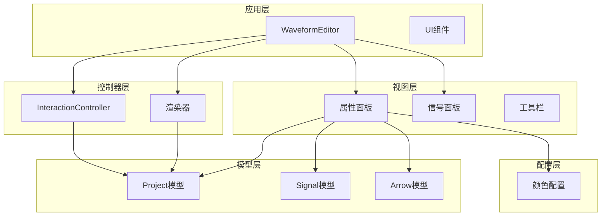
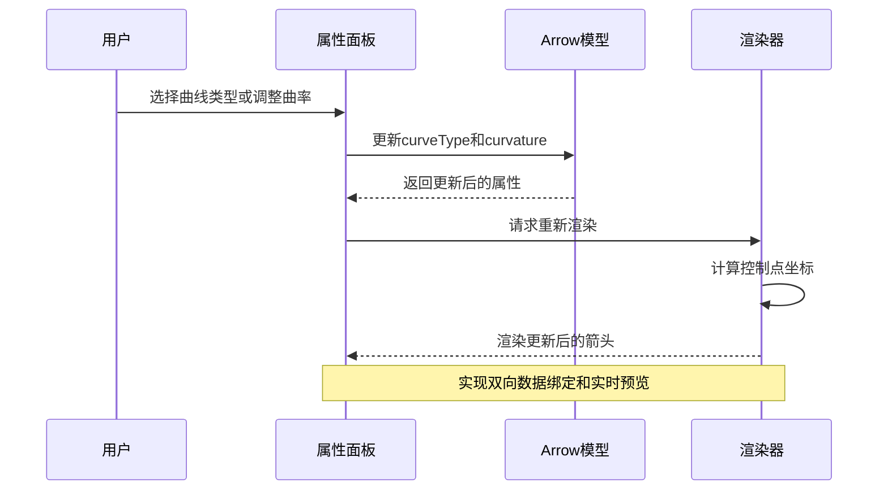
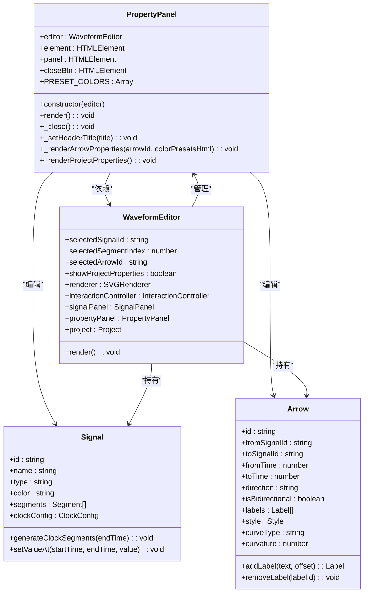
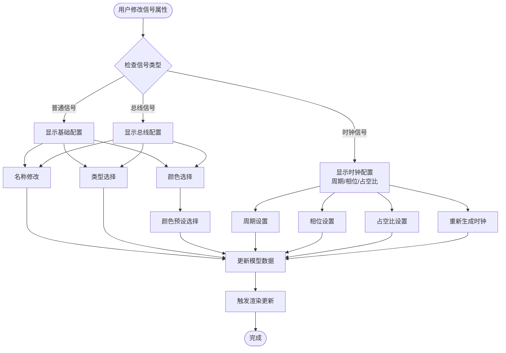
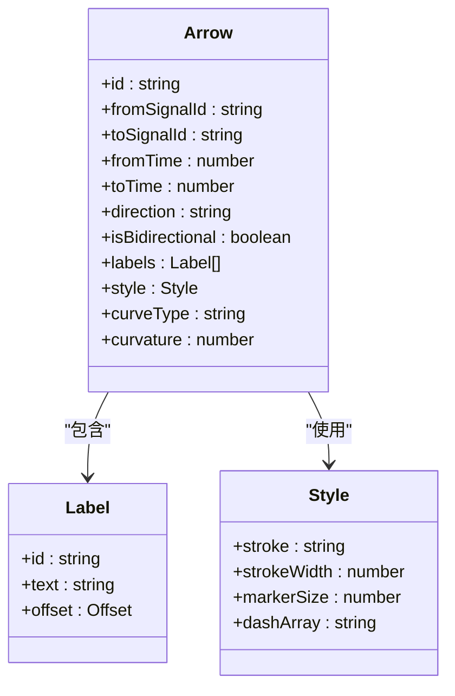
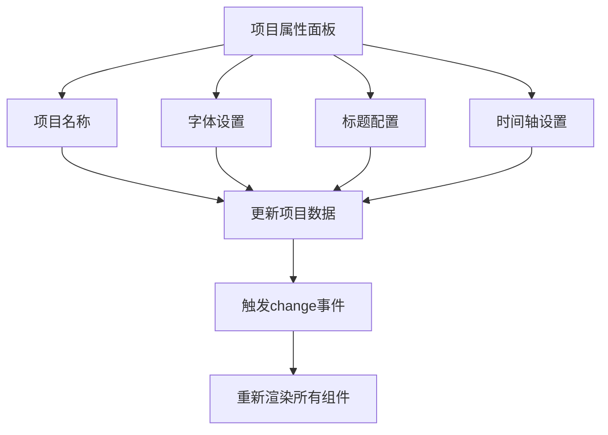
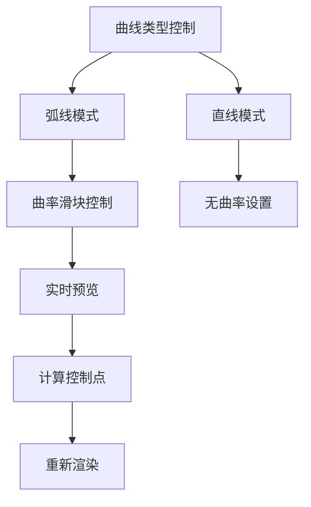
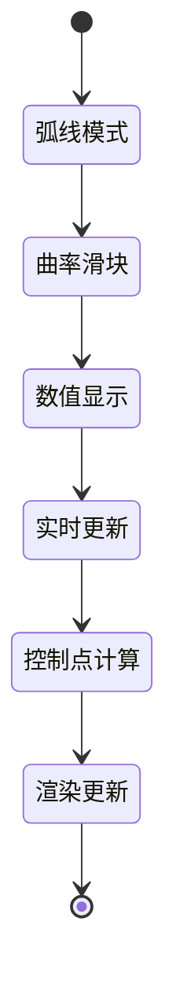
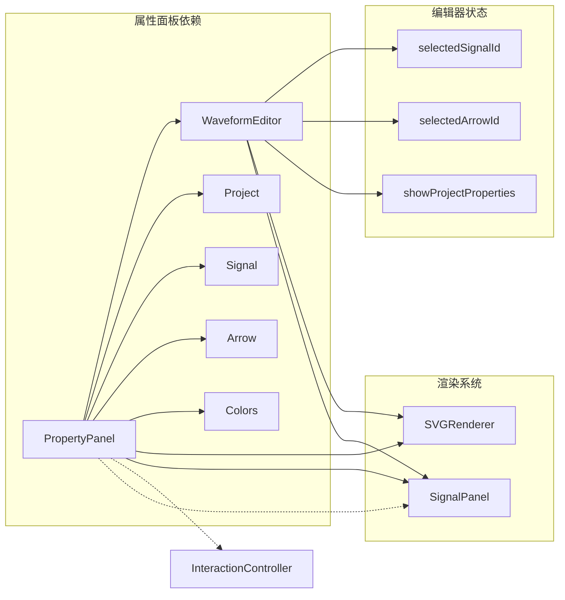

# 属性面板

<cite>
**本文档引用的文件**
- [PropertyPanel.js](file://src/ui/PropertyPanel.js)
- [Signal.js](file://src/models/Signal.js)
- [Arrow.js](file://src/models/Arrow.js)
- [DependencyRenderer.js](file://src/renderers/DependencyRenderer.js)
- [colors.js](file://src/config/colors.js)
- [InteractionController.js](file://src/controllers/InteractionController.js)
- [main.js](file://src/main.js)
- [index.html](file://index.html)
- [main.css](file://styles/main.css)
</cite>

## 更新摘要
**变更内容**
- 新增箭头定制UI控件，包括曲线类型下拉菜单和曲率滑块
- 实现实时预览和同步功能，支持弧线和直线两种曲线模式
- 增强箭头属性编辑体验，提供更直观的可视化控制

## 目录
1. [简介](#简介)
2. [项目结构](#项目结构)
3. [核心组件](#核心组件)
4. [架构概览](#架构概览)
5. [详细组件分析](#详细组件分析)
6. [箭头定制功能](#箭头定制功能)
7. [颜色预设系统](#颜色预设系统)
8. [依赖分析](#依赖分析)
9. [性能考虑](#性能考虑)
10. [故障排除指南](#故障排除指南)
11. [结论](#结论)
12. [附录](#附录)

## 简介
属性面板是波形图编辑器的核心交互组件之一，负责显示和编辑当前选中元素的属性信息。该组件实现了动态内容生成、用户交互处理、实时数据同步等功能，为用户提供直观的波形编辑体验。

**更新** 新增了箭头定制UI控件，包括曲线类型下拉菜单和曲率滑块，支持弧线和直线两种曲线模式的实时预览和同步。

## 项目结构
属性面板位于UI层，与模型层和控制器层紧密协作，形成完整的编辑器架构。



**图表来源**
- [main.js:21-44](file://src/main.js#L21-L44)
- [PropertyPanel.js:3-12](file://src/ui/PropertyPanel.js#L3-L12)
- [colors.js:1-83](file://src/config/colors.js#L1-L83)

**章节来源**
- [main.js:18-132](file://src/main.js#L18-L132)
- [index.html:65-74](file://index.html#L65-L74)

## 核心组件
属性面板采用模块化设计，主要包含以下核心功能：

### 主要职责
- **动态内容生成**：根据当前选中元素类型动态生成相应的属性界面
- **用户交互处理**：响应用户的输入和操作事件
- **数据绑定管理**：维护属性变更与底层数据模型的同步
- **实时渲染控制**：协调编辑器各组件的重新渲染
- **颜色预设管理**：提供标准化的颜色选择体验
- **箭头定制控制**：支持曲线类型和曲率的实时编辑

### 设计特点
- **条件渲染**：支持信号属性、箭头属性、项目属性三种模式
- **事件驱动**：基于DOM事件的响应式设计
- **数据流管理**：通过编辑器状态管理实现组件间通信
- **用户体验优化**：避免输入框失焦，保持编辑连续性
- **颜色预设集成**：提供快速颜色选择功能
- **实时预览支持**：曲率滑块提供实时视觉反馈

**章节来源**
- [PropertyPanel.js:32-237](file://src/ui/PropertyPanel.js#L32-L237)
- [PropertyPanel.js:242-377](file://src/ui/PropertyPanel.js#L242-L377)
- [PropertyPanel.js:382-506](file://src/ui/PropertyPanel.js#L382-L506)

## 架构概览
属性面板在整个编辑器架构中扮演着关键角色，连接用户界面与数据模型。



**图表来源**
- [PropertyPanel.js:403-417](file://src/ui/PropertyPanel.js#L403-L417)
- [DependencyRenderer.js:277-304](file://src/renderers/DependencyRenderer.js#L277-L304)

## 详细组件分析

### PropertyPanel 类设计原理

#### 构造函数与初始化
属性面板通过构造函数接收编辑器实例，建立与其他组件的关联关系。



**图表来源**
- [PropertyPanel.js:3-12](file://src/ui/PropertyPanel.js#L3-L12)
- [main.js:21-44](file://src/main.js#L21-L44)
- [Signal.js:7-36](file://src/models/Signal.js#L7-L36)
- [Arrow.js:5-45](file://src/models/Arrow.js#L5-L45)

#### 动态内容生成机制
属性面板根据当前选中状态动态生成不同的UI内容：

1. **箭头属性模式**：当检测到箭头选中时，显示箭头相关的编辑控件
2. **信号属性模式**：默认模式，显示信号的基本属性和时钟配置
3. **项目属性模式**：当用户点击项目名称时显示项目级别的设置

**章节来源**
- [PropertyPanel.js:32-64](file://src/ui/PropertyPanel.js#L32-L64)
- [PropertyPanel.js:382-441](file://src/ui/PropertyPanel.js#L382-L441)

### 信号属性编辑功能

#### 基本属性编辑
属性面板支持对信号进行以下基本属性编辑：

- **信号名称**：通过文本输入框实时修改信号名称
- **信号类型**：下拉菜单选择信号类型（普通信号、时钟、总线）
- **波形颜色**：颜色选择器配合重置按钮和颜色预设



**图表来源**
- [PropertyPanel.js:65-124](file://src/ui/PropertyPanel.js#L65-L124)
- [PropertyPanel.js:126-204](file://src/ui/PropertyPanel.js#L126-L204)

#### 时钟信号特殊处理
对于时钟类型的信号，属性面板提供了专门的配置界面：

- **周期设置**：控制时钟周期长度
- **相位偏移**：调整时钟起始相位
- **占空比**：设置高电平与低电平的比例
- **极性翻转**：控制时钟极性
- **重新生成**：根据新配置重新生成时钟波形

**章节来源**
- [PropertyPanel.js:87-106](file://src/ui/PropertyPanel.js#L87-L106)
- [Signal.js:226-252](file://src/models/Signal.js#L226-L252)

### 箭头属性编辑功能

#### 箭头样式配置
属性面板支持对依赖箭头进行详细的样式编辑：

- **方向设置**：自动、正向、反向三种模式
- **双向箭头**：勾选框控制箭头方向
- **颜色配置**：颜色选择器设置箭头颜色，支持颜色预设
- **线宽调节**：细、标准、粗三种线宽选项
- **线型设置**：实线、虚线、点线样式
- **曲线类型**：弧线、直线两种曲线模式



**图表来源**
- [Arrow.js:5-45](file://src/models/Arrow.js#L5-L45)
- [PropertyPanel.js:249-308](file://src/ui/PropertyPanel.js#L249-L308)

#### 文字标注管理
属性面板提供了灵活的文字标注管理系统：

- **多标注支持**：每个箭头可以拥有多个标注
- **动态添加**：支持实时添加新的标注
- **编辑删除**：支持修改和删除现有标注
- **位置调整**：通过拖拽调整标注位置

**章节来源**
- [PropertyPanel.js:293-303](file://src/ui/PropertyPanel.js#L293-L303)
- [Arrow.js:78-94](file://src/models/Arrow.js#L78-L94)

### 项目属性编辑功能

#### 项目级配置
当用户点击项目名称时，属性面板显示项目级别的配置选项：

- **项目名称**：修改项目显示名称
- **字体设置**：支持多种字体族选择
- **标题配置**：标题位置和样式的设置
- **时间轴范围**：开始时间、结束时间、缩放比例



**图表来源**
- [PropertyPanel.js:382-441](file://src/ui/PropertyPanel.js#L382-L441)
- [PropertyPanel.js:444-505](file://src/ui/PropertyPanel.js#L444-L505)

### 用户交互处理机制

#### 事件绑定策略
属性面板采用事件委托和直接绑定相结合的方式：

- **输入事件**：使用`input`和`change`事件实现实时响应
- **点击事件**：处理按钮点击和复选框状态变化
- **动态事件**：针对可变内容（如箭头标注）动态绑定事件
- **颜色预设事件**：处理颜色预设选择事件
- **曲线控制事件**：处理曲线类型切换和曲率调整事件

#### 数据同步机制
属性面板通过以下机制确保数据一致性：

1. **直接更新**：用户输入时立即更新对应的数据模型
2. **事件触发**：通过项目模型的事件系统通知其他组件
3. **选择性渲染**：只重新渲染受影响的组件，提高性能

**章节来源**
- [PropertyPanel.js:126-132](file://src/ui/PropertyPanel.js#L126-L132)
- [PropertyPanel.js:313-317](file://src/ui/PropertyPanel.js#L313-L317)

## 箭头定制功能

### 曲线类型控制
属性面板新增了箭头曲线类型的定制功能，支持以下两种模式：

- **弧线模式** (`curved`)：默认曲线样式，适合大多数箭头场景
- **直线模式** (`straight`)：直线样式，适合简单连接场景



**图表来源**
- [PropertyPanel.js:326-338](file://src/ui/PropertyPanel.js#L326-L338)
- [PropertyPanel.js:403-417](file://src/ui/PropertyPanel.js#L403-L417)

### 曲率滑块功能
曲率滑块提供了直观的可视化控制：

- **数值范围**：0.2 到 3.0，默认值 1.0
- **步长设置**：0.1 的精细调节
- **实时预览**：滑块移动时实时显示数值变化
- **同步更新**：数值变化时立即更新渲染效果



**图表来源**
- [PropertyPanel.js:412-417](file://src/ui/PropertyPanel.js#L412-L417)
- [DependencyRenderer.js:277-304](file://src/renderers/DependencyRenderer.js#L277-L304)

### 控制点计算机制
渲染器根据曲线类型和曲率计算贝塞尔曲线控制点：

- **直线模式**：控制点位于起点和终点连线上的固定位置
- **弧线模式**：根据曲率计算向上的弧形控制点
- **同信号箭头**：使用弧高公式 `arcHeight = max(35, min(dx * 0.35, 80)) * curvature`
- **跨信号箭头**：使用控制偏移公式 `controlOffset = min(dx * 0.7, 200) * curvature`

**章节来源**
- [PropertyPanel.js:326-338](file://src/ui/PropertyPanel.js#L326-L338)
- [PropertyPanel.js:403-417](file://src/ui/PropertyPanel.js#L403-L417)
- [DependencyRenderer.js:277-304](file://src/renderers/DependencyRenderer.js#L277-L304)

## 颜色预设系统

### 颜色预设配置
属性面板集成了标准化的颜色预设系统，提供七种预定义颜色选项：

```javascript
const PRESET_COLORS = [
  '#000000',  // 黑色 (Black)
  '#2196F3',  // 蓝色 (Blue)
  '#4CAF50',  // 绿色 (Green)
  '#F44336',  // 红色 (Red)
  '#FF9800',  // 橙色 (Orange)
  '#9C27B0',  // 紫色 (Purple)
  '#607D8B'   // 灰色 (Gray)
];
```

### 颜色预设功能特性
- **快速选择**：通过颜色预设面板快速选择常用颜色
- **一致性**：与信号列表保持一致的颜色方案
- **易用性**：提供直观的颜色预览和选择体验
- **扩展性**：支持未来添加更多预设颜色

### 颜色预设集成方式
颜色预设系统通过以下方式集成到属性面板：

1. **信号颜色选择**：在信号属性面板中提供颜色预设
2. **箭头颜色选择**：在箭头属性面板中提供颜色预设
3. **事件绑定**：为每个颜色预设项绑定点击事件处理器
4. **实时更新**：选择预设颜色后立即更新显示和模型数据

**章节来源**
- [PropertyPanel.js:37-41](file://src/ui/PropertyPanel.js#L37-L41)
- [PropertyPanel.js:84-91](file://src/ui/PropertyPanel.js#L84-L91)
- [PropertyPanel.js:299-306](file://src/ui/PropertyPanel.js#L299-L306)

## 依赖分析

### 组件耦合关系
属性面板与编辑器其他组件存在紧密的依赖关系：



**图表来源**
- [PropertyPanel.js:32-64](file://src/ui/PropertyPanel.js#L32-L64)
- [main.js:35-39](file://src/main.js#L35-L39)
- [InteractionController.js:14-19](file://src/controllers/InteractionController.js#L14-L19)

### 数据流分析
属性面板的数据流遵循单向数据流原则：

1. **用户输入** → 属性面板 → 数据模型
2. **数据模型变更** → 事件系统 → 编辑器
3. **编辑器** → 渲染器 → UI更新
4. **颜色预设** → 颜色系统 → 颜色应用
5. **曲线控制** → 渲染器 → 实时预览

**章节来源**
- [PropertyPanel.js:126-132](file://src/ui/PropertyPanel.js#L126-L132)
- [Project.js:199-202](file://src/models/Project.js#L199-L202)
- [main.js:763-769](file://src/main.js#L763-L769)

## 性能考虑
属性面板在设计时充分考虑了性能优化：

### 渲染优化策略
- **选择性重绘**：只重新渲染受影响的组件，避免全量重绘
- **事件节流**：对频繁触发的输入事件进行适当处理
- **DOM最小化**：通过一次性生成HTML字符串减少DOM操作
- **颜色预设缓存**：预生成颜色预设HTML，避免重复计算
- **实时预览优化**：曲率滑块使用input事件而非change事件实现流畅体验

### 内存管理
- **事件解绑**：在组件销毁时正确清理事件监听器
- **状态管理**：通过编辑器统一管理组件状态，避免重复渲染
- **颜色预设复用**：颜色预设HTML字符串在组件生命周期内复用
- **曲线计算缓存**：渲染器内部缓存控制点计算结果

## 故障排除指南

### 常见问题及解决方案

#### 属性面板不显示
**症状**：点击信号后属性面板不出现
**原因**：
- 未正确设置编辑器状态
- DOM元素未正确初始化

**解决方法**：
- 检查编辑器初始化过程
- 确认DOM元素存在且可访问

#### 属性修改无效
**症状**：修改属性后波形图不更新
**原因**：
- 事件监听器未正确绑定
- 数据模型更新逻辑错误

**解决方法**：
- 检查事件绑定代码
- 验证数据模型更新逻辑

#### 输入框失焦问题
**症状**：输入过程中输入框失去焦点
**原因**：
- 全量重绘导致DOM重建

**解决方法**：
- 使用选择性重绘策略
- 避免不必要的DOM操作

#### 颜色预设不工作
**症状**：点击颜色预设后颜色不改变
**原因**：
- 颜色预设事件绑定失败
- 颜色更新逻辑错误

**解决方法**：
- 检查颜色预设事件绑定代码
- 验证颜色更新和渲染逻辑

#### 曲线控制失效
**症状**：曲线类型切换或曲率调整无效
**原因**：
- 曲线控制事件绑定失败
- 控制点计算逻辑错误
- 渲染器未正确接收更新

**解决方法**：
- 检查曲线控制事件绑定代码
- 验证控制点计算和渲染逻辑
- 确认数据模型正确更新

**章节来源**
- [PropertyPanel.js:14-25](file://src/ui/PropertyPanel.js#L14-L25)
- [PropertyPanel.js:126-132](file://src/ui/PropertyPanel.js#L126-L132)

## 结论
属性面板作为波形图编辑器的重要组成部分，通过精心设计的架构实现了良好的用户体验和高效的性能表现。其动态内容生成、实时数据同步、用户交互处理等功能特性，为用户提供了直观便捷的波形编辑体验。

**更新** 新集成的箭头定制功能进一步增强了属性面板的能力，特别是曲线类型下拉菜单和曲率滑块的引入，为用户提供了更直观的箭头定制体验。通过实时预览和同步机制，用户可以即时看到曲线变化的效果，大大提升了编辑效率和准确性。

## 附录

### 使用示例

#### 基本属性编辑流程
1. 在波形图中选择目标信号
2. 属性面板自动显示信号属性
3. 修改属性值并观察波形图实时更新
4. 通过工具栏保存项目更改

#### 箭头定制使用指南
1. **选择箭头**：在波形图中点击目标箭头
2. **曲线类型切换**：使用曲线类型下拉菜单在弧线和直线间切换
3. **曲率调整**：拖动曲率滑块调整箭头弯曲程度
4. **实时预览**：观察曲率数值变化和箭头形状变化
5. **颜色定制**：使用颜色选择器或颜色预设调整箭头颜色

#### 颜色预设使用指南
1. **信号颜色选择**：在信号属性面板中选择颜色预设
2. **箭头颜色配置**：在箭头属性面板中使用颜色预设
3. **快速切换**：通过颜色预设快速切换不同颜色
4. **自定义颜色**：使用颜色选择器进行精确颜色调整

#### 高级功能使用
- **时钟信号配置**：设置周期、相位、占空比参数
- **箭头样式定制**：调整颜色、线宽、线型等视觉属性
- **曲线类型选择**：根据需要选择弧线或直线样式
- **曲率精细调节**：使用0.1步长的精确调节
- **项目级设置**：配置字体、标题样式、时间轴范围
- **颜色预设管理**：利用标准化颜色方案提升工作效率

### 最佳实践建议

#### 开发规范
- **事件管理**：确保所有事件监听器都有对应的清理逻辑
- **错误处理**：为异步操作提供适当的错误处理机制
- **性能监控**：定期检查渲染性能，避免不必要的重绘
- **颜色一致性**：遵循颜色预设系统，保持界面视觉统一
- **实时预览优化**：合理使用input事件实现流畅的实时预览

#### 用户体验优化
- **即时反馈**：确保用户操作能够得到及时响应
- **一致性**：保持界面风格和交互行为的一致性
- **可访问性**：提供键盘导航和屏幕阅读器支持
- **颜色无障碍**：考虑色盲用户的需求，提供颜色对比度保证
- **曲线控制友好**：提供直观的曲线类型和曲率控制界面

#### 扩展开发指南
- **新增属性字段**：参考现有属性的实现模式添加新字段
- **自定义验证规则**：在属性更新时添加必要的验证逻辑
- **曲线算法扩展**：可以在渲染器中实现更复杂的曲线算法
- **颜色系统扩展**：支持用户自定义颜色预设
- **事件系统扩展**：通过事件系统实现组件间通信