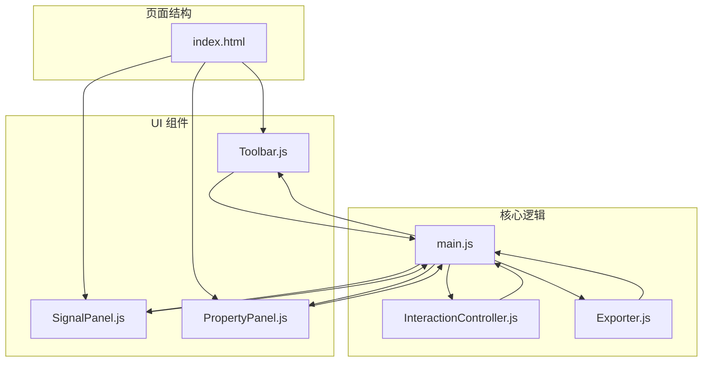
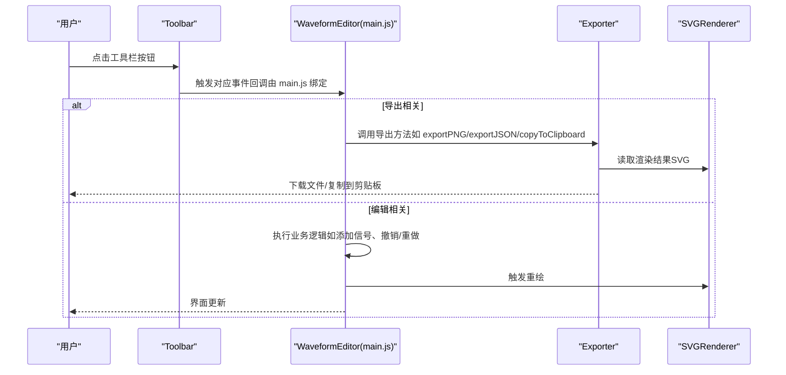
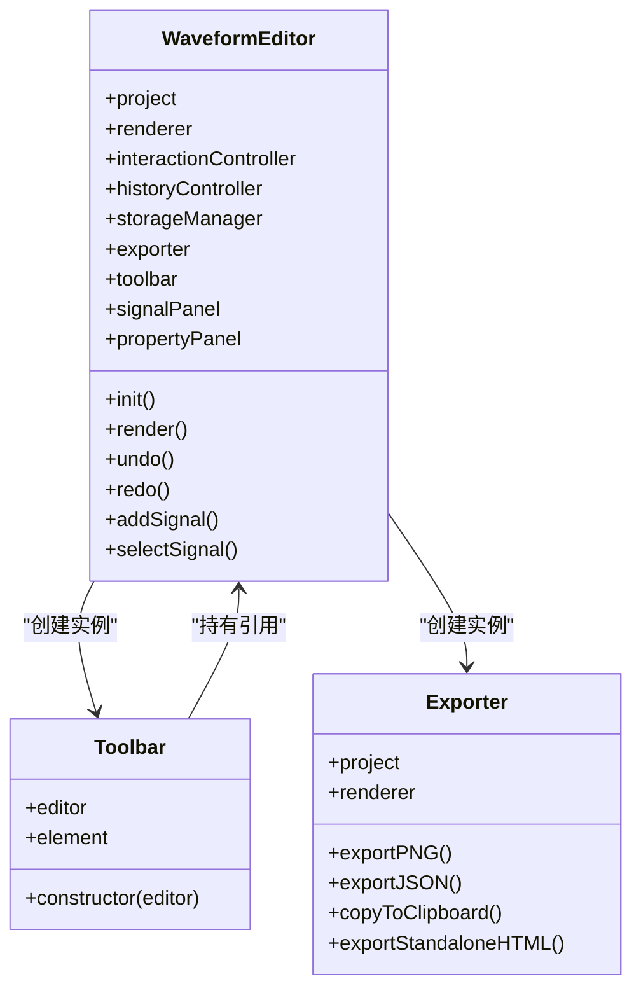
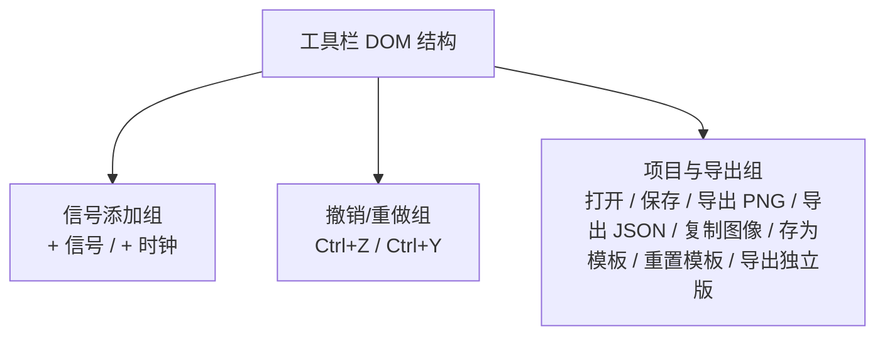
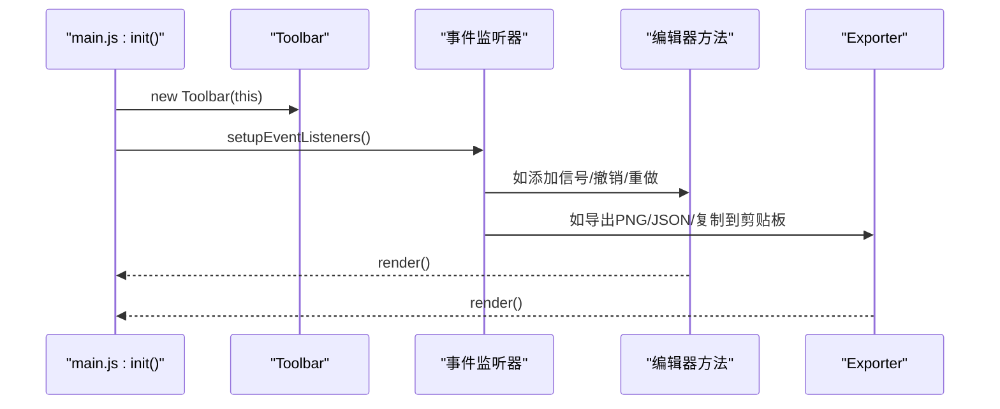
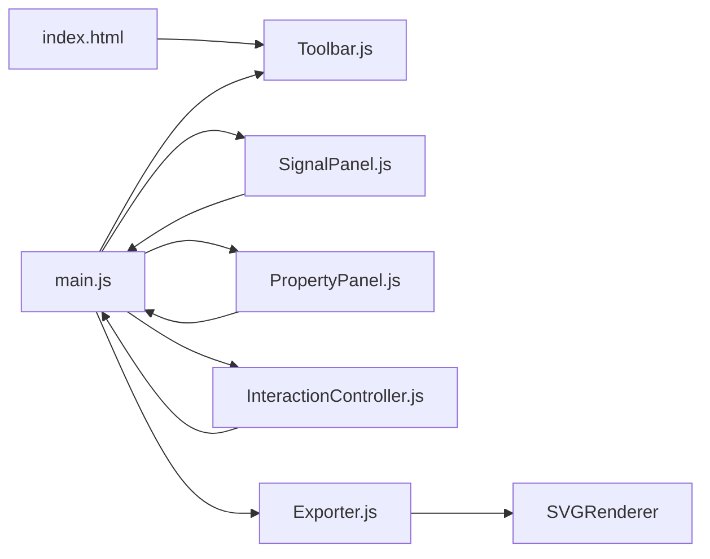

# 工具栏组件

<cite>
**本文档引用的文件**
- [Toolbar.js](file://src/ui/Toolbar.js)
- [index.html](file://index.html)
- [main.css](file://styles/main.css)
- [main.js](file://src/main.js)
- [SignalPanel.js](file://src/ui/SignalPanel.js)
- [PropertyPanel.js](file://src/ui/PropertyPanel.js)
- [InteractionController.js](file://src/controllers/InteractionController.js)
- [Exporter.js](file://src/io/Exporter.js)
</cite>

## 目录
1. [简介](#简介)
2. [项目结构](#项目结构)
3. [核心组件](#核心组件)
4. [架构总览](#架构总览)
5. [详细组件分析](#详细组件分析)
6. [依赖关系分析](#依赖关系分析)
7. [性能考量](#性能考量)
8. [故障排查指南](#故障排查指南)
9. [结论](#结论)
10. [附录](#附录)

## 简介
本文件面向波形图编辑器的“工具栏组件”，系统性阐述 Toolbar 类的实现原理、与主编辑器的交互机制、布局与功能分类，并提供自定义与扩展指南及最佳实践。工具栏位于页面顶部，承载编辑工具、视图控制与导出功能等常用操作，是用户与编辑器交互的中枢之一。

## 项目结构
工具栏作为 UI 子系统的一部分，与主编辑器、渲染器、交互控制器、导出器等模块协同工作。其所在目录与关键文件如下：
- UI 组件：src/ui/Toolbar.js、src/ui/SignalPanel.js、src/ui/PropertyPanel.js
- 主入口与集成：src/main.js
- 页面结构：index.html
- 样式：styles/main.css
- 控制器与导出：src/controllers/InteractionController.js、src/io/Exporter.js

图表来源
- [index.html](file://index.html)
- [Toolbar.js](file://src/ui/Toolbar.js)
- [SignalPanel.js](file://src/ui/SignalPanel.js)
- [PropertyPanel.js](file://src/ui/PropertyPanel.js)
- [main.js](file://src/main.js)
- [InteractionController.js](file://src/controllers/InteractionController.js)
- [Exporter.js](file://src/io/Exporter.js)

章节来源
- [index.html](file://index.html)
- [main.js](file://src/main.js)

## 核心组件
- Toolbar 类：负责持有编辑器实例与工具栏 DOM 元素，作为事件与状态的桥接者。
- 主编辑器（WaveformEditor）：集中管理项目、渲染器、交互控制器、历史控制器、导出器与 UI 组件；初始化时创建 Toolbar 实例。
- UI 子系统：SignalPanel、PropertyPanel 与 Toolbar 协同维护界面状态与渲染。
- 导出器（Exporter）：封装 PNG、SVG、JSON、剪贴板复制与独立 HTML 导出能力，由工具栏按钮触发。

章节来源
- [Toolbar.js](file://src/ui/Toolbar.js)
- [main.js](file://src/main.js)
- [Exporter.js](file://src/io/Exporter.js)

## 架构总览
工具栏在页面中的职责与位置：
- 位置：页面顶部的 .toolbar 区域，包含若干 .toolbar-group 分组，每个分组内放置一组功能按钮。
- 结构：index.html 中定义了工具栏的 DOM 结构与各按钮的 id；Toolbar.js 通过 id 获取 DOM 节点并持有引用。
- 交互：main.js 在初始化阶段创建 Toolbar 实例，并在 setupEventListeners 中为各按钮绑定事件处理逻辑，这些处理逻辑通常委托给主编辑器或导出器。

图表来源
- [index.html](file://index.html)
- [main.js](file://src/main.js)
- [Toolbar.js](file://src/ui/Toolbar.js)
- [Exporter.js](file://src/io/Exporter.js)

## 详细组件分析

### Toolbar 类实现原理
- 构造函数参数：接收编辑器实例 editor，用于后续事件处理与状态同步。
- DOM 绑定：通过 document.getElementById('toolbar') 获取工具栏根元素，保存为 this.element，便于后续扩展或样式控制。
- 作用：作为 UI 与业务逻辑之间的桥梁，承载按钮事件与状态传播。

图表来源
- [Toolbar.js](file://src/ui/Toolbar.js)
- [main.js](file://src/main.js)
- [Exporter.js](file://src/io/Exporter.js)

章节来源
- [Toolbar.js](file://src/ui/Toolbar.js)

### 工具栏布局与功能分类
工具栏采用分组布局，每组 .toolbar-group 内包含若干按钮，具备清晰的功能分层：
- 信号添加组：添加普通信号与时钟信号。
- 撤销/重做组：支持键盘快捷键 Ctrl+Z/Ctrl+Y。
- 项目与导出组：打开/保存项目、导出 PNG/JSON、复制图像到剪贴板、保存/重置模板、导出独立 HTML。

图表来源
- [index.html](file://index.html)

章节来源
- [index.html](file://index.html)

### 工具栏与主编辑器的交互机制
- 初始化集成：main.js 在 init() 中创建 Toolbar 实例，并在 setupEventListeners() 中为各按钮绑定事件。
- 事件委托：按钮点击事件统一在 main.js 中处理，部分操作直接调用编辑器方法（如添加信号、撤销/重做），另一些操作委托给导出器（如导出 PNG/JSON、复制到剪贴板）。
- 状态同步：编辑器通过 render() 触发渲染器与面板重绘，确保 UI 与模型状态一致。

图表来源
- [main.js](file://src/main.js)
- [Toolbar.js](file://src/ui/Toolbar.js)

章节来源
- [main.js](file://src/main.js)

### 工具栏按钮功能详解
- 添加信号：创建普通信号，默认初始段落。
- 添加时钟：创建时钟信号，自动生成周期性段落。
- 撤销/重做：基于历史控制器回退/前进。
- 打开/保存项目：与存储管理器协作，支持 .wfp/.json。
- 导出 PNG/JSON：导出静态图像或项目数据。
- 复制图像到剪贴板：优先使用 Clipboard API，降级至 data URL 或新窗口展示。
- 存为模板/重置模板：持久化/清理模板，供新建项目时使用。
- 导出独立 HTML：将当前项目内联到 HTML，便于分享。

章节来源
- [main.js](file://src/main.js)
- [Exporter.js](file://src/io/Exporter.js)

### 工具栏样式与可定制性
- 基础样式：.toolbar、.toolbar-group、.toolbar-btn、.icon-btn 等类定义了工具栏的整体外观与按钮状态。
- 活跃态：.toolbar-btn.active 用于高亮当前激活状态。
- 图标按钮：.icon-btn 内嵌 SVG，支持 hover 状态下的图标颜色变化。
- 自定义建议：可通过覆盖类名或新增类名的方式扩展按钮样式；注意与现有布局保持一致。

章节来源
- [main.css](file://styles/main.css)

### 与交互控制器的协作
- 交互控制器负责 SVG 区域的鼠标/键盘事件、选择与拖拽等交互逻辑；工具栏按钮触发的操作通常会间接影响交互控制器的状态（例如选中信号、箭头等），随后通过 render() 同步到 UI。

章节来源
- [InteractionController.js](file://src/controllers/InteractionController.js)
- [main.js](file://src/main.js)

## 依赖关系分析
- Toolbar 依赖 DOM 结构（index.html）与编辑器实例（main.js）。
- main.js 依赖 Toolbar、SignalPanel、PropertyPanel、Exporter、InteractionController 等模块。
- Exporter 依赖渲染器（SVGRenderer）以获取最终渲染结果。
- SignalPanel 与 PropertyPanel 依赖编辑器状态进行渲染与交互。

图表来源
- [index.html](file://index.html)
- [Toolbar.js](file://src/ui/Toolbar.js)
- [main.js](file://src/main.js)
- [SignalPanel.js](file://src/ui/SignalPanel.js)
- [PropertyPanel.js](file://src/ui/PropertyPanel.js)
- [InteractionController.js](file://src/controllers/InteractionController.js)
- [Exporter.js](file://src/io/Exporter.js)

章节来源
- [main.js](file://src/main.js)

## 性能考量
- 事件绑定集中在 main.js 的 setupEventListeners 中，避免重复绑定与内存泄漏。
- 导出操作涉及 SVG 序列化与 Canvas 绘制，建议在大项目时控制导出分辨率与延迟处理，减少主线程阻塞。
- 渲染器与面板的重绘应尽量批量执行，避免频繁 DOM 操作。

## 故障排查指南
- 工具栏按钮无响应
  - 检查 index.html 中按钮 id 是否与 main.js 中绑定一致。
  - 确认 main.js 的 init() 是否正确创建 Toolbar 实例并调用 setupEventListeners()。
- 导出失败或复制到剪贴板异常
  - 检查浏览器对 Clipboard API 的支持与权限。
  - 确认导出器的 exportPNG/exportJSON/copyToClipboard 方法是否被正确调用。
- 界面未更新
  - 确认编辑器方法执行后是否调用了 render()，以及渲染器与面板是否同步更新。

章节来源
- [main.js](file://src/main.js)
- [Exporter.js](file://src/io/Exporter.js)

## 结论
Toolbar 作为波形图编辑器的前端入口之一，承担着连接用户操作与编辑器核心逻辑的关键角色。通过简洁的构造与 DOM 绑定，它与主编辑器、导出器、交互控制器形成稳定协作关系。遵循本文提供的扩展与定制建议，可在不破坏既有结构的前提下，安全地新增工具按钮与样式。

## 附录

### 自定义与扩展指南
- 新增工具按钮
  - 在 index.html 中 .toolbar 内添加按钮元素，并赋予唯一 id。
  - 在 main.js 的 setupEventListeners() 中为该按钮绑定事件处理逻辑。
  - 若需要与导出器协作，可在处理逻辑中调用 Exporter 对应方法。
- 样式定制
  - 可通过覆盖 .toolbar、.toolbar-group、.toolbar-btn、.icon-btn 等类实现视觉风格统一。
  - 如需图标按钮，保持 .icon-btn 结构并在内部放置 SVG。
- 最佳实践
  - 事件处理逻辑尽量集中在 main.js，避免分散在多个模块。
  - 导出与渲染操作应考虑异步与降级策略，提升用户体验。
  - 新增按钮时，保持分组与布局一致性，避免破坏整体视觉节奏。

章节来源
- [index.html](file://index.html)
- [main.js](file://src/main.js)
- [main.css](file://styles/main.css)