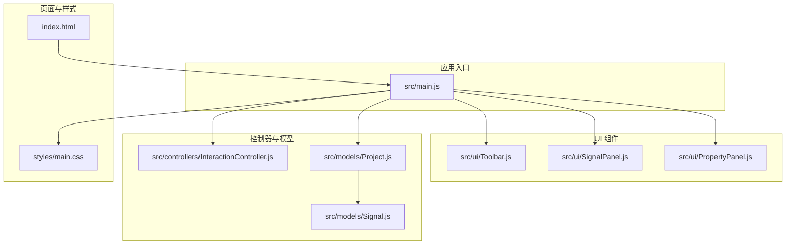
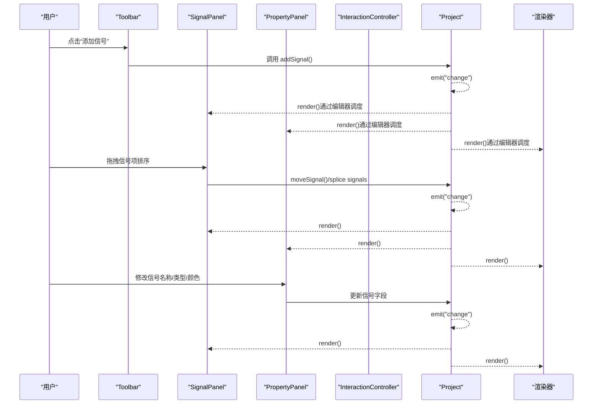
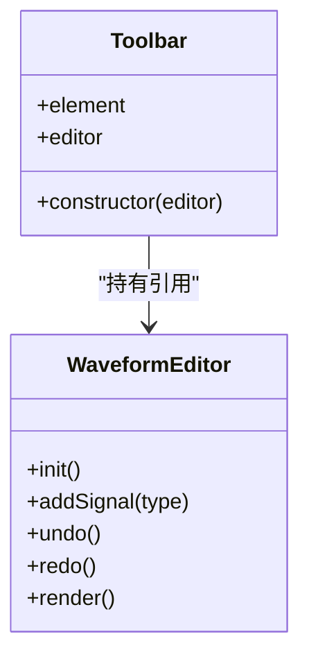
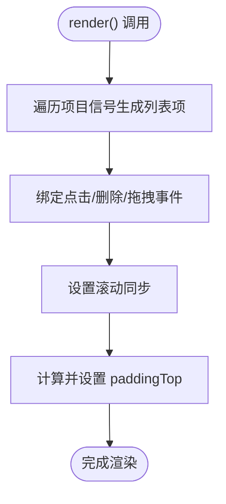
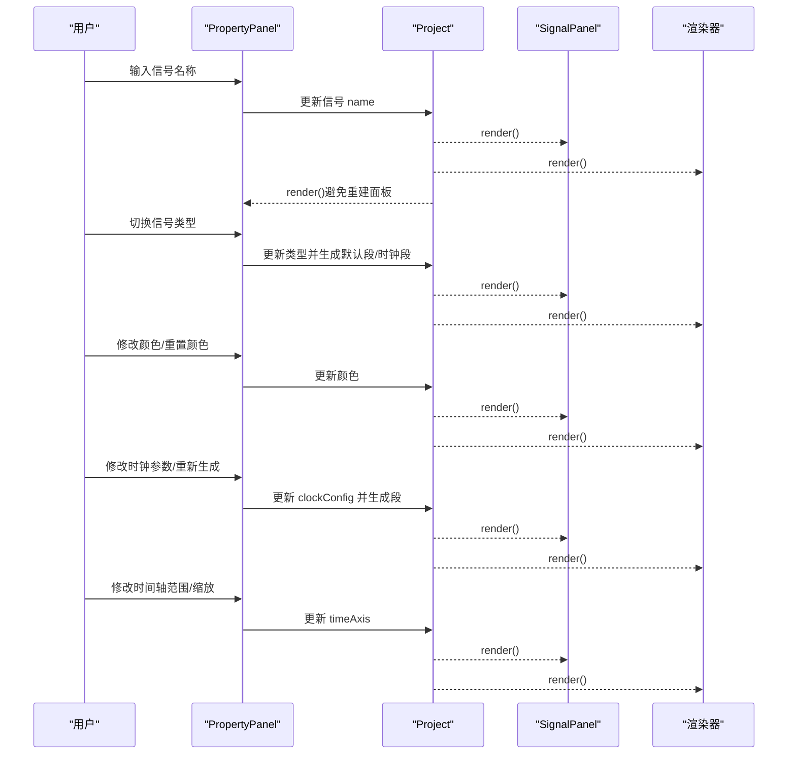
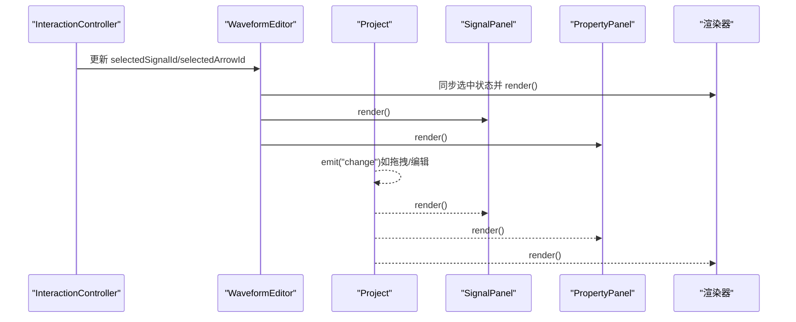
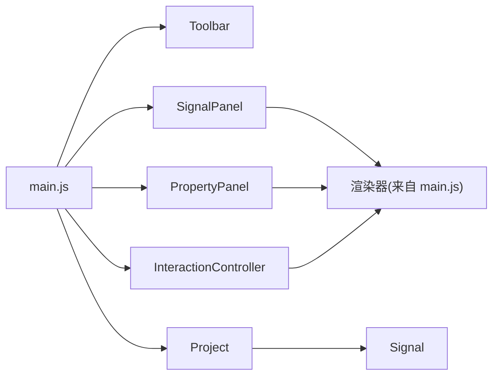

# 用户界面组件

<cite>
**本文档引用的文件**
- [index.html](file://index.html)
- [main.js](file://src/main.js)
- [Toolbar.js](file://src/ui/Toolbar.js)
- [SignalPanel.js](file://src/ui/SignalPanel.js)
- [PropertyPanel.js](file://src/ui/PropertyPanel.js)
- [InteractionController.js](file://src/controllers/InteractionController.js)
- [Project.js](file://src/models/Project.js)
- [Signal.js](file://src/models/Signal.js)
- [main.css](file://styles/main.css)
</cite>

## 目录
1. [简介](#简介)
2. [项目结构](#项目结构)
3. [核心组件](#核心组件)
4. [架构总览](#架构总览)
5. [组件详细分析](#组件详细分析)
6. [依赖关系分析](#依赖关系分析)
7. [性能考量](#性能考量)
8. [故障排查指南](#故障排查指南)
9. [结论](#结论)
10. [附录](#附录)

## 简介
本文件面向波形图编辑器的用户界面组件，聚焦以下三个核心UI模块：
- 工具栏组件 Toolbar：负责项目级操作入口（新增信号/时钟、撤销/重做、导入/导出、模板管理等）。
- 信号面板 SignalPanel：负责信号列表的展示、排序与编辑（拖拽排序、删除、滚动同步、视觉对齐）。
- 属性面板 PropertyPanel：负责信号/箭头/项目属性的动态显示与修改（名称、类型、颜色、时钟参数、时间轴范围与缩放、项目外观等）。

文档还涵盖UI组件的响应式布局、主题与可访问性支持、组件间通信与状态同步策略，以及使用示例与自定义指南，帮助开发者理解并扩展界面功能。

## 项目结构
UI组件位于 src/ui 目录，配合 src/main.js 作为应用入口，通过 DOM 元素挂载与事件绑定实现交互。样式由 styles/main.css 提供统一风格。

图表来源
- [index.html](file://index.html)
- [main.js](file://src/main.js)
- [Toolbar.js](file://src/ui/Toolbar.js)
- [SignalPanel.js](file://src/ui/SignalPanel.js)
- [PropertyPanel.js](file://src/ui/PropertyPanel.js)
- [InteractionController.js](file://src/controllers/InteractionController.js)
- [Project.js](file://src/models/Project.js)
- [Signal.js](file://src/models/Signal.js)
- [main.css](file://styles/main.css)

章节来源
- [index.html](file://index.html)
- [main.js](file://src/main.js)

## 核心组件
- 工具栏 Toolbar：持有编辑器实例，通过 DOM 查询获取工具栏元素，作为项目级操作入口。
- 信号面板 SignalPanel：持有编辑器实例，渲染信号列表，处理点击、删除、拖拽排序、滚动同步与视觉对齐。
- 属性面板 PropertyPanel：持有编辑器实例，根据选中状态动态渲染信号/箭头/项目属性，绑定输入事件并触发重绘与持久化。

章节来源
- [Toolbar.js](file://src/ui/Toolbar.js)
- [SignalPanel.js](file://src/ui/SignalPanel.js)
- [PropertyPanel.js](file://src/ui/PropertyPanel.js)

## 架构总览
UI组件与控制器、模型之间通过编辑器实例进行松耦合协作。编辑器负责状态管理与渲染调度，UI组件负责视图与交互，控制器负责事件处理与业务逻辑，模型负责数据结构与事件通知。

图表来源
- [main.js](file://src/main.js)
- [SignalPanel.js](file://src/ui/SignalPanel.js)
- [PropertyPanel.js](file://src/ui/PropertyPanel.js)
- [InteractionController.js](file://src/controllers/InteractionController.js)
- [Project.js](file://src/models/Project.js)

## 组件详细分析

### 工具栏组件 Toolbar
- 职责：承载项目级操作按钮，如新增信号/时钟、撤销/重做、导入/导出、模板管理、独立版导出等。
- 布局设计：采用分组容器组织按钮，组间以分隔线区分；图标按钮使用 SVG 图标，悬停高亮。
- 交互行为：按钮事件在编辑器入口 main.js 中集中绑定，Toolbar 本身仅持有编辑器实例与 DOM 引用。

图表来源
- [Toolbar.js](file://src/ui/Toolbar.js)
- [main.js](file://src/main.js)

章节来源
- [Toolbar.js](file://src/ui/Toolbar.js)
- [main.js](file://src/main.js)
- [index.html](file://index.html)
- [main.css](file://styles/main.css)

### 信号面板 SignalPanel
- 渲染逻辑：基于项目信号集合生成列表项，包含名称、拖拽手柄、删除按钮。
- 交互能力：
  - 点击信号项选中对应信号（触发编辑器状态更新与重绘）。
  - 删除按钮移除信号并清理选中状态。
  - 拖拽排序：支持在信号项之间拖拽，通过插入/移除实现顺序变更，并触发项目事件。
- 滚动同步：与波形画布垂直滚动联动，保持列表与波形区域同步滚动。
- 视觉对齐：动态计算 paddingTop，使信号列表项与 SVG 波形的信号名垂直对齐。

图表来源
- [SignalPanel.js](file://src/ui/SignalPanel.js)

章节来源
- [SignalPanel.js](file://src/ui/SignalPanel.js)
- [main.js](file://src/main.js)
- [index.html](file://index.html)
- [main.css](file://styles/main.css)

### 属性面板 PropertyPanel
- 渲染优先级：
  - 若选中箭头：渲染箭头属性（方向、双向、颜色、线宽、线型、标注等）。
  - 否则若选中信号：渲染信号属性（名称、类型、颜色、时钟参数、时间轴范围与缩放）。
  - 否则若显示项目属性：渲染项目外观与时间轴设置。
  - 否则隐藏面板。
- 信号属性编辑：
  - 名称输入：实时更新并触发渲染与项目变更事件。
  - 类型切换：根据类型生成默认段或时钟段。
  - 颜色选择与重置：更新颜色并触发渲染与项目变更。
  - 时钟参数：周期、相位、占空比，支持重新生成时钟段。
  - 时间轴：起止时间与缩放，影响所有信号与渲染。
- 箭头属性编辑：
  - 方向、双向、颜色、线宽、线型。
  - 标注文本增删改，支持动态添加标注并触发渲染与项目变更。
  - 删除箭头。
- 项目属性编辑：
  - 项目名称、字体族、标题位置与字号、标题加粗。
  - 时间轴设置与渲染。

图表来源
- [PropertyPanel.js](file://src/ui/PropertyPanel.js)
- [Project.js](file://src/models/Project.js)
- [Signal.js](file://src/models/Signal.js)
- [main.js](file://src/main.js)

章节来源
- [PropertyPanel.js](file://src/ui/PropertyPanel.js)
- [Project.js](file://src/models/Project.js)
- [Signal.js](file://src/models/Signal.js)
- [main.js](file://src/main.js)
- [index.html](file://index.html)
- [main.css](file://styles/main.css)

### 组件间通信与状态同步
- 编辑器状态：编辑器维护选中信号、选中段、选中箭头、是否显示项目属性等状态，并在渲染时同步到渲染器与UI组件。
- 事件驱动：项目模型通过事件系统（on/off/emit）广播变更，UI组件在收到变更后执行局部重绘，避免重建整个面板。
- 交互控制器：负责鼠标/键盘事件、拖拽、吸附、时间轴拖拽等，完成后通过编辑器触发渲染与项目变更。

图表来源
- [InteractionController.js](file://src/controllers/InteractionController.js)
- [main.js](file://src/main.js)
- [Project.js](file://src/models/Project.js)

章节来源
- [InteractionController.js](file://src/controllers/InteractionController.js)
- [main.js](file://src/main.js)
- [Project.js](file://src/models/Project.js)

## 依赖关系分析
- UI 组件依赖编辑器实例以访问项目、渲染器、交互控制器等。
- 信号面板依赖渲染器配置（信号高度、间距、顶部边距）以实现视觉对齐。
- 属性面板依赖项目模型的信号/箭头/时间轴数据，以及交互控制器的选中状态。
- 工具栏按钮事件在编辑器入口集中绑定，减少跨模块耦合。

图表来源
- [main.js](file://src/main.js)
- [Toolbar.js](file://src/ui/Toolbar.js)
- [SignalPanel.js](file://src/ui/SignalPanel.js)
- [PropertyPanel.js](file://src/ui/PropertyPanel.js)
- [InteractionController.js](file://src/controllers/InteractionController.js)
- [Project.js](file://src/models/Project.js)
- [Signal.js](file://src/models/Signal.js)

章节来源
- [main.js](file://src/main.js)
- [SignalPanel.js](file://src/ui/SignalPanel.js)
- [PropertyPanel.js](file://src/ui/PropertyPanel.js)
- [InteractionController.js](file://src/controllers/InteractionController.js)
- [Project.js](file://src/models/Project.js)
- [Signal.js](file://src/models/Signal.js)

## 性能考量
- 局部重绘：属性面板在输入时仅重绘渲染器与信号面板，避免重建面板导致输入框失焦。
- 事件节流：窗口尺寸变化时使用定时器节流渲染，降低频繁 resize 带来的性能压力。
- 滚动同步：仅在必要时设置滚动同步，避免重复绑定。
- 选择性渲染：属性面板按优先级渲染不同内容，减少不必要的 DOM 操作。

章节来源
- [PropertyPanel.js](file://src/ui/PropertyPanel.js)
- [main.js](file://src/main.js)
- [SignalPanel.js](file://src/ui/SignalPanel.js)

## 故障排查指南
- 工具栏按钮无响应：检查编辑器入口是否正确绑定按钮事件，确认 DOM 元素是否存在。
- 信号面板不显示或滚动异常：确认 DOM 结构与 CSS 样式，检查滚动同步初始化条件与波形画布元素是否存在。
- 属性面板不显示：确认编辑器状态（选中信号/箭头/项目属性）与面板显示逻辑；检查事件监听是否触发。
- 拖拽排序无效：检查拖拽事件绑定与项目信号数组的插入/移除逻辑，确保索引计算正确。
- 颜色/时钟参数修改未生效：确认项目事件是否触发与渲染器是否重绘。

章节来源
- [main.js](file://src/main.js)
- [Toolbar.js](file://src/ui/Toolbar.js)
- [SignalPanel.js](file://src/ui/SignalPanel.js)
- [PropertyPanel.js](file://src/ui/PropertyPanel.js)
- [InteractionController.js](file://src/controllers/InteractionController.js)

## 结论
本UI组件体系以编辑器为核心，通过事件驱动与状态同步实现工具栏、信号面板、属性面板与渲染器之间的协调工作。信号面板强调视觉对齐与滚动同步，属性面板提供灵活的动态编辑体验，工具栏提供统一的项目级操作入口。整体设计具备良好的可扩展性与可维护性，便于后续功能增强与主题定制。

## 附录

### 响应式设计与主题定制
- 响应式布局：工具栏、信号面板、属性面板与波形区域采用 Flex 布局，支持窗口尺寸变化与面板宽度拖拽调整。
- 主题与样式：统一的 CSS 样式文件提供按钮、面板、滚动条、标签页等视觉规范，支持浅色背景与深色对比。
- 可访问性：按钮具备标题提示与键盘快捷键支持（撤销/重做），输入框具备焦点样式，滚动条具备可见性。

章节来源
- [index.html](file://index.html)
- [main.css](file://styles/main.css)
- [main.js](file://src/main.js)

### 使用示例与自定义指南
- 自定义工具栏按钮：在编辑器入口中为新按钮添加事件监听，调用编辑器提供的方法（如新增信号、撤销/重做、导出等）。
- 自定义信号面板行为：可在信号面板中扩展点击/拖拽处理逻辑，注意与项目事件与渲染器的协同。
- 自定义属性面板字段：在属性面板中增加新的输入控件，绑定事件并更新项目模型，确保触发变更事件与重绘。
- 主题定制：通过修改 CSS 变量或覆盖类样式，调整按钮、面板、滚动条等元素的外观。

章节来源
- [main.js](file://src/main.js)
- [Toolbar.js](file://src/ui/Toolbar.js)
- [SignalPanel.js](file://src/ui/SignalPanel.js)
- [PropertyPanel.js](file://src/ui/PropertyPanel.js)
- [main.css](file://styles/main.css)