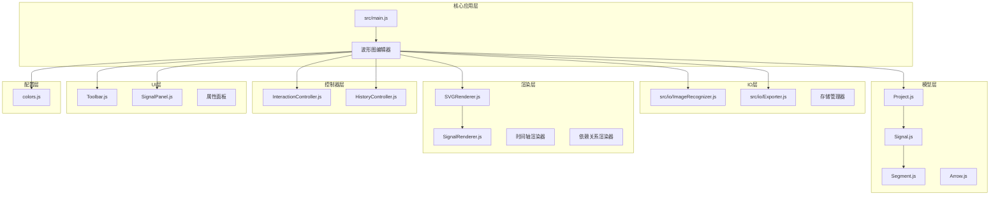
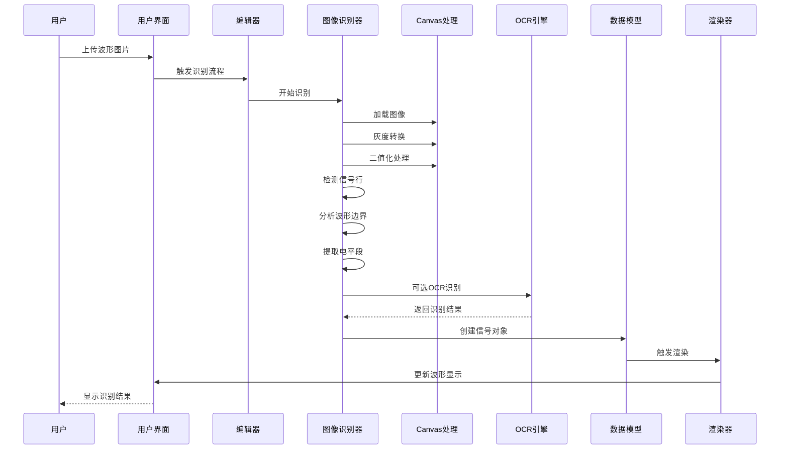
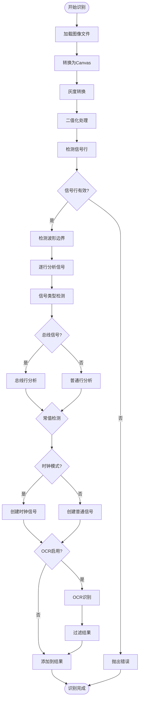
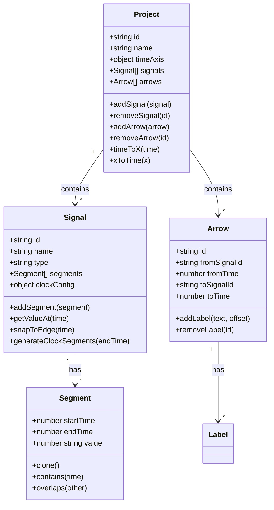
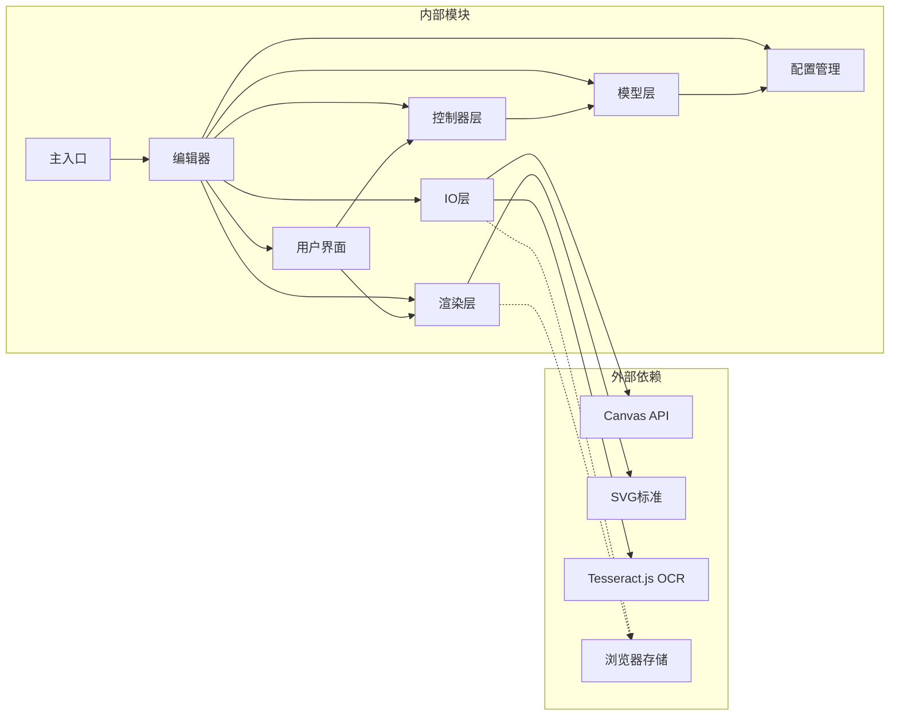
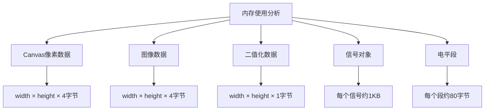

# 图像识别系统

<cite>
**本文档引用的文件**
- [src/main.js](file://src/main.js)
- [src/io/ImageRecognizer.js](file://src/io/ImageRecognizer.js)
- [src/models/Signal.js](file://src/models/Signal.js)
- [src/renderers/SVGRenderer.js](file://src/renderers/SVGRenderer.js)
- [src/controllers/InteractionController.js](file://src/controllers/InteractionController.js)
- [src/models/Project.js](file://src/models/Project.js)
- [src/io/Exporter.js](file://src/io/Exporter.js)
- [src/ui/Toolbar.js](file://src/ui/Toolbar.js)
- [src/config/colors.js](file://src/config/colors.js)
- [src/models/Segment.js](file://src/models/Segment.js)
- [src/models/Arrow.js](file://src/models/Arrow.js)
- [src/renderers/SignalRenderer.js](file://src/renderers/SignalRenderer.js)
- [src/controllers/HistoryController.js](file://src/controllers/HistoryController.js)
- [src/ui/SignalPanel.js](file://src/ui/SignalPanel.js)
- [index.html](file://index.html)
</cite>

## 目录
1. [简介](#简介)
2. [项目结构](#项目结构)
3. [核心组件](#核心组件)
4. [架构概览](#架构概览)
5. [详细组件分析](#详细组件分析)
6. [依赖关系分析](#依赖关系分析)
7. [性能考虑](#性能考虑)
8. [故障排除指南](#故障排除指南)
9. [结论](#结论)

## 简介

这是一个基于纯前端技术的图像识别系统，专门用于从数字波形图中自动识别和提取信号信息。系统采用现代Web技术栈，包括JavaScript ES6+、Canvas API、SVG渲染和OCR技术，实现了完整的波形图像识别、信号提取和可视化编辑功能。

该系统的核心特色包括：
- **纯前端图像识别**：无需服务器端处理，所有识别算法在浏览器中执行
- **智能波形分析**：通过像素分析检测信号行、波形边界和电平状态
- **OCR集成**：可选的光学字符识别功能，支持信号名称和总线值识别
- **实时可视化**：基于SVG的高质量波形渲染和交互式编辑
- **多格式导出**：支持PNG、SVG、JSON等多种输出格式

## 项目结构

项目采用模块化的目录结构，按照功能层次组织代码：

**图表来源**
- [src/main.js:1-1044](file://src/main.js#L1-L1044)
- [src/io/ImageRecognizer.js:1-812](file://src/io/ImageRecognizer.js#L1-L812)
- [src/models/Project.js:1-245](file://src/models/Project.js#L1-L245)

**章节来源**
- [src/main.js:1-1044](file://src/main.js#L1-L1044)
- [index.html:1-132](file://index.html#L1-L132)

## 核心组件

### 主编辑器类 (WaveformEditor)

WaveformEditor是整个系统的主控制器，负责协调各个子系统的协作和生命周期管理。

**主要职责：**
- 项目初始化和配置管理
- 多工作表（Sheet）管理
- UI组件协调
- 事件处理和用户交互
- 自动保存机制

**关键特性：**
- 支持多个独立的工作表
- 智能项目模板加载
- 实时数据同步和持久化
- 响应式界面适配

### 图像识别器 (ImageRecognizer)

ImageRecognizer是系统的核心识别引擎，专门处理波形图像的数字化转换。

**识别流程：**
1. **图像预处理**：加载、缩放和像素转换
2. **信号行检测**：通过像素密度分析定位信号区域
3. **波形边界识别**：确定信号名称区域和波形区域
4. **信号类型分类**：区分普通信号和总线信号
5. **电平段提取**：分析每个信号的高低电平状态
6. **OCR可选识别**：识别信号名称和总线值

**算法特点：**
- 自适应阈值处理（Otsu算法）
- 水平连续性过滤
- 常值信号检测
- 时钟模式识别

### 信号模型 (Signal)

Signal类表示单个波形信号的数据结构和行为。

**核心属性：**
- `id`: 唯一标识符
- `name`: 信号名称
- `type`: 信号类型（signal/clock/bus）
- `segments`: 电平段数组
- `clockConfig`: 时钟配置（仅时钟信号）
- `gaps`: 垂直分隔符
- `edgeMarkers`: 沿标注

**关键方法：**
- `addSegment()`: 添加新的电平段
- `getValueAt()`: 获取指定时间的电平值
- `snapToEdge()`: 跳变沿吸附
- `generateClockSegments()`: 生成时钟波形段

### 渲染系统

系统采用分层渲染架构，通过多个渲染器协同工作：

**SVGRenderer**: 主渲染器，管理SVG画布和整体布局
**SignalRenderer**: 信号波形渲染，处理具体的波形绘制
**TimeAxisRenderer**: 时间轴渲染
**DependencyRenderer**: 依赖关系箭头渲染

**渲染特性：**
- 高精度SVG矢量图形
- 支持X态、Z态等特殊电平
- 总线信号的双线渲染
- 实时缩放和滚动

**章节来源**
- [src/main.js:22-133](file://src/main.js#L22-L133)
- [src/io/ImageRecognizer.js:5-130](file://src/io/ImageRecognizer.js#L5-L130)
- [src/models/Signal.js:7-378](file://src/models/Signal.js#L7-L378)
- [src/renderers/SVGRenderer.js:10-563](file://src/renderers/SVGRenderer.js#L10-L563)

## 架构概览

系统采用典型的MVC架构模式，结合现代前端设计理念：

**图表来源**
- [src/main.js:745-800](file://src/main.js#L745-L800)
- [src/io/ImageRecognizer.js:18-130](file://src/io/ImageRecognizer.js#L18-L130)

**架构特点：**
- **模块化设计**：每个组件职责明确，易于维护和扩展
- **事件驱动**：通过事件系统实现组件间解耦
- **响应式更新**：数据变更自动触发UI更新
- **可扩展性**：支持插件化扩展和自定义处理

## 详细组件分析

### 图像识别算法详解

ImageRecognizer实现了完整的波形图像识别流程：

**图表来源**
- [src/io/ImageRecognizer.js:18-130](file://src/io/ImageRecognizer.js#L18-L130)
- [src/io/ImageRecognizer.js:326-545](file://src/io/ImageRecognizer.js#L326-L545)

**算法优化：**
- **自适应阈值**：使用Otsu算法自动确定最佳阈值
- **水印过滤**：通过双阈值策略过滤浅灰水印
- **信号行验证**：多重条件确保检测准确性
- **边界检测**：智能识别信号名称区域和波形区域

### 数据模型架构

系统采用清晰的数据模型层次结构：

**图表来源**
- [src/models/Project.js:8-245](file://src/models/Project.js#L8-L245)
- [src/models/Signal.js:7-378](file://src/models/Signal.js#L7-L378)
- [src/models/Segment.js:5-94](file://src/models/Segment.js#L5-L94)
- [src/models/Arrow.js:5-122](file://src/models/Arrow.js#L5-L122)

**数据流特点：**
- **不可变性**：数据模型提供克隆和序列化功能
- **事件驱动**：支持变更通知和订阅机制
- **类型安全**：严格的类型检查和验证
- **向后兼容**：支持从JSON格式恢复数据

### 交互控制系统

InteractionController负责处理用户的所有交互操作：

**支持的操作：**
- **信号编辑**：添加、删除、移动信号
- **波形绘制**：设置电平状态和跳变沿
- **依赖关系**：创建和编辑信号间的依赖箭头
- **分隔符管理**：添加和编辑垂直分隔符
- **时间轴控制**：缩放和平移时间轴

**交互特性：**
- **实时反馈**：操作过程中的即时视觉反馈
- **撤销重做**：完整的历史记录管理
- **吸附机制**：智能跳变沿和时间点吸附
- **批量操作**：支持多信号选择和批量编辑

**章节来源**
- [src/io/ImageRecognizer.js:18-812](file://src/io/ImageRecognizer.js#L18-L812)
- [src/models/Signal.js:83-320](file://src/models/Signal.js#L83-L320)
- [src/controllers/InteractionController.js:6-800](file://src/controllers/InteractionController.js#L6-L800)

## 依赖关系分析

系统采用松耦合的设计，通过清晰的接口定义组件间的依赖关系：

**依赖特点：**
- **最小化外部依赖**：仅依赖浏览器标准API
- **模块化导入**：支持按需加载和Tree Shaking
- **版本管理**：通过查询参数管理缓存版本
- **渐进式加载**：OCR引擎按需动态加载

**章节来源**
- [src/main.js:4-17](file://src/main.js#L4-L17)
- [src/io/ImageRecognizer.js:135-144](file://src/io/ImageRecognizer.js#L135-L144)

## 性能考虑

### 图像处理优化

系统在图像识别过程中采用了多项性能优化策略：

**内存管理：**
- 使用TypedArray进行像素数据处理
- 及时释放Canvas和Image对象
- 避免重复的DOM操作

**算法优化：**
- 采样策略：最多500个采样点平衡精度和性能
- 平滑滤波：3像素半径的简单平滑算法
- 早期退出：无效检测时快速返回

**渲染优化：**
- SVG矢量渲染，支持无限缩放
- 分层渲染，减少重绘次数
- 命中区域优化，提高交互响应性

### 内存使用分析

根据代码分析，系统的主要内存使用场景：

**内存优化策略：**
- **及时清理**：识别完成后释放临时Canvas
- **数据压缩**：使用Uint8Array存储二值化数据
- **懒加载**：OCR引擎按需加载，减少初始内存占用

## 故障排除指南

### 常见问题及解决方案

**图像识别失败：**
- **原因**：图像质量差、分辨率过低、光照不均
- **解决方案**：使用清晰的黑白图像，确保信号对比度充足

**OCR识别错误：**
- **原因**：网络问题导致Tesseract.js加载失败
- **解决方案**：检查网络连接，或手动刷新页面重试

**性能问题：**
- **原因**：图像过大、信号过多、浏览器性能不足
- **解决方案**：优化图像尺寸，减少信号数量，升级硬件

**浏览器兼容性：**
- **原因**：旧版浏览器不支持某些API
- **解决方案**：使用现代浏览器，如Chrome、Firefox、Safari最新版本

### 调试技巧

**开发工具使用：**
- 使用浏览器开发者工具监控Canvas性能
- 检查网络面板确认Tesseract.js加载状态
- 监控内存使用情况，避免内存泄漏

**日志调试：**
- 系统提供了详细的进度回调
- 可以通过控制台查看识别过程的中间结果
- 错误信息会包含具体的失败原因

**章节来源**
- [src/main.js:745-800](file://src/main.js#L745-L800)
- [src/io/ImageRecognizer.js:135-144](file://src/io/ImageRecognizer.js#L135-L144)

## 结论

这个图像识别系统展现了现代Web技术的强大能力，通过纯前端实现复杂的图像处理和数据分析功能。系统的主要优势包括：

**技术创新：**
- 纯前端图像识别，无需服务器端处理
- 智能的波形分析算法，准确识别各种信号类型
- OCR技术集成，支持信号名称和总线值识别

**用户体验：**
- 流畅的交互体验，实时响应用户操作
- 高质量的SVG渲染，支持无限缩放
- 直观的可视化界面，降低学习成本

**技术架构：**
- 模块化设计，易于维护和扩展
- 清晰的分层架构，职责分离明确
- 事件驱动的组件通信，降低耦合度

**应用场景：**
- 教育领域：帮助学生理解数字电路原理
- 工程设计：快速从图像中提取电路信息
- 数据迁移：将纸质电路图数字化

该系统为未来的扩展奠定了良好的基础，可以进一步集成更高级的机器学习算法，支持更多类型的波形识别，以及提供更丰富的编辑和分析功能。