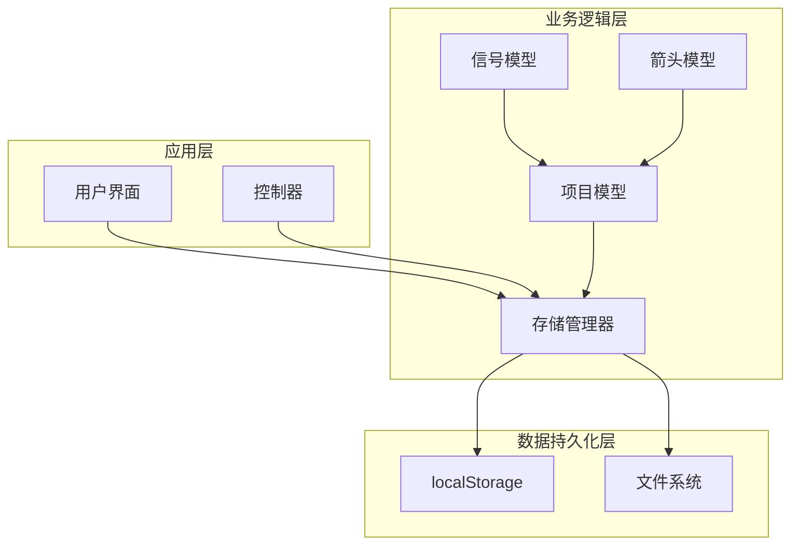
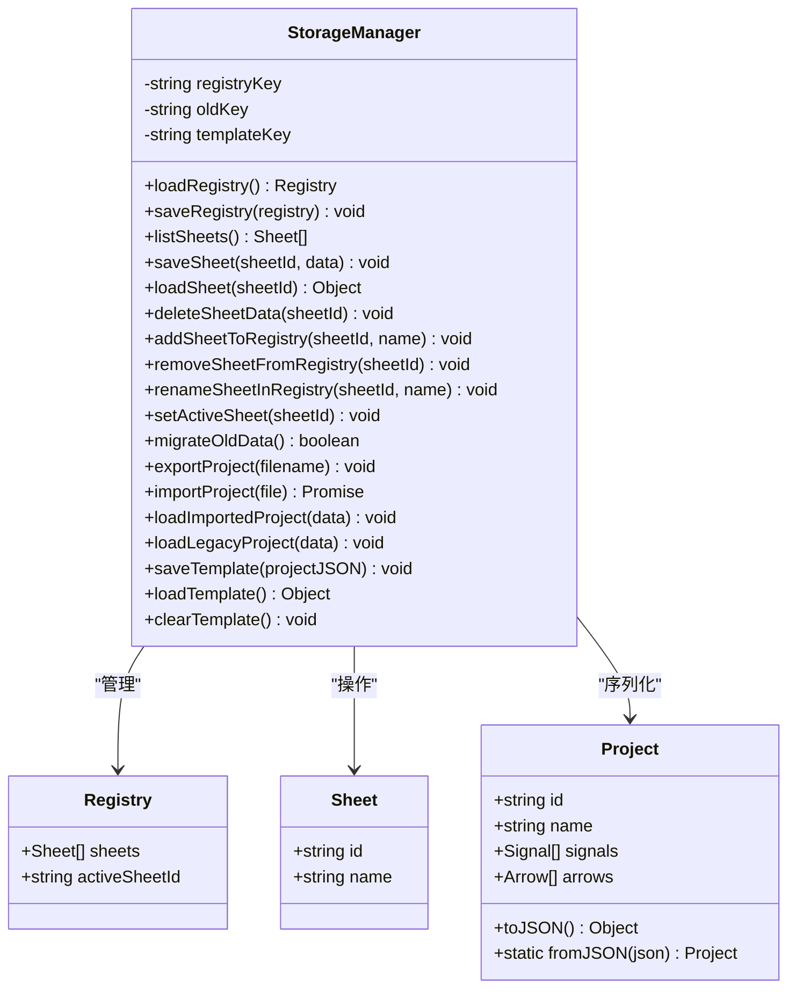
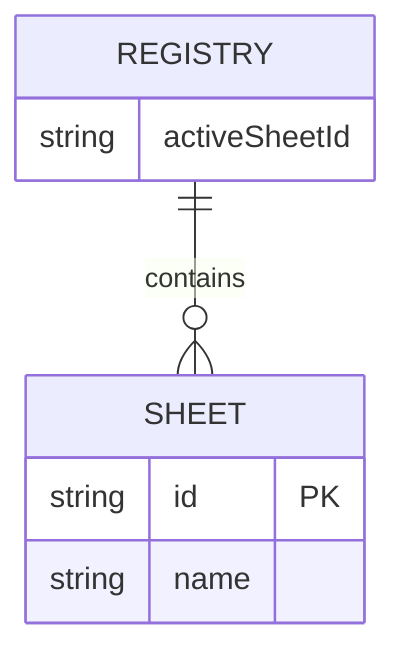
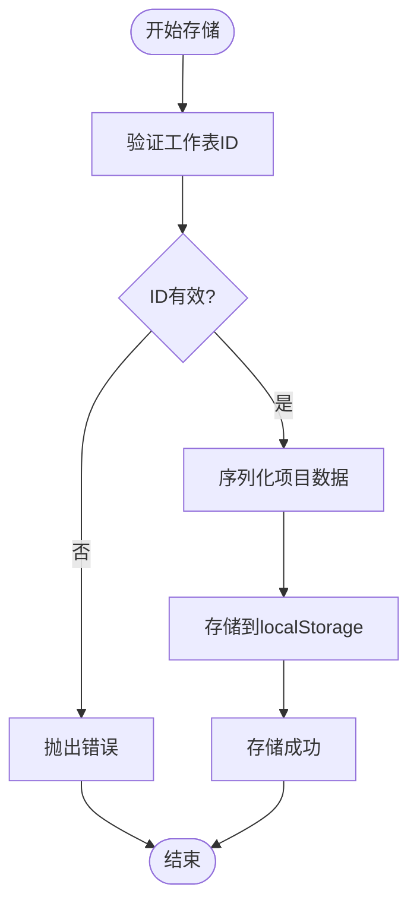
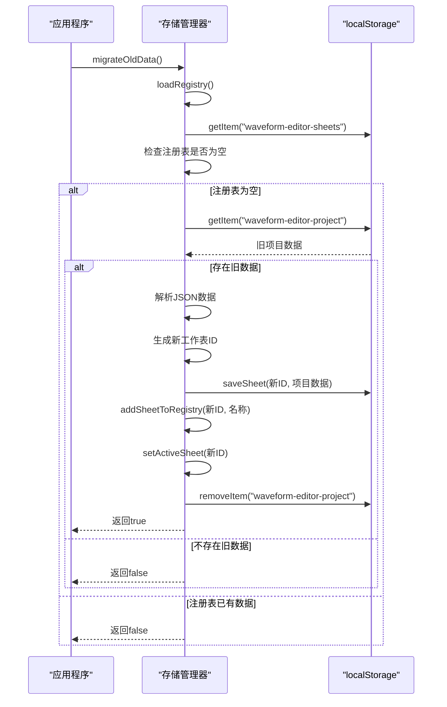
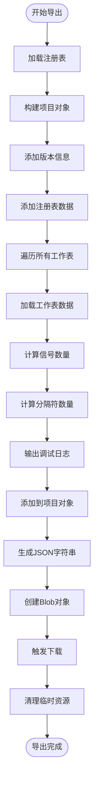
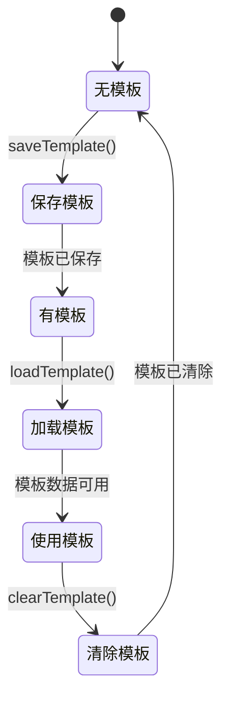
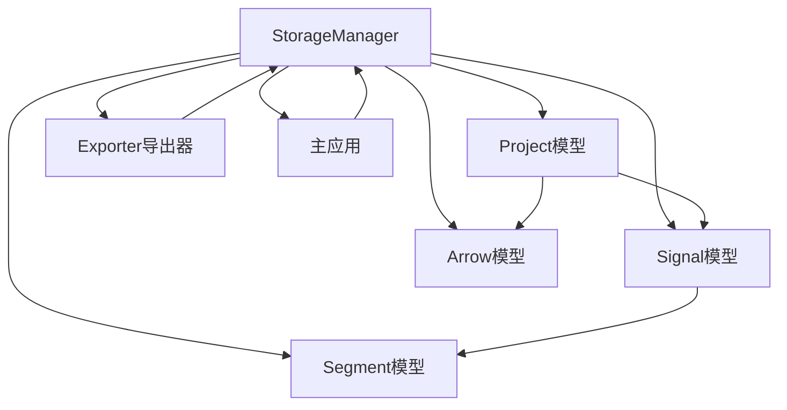

# 存储管理器

<cite>
**本文档引用的文件**
- [StorageManager.js](file://src/io/StorageManager.js)
- [Project.js](file://src/models/Project.js)
- [Signal.js](file://src/models/Signal.js)
- [Arrow.js](file://src/models/Arrow.js)
- [Segment.js](file://src/models/Segment.js)
- [Exporter.js](file://src/io/Exporter.js)
- [main.js](file://src/main.js)
- [default-template.json](file://default-template.json)
</cite>

## 目录
1. [简介](#简介)
2. [项目结构](#项目结构)
3. [核心组件](#核心组件)
4. [架构概览](#架构概览)
5. [详细组件分析](#详细组件分析)
6. [依赖分析](#依赖分析)
7. [性能考虑](#性能考虑)
8. [故障排除指南](#故障排除指南)
9. [结论](#结论)
10. [附录](#附录)

## 简介

存储管理器是波形图编辑器的核心数据持久化组件，负责管理多工作表注册表、单个工作表数据存储和删除操作。该组件实现了从旧版单项目格式到新版多工作表格式的数据迁移机制，并提供了完整的项目文件导入导出功能以及模板管理能力。

存储管理器采用localStorage作为主要数据存储介质，通过精心设计的键空间管理和数据结构，实现了高效的数据访问和持久化。该组件在整个应用架构中扮演着关键角色，连接着用户界面、项目模型和文件系统操作。

**更新** 增强了导出功能的调试能力，在exportProject方法中添加了详细的信号计数和分隔符计数日志，便于开发和调试过程中的性能分析和数据验证。

## 项目结构

存储管理器位于IO层，与项目模型和导出器形成清晰的分层架构：



**图表来源**
- [StorageManager.js:1-370](file://src/io/StorageManager.js#L1-L370)
- [main.js:21-132](file://src/main.js#L21-L132)

**章节来源**
- [StorageManager.js:1-370](file://src/io/StorageManager.js#L1-L370)
- [main.js:21-132](file://src/main.js#L21-L132)

## 核心组件

存储管理器的核心功能围绕以下三个主要方面展开：

### 1. 多工作表注册表管理
- **注册表结构**：包含工作表列表和活跃工作表ID
- **工作表元数据**：每个工作表包含唯一ID和显示名称
- **活跃状态管理**：跟踪当前激活的工作表

### 2. 单个工作表数据存储
- **数据序列化**：将项目模型转换为JSON格式
- **键空间管理**：使用命名空间隔离不同工作表数据
- **数据完整性**：提供数据验证和错误处理机制

### 3. 模板管理系统
- **模板保存**：将当前项目状态保存为模板
- **模板加载**：从localStorage加载模板数据
- **模板清理**：清除已保存的模板设置

**章节来源**
- [StorageManager.js:8-130](file://src/io/StorageManager.js#L8-L130)
- [StorageManager.js:336-370](file://src/io/StorageManager.js#L336-L370)

## 架构概览

存储管理器采用模块化设计，通过清晰的职责分离实现了高内聚低耦合：



**图表来源**
- [StorageManager.js:1-370](file://src/io/StorageManager.js#L1-L370)
- [Project.js:8-245](file://src/models/Project.js#L8-L245)

## 详细组件分析

### 注册表管理组件

注册表管理是存储管理器的核心功能之一，负责维护工作表的元数据信息：

#### 注册表数据结构


**图表来源**
- [StorageManager.js:14-22](file://src/io/StorageManager.js#L14-L22)

#### 注册表操作方法

##### addSheetToRegistry 方法
该方法负责向注册表中添加新的工作表条目：
- **参数验证**：接收工作表ID和名称
- **数据更新**：将新工作表添加到sheets数组末尾
- **持久化**：立即保存更新后的注册表

##### removeSheetFromRegistry 方法
该方法实现工作表的删除功能：
- **数据过滤**：从sheets数组中移除指定ID的工作表
- **活跃状态处理**：如果删除的是活跃工作表，选择下一个工作表作为活跃项
- **状态同步**：更新activeSheetId并保存注册表

##### renameSheetInRegistry 方法
实现工作表名称的动态更新：
- **查找定位**：在sheets数组中搜索匹配的ID
- **名称更新**：修改找到的工作表的name属性
- **持久化保存**：立即保存更新后的注册表

##### setActiveSheet 方法
管理活跃工作表的状态：
- **状态设置**：更新activeSheetId为指定的工作表ID
- **即时生效**：立即保存注册表变更
- **后续操作**：为工作表切换提供基础支持

**章节来源**
- [StorageManager.js:84-130](file://src/io/StorageManager.js#L84-L130)

### 单工作表数据存储组件

单工作表数据存储实现了项目数据的序列化和持久化：

#### 数据存储策略


**图表来源**
- [StorageManager.js:46-80](file://src/io/StorageManager.js#L46-L80)

#### 数据操作方法

##### saveSheet 方法
实现单个工作表数据的保存：
- **序列化处理**：将项目对象转换为JSON字符串
- **键空间管理**：使用特定命名空间隔离不同工作表
- **错误处理**：捕获并记录存储异常

##### loadSheet 方法
提供工作表数据的加载功能：
- **数据检索**：从localStorage获取指定ID的工作表数据
- **解析处理**：将JSON字符串转换为JavaScript对象
- **容错机制**：处理缺失数据和解析错误

##### deleteSheetData 方法
实现工作表数据的删除：
- **数据清理**：移除指定ID对应的工作表数据
- **内存释放**：确保数据完全从存储中移除

**章节来源**
- [StorageManager.js:46-80](file://src/io/StorageManager.js#L46-L80)

### 数据迁移机制

存储管理器实现了从旧版单项目格式到新版多工作表格式的完整迁移：

#### 迁移流程


**图表来源**
- [StorageManager.js:134-164](file://src/io/StorageManager.js#L134-L164)

#### 迁移特性
- **版本检测**：自动检测现有数据格式
- **数据转换**：将单项目数据转换为多工作表格式
- **ID生成**：为新工作表生成唯一标识符
- **兼容性**：保持原有项目数据的完整性

**章节来源**
- [StorageManager.js:134-164](file://src/io/StorageManager.js#L134-L164)

### 项目文件导入导出功能

存储管理器提供了完整的项目文件管理能力：

#### 导出功能


**图表来源**
- [StorageManager.js:168-203](file://src/io/StorageManager.js#L168-L203)

**更新** 导出功能现在包含详细的调试日志输出，每个工作表导出时都会显示信号数量和分隔符数量统计信息，便于开发和调试过程中的性能分析和数据验证。

#### 导入功能
导入功能支持多种文件格式：
- **新版格式(.wfp)**：包含完整的注册表和工作表数据
- **旧版格式(.json)**：兼容原有的单项目格式
- **格式验证**：自动检测并处理不同的文件格式

**章节来源**
- [StorageManager.js:168-275](file://src/io/StorageManager.js#L168-L275)

### 模板管理功能

模板管理为用户提供了一种快速创建新项目的机制：

#### 模板生命周期


**图表来源**
- [StorageManager.js:336-370](file://src/io/StorageManager.js#L336-L370)

#### 模板特性
- **灵活存储**：模板数据存储在独立的localStorage键中
- **快速加载**：支持从多种来源加载模板
- **版本控制**：模板数据包含版本信息便于升级

**章节来源**
- [StorageManager.js:336-370](file://src/io/StorageManager.js#L336-L370)

## 依赖分析

存储管理器与其他组件的依赖关系形成了清晰的层次结构：



**图表来源**
- [StorageManager.js:1-370](file://src/io/StorageManager.js#L1-L370)
- [main.js:15-16](file://src/main.js#L15-L16)

### 关键依赖关系

1. **项目模型依赖**：存储管理器直接依赖项目模型进行数据序列化
2. **UI集成**：与主应用紧密集成，响应用户操作
3. **导出器协作**：与导出器共享数据访问模式
4. **模板系统**：与默认模板文件配合使用

**章节来源**
- [StorageManager.js:1-370](file://src/io/StorageManager.js#L1-L370)
- [main.js:15-16](file://src/main.js#L15-L16)

## 性能考虑

存储管理器在设计时充分考虑了性能优化：

### 存储优化策略
- **增量更新**：只在必要时更新注册表，减少不必要的存储操作
- **数据压缩**：通过合理的JSON序列化减少存储空间占用
- **异步处理**：导入导出操作使用异步模式避免阻塞UI

### 内存管理
- **及时清理**：导出完成后及时清理临时的Blob对象
- **错误恢复**：提供完善的错误处理机制防止内存泄漏
- **资源释放**：确保文件句柄和DOM元素正确释放

### 调试日志优化
**更新** 导出功能的调试日志仅在开发环境中输出，不会影响生产环境的性能表现。日志格式经过优化，包含工作表ID、信号数量和分隔符数量等关键信息，便于快速定位性能问题。

## 故障排除指南

### 常见问题及解决方案

#### 注册表加载失败
**症状**：应用启动时注册表数据丢失
**原因**：localStorage访问权限问题或数据损坏
**解决**：检查浏览器设置，确认localStorage可用性

#### 工作表数据加载异常
**症状**：特定工作表无法打开
**原因**：JSON解析错误或数据格式不兼容
**解决**：使用迁移功能或手动修复数据格式

#### 导入文件格式错误
**症状**：导入文件时出现格式错误提示
**原因**：文件格式不符合预期或文件损坏
**解决**：确认文件格式，重新导出或检查文件完整性

#### 模板加载失败
**症状**：模板功能不可用
**原因**：localStorage中缺少模板数据或格式错误
**解决**：重新保存模板或清除损坏的模板数据

#### 导出调试日志问题
**更新** 如果发现导出过程中出现大量调试日志输出：
- 检查浏览器控制台的过滤设置
- 确认日志输出仅在开发环境中出现
- 如需禁用日志，可在exportProject方法中注释掉调试输出语句

**章节来源**
- [StorageManager.js:18-34](file://src/io/StorageManager.js#L18-L34)
- [StorageManager.js:68-72](file://src/io/StorageManager.js#L68-L72)

## 结论

存储管理器作为波形图编辑器的核心组件，通过精心设计的架构实现了高效的数据持久化和管理功能。其多工作表注册表管理、单工作表数据存储、数据迁移机制、项目文件导入导出和模板管理等功能，为用户提供了完整的项目管理体验。

该组件的成功之处在于：
- **模块化设计**：清晰的职责分离和接口定义
- **向后兼容**：完整的数据迁移机制保证用户体验
- **错误处理**：完善的异常处理和恢复机制
- **性能优化**：高效的存储策略和内存管理
- **调试友好**：增强的导出功能调试能力便于开发和维护

未来可以考虑的改进方向包括：
- **数据备份**：增加自动备份和版本控制功能
- **云同步**：支持云端数据同步和跨设备访问
- **性能监控**：增加存储使用情况的监控和报告
- **日志管理**：提供更精细的日志级别控制

## 附录

### API使用示例

#### 基本工作表操作
```javascript
// 创建存储管理器实例
const storageManager = new StorageManager();

// 添加新工作表
storageManager.addSheetToRegistry('sheet_123', '我的工作表');

// 切换活跃工作表
storageManager.setActiveSheet('sheet_123');

// 删除工作表
storageManager.removeSheetFromRegistry('sheet_123');
```

#### 数据存储和加载
```javascript
// 保存项目数据
storageManager.saveSheet('sheet_123', project.toJSON());

// 加载项目数据
const projectData = storageManager.loadSheet('sheet_123');

// 删除项目数据
storageManager.deleteSheetData('sheet_123');
```

#### 模板管理
```javascript
// 保存当前项目为模板
storageManager.saveTemplate(project.toJSON());

// 加载模板
const template = storageManager.loadTemplate();

// 清除模板
storageManager.clearTemplate();
```

#### 导出项目（含调试日志）
```javascript
// 导出项目到文件
storageManager.exportProject('my-project.wfp');

// 导出时将在控制台看到类似以下的日志：
// [Export] sheet=sheet_123: 5信号, 12分隔符
// [Export] sheet=sheet_456: 8信号, 15分隔符
```

### 错误处理最佳实践

1. **输入验证**：始终验证工作表ID和名称的有效性
2. **异常捕获**：在所有存储操作中使用try-catch块
3. **回滚机制**：在批量操作中实现部分成功的回滚
4. **用户反馈**：提供清晰的错误消息和恢复建议
5. **调试日志**：合理使用导出功能的调试日志进行问题诊断

### 调试日志格式说明

**更新** 导出功能的调试日志格式如下：
```
[Export] sheet={工作表ID}: {信号数量}信号, {分隔符数量}分隔符
```

- **工作表ID**：正在导出的工作表唯一标识符
- **信号数量**：该工作表中信号对象的数量
- **分隔符数量**：该工作表中所有信号的分隔符总数

这些日志信息有助于：
- 快速评估导出性能
- 验证数据完整性
- 诊断潜在的数据问题
- 优化大项目文件的处理效率