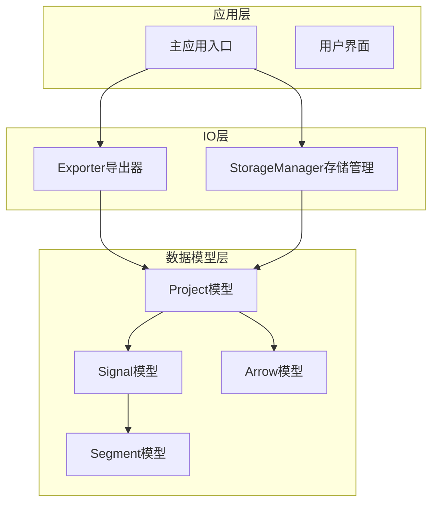
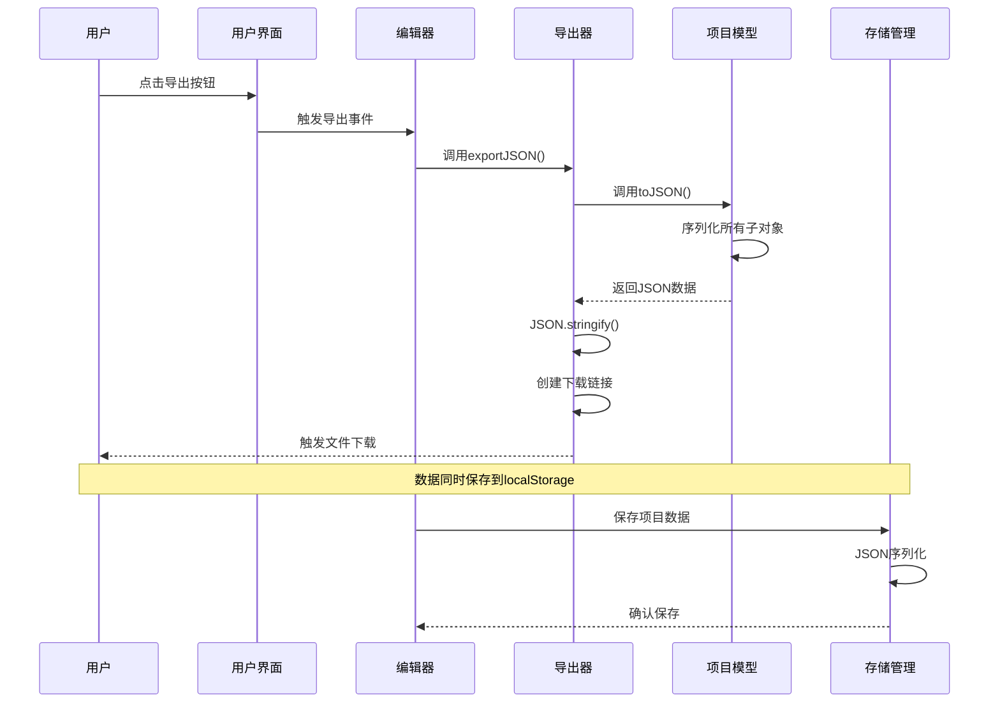
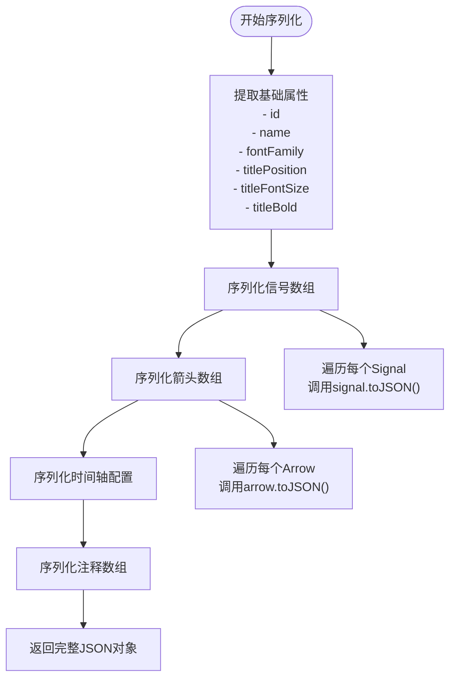
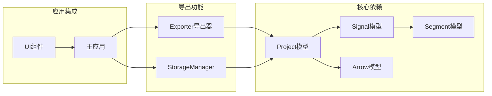

# JSON数据导出

<cite>
**本文档引用的文件**
- [Project.js](file://src/models/Project.js)
- [Signal.js](file://src/models/Signal.js)
- [Arrow.js](file://src/models/Arrow.js)
- [Segment.js](file://src/models/Segment.js)
- [Exporter.js](file://src/io/Exporter.js)
- [StorageManager.js](file://src/io/StorageManager.js)
- [main.js](file://src/main.js)
- [default-template.json](file://default-template.json)
</cite>

## 目录
1. [简介](#简介)
2. [项目结构](#项目结构)
3. [核心组件](#核心组件)
4. [架构概览](#架构概览)
5. [详细组件分析](#详细组件分析)
6. [依赖关系分析](#依赖关系分析)
7. [性能考虑](#性能考虑)
8. [故障排除指南](#故障排除指南)
9. [结论](#结论)
10. [附录](#附录)

## 简介

本文档详细介绍了波形编辑器项目的JSON数据导出功能。该系统提供了完整的项目数据序列化机制，支持将波形图项目转换为标准JSON格式，便于数据备份、项目分享和第三方集成。系统采用模块化的数据模型设计，每个核心实体都实现了toJSON()和fromJSON()方法，确保数据的完整性和可逆性。

## 项目结构

波形编辑器采用清晰的分层架构，JSON导出功能主要涉及以下模块：

**图表来源**
- [Project.js:1-245](file://src/models/Project.js#L1-L245)
- [Exporter.js:1-298](file://src/io/Exporter.js#L1-L298)
- [StorageManager.js:1-368](file://src/io/StorageManager.js#L1-L368)

**章节来源**
- [Project.js:1-245](file://src/models/Project.js#L1-L245)
- [Exporter.js:1-298](file://src/io/Exporter.js#L1-L298)
- [StorageManager.js:1-368](file://src/io/StorageManager.js#L1-L368)

## 核心组件

### 项目模型 (Project)

Project是整个系统的根模型，负责管理项目的所有数据和状态。其toJSON()方法实现了完整的序列化逻辑：

- **基础属性序列化**：包括项目ID、名称、字体设置、标题配置等
- **集合数据处理**：信号数组、注释数组、箭头数组的深度序列化
- **时间轴配置**：完整的时间轴参数序列化
- **事件监听器**：序列化时不包含事件监听器，确保JSON的简洁性

### 信号模型 (Signal)

Signal模型代表单个波形信号，支持多种信号类型：
- **普通信号**：二进制波形数据
- **时钟信号**：具有周期性特性的信号
- **总线信号**：多值信号，支持十六进制数据

每个Signal实例包含：
- **段数据**：由多个Segment组成的时间片段序列
- **时钟配置**：时钟信号的周期、相位、占空比参数
- **分隔符**：垂直分隔符列表，用于复杂波形的视觉分组

### 箭头模型 (Arrow)

Arrow模型表示信号间的依赖关系和时序关系：
- **端点信息**：起始信号和结束信号的ID及时间点
- **样式配置**：线条颜色、粗细、标记大小、虚线样式
- **标签系统**：支持多个文本标签，每个标签可独立定位
- **方向控制**：支持自动、正向、反向三种方向模式

### 段模型 (Segment)

Segment是最小的波形数据单元：
- **时间范围**：精确的开始和结束时间
- **电平值**：支持0、1、'X'、'Z'和十六进制字符串
- **颜色信息**：段级别的颜色配置，主要用于总线信号
- **数据验证**：确保时间范围的有效性

**章节来源**
- [Project.js:208-221](file://src/models/Project.js#L208-L221)
- [Signal.js:312-322](file://src/models/Signal.js#L312-L322)
- [Arrow.js:96-109](file://src/models/Arrow.js#L96-L109)
- [Segment.js:72-79](file://src/models/Segment.js#L72-L79)

## 架构概览

JSON导出系统采用分层设计，确保数据流的清晰性和可维护性：

**图表来源**
- [Exporter.js:84-96](file://src/io/Exporter.js#L84-L96)
- [Project.js:208-221](file://src/models/Project.js#L208-L221)
- [StorageManager.js:51-57](file://src/io/StorageManager.js#L51-L57)

## 详细组件分析

### JSON序列化流程

#### 项目级序列化

项目模型的toJSON()方法实现了完整的数据提取逻辑：

**图表来源**
- [Project.js:208-221](file://src/models/Project.js#L208-L221)
- [Signal.js:312-322](file://src/models/Signal.js#L312-L322)
- [Arrow.js:96-109](file://src/models/Arrow.js#L96-L109)

#### 信号级序列化

信号模型的序列化遵循以下规则：
- **条件字段**：只有存在颜色信息时才序列化color字段
- **时钟配置**：时钟信号的特殊配置序列化
- **分隔符处理**：分隔符数组的完整序列化
- **段数据**：每个Segment的精确序列化

#### 箭头级序列化

箭头模型的序列化包含：
- **端点信息**：完整的信号ID和时间坐标
- **样式配置**：线条样式、颜色、粗细等
- **标签系统**：多标签的完整序列化
- **方向控制**：方向模式和双向标志

**章节来源**
- [Project.js:208-244](file://src/models/Project.js#L208-L244)
- [Signal.js:312-342](file://src/models/Signal.js#L312-L342)
- [Arrow.js:96-114](file://src/models/Arrow.js#L96-L114)

### 版本控制与向后兼容性

系统实现了多层次的版本控制和兼容性处理：

#### 数据格式版本

StorageManager支持项目文件的版本控制：
- **版本2格式**：支持多sheet项目的完整格式
- **旧版兼容**：自动检测和转换旧版单项目格式
- **迁移机制**：无缝迁移用户数据

#### 向后兼容性策略

- **字段默认值**：新字段提供合理的默认值
- **类型降级**：复杂类型自动降级为简单类型
- **结构兼容**：新增字段不影响旧版本解析
- **数据验证**：严格的输入验证确保数据完整性

**章节来源**
- [StorageManager.js:167-236](file://src/io/StorageManager.js#L167-L236)
- [main.js:138-221](file://src/main.js#L138-L221)

### JSON数据验证与校验

系统提供了多层面的数据验证机制：

#### 运行时验证

- **段数据验证**：确保开始时间小于结束时间
- **信号类型验证**：验证信号类型的合法性
- **箭头引用验证**：确保信号ID的有效性
- **时间范围验证**：验证时间轴配置的合理性

#### 文件格式验证

- **JSON语法检查**：确保导出文件的JSON格式正确
- **结构完整性检查**：验证必需字段的存在性
- **数据类型检查**：确保字段类型符合预期
- **范围约束检查**：验证数值范围的合理性

**章节来源**
- [Segment.js:24-28](file://src/models/Segment.js#L24-L28)
- [StorageManager.js:208-236](file://src/io/StorageManager.js#L208-L236)

## 依赖关系分析

JSON导出功能涉及多个模块间的复杂依赖关系：

**图表来源**
- [Project.js:5-6](file://src/models/Project.js#L5-L6)
- [Signal.js:5](file://src/models/Signal.js#L5)
- [Exporter.js:2-5](file://src/io/Exporter.js#L2-L5)

### 组件耦合度分析

- **高内聚**：每个模型类都专注于单一职责
- **低耦合**：模型间通过明确的接口进行交互
- **可测试性**：每个组件都可以独立测试
- **可扩展性**：易于添加新的数据类型和导出格式

**章节来源**
- [Exporter.js:84-96](file://src/io/Exporter.js#L84-L96)
- [StorageManager.js:51-57](file://src/io/StorageManager.js#L51-L57)

## 性能考虑

### 序列化性能优化

- **延迟计算**：只在需要时进行数据序列化
- **内存管理**：及时释放临时对象和大对象
- **批量操作**：支持批量导出多个项目
- **增量更新**：支持增量导出修改过的数据

### 大数据集处理

- **流式处理**：支持大型项目文件的流式导出
- **分块传输**：避免一次性加载大量数据
- **进度反馈**：提供导出进度的实时反馈
- **错误恢复**：支持中断后的数据恢复

## 故障排除指南

### 常见问题及解决方案

#### 导出文件损坏

**症状**：导出的JSON文件无法被其他应用识别
**原因**：
- JSON序列化过程中出现异常
- 数据包含非法字符
- 文件编码问题

**解决方案**：
- 检查数据模型的toJSON()实现
- 验证数据的完整性
- 确认文件编码格式

#### 数据丢失问题

**症状**：导出的数据缺少某些字段
**原因**：
- 条件字段的序列化逻辑问题
- 空值的处理不当
- 版本升级导致的字段变更

**解决方案**：
- 检查条件字段的序列化规则
- 实现完整的字段映射
- 提供向后兼容性处理

#### 性能问题

**症状**：大项目导出速度慢
**原因**：
- 递归序列化效率低
- 内存占用过高
- I/O操作阻塞

**解决方案**：
- 优化递归算法
- 实现内存池管理
- 使用异步I/O操作

**章节来源**
- [Exporter.js:84-96](file://src/io/Exporter.js#L84-L96)
- [StorageManager.js:208-236](file://src/io/StorageManager.js#L208-L236)

## 结论

波形编辑器的JSON数据导出系统展现了优秀的软件工程实践。通过模块化的数据模型设计、完善的序列化机制、多层次的版本控制和全面的错误处理，系统能够可靠地处理各种复杂的波形数据导出需求。

该系统的主要优势包括：
- **完整性**：支持完整的波形数据导出
- **兼容性**：提供向后兼容性保证
- **可扩展性**：易于添加新的数据类型和导出格式
- **可靠性**：具备完善的错误处理和数据验证机制

## 附录

### JSON数据格式规范

#### 项目根对象结构

| 字段名 | 类型 | 必需 | 描述 |
|--------|------|------|------|
| id | string | 是 | 项目唯一标识符 |
| name | string | 是 | 项目名称 |
| fontFamily | string | 否 | 字体族设置，默认系统字体 |
| titlePosition | string | 否 | 标题位置，'bottom'或'top' |
| titleFontSize | number | 否 | 标题字体大小，默认14 |
| titleBold | boolean | 否 | 标题是否加粗，默认false |
| signals | array | 是 | 信号数组，至少包含一个信号 |
| annotations | array | 否 | 注释数组，默认空数组 |
| arrows | array | 否 | 箭头数组，默认空数组 |
| timeAxis | object | 是 | 时间轴配置对象 |

#### 信号对象结构

| 字段名 | 类型 | 必需 | 描述 |
|--------|------|------|------|
| id | string | 是 | 信号唯一标识符 |
| name | string | 是 | 信号名称 |
| type | string | 是 | 信号类型，'signal'、'clock'或'bus' |
| color | string | 否 | 信号颜色，null表示使用默认颜色 |
| segments | array | 是 | 波形段数组 |
| clockConfig | object | 否 | 时钟配置，仅时钟信号需要 |
| gaps | array | 否 | 分隔符数组，默认空数组 |

#### 段对象结构

| 字段名 | 类型 | 必需 | 描述 |
|--------|------|------|------|
| startTime | number | 是 | 段开始时间 |
| endTime | number | 是 | 段结束时间 |
| value | number/string | 是 | 电平值，支持0、1、'X'、'Z'或十六进制字符串 |
| color | string | 否 | 段颜色，主要用于总线信号 |

#### 箭头对象结构

| 字段名 | 类型 | 必需 | 描述 |
|--------|------|------|------|
| id | string | 是 | 箭头唯一标识符 |
| fromSignalId | string | 是 | 起始信号ID |
| fromTime | number | 是 | 起始时间点 |
| toSignalId | string | 是 | 结束信号ID |
| toTime | number | 是 | 结束时间点 |
| controlPointOffset | object | 否 | 控制点偏移量，默认{ x: 0, y: 0 } |
| direction | string | 否 | 方向模式，默认'auto' |
| isBidirectional | boolean | 否 | 是否双向，默认false |
| labels | array | 否 | 标签数组，默认空数组 |
| style | object | 否 | 样式配置对象 |

#### 时间轴配置结构

| 字段名 | 类型 | 必需 | 描述 |
|--------|------|------|------|
| unit | string | 是 | 时间单位，默认'ns' |
| scale | number | 是 | 缩放比例(像素/单位时间) |
| start | number | 是 | 开始时间 |
| end | number | 是 | 结束时间 |

### 使用场景

#### 数据备份
- **定期备份**：系统自动保存项目到localStorage
- **手动导出**：用户可以随时导出项目为JSON文件
- **版本管理**：支持多版本项目文件的管理

#### 项目分享
- **格式标准化**：统一的JSON格式便于分享
- **跨平台兼容**：任何支持JSON的应用都可以处理
- **轻量级传输**：相比二进制格式更便于网络传输

#### 第三方集成
- **API接口**：提供标准的JSON API接口
- **数据交换**：与其他波形编辑工具的数据交换
- **自动化处理**：支持脚本化的数据处理和分析

#### 自定义字段扩展

系统支持灵活的字段扩展机制：

1. **向后兼容**：新增字段不会影响旧版本解析
2. **条件序列化**：可选字段仅在有值时序列化
3. **默认值处理**：新字段提供合理的默认值
4. **验证机制**：新增字段需要通过验证规则

**章节来源**
- [Project.js:208-244](file://src/models/Project.js#L208-L244)
- [Signal.js:312-342](file://src/models/Signal.js#L312-L342)
- [Arrow.js:96-114](file://src/models/Arrow.js#L96-L114)