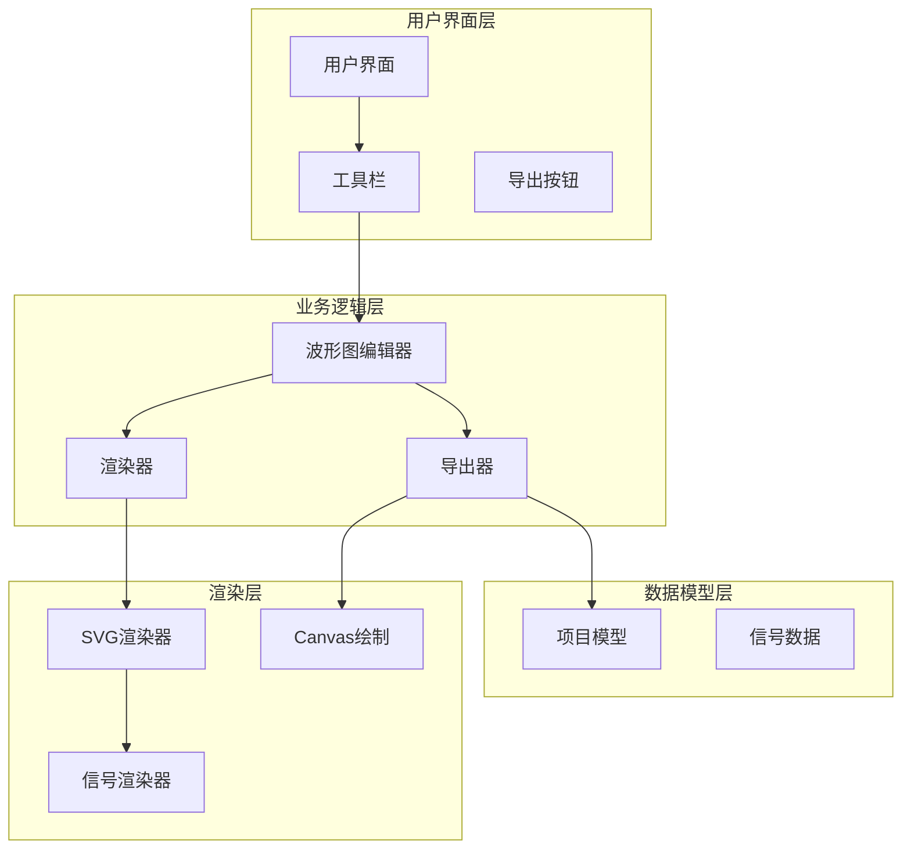
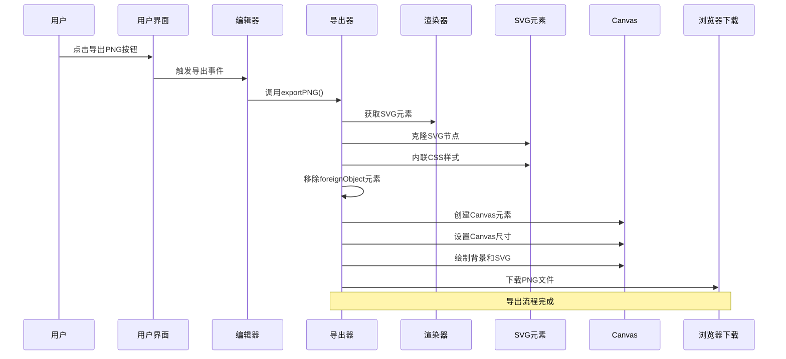
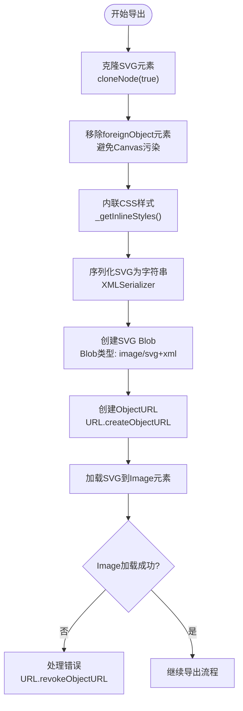
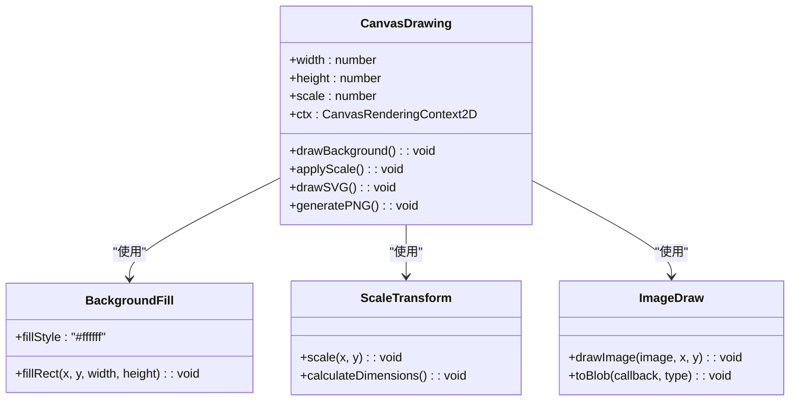
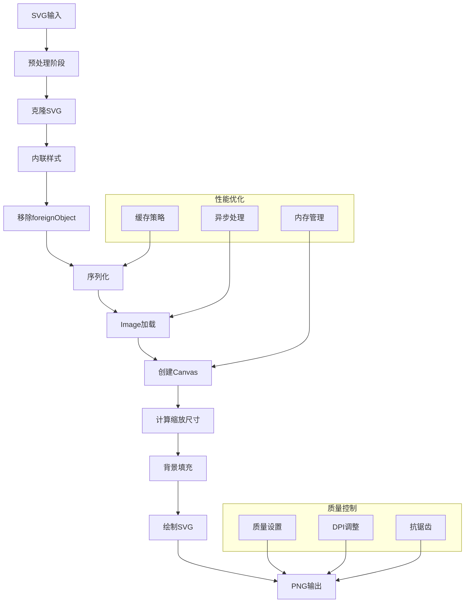
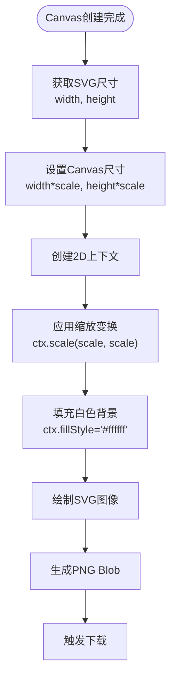
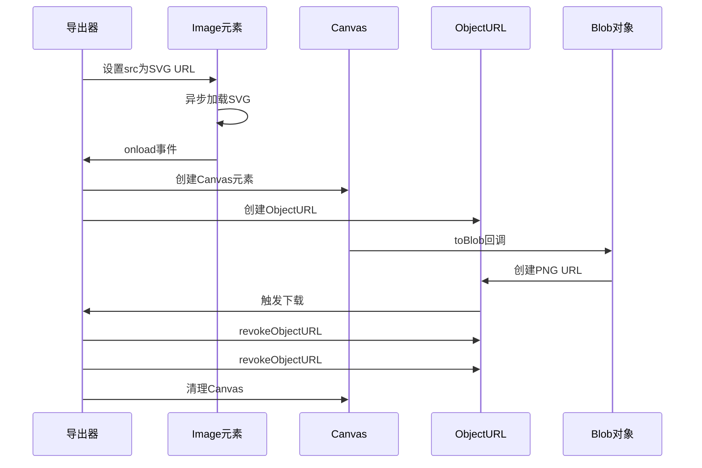

# PNG图像导出

<cite>
**本文档引用的文件**
- [Exporter.js](file://src/io/Exporter.js)
- [SVGRenderer.js](file://src/renderers/SVGRenderer.js)
- [main.js](file://src/main.js)
- [index.html](file://index.html)
- [colors.js](file://src/config/colors.js)
- [SignalRenderer.js](file://src/renderers/SignalRenderer.js)
- [Toolbar.js](file://src/ui/Toolbar.js)
- [main.css](file://styles/main.css)
</cite>

## 目录
1. [简介](#简介)
2. [项目结构](#项目结构)
3. [核心组件](#核心组件)
4. [架构概览](#架构概览)
5. [详细组件分析](#详细组件分析)
6. [依赖关系分析](#依赖关系分析)
7. [性能考虑](#性能考虑)
8. [故障排除指南](#故障排除指南)
9. [结论](#结论)
10. [附录](#附录)

## 简介

本文档详细介绍了波形图编辑器中的PNG图像导出功能。该功能实现了从SVG到PNG的完整转换流程，包括SVG克隆、样式内联、Canvas绘制等关键步骤。文档深入解释了scale参数的作用和影响，以及如何通过缩放因子控制导出图像的质量和分辨率。同时提供了性能优化建议、常见问题解决方案和最佳实践指导。

## 项目结构

波形图编辑器采用模块化的JavaScript架构，PNG导出功能主要涉及以下核心文件：



**图表来源**
- [main.js:1-132](file://src/main.js#L1-L132)
- [Exporter.js:1-298](file://src/io/Exporter.js#L1-L298)
- [SVGRenderer.js:1-547](file://src/renderers/SVGRenderer.js#L1-L547)

**章节来源**
- [main.js:1-819](file://src/main.js#L1-L819)
- [index.html:1-87](file://index.html#L1-L87)

## 核心组件

### 导出器（Exporter）

导出器是PNG导出功能的核心组件，负责协调整个导出流程。它继承自项目和渲染器实例，提供多种导出格式支持。

**主要职责：**
- SVG克隆和样式内联
- Canvas绘制和PNG生成
- 异步处理和内存管理
- 多种导出格式支持（PNG、SVG、JSON、独立HTML）

**关键特性：**
- 支持可配置的缩放因子
- 自动处理foreignObject元素
- 内存资源的及时释放
- 多种回退机制

**章节来源**
- [Exporter.js:1-298](file://src/io/Exporter.js#L1-L298)

### SVG渲染器（SVGRenderer）

SVG渲染器负责生成高质量的SVG图形，为PNG导出提供基础。它管理SVG画布、协调各子渲染器，并计算精确的尺寸。

**主要功能：**
- 动态计算SVG尺寸
- 管理渲染配置
- 创建SVG元素和定义
- 处理信号、箭头和网格渲染

**章节来源**
- [SVGRenderer.js:1-547](file://src/renderers/SVGRenderer.js#L1-L547)

### 波形图编辑器（WaveformEditor）

编辑器作为应用程序的主控制器，协调各个组件的工作，处理用户交互并触发导出操作。

**核心功能：**
- 初始化应用程序组件
- 处理用户界面事件
- 管理项目状态
- 触发导出流程

**章节来源**
- [main.js:1-819](file://src/main.js#L1-L819)

## 架构概览

PNG导出功能采用分层架构设计，确保各组件职责清晰分离：



**图表来源**
- [Exporter.js:38-82](file://src/io/Exporter.js#L38-L82)
- [main.js:471-474](file://src/main.js#L471-L474)

## 详细组件分析

### PNG导出流程详解

PNG导出功能实现了从SVG到PNG的完整转换过程，包含以下关键步骤：

#### 1. SVG克隆和预处理



**图表来源**
- [Exporter.js:38-82](file://src/io/Exporter.js#L38-L82)

#### 2. Canvas绘制过程

Canvas绘制是PNG导出的核心环节，涉及多个重要的绘制步骤：



**图表来源**
- [Exporter.js:55-79](file://src/io/Exporter.js#L55-L79)

#### 3. 缩放因子（Scale Parameter）的作用

缩放因子是PNG导出质量控制的关键参数，具有以下重要作用：

**质量控制：**
- 提高图像分辨率：scale=2时，输出分辨率为原始的4倍
- 减少像素化：更高的缩放因子提供更清晰的边缘
- 支持高DPI显示器：适配Retina显示效果

**性能影响：**
- 内存使用：内存占用与scale²成正比增长
- 处理时间：渲染时间与scale²成正比增长
- 文件大小：PNG文件大小随scale²增长

**章节来源**
- [Exporter.js:38-82](file://src/io/Exporter.js#L38-L82)

### SVG到PNG转换算法

PNG导出功能实现了高效的SVG到PNG转换算法：



**图表来源**
- [Exporter.js:38-82](file://src/io/Exporter.js#L38-L82)

**章节来源**
- [Exporter.js:189-194](file://src/io/Exporter.js#L189-L194)

### Canvas绘制过程详解

Canvas绘制过程包含多个关键步骤，确保输出图像的质量和准确性：

#### 背景填充处理



**图表来源**
- [Exporter.js:55-79](file://src/io/Exporter.js#L55-L79)

#### 像素精度处理

Canvas绘制过程中的像素精度处理确保输出图像的清晰度：

**坐标系统转换：**
- SVG坐标到Canvas坐标的精确映射
- 浮点数精度的合理处理
- 边界情况的特殊处理

**渲染优化：**
- 抗锯齿处理
- 线条宽度的精确计算
- 文本渲染的字体处理

**章节来源**
- [Exporter.js:55-79](file://src/io/Exporter.js#L55-L79)

### 异步处理和内存管理

PNG导出功能采用了完善的异步处理和内存管理策略：



**图表来源**
- [Exporter.js:55-79](file://src/io/Exporter.js#L55-L79)

**章节来源**
- [Exporter.js:55-79](file://src/io/Exporter.js#L55-L79)

## 依赖关系分析

PNG导出功能涉及多个组件间的复杂依赖关系：

```mermaid
graph TB
subgraph "导出功能依赖图"
Exporter[Exporter.js]
SVGRenderer[SVGRenderer.js]
SignalRenderer[SignalRenderer.js]
Project[Project.js]
Colors[colors.js]
Main[main.js]
Index[index.html]
end
Exporter --> SVGRenderer
Exporter --> Project
Exporter --> Colors
SVGRenderer --> SignalRenderer
SVGRenderer --> Colors
Main --> Exporter
Main --> SVGRenderer
Index --> Main
Exporter -.->|"依赖"| "SVG克隆"
Exporter -.->|"依赖"| "Canvas绘制"
Exporter -.->|"依赖"| "Blob生成"
SVGRenderer -.->|"提供"| "SVG元素"
SignalRenderer -.->|"提供"| "信号数据"
Colors -.->|"提供"| "颜色配置"
```

**图表来源**
- [Exporter.js:1-298](file://src/io/Exporter.js#L1-L298)
- [SVGRenderer.js:1-547](file://src/renderers/SVGRenderer.js#L1-L547)
- [main.js:1-132](file://src/main.js#L1-L132)

**章节来源**
- [Exporter.js:1-298](file://src/io/Exporter.js#L1-L298)
- [SVGRenderer.js:1-547](file://src/renderers/SVGRenderer.js#L1-L547)

## 性能考虑

### 内存优化策略

PNG导出功能实施了多项内存优化策略：

**1. 及时的资源清理**
- 导出完成后立即释放ObjectURL
- Canvas元素的及时销毁
- 大对象的生命周期管理

**2. 内存使用估算**
- Canvas内存占用：width × height × 4字节（RGBA）
- 缩放因子对内存的影响：O(scale²)
- 建议的内存限制：单次导出不超过50MB

**3. 异步处理优化**
- 避免阻塞主线程
- 分阶段处理大任务
- 进度反馈机制

### 性能优化建议

**1. 缩放因子选择**
- 默认值：scale = 2（平衡质量和性能）
- 高质量需求：scale = 3-4
- 性能优先：scale = 1

**2. SVG复杂度控制**
- 减少不必要的SVG元素
- 优化CSS样式复杂度
- 合理使用渐变和滤镜

**3. 浏览器兼容性**
- 检查Canvas支持情况
- 提供降级方案
- 错误处理和回退机制

**章节来源**
- [Exporter.js:38-82](file://src/io/Exporter.js#L38-L82)

## 故障排除指南

### 常见问题及解决方案

#### 1. SVG渲染失败

**问题描述：** Image元素onerror事件触发，导出失败

**可能原因：**
- SVG内容包含不支持的元素
- 外部资源加载失败
- CSS样式问题

**解决方案：**
- 移除foreignObject元素
- 内联所有CSS样式
- 验证SVG语法正确性

**章节来源**
- [Exporter.js:180-186](file://src/io/Exporter.js#L180-L186)

#### 2. Canvas尺寸计算错误

**问题描述：** 导出图像尺寸不正确或比例失调

**可能原因：**
- SVG width/height属性缺失
- 浮点数精度问题
- 缩放因子计算错误

**解决方案：**
- 确保SVG元素具有明确的width和height属性
- 使用parseFloat进行数值转换
- 验证缩放因子的有效性

**章节来源**
- [Exporter.js:57-61](file://src/io/Exporter.js#L57-L61)

#### 3. 内存泄漏问题

**问题描述：** 导出后内存无法释放

**可能原因：**
- ObjectURL未正确释放
- Canvas引用未清理
- 事件监听器未移除

**解决方案：**
- 确保每次导出后调用URL.revokeObjectURL
- 清理Canvas元素引用
- 移除所有事件监听器

**章节来源**
- [Exporter.js:78-79](file://src/io/Exporter.js#L78-L79)

#### 4. PNG质量不佳

**问题描述：** 导出的PNG图像模糊或像素化

**可能原因：**
- 缩放因子过小
- Canvas分辨率不足
- 抗锯齿设置不当

**解决方案：**
- 增加缩放因子（scale = 2-4）
- 检查Canvas像素密度
- 调整渲染配置

**章节来源**
- [Exporter.js:38-82](file://src/io/Exporter.js#L38-L82)

### 调试技巧

**1. 控制台日志**
- 监控导出流程的每个步骤
- 记录关键参数和状态
- 捕获异常信息

**2. 性能监控**
- 测量导出耗时
- 监控内存使用情况
- 分析性能瓶颈

**3. 用户体验优化**
- 显示进度指示器
- 提供取消选项
- 错误友好提示

**章节来源**
- [Exporter.js:112-186](file://src/io/Exporter.js#L112-L186)

## 结论

PNG图像导出功能通过精心设计的架构和优化策略，实现了高质量的SVG到PNG转换。该功能的主要优势包括：

**技术优势：**
- 完整的SVG克隆和样式内联机制
- 精确的Canvas绘制和像素处理
- 有效的内存管理和异步处理
- 多种回退机制确保可靠性

**性能特点：**
- 可配置的缩放因子控制质量
- 优化的内存使用策略
- 异步处理避免界面阻塞
- 浏览器兼容性良好

**应用场景：**
- 技术文档截图
- 报告和演示材料
- 代码审查和分享
- 教育和培训资料

通过合理的参数配置和最佳实践，该导出功能能够满足各种应用场景的需求，为用户提供高质量的PNG图像输出能力。

## 附录

### 使用示例

#### 基础PNG导出
```javascript
// 使用默认缩放因子（scale = 2）
exporter.exportPNG();

// 使用自定义缩放因子
exporter.exportPNG(3); // 更高质量
exporter.exportPNG(1); // 更快但质量较低
```

#### 复制到剪贴板
```javascript
// 导出PNG并复制到剪贴板
exporter.copyToClipboard(2)
  .then(result => console.log('导出结果:', result))
  .catch(error => console.error('导出失败:', error));
```

### 最佳实践

**1. 参数选择建议**
- 日常使用：scale = 2
- 高质量打印：scale = 3-4
- 快速预览：scale = 1

**2. 性能优化**
- 控制SVG复杂度
- 合理使用渐变和滤镜
- 避免过多的foreignObject元素

**3. 错误处理**
- 实现完善的异常处理
- 提供用户友好的错误提示
- 实施回退机制

**4. 内存管理**
- 及时释放ObjectURL
- 监控内存使用情况
- 实施垃圾回收策略