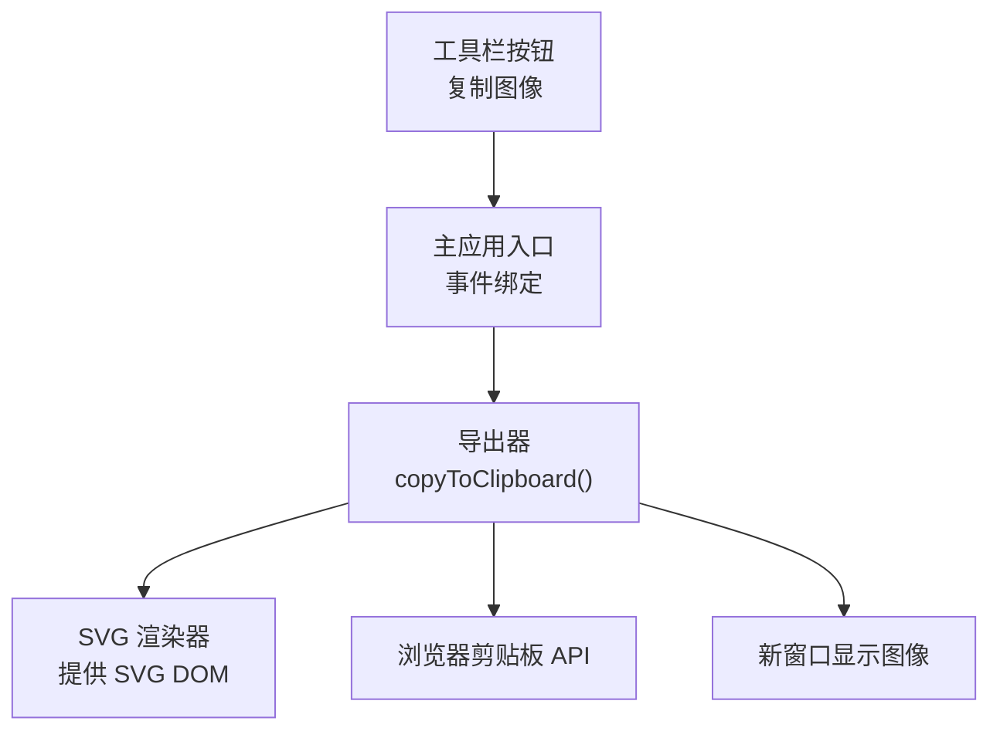
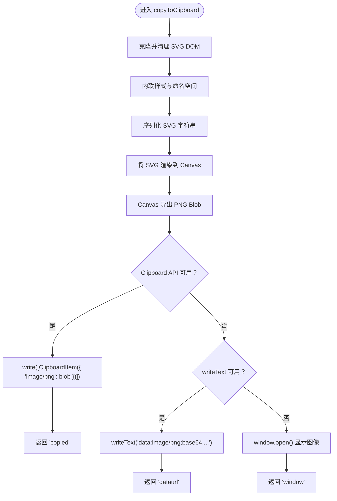
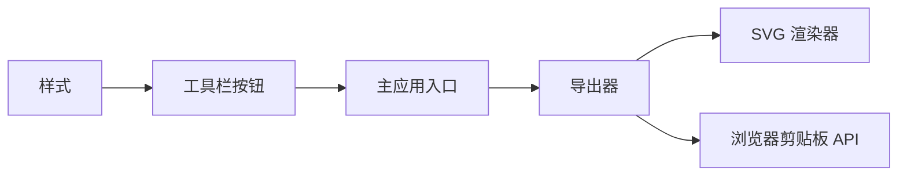

# 剪贴板集成

<cite>
**本文档引用的文件**
- [index.html](file://index.html)
- [src/main.js](file://src/main.js)
- [src/io/Exporter.js](file://src/io/Exporter.js)
- [src/renderers/SVGRenderer.js](file://src/renderers/SVGRenderer.js)
- [src/ui/Toolbar.js](file://src/ui/Toolbar.js)
- [styles/main.css](file://styles/main.css)
</cite>

## 目录
1. [简介](#简介)
2. [项目结构](#项目结构)
3. [核心组件](#核心组件)
4. [架构总览](#架构总览)
5. [详细组件分析](#详细组件分析)
6. [依赖关系分析](#依赖关系分析)
7. [性能考量](#性能考量)
8. [故障排查指南](#故障排查指南)
9. [结论](#结论)
10. [附录](#附录)

## 简介
本文件围绕“剪贴板集成”主题，系统梳理波形图编辑器中图像复制到系统剪贴板的实现方案与最佳实践。重点涵盖：
- 多种复制实现路径：Clipboard API、writeText 方法与传统降级方案
- 浏览器兼容性策略与 API 支持检测
- Promise 异步流程与错误处理、权限请求与用户提示
- 剪贴板数据格式选择与转换：PNG 图像与 Data URL 文本
- 使用场景、批量操作与用户体验优化
- 安全限制与解决方案：HTTPS 要求与用户手势触发

## 项目结构
该功能位于编辑器的导出与交互层之间，主要涉及以下模块：
- UI 事件绑定与按钮交互：工具栏按钮触发复制流程
- 导出器：负责将 SVG 渲染为 PNG 并写入剪贴板或打开新窗口
- 渲染器：提供 SVG DOM 供导出器序列化与绘制
- 页面与样式：承载工具栏与按钮，提供基础 UI 体验



图表来源
- [index.html:36](file://index.html#L36)
- [src/main.js:480](file://src/main.js#L480)
- [src/io/Exporter.js:98](file://src/io/Exporter.js#L98)
- [src/renderers/SVGRenderer.js:10](file://src/renderers/SVGRenderer.js#L10)

章节来源
- [index.html:12-41](file://index.html#L12-L41)
- [src/main.js:479](file://src/main.js#L479)
- [src/io/Exporter.js:98](file://src/io/Exporter.js#L98)
- [src/renderers/SVGRenderer.js:10](file://src/renderers/SVGRenderer.js#L10)

## 核心组件
- 工具栏按钮与事件绑定：点击“复制图像”按钮后，主应用入口设置按钮状态、启动超时保护，并调用导出器执行复制流程。
- 导出器（Exporter）：核心逻辑封装在 copyToClipboard()，负责：
  - 克隆并清理 SVG DOM
  - 内联样式与命名空间
  - 将 SVG 渲染为 PNG（Canvas + toBlob）
  - 优先使用 Clipboard API 写入 image/png；若失败则回退到 writeText(Data URL)；仍失败则打开新窗口展示图像
- SVG 渲染器（SVGRenderer）：提供可被导出器使用的 SVG DOM，包含信号、时间轴与依赖关系的完整渲染结果。

章节来源
- [src/main.js:480](file://src/main.js#L480)
- [src/io/Exporter.js:98](file://src/io/Exporter.js#L98)
- [src/renderers/SVGRenderer.js:10](file://src/renderers/SVGRenderer.js#L10)

## 架构总览
下图展示了“复制到剪贴板”的端到端流程，包括三种降级策略与错误处理路径。

```mermaid
sequenceDiagram
participant U as "用户"
participant T as "工具栏按钮"
participant M as "主应用入口"
participant E as "导出器"
participant R as "SVG 渲染器"
participant C as "浏览器剪贴板 API"
participant W as "新窗口"
U->>T : 点击“复制图像”
T->>M : 触发点击事件
M->>M : 设置按钮状态/超时保护
M->>E : 调用 copyToClipboard()
E->>R : 获取 SVG DOM 并克隆
E->>E : 序列化 SVG、内联样式、设置命名空间
E->>E : 将 SVG 渲染到 Canvas 并导出 PNG Blob
alt Clipboard API 支持且可用
E->>C : write([ClipboardItem({ "image/png" : blob })])
C-->>E : 成功
E-->>M : 返回 "copied"
else 回退到 writeText
E->>C : writeText("data : image/png;base64,...")
C-->>E : 成功
E-->>M : 返回 "dataurl"
else 打开新窗口
E->>W : window.open() 显示图像
W-->>E : 成功
E-->>M : 返回 "window"
end
M-->>U : 更新按钮文案/恢复状态
```

图表来源
- [src/main.js:480](file://src/main.js#L480)
- [src/io/Exporter.js:98](file://src/io/Exporter.js#L98)
- [src/renderers/SVGRenderer.js:10](file://src/renderers/SVGRenderer.js#L10)

## 详细组件分析

### 组件一：工具栏按钮与事件绑定
- 功能职责：响应用户点击“复制图像”，设置按钮文案与禁用状态，启动超时保护，调用导出器执行复制，并根据结果更新按钮状态与提示。
- 关键点：
  - 超时保护：超过阈值自动提示“超时”，并恢复按钮状态
  - Promise 结果处理：区分“窗口模式”与“剪贴板模式”，分别提示“已打开图像窗口”与“已复制!”
  - 异常捕获：统一记录错误日志并提示“复制失败”

章节来源
- [src/main.js:480](file://src/main.js#L480)
- [src/main.js:491](file://src/main.js#L491)
- [src/main.js:500](file://src/main.js#L500)

### 组件二：导出器（Exporter）与剪贴板复制
- 功能职责：将当前项目渲染为 SVG，再转为 PNG，尝试写入剪贴板或打开新窗口。
- 关键流程与策略：
  - SVG 克隆与清理：移除 foreignObject，避免 Canvas 污染
  - 内联样式与命名空间：保证 PNG 输出背景与字体一致
  - Canvas 绘制：按比例放大，先填充白色背景，再绘制图像
  - 三阶段降级策略：
    1) Clipboard API：写入 image/png（ClipboardItem）
    2) writeText：写入 data URL 文本
    3) 新窗口：window.open() 展示图像，便于用户右键保存
- 数据格式与转换：
  - PNG 图像数据：Canvas.toBlob('image/png')
  - Data URL 文本：Canvas.toDataURL('image/png')



图表来源
- [src/io/Exporter.js:98](file://src/io/Exporter.js#L98)
- [src/io/Exporter.js:138](file://src/io/Exporter.js#L138)
- [src/io/Exporter.js:141](file://src/io/Exporter.js#L141)
- [src/io/Exporter.js:155](file://src/io/Exporter.js#L155)
- [src/io/Exporter.js:168](file://src/io/Exporter.js#L168)

章节来源
- [src/io/Exporter.js:98](file://src/io/Exporter.js#L98)
- [src/io/Exporter.js:138](file://src/io/Exporter.js#L138)
- [src/io/Exporter.js:141](file://src/io/Exporter.js#L141)
- [src/io/Exporter.js:155](file://src/io/Exporter.js#L155)
- [src/io/Exporter.js:168](file://src/io/Exporter.js#L168)

### 组件三：SVG 渲染器（SVGRenderer）
- 功能职责：维护 SVG DOM 结构、子渲染器与尺寸计算，为导出器提供可序列化的 SVG。
- 与剪贴板集成的关系：导出器从渲染器获取 SVG DOM，进行克隆与序列化，确保输出质量与一致性。

章节来源
- [src/renderers/SVGRenderer.js:10](file://src/renderers/SVGRenderer.js#L10)
- [src/renderers/SVGRenderer.js:194](file://src/renderers/SVGRenderer.js#L194)

### 组件四：UI 与样式
- 工具栏按钮：承载“复制图像”交互入口
- 样式：提供按钮状态、悬停与激活态的视觉反馈，辅助用户体验

章节来源
- [index.html:36](file://index.html#L36)
- [styles/main.css:46](file://styles/main.css#L46)
- [styles/main.css:60](file://styles/main.css#L60)

## 依赖关系分析
- 主应用入口依赖导出器：通过事件绑定触发导出器的复制流程
- 导出器依赖 SVG 渲染器：获取 SVG DOM 以进行序列化与绘制
- 导出器依赖浏览器剪贴板 API：优先使用 Clipboard API，回退至 writeText 或新窗口
- UI 与样式：为用户提供明确的交互反馈与视觉状态



图表来源
- [src/main.js:480](file://src/main.js#L480)
- [src/io/Exporter.js:98](file://src/io/Exporter.js#L98)
- [src/renderers/SVGRenderer.js:10](file://src/renderers/SVGRenderer.js#L10)
- [index.html:36](file://index.html#L36)
- [styles/main.css:46](file://styles/main.css#L46)

章节来源
- [src/main.js:480](file://src/main.js#L480)
- [src/io/Exporter.js:98](file://src/io/Exporter.js#L98)
- [src/renderers/SVGRenderer.js:10](file://src/renderers/SVGRenderer.js#L10)
- [index.html:36](file://index.html#L36)
- [styles/main.css:46](file://styles/main.css#L46)

## 性能考量
- 渲染缩放与内存占用：导出时按比例放大 Canvas，可能增加内存与 CPU 开销。建议根据实际需要调整缩放系数，平衡清晰度与性能。
- Blob 导出与 revoke：导出 PNG 后及时释放对象 URL，避免内存泄漏。
- 降级策略的代价：writeText 与新窗口均会产生额外的 DOM 与网络开销，应优先使用 Clipboard API。
- 用户手势与异步：复制操作需由用户手势触发，避免在无交互上下文中调用导致失败。

[本节为通用性能建议，不直接分析具体文件]

## 故障排查指南
- Clipboard API 失败
  - 现象：控制台记录 Clipboard API 失败，继续回退
  - 排查：确认浏览器支持 Clipboard API 且未处于不安全上下文
- writeText 失败
  - 现象：writeText 也失败，继续回退
  - 排查：检查 Data URL 的生成与写入是否成功
- 打开新窗口失败
  - 现象：提示“无法打开窗口，请允许弹出窗口”
  - 排查：检查浏览器弹窗拦截设置与 HTTPS 环境
- SVG 渲染失败
  - 现象：Image 加载失败，拒绝 Promise
  - 排查：确认 SVG 序列化与 Blob 生成正常，检查命名空间与样式内联
- 超时与按钮状态
  - 现象：按钮显示“超时”，随后恢复
  - 排查：检查 Promise 链路与超时定时器是否正确清理

章节来源
- [src/io/Exporter.js:150](file://src/io/Exporter.js#L150)
- [src/io/Exporter.js:164](file://src/io/Exporter.js#L164)
- [src/io/Exporter.js:175](file://src/io/Exporter.js#L175)
- [src/io/Exporter.js:183](file://src/io/Exporter.js#L183)
- [src/main.js:486](file://src/main.js#L486)

## 结论
本项目实现了完整的“复制图像到剪贴板”能力，采用三层降级策略以最大化兼容性与成功率：
- 优先 Clipboard API 写入 PNG 图像
- 回退 writeText 写入 Data URL 文本
- 最终回退到新窗口展示图像，便于用户手动保存

配合完善的 Promise 异步处理、超时保护与错误提示，以及对浏览器安全限制与用户手势触发的考虑，整体方案具备良好的可用性与可维护性。

[本节为总结性内容，不直接分析具体文件]

## 附录

### 使用场景与最佳实践
- 场景一：快速分享波形图
  - 使用 Clipboard API 直接写入 PNG，提升效率
- 场景二：跨平台粘贴
  - 若 Clipboard API 不可用，writeText 写入 Data URL，便于在支持 Data URL 的应用中粘贴
- 场景三：离线或受限环境
  - 通过新窗口展示图像，用户可右键保存
- 最佳实践
  - 优先在用户手势触发的上下文中执行复制
  - 控制 Canvas 缩放比例，平衡清晰度与性能
  - 及时释放对象 URL，避免内存泄漏
  - 提供明确的用户提示与状态反馈

[本节为通用指导，不直接分析具体文件]

### 安全限制与解决方案
- HTTPS 要求
  - Clipboard API 与部分浏览器特性仅在安全上下文（HTTPS）下可用
  - 解决：通过 HTTPS 服务器部署，避免混合内容问题
- 用户手势触发
  - 复制操作必须由用户手势触发，避免静默失败
  - 解决：将复制绑定到按钮点击等显式交互事件
- 权限与弹窗拦截
  - writeText 与 window.open 可能受权限与弹窗拦截影响
  - 解决：在首次交互后执行复制，提示用户允许弹窗与权限

[本节为通用指导，不直接分析具体文件]