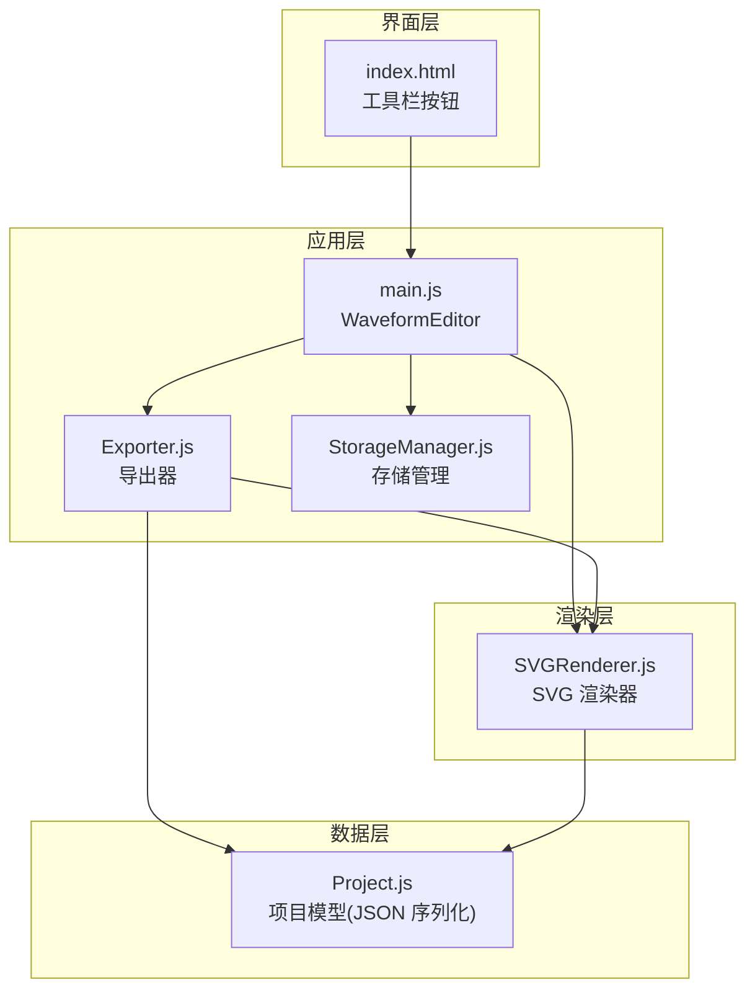
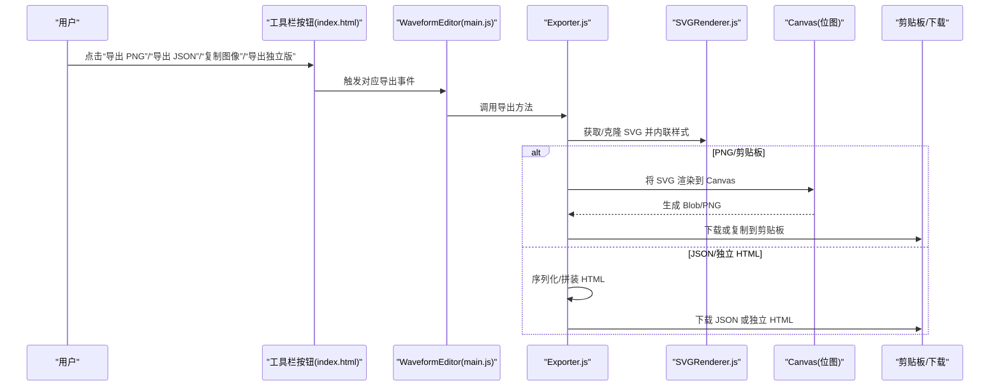
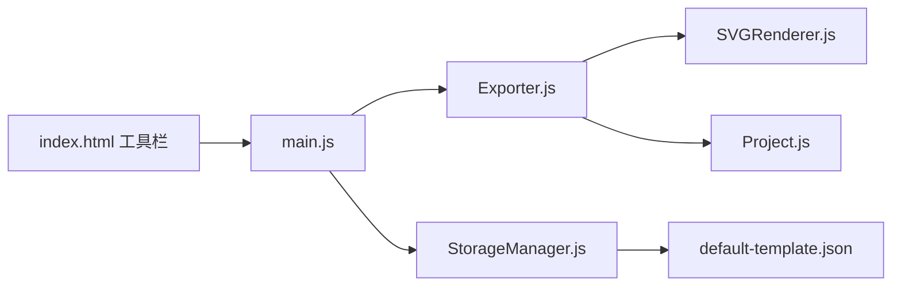

# 导出格式对比与选择

<cite>
**本文档引用的文件**
- [Exporter.js](file://src/io/Exporter.js)
- [SVGRenderer.js](file://src/renderers/SVGRenderer.js)
- [Project.js](file://src/models/Project.js)
- [main.js](file://src/main.js)
- [index.html](file://index.html)
- [StorageManager.js](file://src/io/StorageManager.js)
- [default-template.json](file://default-template.json)
- [main.css](file://styles/main.css)
</cite>

## 目录
1. [简介](#简介)
2. [项目结构](#项目结构)
3. [核心组件](#核心组件)
4. [架构总览](#架构总览)
5. [详细组件分析](#详细组件分析)
6. [依赖关系分析](#依赖关系分析)
7. [性能考量](#性能考量)
8. [故障排查指南](#故障排查指南)
9. [结论](#结论)
10. [附录](#附录)

## 简介
本技术文档围绕波形图编辑器的导出能力进行系统性对比分析，重点覆盖以下导出格式：
- PNG：位图图像，适合截图、演示与快速分享
- JSON：项目数据文件，便于备份、迁移与二次处理
- 独立 HTML：自包含网页，无需服务器即可离线查看
- 剪贴板：将图像复制到系统剪贴板，便于粘贴到文档或聊天工具

我们将从质量、体积、兼容性、易用性等维度对比各格式，并给出选择建议、局限性与注意事项，以及格式转换过程中的质量控制策略与实际使用案例。

## 项目结构
本项目采用前端单页应用架构，导出功能由导出器统一调度，渲染器负责生成 SVG，项目模型提供序列化能力，UI 通过按钮触发导出流程。

图表来源
- [index.html:12-40](file://index.html#L12-L40)
- [main.js:111-112](file://src/main.js#L111-L112)
- [Exporter.js:1-298](file://src/io/Exporter.js#L1-L298)
- [SVGRenderer.js:10-40](file://src/renderers/SVGRenderer.js#L10-L40)
- [Project.js:208-221](file://src/models/Project.js#L208-L221)

章节来源
- [index.html:12-40](file://index.html#L12-L40)
- [main.js:111-112](file://src/main.js#L111-L112)
- [Exporter.js:1-298](file://src/io/Exporter.js#L1-L298)
- [SVGRenderer.js:10-40](file://src/renderers/SVGRenderer.js#L10-L40)
- [Project.js:208-221](file://src/models/Project.js#L208-L221)

## 核心组件
- 导出器 Exporter：封装 PNG、JSON、独立 HTML、剪贴板导出的统一入口，负责样式内联、SVG 克隆、Canvas 渲染与下载/复制流程。
- SVG 渲染器 SVGRenderer：负责 SVG 画布初始化、样式定义、网格与标题渲染、尺寸计算与坐标转换。
- 项目模型 Project：提供 toJSON/fromJSON，支撑 JSON 导出与导入、模板注入。
- 应用入口 main.js：初始化渲染器与导出器，绑定 UI 事件，触发导出动作。
- 存储管理 StorageManager：提供项目导入导出、模板保存与加载，辅助 JSON 导出与独立 HTML 的模板注入。

章节来源
- [Exporter.js:1-298](file://src/io/Exporter.js#L1-L298)
- [SVGRenderer.js:10-40](file://src/renderers/SVGRenderer.js#L10-L40)
- [Project.js:208-221](file://src/models/Project.js#L208-L221)
- [main.js:111-112](file://src/main.js#L111-L112)
- [StorageManager.js:167-236](file://src/io/StorageManager.js#L167-L236)

## 架构总览
导出流程的关键交互如下：

图表来源
- [index.html:34-39](file://index.html#L34-L39)
- [main.js:472-560](file://src/main.js#L472-L560)
- [Exporter.js:15-96](file://src/io/Exporter.js#L15-L96)
- [Exporter.js:98-187](file://src/io/Exporter.js#L98-L187)
- [Exporter.js:200-297](file://src/io/Exporter.js#L200-L297)
- [SVGRenderer.js:284-314](file://src/renderers/SVGRenderer.js#L284-L314)

## 详细组件分析

### PNG 导出
- 实现要点
  - 克隆 SVG 并内联样式，移除 foreignObject 以避免 Canvas 渲染污染
  - 将 SVG 字符串转为 Blob，再通过 Image 加载
  - 使用 Canvas 按倍率缩放绘制，填充白色背景，最终 toBlob 输出 PNG
  - 支持缩放参数，默认 2 倍，提升清晰度
- 质量与体积
  - 质量：受缩放系数影响，放大可提升矢量转位图的锐利度
  - 体积：与画布尺寸、缩放系数、颜色复杂度相关，通常较大
- 兼容性与易用性
  - 浏览器原生支持良好，下载体验简单
- 局限性
  - 位图不支持无限缩放，过度放大可能模糊
  - 透明度在白色背景填充下会被覆盖
- 适用场景
  - 截图、演示文稿、快速分享、打印预览

章节来源
- [Exporter.js:38-82](file://src/io/Exporter.js#L38-L82)
- [SVGRenderer.js:284-314](file://src/renderers/SVGRenderer.js#L284-L314)

### JSON 导出
- 实现要点
  - 调用 Project.toJSON 序列化项目数据
  - 生成 JSON Blob 并触发下载
- 质量与体积
  - 质量：纯文本数据，无失真
  - 体积：取决于信号数量、段落与箭头数量，通常较小至中等
- 兼容性与易用性
  - 通用性强，可被任意程序解析
- 局限性
  - 无法直接在浏览器中可视化查看
  - 大型项目 JSON 可能过大，影响传输与解析
- 适用场景
  - 备份、版本管理、二次开发、跨平台迁移

章节来源
- [Exporter.js:84-96](file://src/io/Exporter.js#L84-L96)
- [Project.js:208-221](file://src/models/Project.js#L208-L221)

### 独立 HTML 导出
- 实现要点
  - 读取模板 JSON（localStorage 或默认模板），注入到 window.__WAVEFORM_TEMPLATE__
  - 读取 index.html 源码，内联样式与脚本，移除 import 与 export 关键字
  - 按模块依赖顺序拼接 JS，替换 HTML 中的资源链接为内联内容
  - 在 <head> 插入模板变量，生成完整 HTML Blob 并下载
- 质量与体积
  - 质量：可直接在浏览器中查看，无失真
  - 体积：包含内联 CSS/JS，文件较大
- 兼容性与易用性
  - 无需服务器，file:// 即可打开
  - 依赖现代浏览器支持 ES 模块与 Clipboard API
- 局限性
  - 内联脚本较多，可读性差
  - 模块加载失败会中断导出
- 适用场景
  - 分享给他人离线查看、教学演示、静态归档

章节来源
- [Exporter.js:200-297](file://src/io/Exporter.js#L200-L297)
- [main.js:138-184](file://src/main.js#L138-L184)
- [StorageManager.js:334-367](file://src/io/StorageManager.js#L334-L367)
- [default-template.json:1-20](file://default-template.json#L1-L20)

### 剪贴板导出
- 实现要点
  - 与 PNG 导出类似，先克隆 SVG 并内联样式，再渲染到 Canvas
  - 优先尝试 Clipboard API 复制 PNG Blob
  - 若失败则回退到复制 data URL 文本
  - 再次失败则新开窗口显示图像，提示用户手动保存
- 质量与体积
  - 与 PNG 相同，受缩放系数影响
- 兼容性与易用性
  - 需要 HTTPS 或 localhost 才能使用 Clipboard API
  - 不同浏览器支持程度不同
- 局限性
  - 权限与安全限制可能导致复制失败
  - data URL 文本粘贴到某些应用可能不如直接图片有效
- 适用场景
  - 快速粘贴到文档、聊天工具、演示材料

章节来源
- [Exporter.js:98-187](file://src/io/Exporter.js#L98-L187)

### SVG 导出（实现说明）
- 实现要点
  - 克隆 SVG，内联样式，设置命名空间，序列化为字符串
  - 生成 Blob 并触发下载
- 质量与体积
  - 矢量格式，无损缩放，体积通常较小
- 兼容性与易用性
  - 浏览器普遍支持，可被多种工具打开
- 局限性
  - 外部字体与资源需内联或本地可用，否则可能缺失
- 适用场景
  - 设计软件导入、进一步编辑、高分辨率打印

章节来源
- [Exporter.js:15-36](file://src/io/Exporter.js#L15-L36)

## 依赖关系分析
导出功能的依赖链路如下：

图表来源
- [index.html:34-39](file://index.html#L34-L39)
- [main.js:111-112](file://src/main.js#L111-L112)
- [Exporter.js:1-298](file://src/io/Exporter.js#L1-L298)
- [SVGRenderer.js:10-40](file://src/renderers/SVGRenderer.js#L10-L40)
- [Project.js:208-221](file://src/models/Project.js#L208-L221)
- [StorageManager.js:334-367](file://src/io/StorageManager.js#L334-L367)
- [default-template.json:1-20](file://default-template.json#L1-L20)

章节来源
- [index.html:34-39](file://index.html#L34-L39)
- [main.js:111-112](file://src/main.js#L111-L112)
- [Exporter.js:1-298](file://src/io/Exporter.js#L1-L298)
- [SVGRenderer.js:10-40](file://src/renderers/SVGRenderer.js#L10-L40)
- [Project.js:208-221](file://src/models/Project.js#L208-L221)
- [StorageManager.js:334-367](file://src/io/StorageManager.js#L334-L367)
- [default-template.json:1-20](file://default-template.json#L1-L20)

## 性能考量
- PNG 导出
  - Canvas 绘制与 toBlob 为 CPU/GPU 密集操作，大画布或高缩放系数会增加耗时
  - 建议在用户空闲时触发，或提供进度反馈
- 独立 HTML 导出
  - 模块拼接与正则替换成本较高，建议在后台线程或异步队列中执行
  - 内联脚本体积大，首次加载较慢
- 剪贴板导出
  - Clipboard API 在部分浏览器中存在权限与安全限制，失败回退路径需要及时响应
- JSON 导出
  - 序列化成本低，适合频繁备份与版本管理

[本节为通用性能讨论，不直接分析具体文件]

## 故障排查指南
- PNG 导出空白或黑屏
  - 检查是否移除了 foreignObject，确认内联样式是否正确
  - 确认 Canvas 绘制前的 SVG 已完全加载
- 剪贴板复制失败
  - 确认页面在 HTTPS 或 localhost 环境
  - 检查浏览器权限设置，尝试回退到 data URL 文本复制
- 独立 HTML 打不开或脚本报错
  - 检查模块依赖顺序与 import/export 关键字清理是否正确
  - 确认模板 JSON 可用且结构正确
- JSON 导出体积异常
  - 检查项目中信号段与箭头数量，必要时精简数据

章节来源
- [Exporter.js:38-82](file://src/io/Exporter.js#L38-L82)
- [Exporter.js:98-187](file://src/io/Exporter.js#L98-L187)
- [Exporter.js:200-297](file://src/io/Exporter.js#L200-L297)

## 结论
- PNG：适合截图与演示，注意缩放系数与背景色对透明度的影响
- JSON：适合备份与二次开发，注意数据体量与跨平台兼容
- 独立 HTML：适合分享与离线查看，注意内联体积与浏览器支持
- 剪贴板：适合快速粘贴，注意权限与回退路径
- 选择建议
  - 需要矢量图或进一步编辑：优先 SVG
  - 需要高分辨率截图：PNG（适当提高缩放系数）
  - 需要永久备份与迁移：JSON
  - 需要快速分享给他人：独立 HTML 或 PNG
  - 需要粘贴到文档：剪贴板（优先 Clipboard API）

[本节为总结性内容，不直接分析具体文件]

## 附录

### 导出格式对比表
- PNG
  - 质量：位图，可放大但有分辨率上限
  - 体积：中到大
  - 兼容性：广泛
  - 易用性：简单
  - 局限性：不支持透明度覆盖（白色背景）、不可无限缩放
- JSON
  - 质量：无损
  - 体积：小到中等
  - 兼容性：通用
  - 易用性：需解析
  - 局限性：不可直接可视化
- 独立 HTML
  - 质量：无损
  - 体积：大
  - 兼容性：现代浏览器
  - 易用性：离线可用
  - 局限性：内联脚本可读性差
- 剪贴板
  - 质量：PNG
  - 体积：中到大
  - 兼容性：受限于环境与权限
  - 易用性：便捷
  - 局限性：权限与回退路径

[本节为概念性汇总，不直接分析具体文件]

### 格式转换与质量控制
- SVG → PNG
  - 控制点：缩放系数、背景色、Canvas 尺寸
  - 建议：保持白底，适度放大，避免过度模糊
- SVG → 独立 HTML
  - 控制点：内联 CSS/JS、模板注入、模块依赖顺序
  - 建议：清理 import/export，转义脚本标签，保证模板可用
- JSON → 项目
  - 控制点：字段完整性、类型一致性
  - 建议：严格校验模板 JSON 结构，必要时迁移旧字段

[本节为通用指导，不直接分析具体文件]

### 实际使用案例
- 案例 1：导出 PNG 用于 PPT
  - 步骤：点击“导出 PNG”，选择合适缩放系数，下载后插入 PPT
  - 注意：确保背景为白色，避免透明度问题
- 案例 2：导出 JSON 作为版本备份
  - 步骤：点击“导出 JSON”，保存到版本控制系统
  - 注意：定期检查 JSON 结构变化，必要时迁移
- 案例 3：导出独立 HTML 分享给同事
  - 步骤：点击“导出独立版”，发送 .html 文件
  - 注意：确保对方使用现代浏览器，避免跨域问题
- 案例 4：复制图像到微信/文档
  - 步骤：点击“复制图像”，在目标应用粘贴
  - 注意：HTTPS 环境优先，失败时使用 data URL 文本

[本节为使用场景说明，不直接分析具体文件]