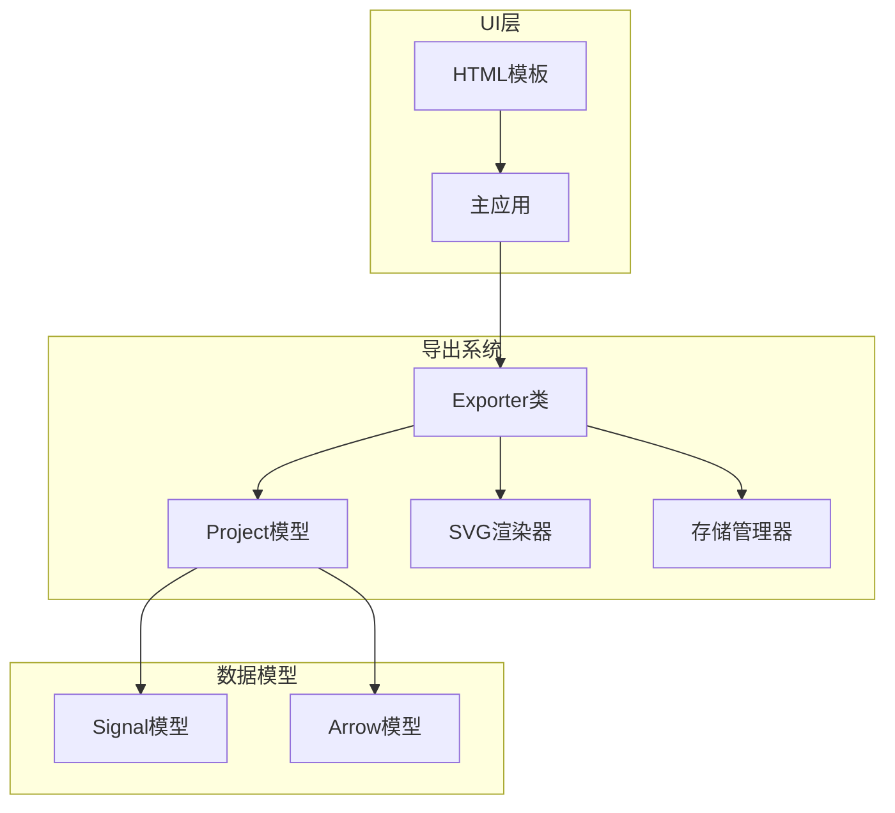
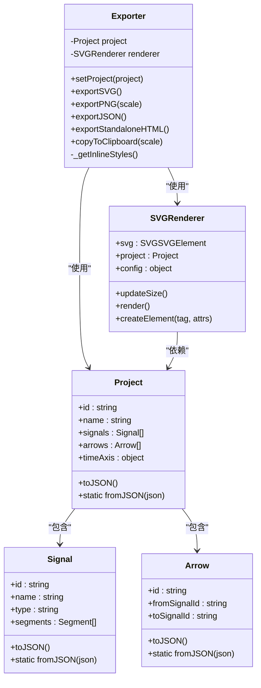
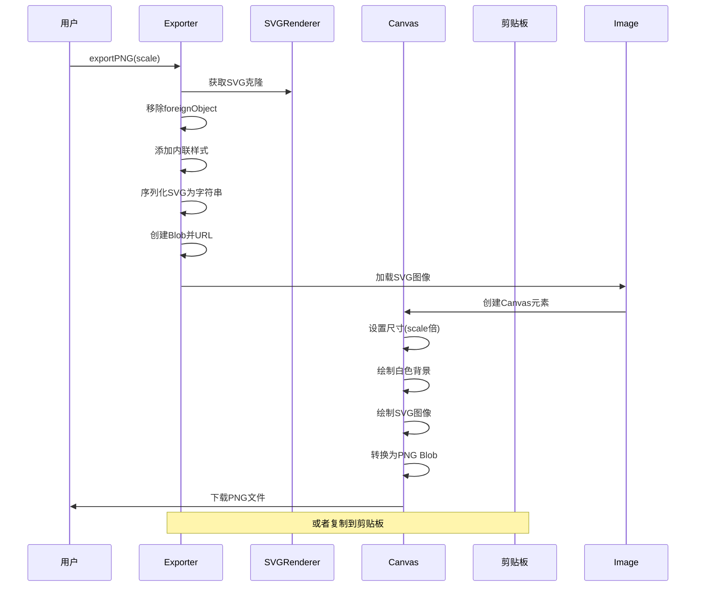
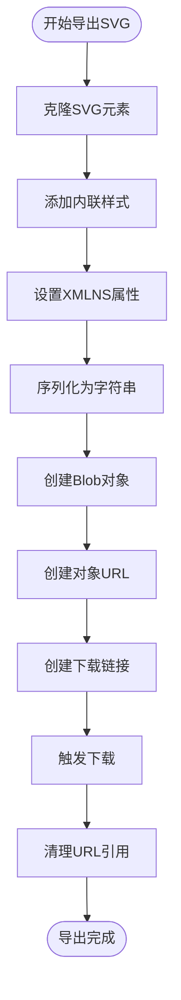
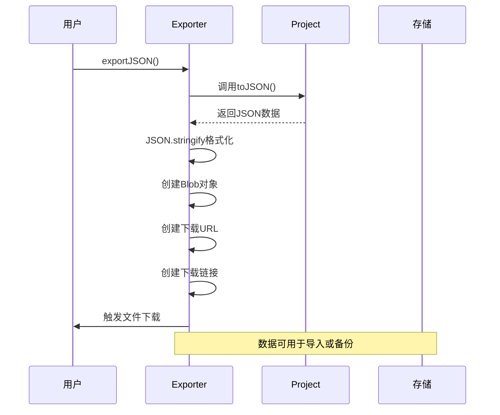
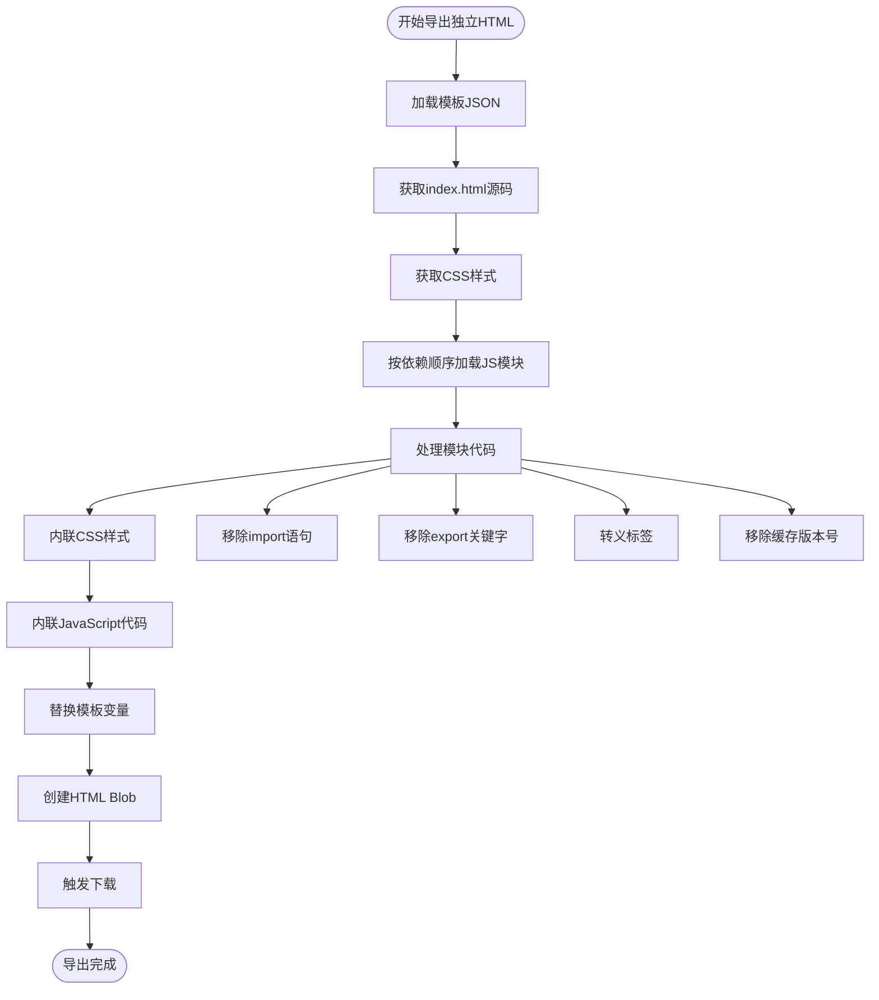
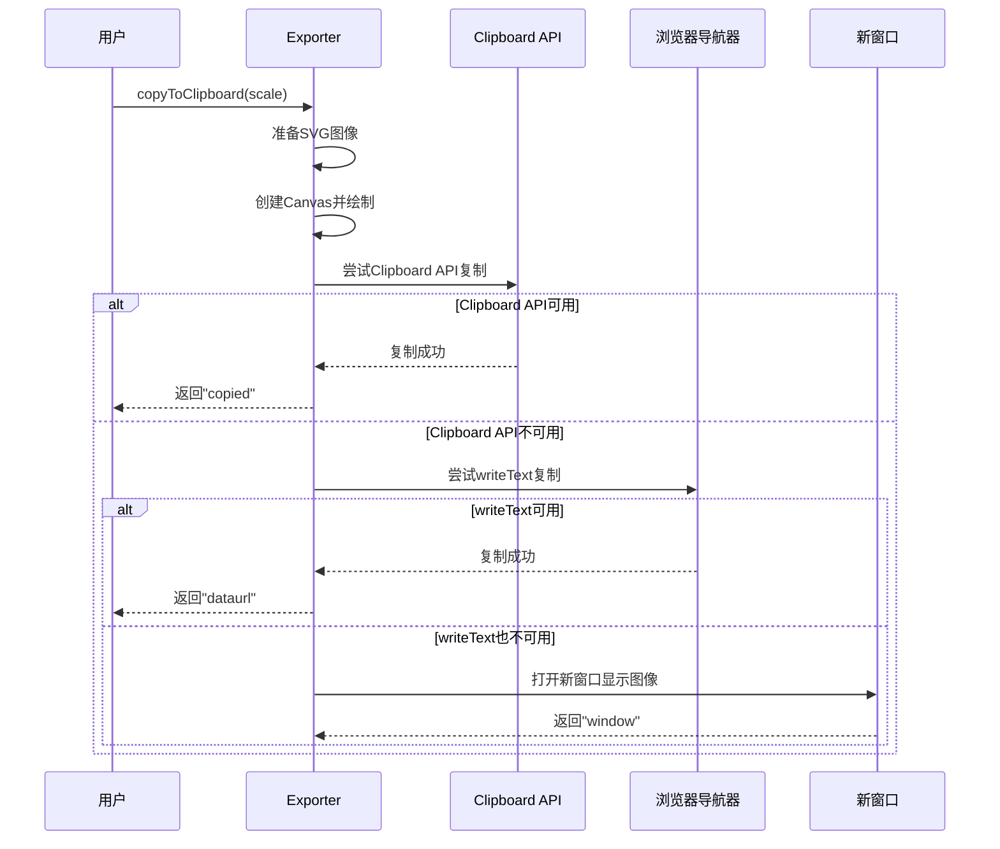
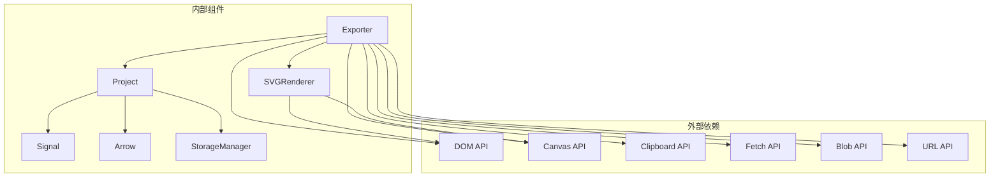

# 导出系统

<cite>
**本文档引用的文件**
- [Exporter.js](file://src/io/Exporter.js)
- [Project.js](file://src/models/Project.js)
- [SVGRenderer.js](file://src/renderers/SVGRenderer.js)
- [main.js](file://src/main.js)
- [StorageManager.js](file://src/io/StorageManager.js)
- [Signal.js](file://src/models/Signal.js)
- [Arrow.js](file://src/models/Arrow.js)
- [SignalRenderer.js](file://src/renderers/SignalRenderer.js)
- [DependencyRenderer.js](file://src/renderers/DependencyRenderer.js)
- [index.html](file://index.html)
- [default-template.json](file://default-template.json)
</cite>

## 目录
1. [简介](#简介)
2. [项目结构](#项目结构)
3. [核心组件](#核心组件)
4. [架构概览](#架构概览)
5. [详细组件分析](#详细组件分析)
6. [依赖分析](#依赖分析)
7. [性能考虑](#性能考虑)
8. [故障排除指南](#故障排除指南)
9. [结论](#结论)
10. [附录](#附录)

## 简介
本文档全面解析波形图编辑器的导出系统，重点阐述Exporter类的设计架构以及各种导出格式的实现原理。系统支持PNG图像导出、SVG矢量导出、JSON数据导出、独立HTML导出以及剪贴板集成等多种导出方式。本文将深入解释SVG到Canvas的转换过程、图像尺寸计算和质量控制机制，详细说明JSON数据导出的序列化流程、版本控制和格式标准化，阐述独立HTML导出的模板生成、资源嵌入和可执行性保证，并提供剪贴板集成功能的实现细节和最佳实践。

## 项目结构
导出系统位于src/io目录下，主要由Exporter类为核心，配合Project模型、SVGRenderer渲染器和StorageManager存储管理器共同构成完整的导出体系。

**图表来源**
- [Exporter.js:1-298](file://src/io/Exporter.js#L1-L298)
- [Project.js:1-245](file://src/models/Project.js#L1-L245)
- [main.js:1-819](file://src/main.js#L1-L819)

**章节来源**
- [Exporter.js:1-298](file://src/io/Exporter.js#L1-L298)
- [main.js:111-112](file://src/main.js#L111-L112)

## 核心组件
导出系统的核心组件包括Exporter类、Project模型、SVGRenderer渲染器和相关的数据模型。

### Exporter类设计
Exporter类采用单一职责原则，专门负责各种格式的导出操作。其构造函数接收Project实例和SVGRenderer实例，确保导出时能够访问完整的项目数据和渲染信息。

### Project模型
Project模型提供完整的项目数据结构，包括信号、箭头、时间轴配置等，并实现了标准的序列化和反序列化方法，为JSON导出提供了基础。

### SVGRenderer渲染器
SVGRenderer负责管理SVG画布和协调各子渲染器，提供尺寸计算、样式设置和渲染控制等功能，是PNG导出的基础。

**章节来源**
- [Exporter.js:1-194](file://src/io/Exporter.js#L1-L194)
- [Project.js:208-244](file://src/models/Project.js#L208-L244)
- [SVGRenderer.js:10-100](file://src/renderers/SVGRenderer.js#L10-L100)

## 架构概览
导出系统采用分层架构设计，各组件职责明确，耦合度低，易于维护和扩展。

**图表来源**
- [Exporter.js:1-298](file://src/io/Exporter.js#L1-L298)
- [Project.js:8-34](file://src/models/Project.js#L8-L34)
- [SVGRenderer.js:10-40](file://src/renderers/SVGRenderer.js#L10-L40)
- [Signal.js:7-343](file://src/models/Signal.js#L7-L343)
- [Arrow.js:5-114](file://src/models/Arrow.js#L5-L114)

## 详细组件分析

### PNG图像导出机制
PNG导出是导出系统中最复杂的功能，涉及SVG到Canvas的转换、图像尺寸计算和质量控制。

#### SVG到Canvas转换流程

**图表来源**
- [Exporter.js:38-82](file://src/io/Exporter.js#L38-L82)
- [SVGRenderer.js:194-243](file://src/renderers/SVGRenderer.js#L194-L243)

#### 图像尺寸计算和质量控制
PNG导出的关键在于精确的尺寸计算和质量控制：

1. **尺寸计算**：从SVG元素的width和height属性获取原始尺寸，乘以scale参数得到最终Canvas尺寸
2. **质量控制**：通过scale参数控制输出分辨率，默认2倍质量，可根据需求调整
3. **背景处理**：使用白色背景填充，确保PNG文件在任何背景下都能正确显示
4. **抗锯齿**：Canvas的drawImage操作自动进行抗锯齿处理

**章节来源**
- [Exporter.js:38-82](file://src/io/Exporter.js#L38-L82)
- [SVGRenderer.js:228-242](file://src/renderers/SVGRenderer.js#L228-L242)

### SVG矢量导出机制
SVG导出相对简单，主要是克隆当前SVG元素并添加必要的样式信息。

#### SVG导出流程

**图表来源**
- [Exporter.js:15-36](file://src/io/Exporter.js#L15-L36)

**章节来源**
- [Exporter.js:15-36](file://src/io/Exporter.js#L15-L36)

### JSON数据导出机制
JSON导出基于Project模型的标准序列化方法，提供完整的项目数据备份和交换能力。

#### JSON导出流程

**图表来源**
- [Exporter.js:84-96](file://src/io/Exporter.js#L84-L96)
- [Project.js:208-221](file://src/models/Project.js#L208-L221)

#### 版本控制和格式标准化
JSON导出遵循以下版本控制和格式标准化原则：
1. **版本控制**：通过Project模型的版本信息确保数据兼容性
2. **格式标准化**：使用标准的JSON格式，提供统一的数据结构
3. **完整性保证**：导出包含所有必要的项目信息，确保完整备份

**章节来源**
- [Exporter.js:84-96](file://src/io/Exporter.js#L84-L96)
- [Project.js:208-221](file://src/models/Project.js#L208-L221)

### 独立HTML导出功能
独立HTML导出是最复杂的功能，需要从源文件构建完整的可执行HTML文件。

#### HTML模板生成流程

**图表来源**
- [Exporter.js:200-297](file://src/io/Exporter.js#L200-L297)

#### 资源嵌入和可执行性保证
独立HTML导出的关键特性：
1. **资源内联**：CSS、JavaScript代码完全内联到HTML文件中
2. **依赖管理**：严格按模块依赖顺序加载和处理代码
3. **兼容性保证**：移除ES6模块语法，转换为浏览器兼容的代码
4. **模板注入**：将项目数据作为全局变量注入到生成的HTML中

**章节来源**
- [Exporter.js:200-297](file://src/io/Exporter.js#L200-L297)

### 剪贴板集成功能
剪贴板集成功能提供多种复制方式，确保在不同环境下都能成功复制图像。

#### 剪贴板复制流程

**图表来源**
- [Exporter.js:98-187](file://src/io/Exporter.js#L98-L187)

#### 复制策略和回退机制
剪贴板集成功能采用三层复制策略：
1. **首选策略**：Clipboard API复制PNG图像数据
2. **次选策略**：复制PNG数据URL到剪贴板
3. **最后手段**：在新窗口中显示图像供用户手动保存

**章节来源**
- [Exporter.js:98-187](file://src/io/Exporter.js#L98-L187)

## 依赖分析
导出系统各组件之间的依赖关系清晰明确，遵循依赖倒置原则。

**图表来源**
- [Exporter.js:1-298](file://src/io/Exporter.js#L1-L298)
- [Project.js:1-245](file://src/models/Project.js#L1-L245)
- [SVGRenderer.js:1-547](file://src/renderers/SVGRenderer.js#L1-L547)

**章节来源**
- [Exporter.js:1-298](file://src/io/Exporter.js#L1-L298)
- [Project.js:1-245](file://src/models/Project.js#L1-L245)
- [SVGRenderer.js:1-547](file://src/renderers/SVGRenderer.js#L1-L547)

## 性能考虑
导出系统在设计时充分考虑了性能优化，特别是在大尺寸图像导出和复杂项目渲染场景下的表现。

### PNG导出性能优化
1. **异步处理**：使用Image.onload回调处理SVG到Canvas的转换，避免阻塞主线程
2. **内存管理**：及时清理Object URLs和临时Canvas元素，防止内存泄漏
3. **质量平衡**：提供scale参数让用户在质量和性能之间权衡
4. **预处理优化**：移除foreignObject元素避免Canvas渲染污染

### HTML导出性能优化
1. **模块依赖优化**：严格按依赖顺序加载模块，避免重复加载
2. **代码压缩**：移除不必要的import/export语句，减少代码体积
3. **缓存版本清理**：移除缓存版本号，确保生成的HTML最小化
4. **脚本标签转义**：防止HTML解析器误判</script>标签

### 内存使用优化
1. **渐进式处理**：逐个模块处理，避免一次性加载大量代码
2. **及时释放**：使用URL.revokeObjectURL及时释放内存
3. **条件加载**：仅在需要时加载CSS和JS文件

## 故障排除指南
导出系统可能遇到的各种问题及解决方案：

### 常见问题及解决方案

#### PNG导出失败
**问题症状**：PNG文件无法生成或显示空白
**可能原因**：
1. SVG渲染未完成就尝试导出
2. foreignObject元素导致Canvas渲染异常
3. 图像加载超时

**解决方案**：
1. 确保在SVG渲染完成后调用导出方法
2. 检查foreignObject元素是否被正确移除
3. 增加适当的超时处理和错误回调

#### 剪贴板复制失败
**问题症状**：图像无法复制到剪贴板
**可能原因**：
1. 浏览器不支持Clipboard API
2. 安全限制阻止剪贴板访问
3. 网络环境限制

**解决方案**：
1. 检查浏览器兼容性
2. 提供回退方案（data URL复制或新窗口显示）
3. 确保页面在HTTPS环境下运行

#### HTML导出失败
**问题症状**：独立HTML文件无法正常运行
**可能原因**：
1. 模块加载失败
2. 依赖顺序错误
3. 代码转换问题

**解决方案**：
1. 检查网络连接和文件访问权限
2. 验证模块依赖关系
3. 确认代码转换过程无错误

**章节来源**
- [Exporter.js:98-187](file://src/io/Exporter.js#L98-L187)
- [Exporter.js:200-297](file://src/io/Exporter.js#L200-L297)

## 结论
导出系统展现了良好的软件工程实践，具有以下特点：

1. **模块化设计**：Exporter类职责单一，与其他组件解耦良好
2. **多格式支持**：涵盖PNG、SVG、JSON、独立HTML等多种导出格式
3. **用户体验**：提供多种复制策略，确保在不同环境下都能成功导出
4. **性能优化**：采用异步处理和内存管理策略，保证系统响应性
5. **错误处理**：完善的错误处理和回退机制，提升系统稳定性

该系统为波形图编辑器提供了完整的数据导出和分享能力，满足了从个人使用到团队协作的各种需求。

## 附录

### 使用示例和最佳实践

#### PNG导出最佳实践
1. **质量选择**：默认scale=2，对于高分辨率需求可适当提高
2. **时机选择**：在SVG渲染完成后调用导出方法
3. **内存管理**：及时清理导出产生的临时资源

#### JSON导出最佳实践
1. **定期备份**：建议定期导出JSON文件作为项目备份
2. **版本记录**：在项目名称中标注导出时间，便于版本管理
3. **安全存储**：JSON文件包含敏感信息，应妥善保管

#### 独立HTML导出最佳实践
1. **测试验证**：导出后在不同浏览器中测试运行效果
2. **文件大小**：注意HTML文件大小，避免过大影响传输
3. **兼容性**：确保生成的HTML在目标环境中可正常运行

### 数据验证和格式检查
导出系统在数据处理过程中实施了多层次的验证和检查机制：

1. **SVG有效性检查**：确保SVG元素具有正确的width和height属性
2. **Canvas尺寸验证**：验证计算出的Canvas尺寸在合理范围内
3. **文件格式验证**：检查导出文件的MIME类型和文件扩展名
4. **兼容性检查**：检测浏览器对各种API的支持情况

这些机制确保了导出结果的质量和可靠性，为用户提供一致的导出体验。