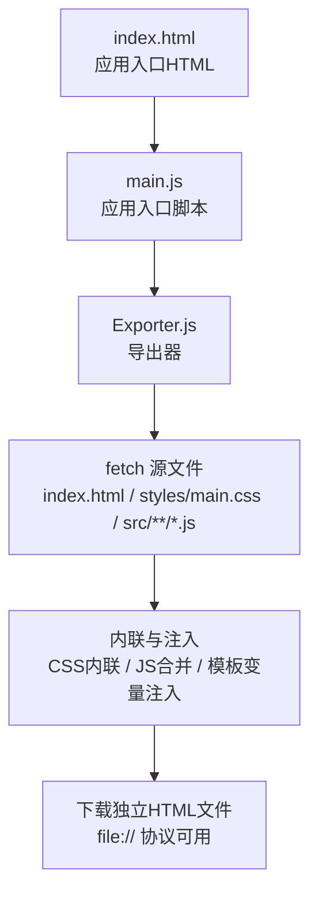
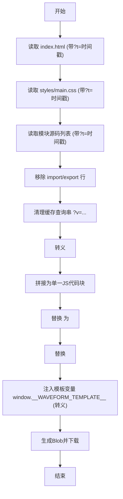
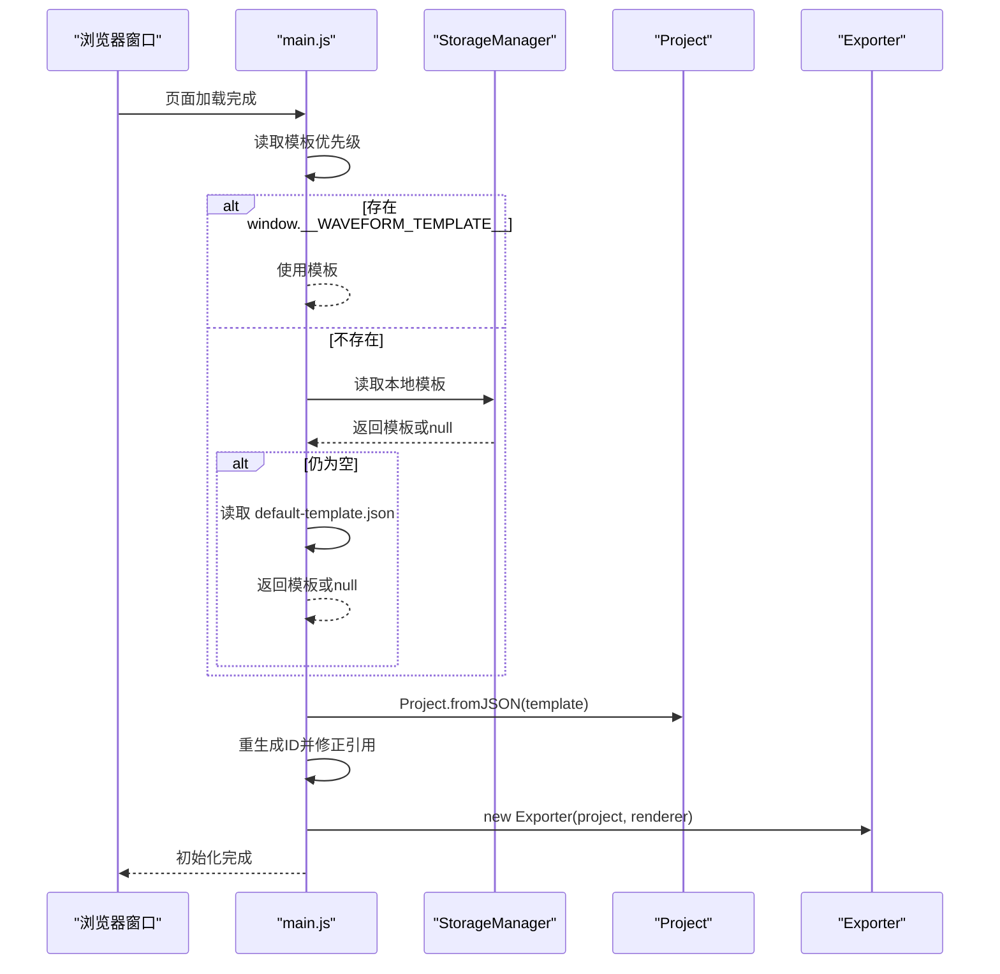
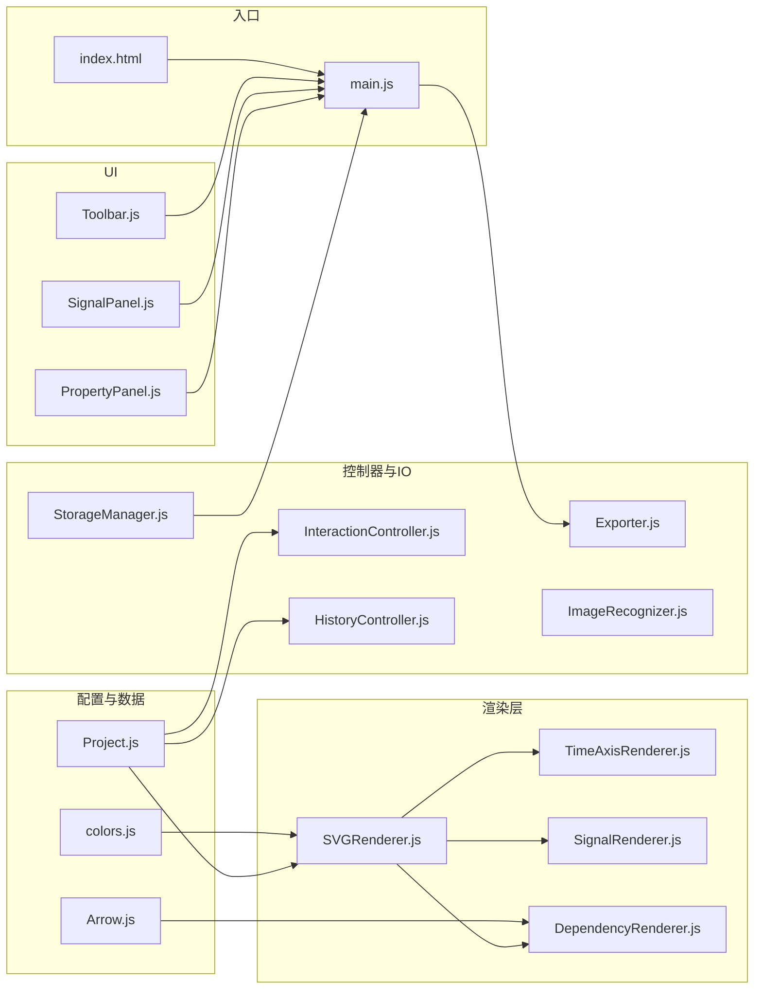

# 独立HTML导出

<cite>
**本文引用的文件**
- [Exporter.js](file://src/io/Exporter.js)
- [main.js](file://src/main.js)
- [index.html](file://index.html)
- [build.py](file://build.py)
- [default-template.json](file://default-template.json)
- [colors.js](file://src/config/colors.js)
- [Project.js](file://src/models/Project.js)
- [StorageManager.js](file://src/io/StorageManager.js)
- [SVGRenderer.js](file://src/renderers/SVGRenderer.js)
- [Toolbar.js](file://src/ui/Toolbar.js)
- [main.css](file://styles/main.css)
- [Arrow.js](file://src/models/Arrow.js)
- [SignalRenderer.js](file://src/renderers/SignalRenderer.js)
- [DependencyRenderer.js](file://src/renderers/DependencyRenderer.js)
</cite>

## 更新摘要
**变更内容**
- 新增详细的箭头曲率诊断日志功能，涵盖导出时、独立版初始化和模板加载三个阶段
- 引入时间戳缓存破坏机制（`?t=` 参数）防止浏览器缓存问题
- 改进HTML模板注入安全性，正确转义 `</script>` 标签
- 增强模块依赖顺序和缓存查询串清理机制

## 目录
1. [简介](#简介)
2. [项目结构](#项目结构)
3. [核心组件](#核心组件)
4. [架构总览](#架构总览)
5. [详细组件分析](#详细组件分析)
6. [依赖关系分析](#依赖关系分析)
7. [性能考量](#性能考量)
8. [故障排查指南](#故障排查指南)
9. [结论](#结论)
10. [附录](#附录)

## 简介
本文件面向"独立HTML导出"能力，系统性梳理从源文件加载、CSS内联、JavaScript模块合并、模板变量注入到最终HTML产物的完整流程。重点解释：
- ES6模块的转换与import语句处理
- JavaScript内联与</script>转义、缓存查询串清理
- CSS内联替换与资源嵌入策略
- 模板变量注入与项目数据传递
- 生成的HTML如何在file://协议下独立运行
- 部署与使用指南、浏览器兼容性与安全注意事项
- 体积优化与性能调优建议
- **新增**：详细的箭头曲率诊断日志系统
- **新增**：时间戳缓存破坏机制
- **新增**：改进的HTML模板注入安全性

## 项目结构
该工程采用前端单页应用结构，核心由入口脚本、渲染器、控制器、UI组件、IO工具与样式组成；独立HTML导出通过导出器模块在浏览器环境中读取源HTML与模块源码，进行内联与注入，最终生成可离线运行的HTML文件。



**图表来源**
- [index.html:1-87](file://index.html#L1-L87)
- [main.js:1-819](file://src/main.js#L1-L819)
- [Exporter.js:1-306](file://src/io/Exporter.js#L1-L306)

**章节来源**
- [index.html:1-87](file://index.html#L1-L87)
- [main.js:1-819](file://src/main.js#L1-L819)
- [Exporter.js:1-306](file://src/io/Exporter.js#L1-L306)

## 核心组件
- 导出器 Exporter：负责独立HTML导出、SVG/PNG导出、JSON导出、剪贴板复制等。独立HTML导出的关键逻辑位于 exportStandaloneHTML 方法。
- 应用入口 main.js：初始化编辑器、加载模板、绑定事件、创建导出器实例，并暴露导出独立HTML的入口。
- 模板与数据 default-template.json：作为初始项目模板，可在导出时注入到生成的HTML中。
- 构建脚本 build.py：提供与导出器一致的内联策略（Python侧），便于离线构建或CI集成。

**章节来源**
- [Exporter.js:1-306](file://src/io/Exporter.js#L1-L306)
- [main.js:1-819](file://src/main.js#L1-L819)
- [build.py:1-103](file://build.py#L1-L103)
- [default-template.json:1-1767](file://default-template.json#L1-L1767)

## 架构总览
独立HTML导出的控制流如下：用户点击"导出独立版"，触发导出器从源HTML加载、读取CSS与JS模块、内联替换、注入模板变量，最后生成并下载独立HTML文件。

```mermaid
sequenceDiagram
participant U as "用户"
participant M as "main.js"
participant E as "Exporter"
participant FS as "fetch 源文件"
participant B as "浏览器Blob/URL"
participant DL as "下载器"
U->>M : 点击"导出独立版"
M->>E : 调用 exportStandaloneHTML()
E->>FS : 读取 index.html (带时间戳缓存破坏)
FS-->>E : HTML文本
E->>FS : 读取 styles/main.css (带时间戳缓存破坏)
FS-->>E : CSS文本
E->>FS : 逐个读取模块源码(src/**/*.js) (带时间戳缓存破坏)
FS-->>E : 模块源码数组
E->>E : 移除import/export、清理缓存查询串、转义</script>
E->>E : 替换<link>为<style>内联CSS
E->>E : 替换<script type=module>为<script>内联JS
E->>E : 注入模板变量 window.__WAVEFORM_TEMPLATE__ (转义</script>)
E->>B : 生成Blob(text/html;charset=utf-8)
B-->>E : 对象URL
E->>DL : 触发下载
DL-->>U : 下载独立HTML文件
```

**图表来源**
- [main.js:596-599](file://src/main.js#L596-L599)
- [Exporter.js:200-305](file://src/io/Exporter.js#L200-L305)

**章节来源**
- [main.js:596-599](file://src/main.js#L596-L599)
- [Exporter.js:200-305](file://src/io/Exporter.js#L200-L305)

## 详细组件分析

### 导出器 Exporter：独立HTML导出全流程
- 源文件加载：通过 fetch 读取 index.html、styles/main.css 与模块源码列表，使用时间戳参数破坏缓存。
- CSS内联：将<link>替换为内联<style>，避免外部依赖。
- JS模块合并与转换：
  - 移除 import 行与 export 关键字，适配浏览器全局脚本环境
  - 清理模块源码中的缓存查询串（如?v=数字）
  - 转义 </script> 防止HTML解析器误判
  - 将模块按固定顺序拼接为单一脚本块
- 模板变量注入：在<head>后注入 window.__WAVEFORM_TEMPLATE__，供应用启动时读取。
- 生成与下载：构造Blob并触发下载，文件名为项目名.html。

**更新** 新增详细的箭头曲率诊断日志，在导出时记录箭头的curvature、curveType、fromSignalId、toSignalId等信息。



**图表来源**
- [Exporter.js:200-305](file://src/io/Exporter.js#L200-L305)

**章节来源**
- [Exporter.js:200-305](file://src/io/Exporter.js#L200-L305)

### 应用入口 main.js：模板加载与初始化
- 模板优先级：window.__WAVEFORM_TEMPLATE__ > localStorage模板 > default-template.json > 内置默认
- 从模板创建项目时，会重新生成信号与箭头ID，修正箭头引用，确保导出HTML可独立运行
- 初始化渲染器、控制器、UI组件与导出器，并设置事件监听

**更新** 新增独立版模式下的箭头曲率诊断日志，记录模板加载前后箭头的curvature和curveType变化。



**图表来源**
- [main.js:56-83](file://src/main.js#L56-L83)
- [StorageManager.js:1-380](file://src/io/StorageManager.js#L1-L380)
- [Project.js:1-245](file://src/models/Project.js#L1-L245)

**章节来源**
- [main.js:56-83](file://src/main.js#L56-L83)
- [StorageManager.js:1-380](file://src/io/StorageManager.js#L1-L380)
- [Project.js:1-245](file://src/models/Project.js#L1-L245)

### 模板与数据：default-template.json
- 提供默认项目结构（信号、箭头、时间轴等），在无模板或模板加载失败时作为后备
- 导出时可直接注入到生成的HTML中，确保首次打开即有内容

**章节来源**
- [default-template.json:1-1767](file://default-template.json#L1-L1767)

### 构建脚本 build.py：与导出器一致的内联策略
- 读取 index.html 并替换CSS与模块脚本占位符
- 读取 styles/main.css 并内联
- 读取模块列表，移除 import/export、清理缓存查询串、转义</script>，拼接为内联JS
- 可选注入模板（JSON文件路径），写入 dist/waveform-editor.html

**章节来源**
- [build.py:1-103](file://build.py#L1-L103)

### 样式与渲染：main.css 与 SVGRenderer
- main.css 提供全局布局与UI样式，导出HTML时被内联到<head>中
- SVGRenderer 负责SVG画布与各子渲染器的协调，确保导出HTML能正确渲染波形图

**章节来源**
- [main.css:1-551](file://styles/main.css#L1-L551)
- [SVGRenderer.js:1-563](file://src/renderers/SVGRenderer.js#L1-L563)

### 箭头曲率诊断系统
**新增功能** 系统性地记录和验证箭头的曲率配置，确保导出前后的一致性。

#### 导出时诊断
- 记录每个箭头的curvature值（默认1.0，范围0.2-3.0）
- 记录curveType（curved弧线或straight直线）
- 记录fromSignalId和toSignalId信号连接关系
- 输出JSON大小和信号/箭头数量统计

#### 独立版初始化诊断
- 模板加载时记录箭头曲率信息
- 从JSON创建项目后再次记录箭头曲率信息
- 验证从JSON转换后的数据完整性

**章节来源**
- [Exporter.js:201-206](file://src/io/Exporter.js#L201-L206)
- [main.js:61-71](file://src/main.js#L61-L71)

## 依赖关系分析
- 模块依赖顺序：导出器在内联JS时严格遵循固定顺序，确保依赖先于使用
- 关键依赖链：
  - colors.js → 所有渲染器与配置使用
  - Project.js → 所有渲染器与控制器读取项目数据
  - SVGRenderer.js → 渲染波形图
  - StorageManager.js → 模板与项目数据持久化
  - Exporter.js → 生成独立HTML



**图表来源**
- [Exporter.js:230-249](file://src/io/Exporter.js#L230-L249)
- [main.js:1-18](file://src/main.js#L1-L18)
- [SVGRenderer.js:1-9](file://src/renderers/SVGRenderer.js#L1-L9)
- [Project.js:1-7](file://src/models/Project.js#L1-L7)
- [StorageManager.js:1-6](file://src/io/StorageManager.js#L1-L6)

**章节来源**
- [Exporter.js:230-249](file://src/io/Exporter.js#L230-L249)
- [main.js:1-18](file://src/main.js#L1-L18)
- [SVGRenderer.js:1-9](file://src/renderers/SVGRenderer.js#L1-L9)
- [Project.js:1-7](file://src/models/Project.js#L1-L7)
- [StorageManager.js:1-6](file://src/io/StorageManager.js#L1-L6)

## 性能考量
- 模块内联体积：
  - 导出器与构建脚本均会清理缓存查询串（?v=数字），减少重复请求与体积
  - 移除 import/export 与注释可降低体积，但需注意可读性与调试成本
- 渲染性能：
  - SVGRenderer 在导出HTML中同样生效，确保渲染一致性
- 下载与内存：
  - 生成Blob与URL对象后及时释放，避免内存泄漏
- 缓存管理：
  - **新增** 使用时间戳参数（?t=）破坏浏览器缓存，确保获取最新源文件
- 建议：
  - 控制模块数量与体积，避免过度内联导致HTML过大
  - 对大模板JSON可考虑压缩或延迟加载（当前导出策略为直接注入）

## 故障排查指南
- 无法加载源文件（HTTP服务器要求）：
  - 导出器通过 fetch 读取 index.html 与 CSS/JS 源码，若直接以 file:// 打开页面，fetch 可能受限
  - 建议通过本地HTTP服务器访问页面后再执行导出
- 模块加载失败：
  - 若某个模块路径不存在，导出会中断并提示失败
  - 检查模块路径是否与导出器中固定顺序一致
- 模板注入问题：
  - 模板变量注入仅替换第一个<head>，避免影响JS代码中的字符串
  - 确认模板JSON格式正确且可被window.__WAVEFORM_TEMPLATE__读取
  - **新增** 确保模板中的</script>标签已被正确转义
- 剪贴板与下载：
  - 复制到剪贴板可能因权限或浏览器限制失败，导出器提供降级方案（data URL或新窗口展示）
- 缓存问题：
  - **新增** 如果遇到旧版本缓存问题，确保使用最新版本的导出器，它会自动添加时间戳参数破坏缓存

**章节来源**
- [Exporter.js:214-218](file://src/io/Exporter.js#L214-L218)
- [Exporter.js:266-270](file://src/io/Exporter.js#L266-L270)
- [Exporter.js:290-295](file://src/io/Exporter.js#L290-L295)

## 结论
独立HTML导出通过"源文件加载→CSS内联→JS模块合并与转换→模板变量注入→生成Blob下载"的闭环，实现了完全离线可用的HTML文件。其关键在于：
- 明确的模块依赖顺序与严格的内联策略
- 对import/export与缓存查询串的统一处理
- 模板变量的精准注入与项目数据的迁移
- 生成的HTML在file://协议下的兼容性保障
- **新增** 详细的箭头曲率诊断系统确保数据完整性
- **新增** 时间戳缓存破坏机制防止浏览器缓存问题
- **新增** 改进的HTML模板注入安全性

## 附录

### 部署与使用指南
- 浏览器兼容性：
  - 需要支持 ES6 模块语法与 fetch API 的现代浏览器
  - file:// 协议下导出器依赖 fetch，建议通过本地HTTP服务器访问页面
- 安全注意事项：
  - 导出HTML包含内联JS与CSS，注意不要在不受信任的环境中随意执行
  - 模板JSON来自用户输入，应确保来源可信
  - **新增** 模板中的</script>标签已被自动转义，但仍建议验证模板来源
- 使用步骤：
  - 在页面中打开项目，点击"导出独立版"
  - 选择保存位置，得到 .html 文件
  - 双击打开即可在浏览器中查看与编辑
- **新增** 缓存处理：
  - 导出器会自动添加时间戳参数破坏缓存
  - 如遇缓存问题，确保使用最新版本的导出器

### 体积优化与性能调优建议
- 减少模块数量与体积：合并相近功能模块，移除冗余依赖
- 清理缓存查询串：导出器与构建脚本均已清理，保持开发时的缓存策略
- 控制模板大小：默认模板较大，可根据需要精简
- 延迟加载策略：对于非关键资源可考虑延迟加载（当前导出策略为直接注入）
- **新增** 箭头曲率优化：
  - 合理设置curvature值（0.2-3.0范围内）
  - 使用straight模式减少复杂曲线的计算开销
  - 避免过多同信号箭头造成视觉重叠

### 箭头曲率诊断使用指南
**新增功能** 通过浏览器控制台查看箭头曲率诊断信息：

1. **导出时诊断**：在导出独立HTML时，控制台会输出类似以下信息：
   ```
   [导出独立版] 箭头[0] id=arrow-1700000000000-curvature=1.0 curveType=curved from=signalA to=signalB
   [导出独立版] 嵌入项目: 5信号, 3箭头, JSON大小=12345字符
   ```

2. **独立版初始化诊断**：在独立HTML文件加载时，会输出：
   ```
   [独立版] 使用嵌入模板数据
   [独立版] 模板箭头[0] id=arrow-1700000000000-curvature=1.0 curveType=curved
   [独立版] 加载后箭头[0] id=arrow-1700000000000-curvature=1.0 curveType=curved
   ```

3. **诊断信息含义**：
   - `curvature`：曲率系数，1.0为默认值
   - `curveType`：曲线类型，curved或straight
   - `fromSignalId/toSignalId`：信号连接关系
   - `JSON大小`：模板数据大小，用于性能监控