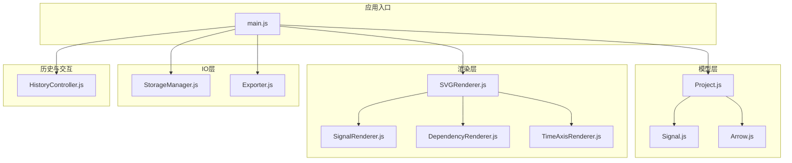
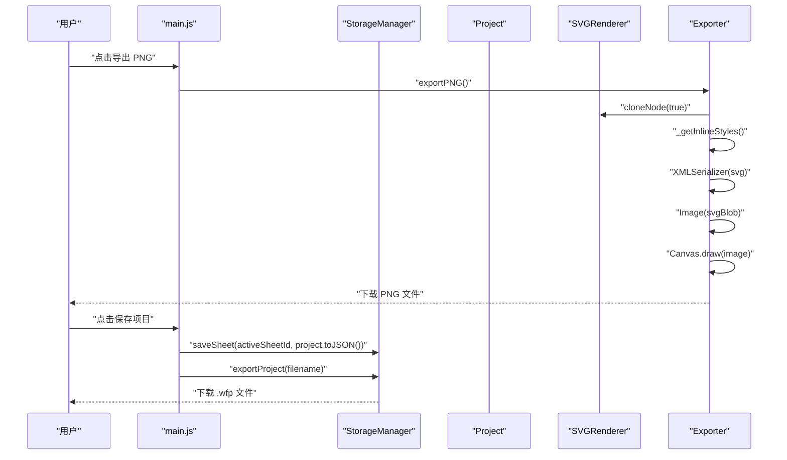
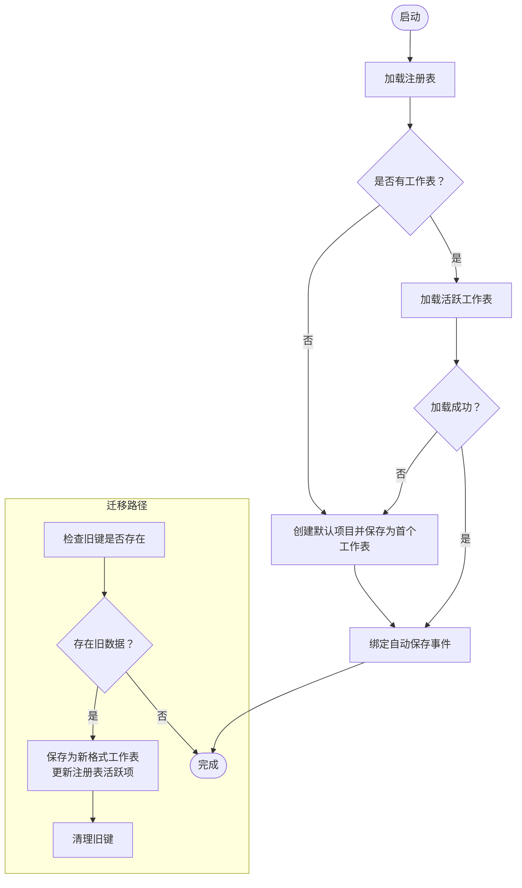
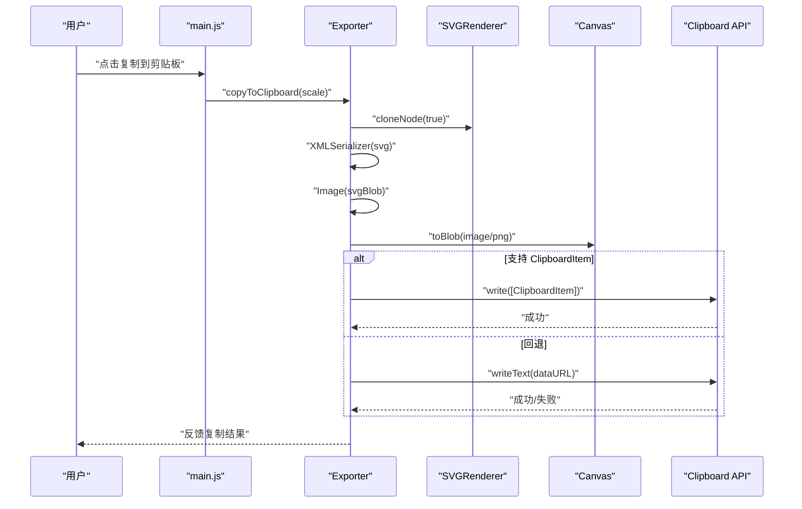
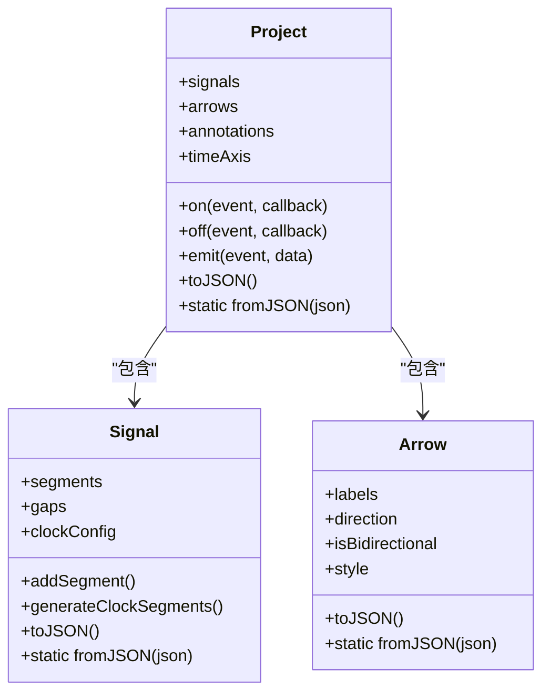
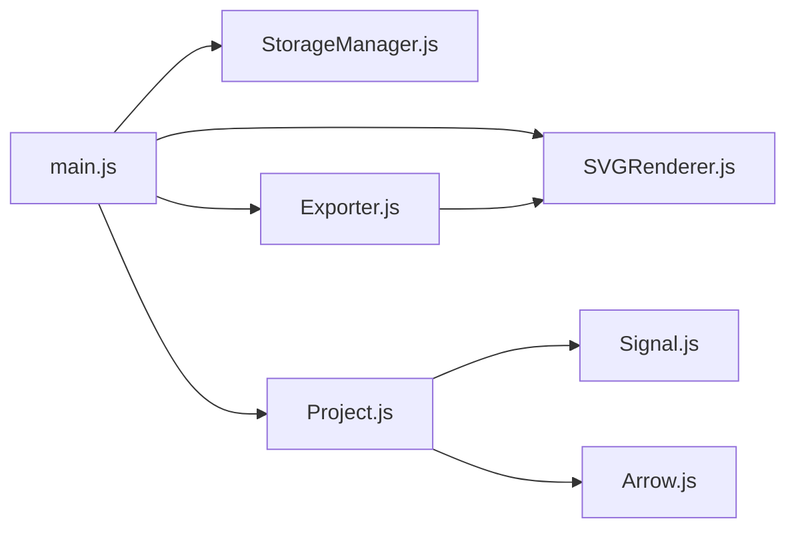

# 输入输出与存储

<cite>
**本文引用的文件列表**
- [StorageManager.js](file://src/io/StorageManager.js)
- [Exporter.js](file://src/io/Exporter.js)
- [Project.js](file://src/models/Project.js)
- [Signal.js](file://src/models/Signal.js)
- [Arrow.js](file://src/models/Arrow.js)
- [SVGRenderer.js](file://src/renderers/SVGRenderer.js)
- [SignalRenderer.js](file://src/renderers/SignalRenderer.js)
- [DependencyRenderer.js](file://src/renderers/DependencyRenderer.js)
- [TimeAxisRenderer.js](file://src/renderers/TimeAxisRenderer.js)
- [HistoryController.js](file://src/controllers/HistoryController.js)
- [main.js](file://src/main.js)
- [default-template.json](file://default-template.json)
</cite>

## 目录
1. [简介](#简介)
2. [项目结构](#项目结构)
3. [核心组件](#核心组件)
4. [架构总览](#架构总览)
5. [详细组件分析](#详细组件分析)
6. [依赖关系分析](#依赖关系分析)
7. [性能考量](#性能考量)
8. [故障排查指南](#故障排查指南)
9. [结论](#结论)
10. [附录](#附录)

## 简介
本文件面向波形图编辑器的输入输出与存储系统，围绕以下目标展开：
- 深入解析 StorageManager 的设计与实现，包括本地存储管理、多工作表支持与数据迁移机制。
- 阐述项目数据的持久化策略、备份恢复能力与版本兼容性处理。
- 详解 Exporter 的导出架构，涵盖 PNG 图像导出、JSON 数据导出、独立 HTML 导出与剪贴板集成。
- 说明文件格式标准、数据压缩与性能优化策略。
- 提供数据导入导出的使用示例与最佳实践，帮助开发者理解数据管理的完整流程。

## 项目结构
本项目采用“模型-渲染器-控制器-IO”的分层组织方式，输入输出与存储主要集中在 IO 层（StorageManager、Exporter），并通过主入口（main.js）与模型（Project、Signal、Arrow）及渲染器（SVGRenderer 等）协同工作。

图表来源
- [main.js:1-132](file://src/main.js#L1-L132)
- [StorageManager.js:1-368](file://src/io/StorageManager.js#L1-L368)
- [Exporter.js:1-298](file://src/io/Exporter.js#L1-L298)
- [Project.js:1-245](file://src/models/Project.js#L1-L245)
- [Signal.js:1-343](file://src/models/Signal.js#L1-L343)
- [Arrow.js:1-114](file://src/models/Arrow.js#L1-L114)
- [SVGRenderer.js:1-547](file://src/renderers/SVGRenderer.js#L1-L547)
- [SignalRenderer.js:1-501](file://src/renderers/SignalRenderer.js#L1-L501)
- [DependencyRenderer.js:1-290](file://src/renderers/DependencyRenderer.js#L1-L290)
- [TimeAxisRenderer.js:1-132](file://src/renderers/TimeAxisRenderer.js#L1-L132)
- [HistoryController.js:1-56](file://src/controllers/HistoryController.js#L1-L56)

章节来源
- [main.js:1-132](file://src/main.js#L1-L132)

## 核心组件
- StorageManager：负责多工作表注册表与数据持久化、模板管理、项目导入导出、旧格式迁移与清理。
- Exporter：负责将当前项目导出为 SVG/PNG/JSON/独立 HTML，并支持复制到剪贴板。
- Project/Signal/Arrow：项目数据模型，提供序列化/反序列化能力，支撑持久化与导出。
- SVGRenderer/SignalRenderer/DependencyRenderer/TimeAxisRenderer：渲染器体系，驱动导出时的 SVG 输出。
- HistoryController：历史栈，配合自动保存与导入导出流程。

章节来源
- [StorageManager.js:1-368](file://src/io/StorageManager.js#L1-L368)
- [Exporter.js:1-298](file://src/io/Exporter.js#L1-L298)
- [Project.js:1-245](file://src/models/Project.js#L1-L245)
- [Signal.js:1-343](file://src/models/Signal.js#L1-L343)
- [Arrow.js:1-114](file://src/models/Arrow.js#L1-L114)
- [SVGRenderer.js:1-547](file://src/renderers/SVGRenderer.js#L1-L547)
- [HistoryController.js:1-56](file://src/controllers/HistoryController.js#L1-L56)

## 架构总览
StorageManager 作为数据中枢，统一管理：
- 注册表：记录工作表清单与当前活跃工作表。
- 工作表数据：以 sheetId 为键，存储项目 JSON。
- 模板：保存当前项目为模板，支持默认模板回退。
- 项目导入导出：支持新版多工作表格式与旧版单项目格式，兼容版本差异。

Exporter 依赖当前 Project 与 SVGRenderer，将渲染树转换为：
- SVG/PNG：基于 SVG DOM 克隆与 Canvas 转换。
- JSON：直接序列化 Project。
- 独立 HTML：内联所有 JS/CSS，注入模板变量，便于离线使用。

图表来源
- [Exporter.js:38-82](file://src/io/Exporter.js#L38-L82)
- [StorageManager.js:172-201](file://src/io/StorageManager.js#L172-L201)
- [main.js:472-516](file://src/main.js#L472-L516)

## 详细组件分析

### StorageManager 设计与实现
- 注册表管理
  - loadRegistry/saveRegistry：维护 sheets 列表与 activeSheetId。
  - listSheets/addSheetToRegistry/removeSheetFromRegistry/renameSheetInRegistry/setActiveSheet：对注册表进行增删改查与活跃项切换。
- 单工作表数据
  - saveSheet/loadSheet/deleteSheetData：以“注册表键前缀 + sheetId”为键进行存储与读取。
- 数据迁移
  - migrateOldData：检测旧版单项目键，若存在则迁移为多工作表格式，设置活跃工作表并清理旧键。
- 项目导入导出
  - exportProject：打包注册表与所有工作表数据为 JSON，文件名默认 .wfp。
  - importProject：读取 .wfp/.json，识别版本并返回兼容结果（新格式或旧格式）。
  - loadImportedProject/loadLegacyProject：将导入的数据写入 localStorage，覆盖旧数据。
- 旧接口兼容
  - 保留旧键 save/load/clear 与 exportToFile/importFromFile，但不再使用，仅用于兼容。
- 模板管理
  - saveTemplate/loadTemplate/clearTemplate：模板保存、加载与清除，支持默认模板回退。

图表来源
- [StorageManager.js:138-164](file://src/io/StorageManager.js#L138-L164)
- [StorageManager.js:172-201](file://src/io/StorageManager.js#L172-L201)
- [main.js:49-85](file://src/main.js#L49-L85)

章节来源
- [StorageManager.js:1-368](file://src/io/StorageManager.js#L1-L368)
- [main.js:49-85](file://src/main.js#L49-L85)

### Exporter 导出架构
- SVG/PNG 导出
  - exportSVG：克隆 SVG DOM，注入内联样式，序列化为 SVG 字符串并下载。
  - exportPNG：克隆 SVG，注入内联样式，序列化为 SVG Blob，转 Image，再绘制到 Canvas，最终 toBlob 下载 PNG。
- JSON 导出
  - exportJSON：调用 Project.toJSON()，序列化为 JSON 并下载。
- 剪贴板集成
  - copyToClipboard：与 PNG 导出相同流程，但通过 Clipboard API 或 data URL 文本形式写入剪贴板；失败时打开新窗口展示图像。
- 独立 HTML 导出
  - exportStandaloneHTML：拉取 index.html 与 styles/main.css，按依赖顺序内联所有 JS 模块源码（移除 import/export、转义脚本标签、去除缓存版本号），注入模板变量，生成可离线运行的 HTML 并下载。

图表来源
- [Exporter.js:98-187](file://src/io/Exporter.js#L98-L187)
- [main.js:480-505](file://src/main.js#L480-L505)

章节来源
- [Exporter.js:1-298](file://src/io/Exporter.js#L1-L298)
- [SVGRenderer.js:1-547](file://src/renderers/SVGRenderer.js#L1-L547)

### 项目数据模型与持久化
- Project
  - 提供 addSignal/removeSignal/moveSignal 等变更方法，内部通过事件派发通知订阅者。
  - toJSON/fromJSON：序列化/反序列化项目，包含信号、箭头、注释、时间轴等。
- Signal
  - 支持分段波形、时钟生成、跳变沿吸附、分隔符 gap、X/Z 态渲染等。
  - toJSON/fromJSON：序列化/反序列化信号及其段。
- Arrow
  - 支持标签集合、方向与双向箭头、样式配置等。
  - toJSON/fromJSON：序列化/反序列化箭头。

图表来源
- [Project.js:1-245](file://src/models/Project.js#L1-L245)
- [Signal.js:1-343](file://src/models/Signal.js#L1-L343)
- [Arrow.js:1-114](file://src/models/Arrow.js#L1-L114)

章节来源
- [Project.js:1-245](file://src/models/Project.js#L1-L245)
- [Signal.js:1-343](file://src/models/Signal.js#L1-L343)
- [Arrow.js:1-114](file://src/models/Arrow.js#L1-L114)

### 渲染器与导出一致性
- SVGRenderer 负责整体布局、尺寸计算、分组与裁剪区域，确保导出 SVG/PNG 与屏幕渲染一致。
- SignalRenderer/DependencyRenderer/TimeAxisRenderer 分别负责波形、依赖箭头与时间轴的绘制细节。
- 导出时，Exporter 通过克隆 SVG DOM 并注入内联样式，避免外部资源缺失导致的样式丢失。

章节来源
- [SVGRenderer.js:1-547](file://src/renderers/SVGRenderer.js#L1-L547)
- [SignalRenderer.js:1-501](file://src/renderers/SignalRenderer.js#L1-L501)
- [DependencyRenderer.js:1-290](file://src/renderers/DependencyRenderer.js#L1-L290)
- [TimeAxisRenderer.js:1-132](file://src/renderers/TimeAxisRenderer.js#L1-L132)
- [Exporter.js:15-36](file://src/io/Exporter.js#L15-L36)

## 依赖关系分析
- StorageManager 与 main.js：main.js 在初始化阶段调用 StorageManager 进行迁移、加载注册表、创建默认工作表、绑定自动保存与事件监听。
- Exporter 与 main.js：main.js 将 Exporter 实例注入 UI 事件处理，触发导出与复制。
- Project/Signal/Arrow 与 StorageManager/Exporter：二者通过 toJSON/fromJSON 实现数据持久化与导出。
- SVGRenderer 与 Exporter：Exporter 依赖 SVGRenderer 的 SVG DOM 结构进行导出。

图表来源
- [main.js:1-132](file://src/main.js#L1-L132)
- [StorageManager.js:1-368](file://src/io/StorageManager.js#L1-L368)
- [Exporter.js:1-298](file://src/io/Exporter.js#L1-L298)
- [Project.js:1-245](file://src/models/Project.js#L1-L245)
- [Signal.js:1-343](file://src/models/Signal.js#L1-L343)
- [Arrow.js:1-114](file://src/models/Arrow.js#L1-L114)
- [SVGRenderer.js:1-547](file://src/renderers/SVGRenderer.js#L1-L547)

章节来源
- [main.js:1-132](file://src/main.js#L1-L132)

## 性能考量
- 导出 PNG 的性能瓶颈在于 SVG 到 Canvas 的绘制与 toBlob，建议：
  - 控制 scale 参数，避免过大分辨率。
  - 在批量导出时合并多次导出请求，减少重复克隆与渲染。
- 导出独立 HTML 时，内联所有 JS/CSS 会增大文件体积，建议：
  - 仅在需要离线运行时使用独立 HTML 导出。
  - 对于常规分享，优先使用 PNG/JSON。
- localStorage 存储限制与碎片化：
  - 多工作表模式下，建议定期清理不再使用的 sheet 数据。
  - 导入项目时先清理旧数据，避免累积膨胀。
- 渲染一致性：
  - 导出前确保渲染器已完成尺寸更新与裁剪区域设置，避免导出内容与屏幕不一致。

[本节为通用性能建议，不直接分析具体文件]

## 故障排查指南
- 无法加载工作表或出现空白项目
  - 检查注册表是否为空，确认是否触发了默认项目创建逻辑。
  - 若存在旧键数据，确认 migrateOldData 是否成功执行。
- 导出 PNG 失败或空白
  - 确认 SVG DOM 已注入内联样式，foreignObject 已移除。
  - 检查 Image 加载是否成功，Canvas 绘制是否完成。
- 剪贴板复制失败
  - 浏览器环境需支持 Clipboard API；若不支持，回退到 data URL 文本写入；仍失败则提示打开新窗口。
- 导入项目报错
  - 确认文件格式为 .wfp 或 .json，且符合版本规范；旧版单项目格式会被识别并单独处理。
- 模板加载异常
  - 检查模板键是否存在，必要时清除模板并重新保存。

章节来源
- [StorageManager.js:138-164](file://src/io/StorageManager.js#L138-L164)
- [Exporter.js:98-187](file://src/io/Exporter.js#L98-L187)
- [main.js:697-742](file://src/main.js#L697-L742)

## 结论
本系统通过 StorageManager 实现了多工作表的本地持久化与版本兼容迁移，结合 Exporter 的多样化导出能力，满足从屏幕渲染到离线分享的全链路需求。配合 Project/Signal/Arrow 的清晰数据模型与 SVGRenderer 的一致性渲染，开发者可以稳定地实现数据的导入、导出、备份与恢复。

[本节为总结性内容，不直接分析具体文件]

## 附录

### 文件格式标准与版本兼容
- 项目文件（.wfp）
  - 版本字段：version=2。
  - 结构：registry（sheets、activeSheetId）、sheets（sheetId -> 项目 JSON）。
  - 旧版单项目格式：无 version 字段，直接包含 signals/annotations/arrows/timeAxis 等。
- 模板文件（default-template.json）
  - 作为默认模板，可在无模板时回退使用；也可通过 UI 保存当前项目为模板。

章节来源
- [StorageManager.js:172-236](file://src/io/StorageManager.js#L172-L236)
- [default-template.json:1-800](file://default-template.json#L1-L800)

### 数据导入导出使用示例与最佳实践
- 导入项目
  - 通过 UI 触发 openProjectFile，选择 .wfp 或 .json 文件，内部调用 StorageManager.importProject 并根据结果写入 localStorage。
  - 建议：导入前保存当前工作表，导入后刷新标签页与渲染。
- 导出项目
  - 通过 UI 触发保存项目，内部调用 StorageManager.exportProject 下载 .wfp 文件。
  - 建议：导出前确保项目已自动保存，避免遗漏变更。
- 导出 PNG/JSON/独立 HTML
  - 通过 UI 触发对应按钮，内部调用 Exporter 对应方法。
  - 建议：PNG 导出时合理设置 scale；独立 HTML 适合离线演示场景。

章节来源
- [main.js:472-560](file://src/main.js#L472-L560)
- [StorageManager.js:172-236](file://src/io/StorageManager.js#L172-L236)
- [Exporter.js:15-298](file://src/io/Exporter.js#L15-L298)