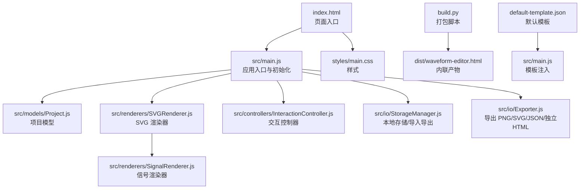
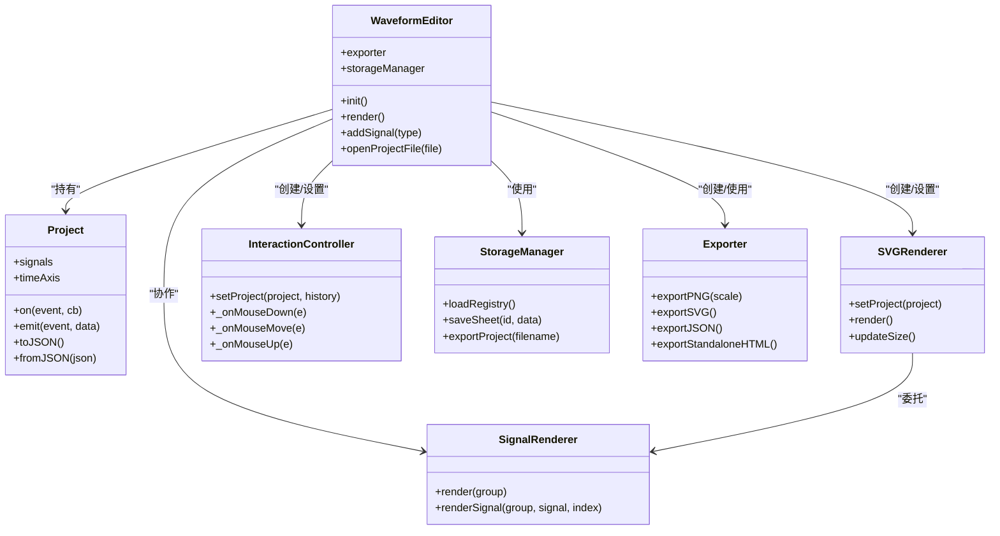
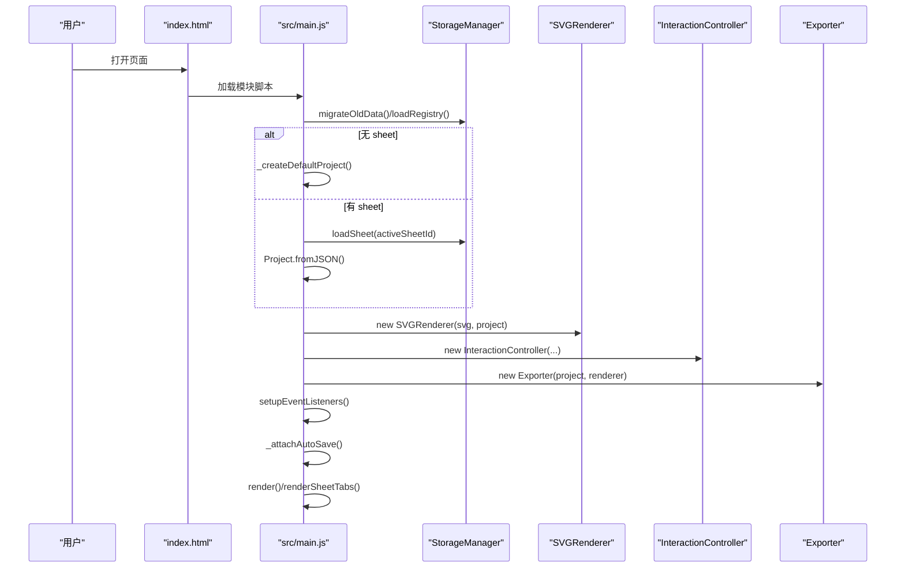
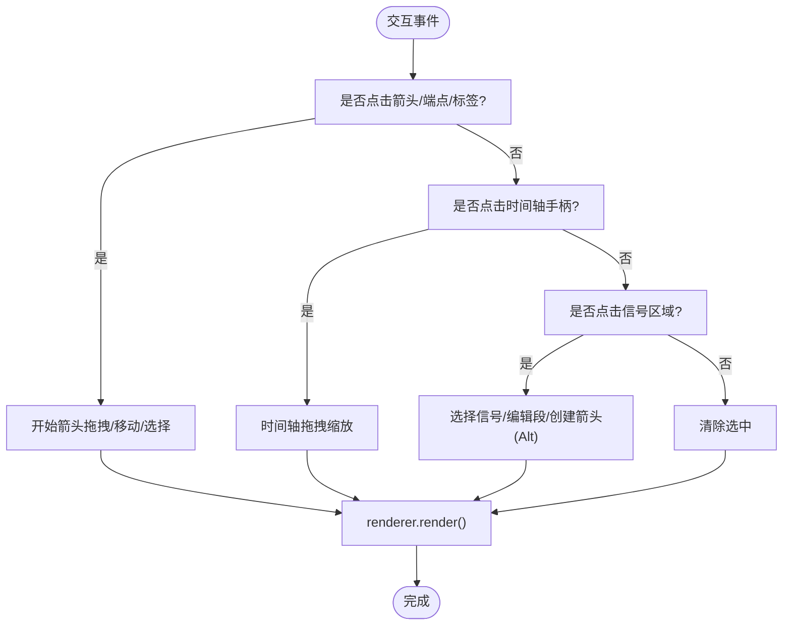
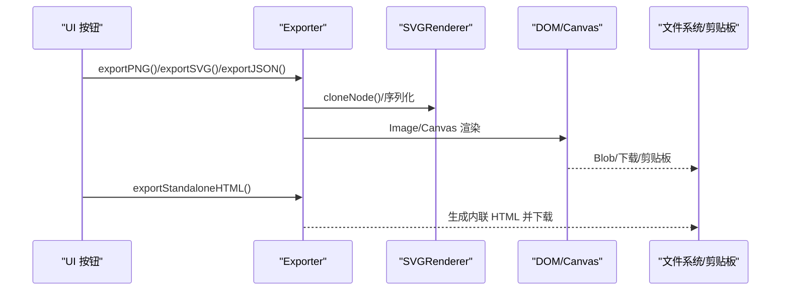
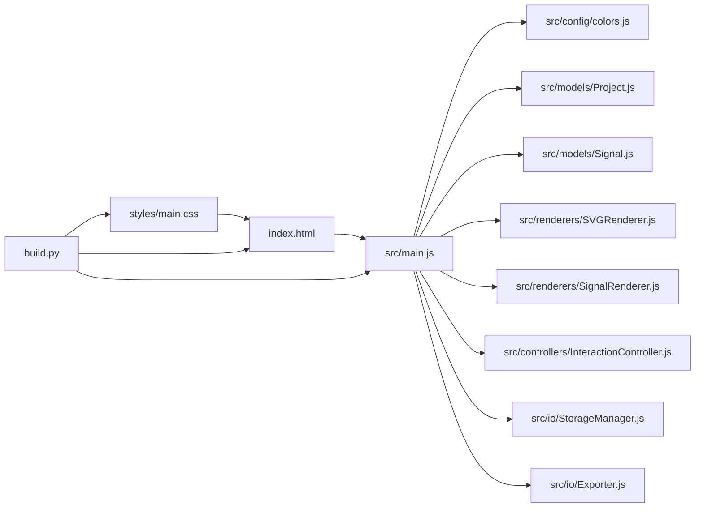

# 部署与维护

<cite>
**本文引用的文件**
- [index.html](file://index.html)
- [build.py](file://build.py)
- [default-template.json](file://default-template.json)
- [src/main.js](file://src/main.js)
- [src/config/colors.js](file://src/config/colors.js)
- [src/models/Project.js](file://src/models/Project.js)
- [src/models/Signal.js](file://src/models/Signal.js)
- [src/renderers/SVGRenderer.js](file://src/renderers/SVGRenderer.js)
- [src/renderers/SignalRenderer.js](file://src/renderers/SignalRenderer.js)
- [src/controllers/InteractionController.js](file://src/controllers/InteractionController.js)
- [src/io/StorageManager.js](file://src/io/StorageManager.js)
- [src/io/Exporter.js](file://src/io/Exporter.js)
- [styles/main.css](file://styles/main.css)
- [debug.html](file://debug.html)
- [tests/test-runner.html](file://tests/test-runner.html)
</cite>

## 目录
1. [简介](#简介)
2. [项目结构](#项目结构)
3. [核心组件](#核心组件)
4. [架构总览](#架构总览)
5. [详细组件分析](#详细组件分析)
6. [依赖关系分析](#依赖关系分析)
7. [性能考量](#性能考量)
8. [故障排除指南](#故障排除指南)
9. [结论](#结论)
10. [附录](#附录)

## 简介
本指南面向生产环境部署与长期维护，围绕波形图编辑器的静态资源打包、模板注入、本地存储与导出能力、渲染架构与交互控制等方面，提供部署要求、配置步骤、版本与发布流程、性能优化、故障排除与安全建议，以及维护与升级策略。

## 项目结构
- 前端采用纯静态 HTML/CSS/JS，无构建工具链依赖，通过模块脚本按需加载。
- 提供打包脚本将所有 JS/CSS 内联到单一 HTML 文件，便于离线部署与分发。
- 默认模板支持注入，便于快速生成初始项目。
- 核心逻辑集中在 src 目录，按职责划分为模型、渲染器、控制器、IO 与 UI 组件。

图表来源
- [index.html:1-87](file://index.html#L1-L87)
- [src/main.js:1-132](file://src/main.js#L1-L132)
- [src/renderers/SVGRenderer.js:1-100](file://src/renderers/SVGRenderer.js#L1-L100)
- [src/renderers/SignalRenderer.js:1-60](file://src/renderers/SignalRenderer.js#L1-L60)
- [src/controllers/InteractionController.js:1-82](file://src/controllers/InteractionController.js#L1-L82)
- [src/io/StorageManager.js:1-60](file://src/io/StorageManager.js#L1-L60)
- [src/io/Exporter.js:1-60](file://src/io/Exporter.js#L1-L60)
- [styles/main.css:1-60](file://styles/main.css#L1-L60)
- [build.py:1-103](file://build.py#L1-L103)
- [default-template.json:1-40](file://default-template.json#L1-L40)

章节来源
- [index.html:1-87](file://index.html#L1-L87)
- [build.py:1-103](file://build.py#L1-L103)

## 核心组件
- 应用入口与初始化：负责加载模板、迁移旧数据、初始化渲染器与控制器、绑定事件、自动保存与渲染。
- 模型层：Project/Signal/Segment 等数据模型，提供序列化/反序列化与事件机制。
- 渲染层：SVGRenderer 负责 SVG 画布与层级组织；SignalRenderer 负责信号波形绘制与分隔符遮罩。
- 控制层：InteractionController 负责鼠标键盘交互、时间轴缩放、箭头创建与拖拽、信号选择与属性面板联动。
- IO 层：StorageManager 负责多 sheet 注册表与数据持久化；Exporter 负责 PNG/SVG/JSON/独立 HTML 导出与剪贴板复制。
- 样式层：styles/main.css 提供响应式布局、面板与交互样式。

章节来源
- [src/main.js:1-132](file://src/main.js#L1-L132)
- [src/models/Project.js:1-120](file://src/models/Project.js#L1-L120)
- [src/models/Signal.js:1-120](file://src/models/Signal.js#L1-L120)
- [src/renderers/SVGRenderer.js:1-100](file://src/renderers/SVGRenderer.js#L1-L100)
- [src/renderers/SignalRenderer.js:1-120](file://src/renderers/SignalRenderer.js#L1-L120)
- [src/controllers/InteractionController.js:1-120](file://src/controllers/InteractionController.js#L1-L120)
- [src/io/StorageManager.js:1-120](file://src/io/StorageManager.js#L1-L120)
- [src/io/Exporter.js:1-120](file://src/io/Exporter.js#L1-L120)
- [styles/main.css:1-120](file://styles/main.css#L1-L120)

## 架构总览
应用采用“模型-渲染-控制-IO”的分层架构，通过事件驱动实现解耦。初始化阶段加载模板与历史数据，随后建立渲染器与控制器，绑定 UI 事件，进入交互循环。导出与存储均通过 IO 层完成。

图表来源
- [src/main.js:1-132](file://src/main.js#L1-L132)
- [src/models/Project.js:1-200](file://src/models/Project.js#L1-L200)
- [src/renderers/SVGRenderer.js:1-120](file://src/renderers/SVGRenderer.js#L1-L120)
- [src/renderers/SignalRenderer.js:1-120](file://src/renderers/SignalRenderer.js#L1-L120)
- [src/controllers/InteractionController.js:1-120](file://src/controllers/InteractionController.js#L1-L120)
- [src/io/StorageManager.js:1-200](file://src/io/StorageManager.js#L1-L200)
- [src/io/Exporter.js:1-120](file://src/io/Exporter.js#L1-L120)

## 详细组件分析

### 应用入口与初始化流程
- 加载模板：优先使用注入模板，其次读取本地模板，再尝试远端 default-template.json。
- 迁移旧数据：检测旧格式并迁移至多 sheet 注册表。
- 初始化渲染器与控制器：创建 SVGRenderer、SignalRenderer、TimeAxisRenderer、DependencyRenderer、HistoryController、InteractionController。
- 自动保存：监听项目 change 事件，写入当前 sheet。
- 渲染与标签页：渲染波形、信号面板、属性面板与 sheet 标签。

图表来源
- [src/main.js:49-132](file://src/main.js#L49-L132)
- [src/io/StorageManager.js:138-164](file://src/io/StorageManager.js#L138-L164)
- [src/renderers/SVGRenderer.js:15-54](file://src/renderers/SVGRenderer.js#L15-L54)
- [src/controllers/InteractionController.js:6-27](file://src/controllers/InteractionController.js#L6-L27)
- [src/io/Exporter.js:1-14](file://src/io/Exporter.js#L1-L14)

章节来源
- [src/main.js:49-132](file://src/main.js#L49-L132)
- [src/io/StorageManager.js:138-164](file://src/io/StorageManager.js#L138-L164)

### 渲染与交互处理
- SVGRenderer 负责 SVG 画布初始化、层级分组、网格与依赖箭头标记定义，并计算尺寸。
- SignalRenderer 负责信号名称、波形线段、分隔符遮罩与命中区域。
- InteractionController 负责时间轴缩放、信号选择、箭头创建与拖拽、分隔符拖拽、键盘快捷键与外部点击清除选中。

图表来源
- [src/renderers/SVGRenderer.js:194-220](file://src/renderers/SVGRenderer.js#L194-L220)
- [src/renderers/SignalRenderer.js:39-144](file://src/renderers/SignalRenderer.js#L39-L144)
- [src/controllers/InteractionController.js:84-200](file://src/controllers/InteractionController.js#L84-L200)

章节来源
- [src/renderers/SVGRenderer.js:194-220](file://src/renderers/SVGRenderer.js#L194-L220)
- [src/renderers/SignalRenderer.js:39-144](file://src/renderers/SignalRenderer.js#L39-L144)
- [src/controllers/InteractionController.js:84-200](file://src/controllers/InteractionController.js#L84-L200)

### 导出与存储
- 导出：PNG（基于 SVG 渲染到 Canvas）、SVG、JSON、独立 HTML（内联所有资源）。
- 存储：localStorage 多 sheet 注册表与数据，支持导入导出 .wfp 包。
- 模板：default-template.json 作为默认模板，也可通过注入模板参数使用。

图表来源
- [src/io/Exporter.js:15-120](file://src/io/Exporter.js#L15-L120)
- [src/renderers/SVGRenderer.js:59-100](file://src/renderers/SVGRenderer.js#L59-L100)

章节来源
- [src/io/Exporter.js:15-120](file://src/io/Exporter.js#L15-L120)
- [src/io/StorageManager.js:166-200](file://src/io/StorageManager.js#L166-L200)

## 依赖关系分析
- 模块导入：入口文件集中导入各子模块，便于打包脚本统一处理。
- 运行时依赖：浏览器原生 API（fetch、localStorage、Blob、XMLSerializer、Canvas、Clipboard API 等）。
- 打包依赖：Python 脚本读取 HTML/CSS/JS，剥离 import/export，内联到 HTML。

图表来源
- [src/main.js:4-16](file://src/main.js#L4-L16)
- [index.html:7-85](file://index.html#L7-L85)
- [build.py:12-30](file://build.py#L12-L30)

章节来源
- [src/main.js:4-16](file://src/main.js#L4-L16)
- [build.py:12-30](file://build.py#L12-L30)

## 性能考量
- 渲染性能
  - 事件节流：窗口 resize 使用定时器去抖，避免频繁重绘。
  - 选择性重绘：渲染器与控制器仅在必要时更新，减少 DOM 操作。
  - Canvas 导出：PNG 导出先克隆 SVG，移除 foreignObject，再绘制到 Canvas，避免复杂文本导致的渲染开销。
- 内存优化
  - 事件解绑：切换 sheet 或销毁实例时，清理事件监听与定时器。
  - 临时对象复用：导出时使用临时 Image/Canvas/Blob，及时 revokeObjectURL。
  - 模板注入：仅在首次加载时注入，避免重复解析。
- 用户体验
  - 自动保存：监听 change 事件，异步保存，避免阻塞主线程。
  - 剪贴板复制：优先 Clipboard API，降级到 data URL，失败时提示或打开新窗口。
  - 响应式布局：面板宽度与时间轴自适应，提升小屏可用性。

章节来源
- [src/main.js:588-596](file://src/main.js#L588-L596)
- [src/io/Exporter.js:98-187](file://src/io/Exporter.js#L98-L187)
- [src/renderers/SVGRenderer.js:194-220](file://src/renderers/SVGRenderer.js#L194-L220)

## 故障排除指南
- 页面无法加载或空白
  - 检查 index.html 中模块脚本与样式链接是否正确。
  - 确认 default-template.json 可访问且格式正确。
- 无法保存/加载项目
  - 检查浏览器 localStorage 权限与容量。
  - 若迁移失败，清理注册表与 sheet 数据后重试。
- 导出失败
  - PNG 导出：确认 Canvas 支持与图片加载成功；若 Clipboard API 失败，尝试 data URL 或新窗口方式。
  - SVG 导出：确认序列化结果有效，foreignObject 已移除。
- 模板未生效
  - 确认模板注入逻辑与 window.__WAVEFORM_TEMPLATE__ 设置顺序。
- 性能问题
  - 大量信号/长时域：适当降低缩放比例或分页渲染；避免频繁 resize。
  - 交互卡顿：检查是否有过多事件监听或未清理的定时器。

章节来源
- [index.html:7-85](file://index.html#L7-L85)
- [src/main.js:146-153](file://src/main.js#L146-L153)
- [src/io/StorageManager.js:138-164](file://src/io/StorageManager.js#L138-L164)
- [src/io/Exporter.js:98-187](file://src/io/Exporter.js#L98-L187)

## 结论
本项目以静态资源为核心，通过内联打包与模板注入实现快速部署与灵活定制。生产部署建议采用打包产物，结合本地存储与导出能力，满足离线使用与团队协作场景。维护方面，建议完善版本与变更记录、自动化测试与回归验证，持续优化渲染与交互性能。

## 附录

### 生产部署与配置
- 服务器设置
  - 静态站点托管：Nginx/Apache/CDN 均可，推荐开启 gzip/HTTP/2。
  - 缓存策略：静态资源可长缓存，HTML 与模板按需短缓存或禁用缓存。
- 静态资源部署
  - 使用打包脚本生成 dist/waveform-editor.html，包含内联 CSS/JS。
  - 如需外链资源，保留 index.html 中的 ?v= 查询串以便缓存失效。
- 域名配置
  - 无跨域需求；如需从服务器加载模板，确保 CORS 配置允许跨域读取 default-template.json。
- 模板注入
  - 通过 build.py 注入模板 JSON；或在运行时设置 window.__WAVEFORM_TEMPLATE__。

章节来源
- [build.py:83-94](file://build.py#L83-L94)
- [index.html:7-85](file://index.html#L7-L85)
- [default-template.json:1-40](file://default-template.json#L1-L40)

### 版本管理与发布流程
- 版本号规则
  - 语义化版本：主版本.次版本.修订号；重大破坏性变更提升主版本。
- 变更日志
  - 记录新增/修复/优化项，区分前端渲染、交互、导出、存储与打包脚本。
- 发布流程
  - 开发分支 -> 预发布分支 -> master；每次发布打 tag 并生成 dist/waveform-editor.html。
- 回滚策略
  - 保留上一版本 dist/waveform-editor.html；回滚时替换当前文件；如涉及模板变更，同步回滚 default-template.json。

章节来源
- [build.py:96-103](file://build.py#L96-L103)

### 安全考虑与防护
- CORS 配置
  - 若从服务器加载 default-template.json，确保 Access-Control-Allow-Origin 仅允许可信域名。
- 文件上传安全
  - 本地导入 .wfp/.json 仅在浏览器内处理，不上传至服务器；建议对文件大小与类型进行校验。
- 数据保护
  - 项目数据存储于 localStorage；建议在企业环境中限制本地存储权限或提供加密导出选项。

章节来源
- [src/io/StorageManager.js:166-200](file://src/io/StorageManager.js#L166-L200)
- [src/main.js:146-153](file://src/main.js#L146-L153)

### 维护计划与升级指南
- 维护计划
  - 定期运行单元测试与集成测试，确保渲染与交互稳定性。
  - 监控导出与剪贴板复制成功率，收集用户反馈。
- 升级指南
  - 引入新特性时，优先在开发分支验证；升级渲染器/控制器时，关注事件与 DOM 结构变更。
  - 打包脚本升级需同步更新模块清单与注入逻辑。

章节来源
- [tests/test-runner.html:1-60](file://tests/test-runner.html#L1-L60)
- [debug.html:1-40](file://debug.html#L1-L40)
- [build.py:12-30](file://build.py#L12-L30)