# 配置管理系统

<cite>
**本文档引用的文件**
- [colors.js](file://src/config/colors.js)
- [main.js](file://src/main.js)
- [default-template.json](file://default-template.json)
- [main.css](file://styles/main.css)
- [StorageManager.js](file://src/io/StorageManager.js)
- [Project.js](file://src/models/Project.js)
- [SVGRenderer.js](file://src/renderers/SVGRenderer.js)
- [SignalRenderer.js](file://src/renderers/SignalRenderer.js)
- [PropertyPanel.js](file://src/ui/PropertyPanel.js)
</cite>

## 目录
1. [简介](#简介)
2. [项目结构](#项目结构)
3. [核心组件](#核心组件)
4. [架构概览](#架构概览)
5. [详细组件分析](#详细组件分析)
6. [依赖关系分析](#依赖关系分析)
7. [性能考虑](#性能考虑)
8. [故障排除指南](#故障排除指南)
9. [结论](#结论)
10. [附录](#附录)

## 简介

波形图编辑器的配置管理系统是一个集中化的配置管理解决方案，负责管理应用的视觉外观、渲染参数和用户界面主题。该系统通过模块化的配置文件、统一的颜色管理、灵活的渲染配置和持久化的存储机制，为用户提供了一个可定制且一致的用户体验。

系统的核心特性包括：
- 集中的颜色配置管理
- 可扩展的渲染参数配置
- 多层次的配置继承机制
- 动态配置更新支持
- 模板化配置系统
- 向后兼容的数据迁移

## 项目结构

波形图编辑器采用模块化架构，配置管理系统分布在多个关键目录中：

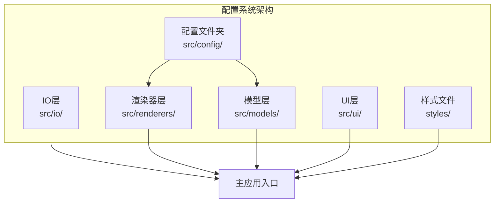

**图表来源**
- [colors.js:1-83](file://src/config/colors.js#L1-L83)
- [main.js:1-819](file://src/main.js#L1-L819)

**章节来源**
- [colors.js:1-83](file://src/config/colors.js#L1-L83)
- [main.js:1-819](file://src/main.js#L1-L819)

## 核心组件

### 颜色配置系统

颜色配置系统是整个配置管理的核心，提供了统一的颜色管理和渲染逻辑：

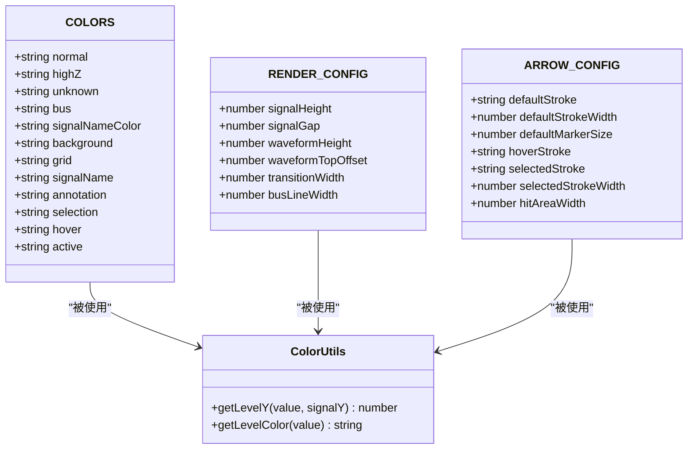

**图表来源**
- [colors.js:5-83](file://src/config/colors.js#L5-L83)

### 渲染配置管理

渲染配置系统负责控制波形图的视觉呈现参数：

| 配置类别 | 参数名称 | 默认值 | 作用描述 |
|---------|---------|--------|----------|
| 波形渲染 | signalHeight | 40 | 单个信号行的高度（像素） |
| 波形渲染 | signalGap | 10 | 信号行之间的间距（像素） |
| 波形渲染 | waveformHeight | 30 | 波形图形的高度（像素） |
| 波形渲染 | waveformTopOffset | 5 | 波形距离行顶部的偏移（像素） |
| 波形渲染 | transitionWidth | 1.2 | 跳变沿的宽度（像素） |
| 波形渲染 | busLineWidth | 2 | 总线双线的间距（像素） |
| 箭头配置 | defaultStroke | '#0078D7' | 默认箭头颜色 |
| 箭头配置 | defaultStrokeWidth | 1.5 | 默认箭头线宽（像素） |
| 箭头配置 | defaultMarkerSize | 4 | 箭头标记大小（像素） |
| 箭头配置 | hoverStroke | '#005A9E' | 悬停状态箭头颜色 |
| 箭头配置 | selectedStroke | '#FF6B00' | 选中状态箭头颜色 |
| 箭头配置 | selectedStrokeWidth | 2.5 | 选中状态箭头线宽（像素） |
| 箭头配置 | hitAreaWidth | 10 | 箭头命中区域宽度（像素） |

**章节来源**
- [colors.js:30-50](file://src/config/colors.js#L30-L50)

### 项目配置模型

项目配置模型提供了项目级别的视觉设置：

| 项目配置 | 类型 | 默认值 | 作用描述 |
|---------|------|--------|----------|
| id | string | 自动生成 | 项目唯一标识符 |
| name | string | '未命名项目' | 项目显示名称 |
| fontFamily | string | 系统字体 | 项目标题字体族 |
| titlePosition | string | 'bottom' | 标题位置（'top'/'bottom'） |
| titleFontSize | number | 14 | 标题字体大小（像素） |
| titleBold | boolean | false | 标题是否加粗 |
| signals | array | [] | 信号列表数组 |
| annotations | array | [] | 注释列表数组 |
| arrows | array | [] | 依赖箭头列表数组 |
| timeAxis | object | {unit:'ns', scale:10, start:0, end:100} | 时间轴配置 |

**章节来源**
- [Project.js:8-34](file://src/models/Project.js#L8-L34)

## 架构概览

配置管理系统采用分层架构设计，确保配置的可维护性和扩展性：

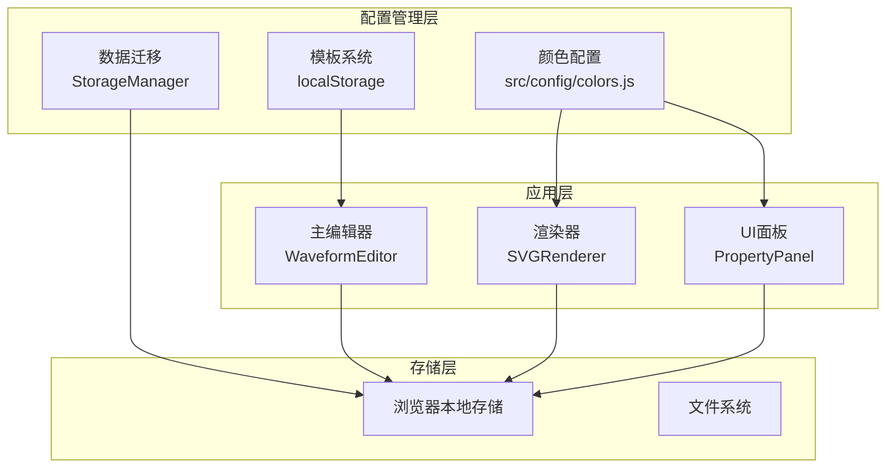

**图表来源**
- [main.js:21-44](file://src/main.js#L21-L44)
- [StorageManager.js:1-368](file://src/io/StorageManager.js#L1-L368)

## 详细组件分析

### 颜色配置管理器

颜色配置管理器是系统中最核心的配置组件，负责统一管理所有视觉颜色：

#### 颜色分类体系

系统采用多层次的颜色分类体系：

```mermaid
flowchart TD
Start[颜色配置开始] --> LevelColors[电平颜色]
LevelColors --> Normal[正常电平<br/>#000000]
LevelColors --> HighZ[高阻态<br/>#B8860B]
LevelColors --> Unknown[不定态<br/>#E00000]
LevelColors --> Bus[总线数据<br/>#000000]
Start --> UIElements[界面元素颜色]
UIElements --> Background[背景色<br/>#FFFFFF]
UIElements --> Grid[网格线<br/>#E0E0E0]
UIElements --> SignalName[信号名称<br/>#333333]
UIElements --> Annotation[标注颜色<br/>#666666]
Start --> Interaction[交互状态颜色]
Interaction --> Selection[选择框<br/>rgba(0,120,215,0.3)]
Interaction --> Hover[悬停高亮<br/>rgba(0,120,215,0.1)]
Interaction --> Active[激活状态<br/>#0078D7]
```

**图表来源**
- [colors.js:5-25](file://src/config/colors.js#L5-L25)

#### 渲染参数配置

渲染参数配置控制波形图的视觉表现：

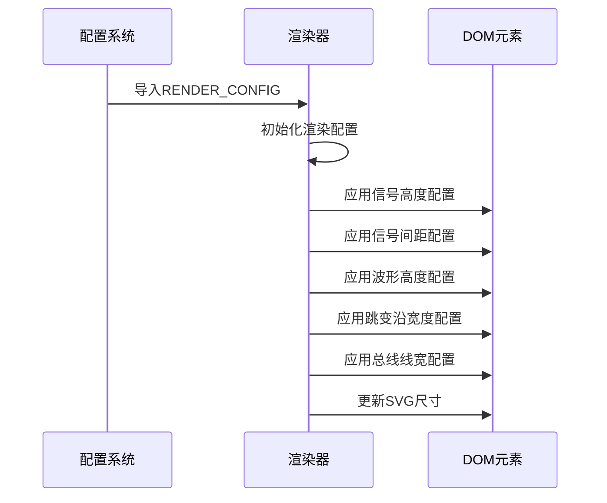

**图表来源**
- [SVGRenderer.js:21-28](file://src/renderers/SVGRenderer.js#L21-L28)
- [colors.js:30-37](file://src/config/colors.js#L30-L37)

**章节来源**
- [colors.js:5-83](file://src/config/colors.js#L5-L83)

### 模板系统

模板系统提供了配置的标准化和复用能力：

#### 模板加载流程

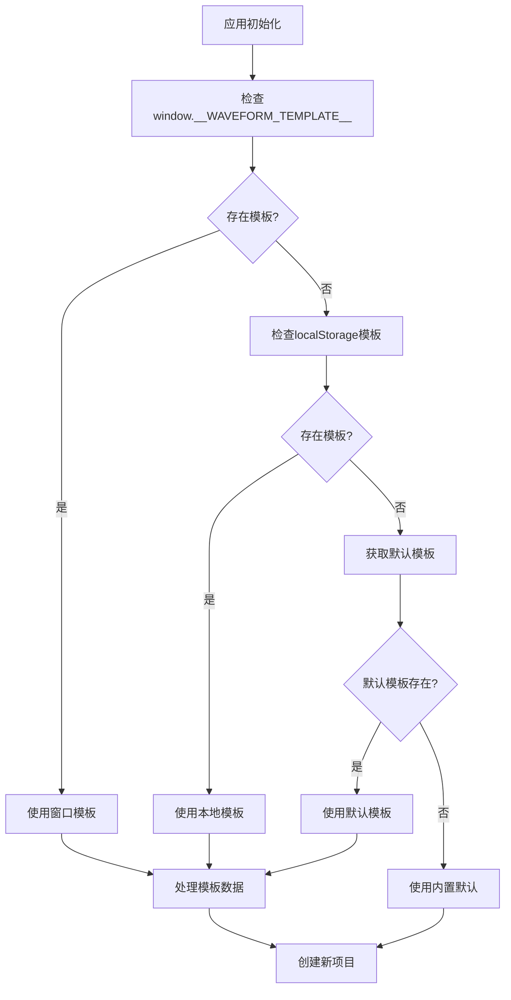

**图表来源**
- [main.js:138-210](file://src/main.js#L138-L210)

#### 模板配置选项

模板系统支持以下配置选项：

| 配置项 | 类型 | 默认值 | 说明 |
|-------|------|--------|------|
| id | string | 自动生成 | 项目唯一标识 |
| name | string | 'reset_iso_waveform' | 项目名称 |
| fontFamily | string | "'Times New Roman', serif" | 字体族 |
| titlePosition | string | 'bottom' | 标题位置 |
| titleFontSize | number | 16 | 标题字体大小 |
| titleBold | boolean | false | 标题加粗 |
| signals | array | 信号列表 | 包含时钟信号的完整配置 |

**章节来源**
- [default-template.json:1-800](file://default-template.json#L1-L800)

### 存储管理器

存储管理器负责配置数据的持久化和迁移：

#### 多项目存储架构

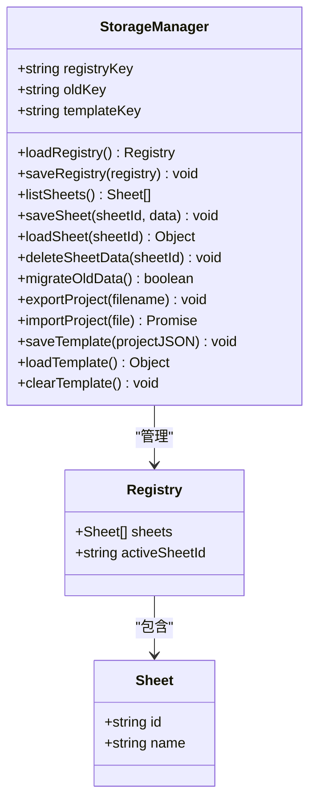

**图表来源**
- [StorageManager.js:1-368](file://src/io/StorageManager.js#L1-L368)

#### 数据迁移策略

系统实现了完整的数据迁移机制，确保向后兼容性：

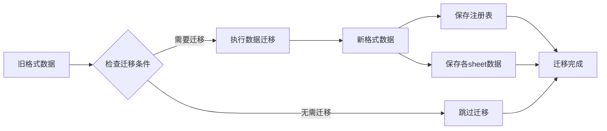

**图表来源**
- [StorageManager.js:138-164](file://src/io/StorageManager.js#L138-L164)

**章节来源**
- [StorageManager.js:1-368](file://src/io/StorageManager.js#L1-L368)

### 渲染器集成

渲染器通过配置系统实现动态视觉效果：

#### 渲染配置传递

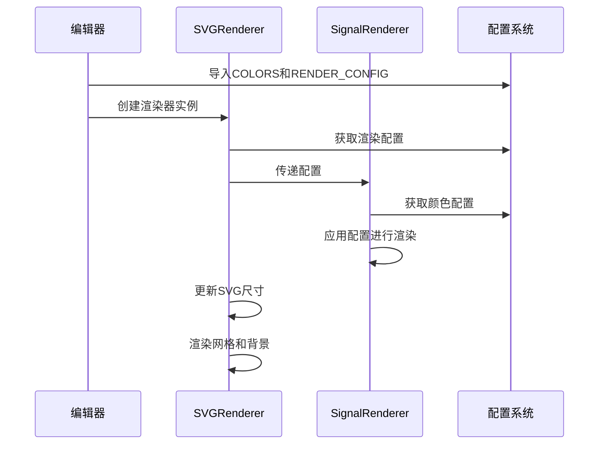

**图表来源**
- [SVGRenderer.js:5-40](file://src/renderers/SVGRenderer.js#L5-L40)
- [SignalRenderer.js:4-16](file://src/renderers/SignalRenderer.js#L4-L16)

#### 动态配置更新

渲染器支持配置的动态更新，无需重启应用：

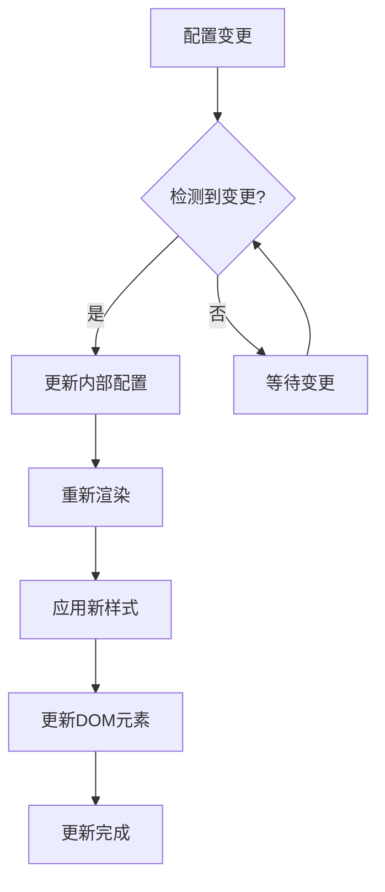

**章节来源**
- [SVGRenderer.js:284-314](file://src/renderers/SVGRenderer.js#L284-L314)
- [SignalRenderer.js:22-31](file://src/renderers/SignalRenderer.js#L22-L31)

### 用户界面集成

属性面板集成了配置管理功能，提供直观的配置界面：

#### 配置界面组件

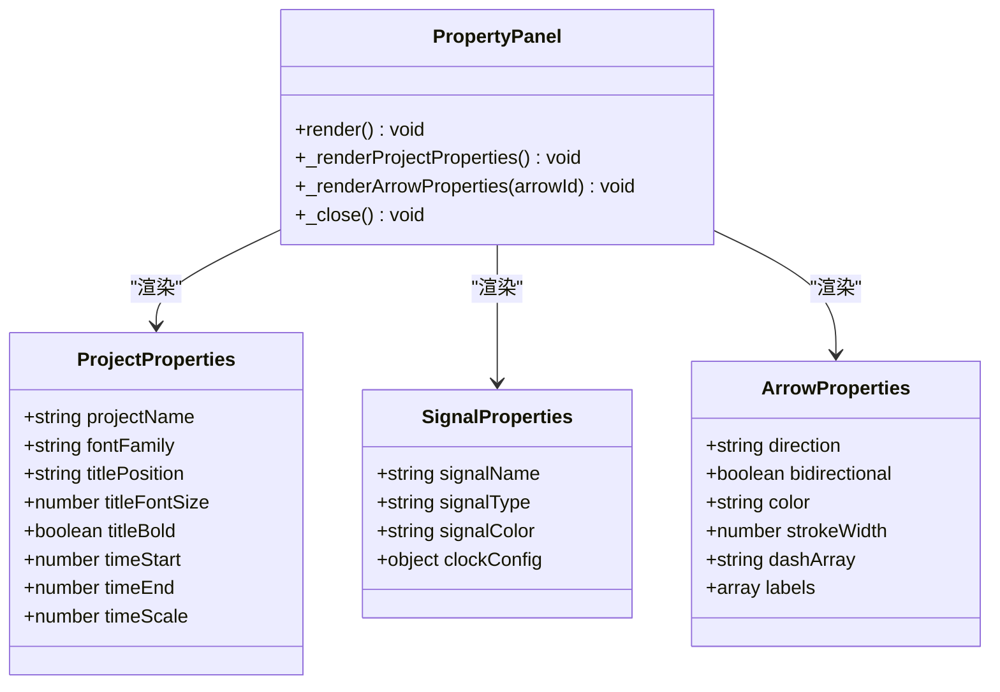

**图表来源**
- [PropertyPanel.js:32-237](file://src/ui/PropertyPanel.js#L32-L237)

#### 实时配置预览

属性面板提供了实时配置预览功能：

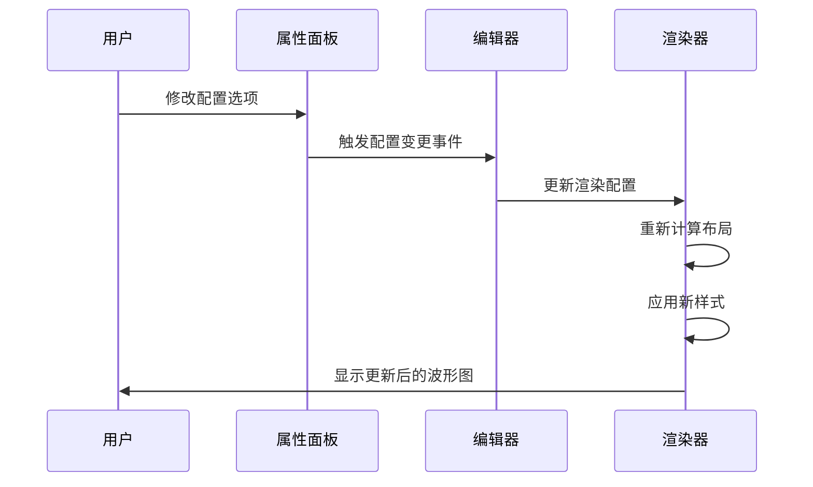

**图表来源**
- [PropertyPanel.js:126-132](file://src/ui/PropertyPanel.js#L126-L132)

**章节来源**
- [PropertyPanel.js:1-507](file://src/ui/PropertyPanel.js#L1-L507)

## 依赖关系分析

配置管理系统与其他模块的依赖关系如下：

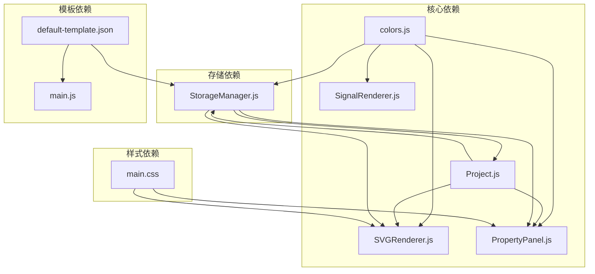

**图表来源**
- [main.js:4-16](file://src/main.js#L4-L16)
- [SVGRenderer.js:5-8](file://src/renderers/SVGRenderer.js#L5-L8)

### 配置耦合度分析

系统采用了松耦合的设计原则：

| 组件 | 耦合类型 | 说明 |
|------|----------|------|
| colors.js | 低耦合 | 纯配置文件，无业务逻辑 |
| SVGRenderer | 中等耦合 | 依赖颜色配置，但不直接修改 |
| PropertyPanel | 中等耦合 | 依赖项目配置，提供配置界面 |
| StorageManager | 低耦合 | 专注于数据持久化，不关心具体配置值 |
| Project | 低耦合 | 作为配置载体，不包含渲染逻辑 |

**章节来源**
- [main.js:4-16](file://src/main.js#L4-L16)
- [SVGRenderer.js:5-8](file://src/renderers/SVGRenderer.js#L5-L8)

## 性能考虑

配置管理系统在设计时充分考虑了性能优化：

### 配置缓存策略

系统采用了多层缓存机制：

1. **内存缓存**：配置数据在首次加载后缓存在内存中
2. **DOM缓存**：渲染结果缓存在DOM中，避免重复计算
3. **模板缓存**：常用配置模板缓存在localStorage中

### 渲染优化

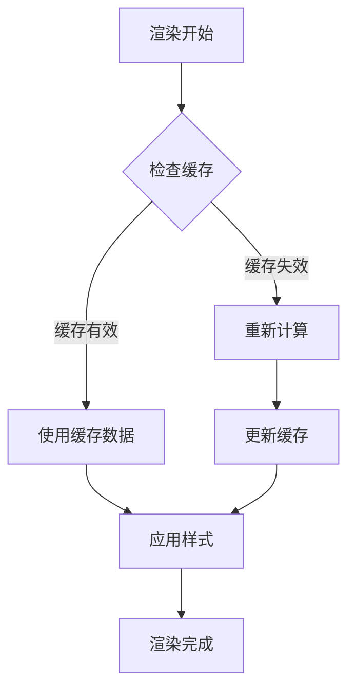

### 内存管理

系统实现了智能的内存管理策略：

- 配置对象采用不可变模式，避免意外修改
- 渲染器使用对象池技术，减少垃圾回收压力
- 模板系统支持增量更新，避免全量重绘

## 故障排除指南

### 常见配置问题

#### 颜色配置问题

**问题**：颜色显示异常或不生效
**解决方案**：
1. 检查颜色值格式是否正确（十六进制或RGBA）
2. 确认颜色值在有效范围内
3. 验证颜色配置是否被其他样式覆盖

#### 渲染配置问题

**问题**：波形图渲染异常或布局错乱
**解决方案**：
1. 检查RENDER_CONFIG参数是否合理
2. 验证信号高度和间距配置
3. 确认SVG尺寸计算逻辑

#### 模板加载问题

**问题**：模板无法加载或加载失败
**解决方案**：
1. 检查localStorage中是否存在模板数据
2. 验证模板JSON格式是否正确
3. 确认模板版本兼容性

### 调试工具

系统提供了多种调试工具：

```javascript
// 配置验证函数
function validateConfig(config) {
    const errors = [];
    
    // 验证颜色配置
    if (!isValidColor(config.colors)) {
        errors.push('颜色配置无效');
    }
    
    // 验证渲染配置
    if (!isValidRenderConfig(config.renderConfig)) {
        errors.push('渲染配置无效');
    }
    
    return errors;
}

// 配置重置函数
function resetConfig() {
    localStorage.removeItem('waveform-editor-template');
    localStorage.removeItem('waveform-editor-sheets');
    location.reload();
}
```

**章节来源**
- [StorageManager.js:334-368](file://src/io/StorageManager.js#L334-L368)

## 结论

波形图编辑器的配置管理系统通过模块化设计、分层架构和灵活的配置机制，为用户提供了强大的定制能力。系统的主要优势包括：

1. **统一管理**：所有配置集中在单一文件中，便于维护和修改
2. **灵活扩展**：支持新增配置项而无需修改核心代码
3. **向后兼容**：完善的迁移机制确保数据安全
4. **性能优化**：多层缓存和智能更新策略提升响应速度
5. **用户友好**：直观的配置界面和实时预览功能

该系统为波形图编辑器提供了坚实的基础，支持未来功能的扩展和定制需求。

## 附录

### 配置定制最佳实践

#### 颜色主题定制

建议按照以下步骤进行颜色主题定制：

1. **确定主题风格**：明暗主题、专业主题、高对比度主题
2. **制定颜色规范**：定义主色调、辅助色、强调色
3. **测试可访问性**：确保颜色对比度符合WCAG标准
4. **验证一致性**：检查颜色在不同场景下的表现

#### 渲染参数优化

建议根据使用场景调整渲染参数：

- **小屏幕设备**：减小信号高度，增加间距
- **高分辨率显示器**：适当增大字体和线宽
- **长时间使用**：选择柔和的颜色，减少眼部疲劳

#### 配置备份策略

建议定期备份配置数据：

```javascript
// 配置备份函数
function backupConfig() {
    const config = {
        colors: COLORS,
        renderConfig: RENDER_CONFIG,
        arrowConfig: ARROW_CONFIG,
        templates: localStorage.getItem('waveform-editor-template')
    };
    
    const blob = new Blob([JSON.stringify(config)], { type: 'application/json' });
    const url = URL.createObjectURL(blob);
    
    const a = document.createElement('a');
    a.href = url;
    a.download = 'waveform-config-backup.json';
    a.click();
    
    URL.revokeObjectURL(url);
}
```