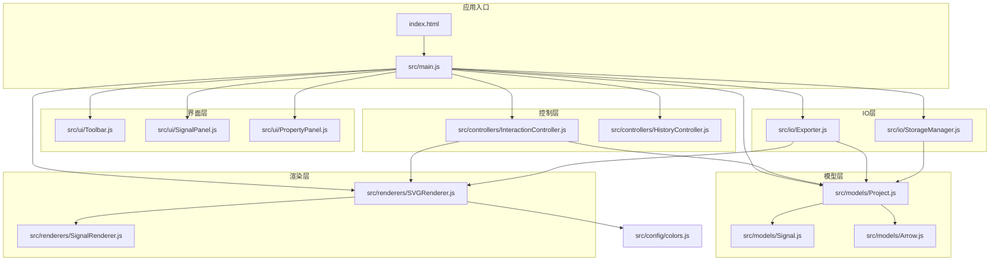
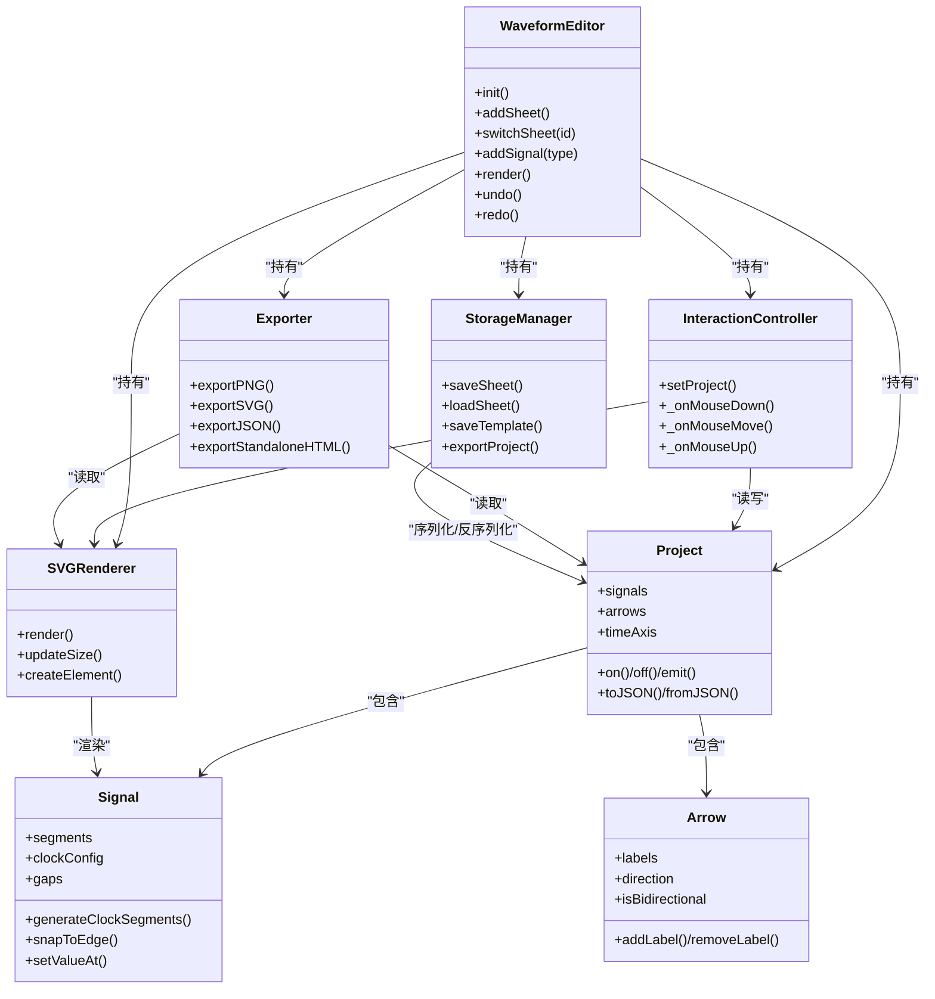
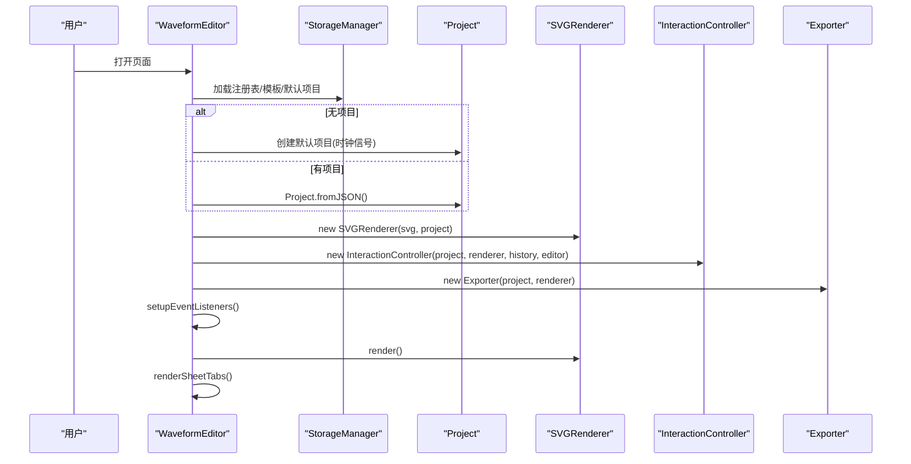
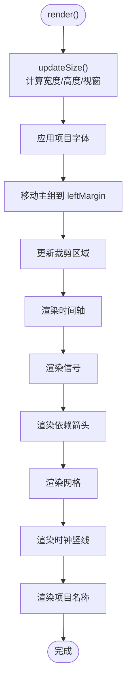
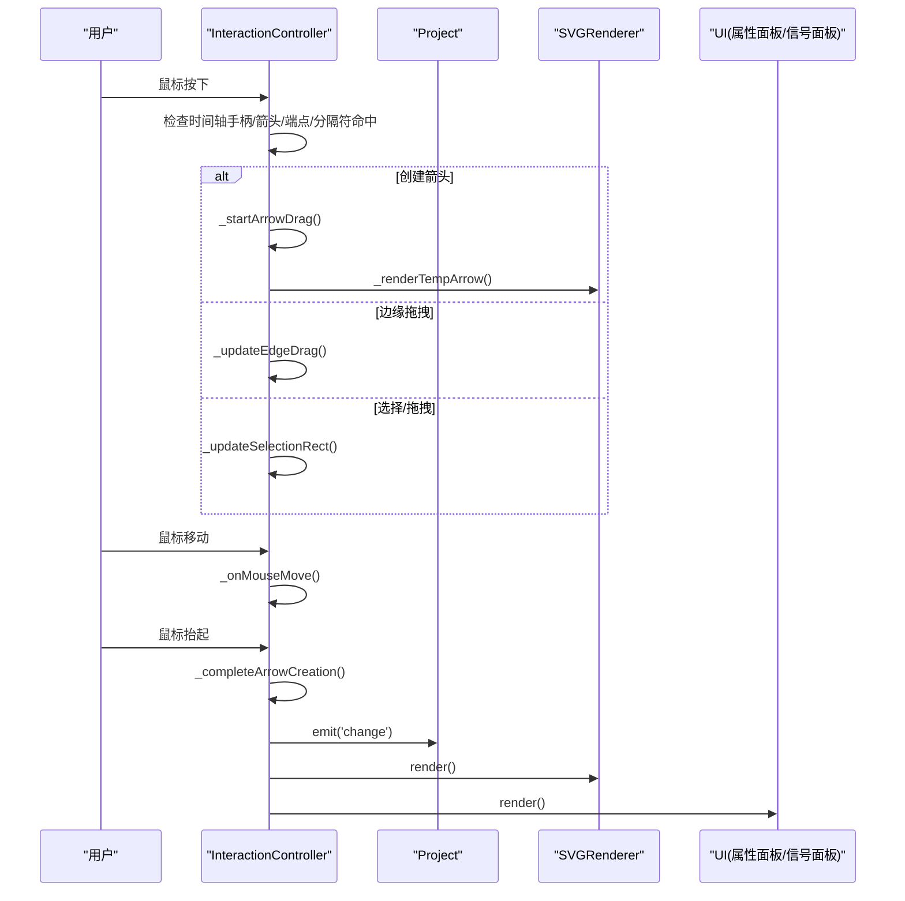
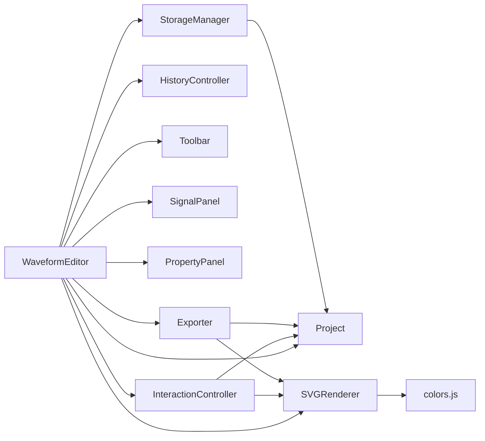

# 项目概述

<cite>
**本文档引用的文件**
- [src/main.js](file://src/main.js)
- [index.html](file://index.html)
- [src/models/Project.js](file://src/models/Project.js)
- [src/models/Signal.js](file://src/models/Signal.js)
- [src/models/Arrow.js](file://src/models/Arrow.js)
- [src/renderers/SVGRenderer.js](file://src/renderers/SVGRenderer.js)
- [src/renderers/SignalRenderer.js](file://src/renderers/SignalRenderer.js)
- [src/controllers/InteractionController.js](file://src/controllers/InteractionController.js)
- [src/controllers/HistoryController.js](file://src/controllers/HistoryController.js)
- [src/ui/Toolbar.js](file://src/ui/Toolbar.js)
- [src/ui/SignalPanel.js](file://src/ui/SignalPanel.js)
- [src/ui/PropertyPanel.js](file://src/ui/PropertyPanel.js)
- [src/io/Exporter.js](file://src/io/Exporter.js)
- [src/io/StorageManager.js](file://src/io/StorageManager.js)
- [src/config/colors.js](file://src/config/colors.js)
- [default-template.json](file://default-template.json)
</cite>

## 目录
1. [简介](#简介)
2. [项目结构](#项目结构)
3. [核心组件](#核心组件)
4. [架构总览](#架构总览)
5. [详细组件分析](#详细组件分析)
6. [依赖关系分析](#依赖关系分析)
7. [性能考量](#性能考量)
8. [故障排查指南](#故障排查指南)
9. [结论](#结论)
10. [附录](#附录)

## 简介
本项目是一个零依赖的纯 JavaScript 波形图编辑器，采用基于 SVG 的渲染系统与 MVC 架构模式，提供实时波形编辑、多信号类型管理（普通信号、时钟信号、总线信号）、依赖关系标注（箭头）、多工作表管理、模板系统以及多种导出格式（PNG、SVG、JSON、独立 HTML）。其设计目标是让用户在浏览器中即可完成波形图的创建、编辑与分享，无需服务器或第三方库依赖。

## 项目结构
项目采用模块化的前端架构，核心目录组织如下：
- src/main.js：应用入口与主控制器，负责初始化、事件绑定、多工作表管理、导入导出与渲染调度。
- src/models/*：数据模型层，包含 Project、Signal、Arrow、Segment 等。
- src/renderers/*：渲染层，负责 SVG 渲染与子渲染器协调（SignalRenderer、TimeAxisRenderer、DependencyRenderer）。
- src/controllers/*：控制层，负责交互逻辑与历史记录（InteractionController、HistoryController）。
- src/ui/*：界面组件（Toolbar、SignalPanel、PropertyPanel）。
- src/io/*：输入输出与存储（Exporter、StorageManager）。
- src/config/colors.js：统一的颜色与渲染配置。
- index.html：页面骨架与工具栏、面板布局。
- default-template.json：默认模板数据。



图表来源
- [src/main.js:1-132](file://src/main.js#L1-L132)
- [index.html:1-87](file://index.html#L1-L87)
- [src/models/Project.js:1-245](file://src/models/Project.js#L1-L245)
- [src/renderers/SVGRenderer.js:1-100](file://src/renderers/SVGRenderer.js#L1-L100)
- [src/controllers/InteractionController.js:1-83](file://src/controllers/InteractionController.js#L1-L83)
- [src/io/Exporter.js:1-60](file://src/io/Exporter.js#L1-L60)

章节来源
- [src/main.js:1-132](file://src/main.js#L1-L132)
- [index.html:1-87](file://index.html#L1-L87)

## 核心组件
- 应用主类 WaveformEditor：负责项目生命周期、多工作表管理、事件绑定、渲染调度与自动保存。
- 模型 Project：项目数据容器，维护信号、箭头、注释、时间轴配置，并提供事件通知。
- 模型 Signal：表示单个波形信号，支持普通、时钟、总线类型，提供段合并、吸附、时钟生成等能力。
- 模型 Arrow：表示信号间的依赖关系箭头，支持多标签标注、方向与双向配置。
- 渲染器 SVGRenderer：管理 SVG 画布、子渲染器与全局样式，负责尺寸计算、网格、时钟竖线、项目名称等。
- 控制器 InteractionController：处理鼠标/键盘交互、时间轴拖拽、箭头创建与编辑、分隔符拖拽、删除等。
- UI 组件：工具栏、信号面板、属性面板，提供可视化操作与参数编辑。
- IO 组件：Exporter 提供 PNG/SVG/JSON/独立 HTML 导出；StorageManager 负责本地存储、模板、多工作表注册表。

章节来源
- [src/main.js:21-132](file://src/main.js#L21-L132)
- [src/models/Project.js:8-245](file://src/models/Project.js#L8-L245)
- [src/models/Signal.js:7-343](file://src/models/Signal.js#L7-L343)
- [src/models/Arrow.js:5-114](file://src/models/Arrow.js#L5-L114)
- [src/renderers/SVGRenderer.js:10-100](file://src/renderers/SVGRenderer.js#L10-L100)
- [src/controllers/InteractionController.js:6-83](file://src/controllers/InteractionController.js#L6-L83)
- [src/ui/Toolbar.js:1-6](file://src/ui/Toolbar.js#L1-L6)
- [src/ui/SignalPanel.js:1-164](file://src/ui/SignalPanel.js#L1-L164)
- [src/ui/PropertyPanel.js:3-507](file://src/ui/PropertyPanel.js#L3-L507)
- [src/io/Exporter.js:1-298](file://src/io/Exporter.js#L1-L298)
- [src/io/StorageManager.js](file://src/io/StorageManager.js)

## 架构总览
系统遵循 MVC 架构：
- Model：Project/Signal/Arrow/Segment，负责数据与业务规则。
- View：SVGRenderer 与子渲染器，负责将数据渲染为 SVG。
- Controller：InteractionController/HistoryController，负责交互与历史管理。
- UI：Toolbar/SignalPanel/PropertyPanel，负责用户交互与参数编辑。
- IO：Exporter/StorageManager，负责导入导出与持久化。



图表来源
- [src/main.js:21-132](file://src/main.js#L21-L132)
- [src/models/Project.js:8-245](file://src/models/Project.js#L8-L245)
- [src/models/Signal.js:7-343](file://src/models/Signal.js#L7-L343)
- [src/models/Arrow.js:5-114](file://src/models/Arrow.js#L5-L114)
- [src/renderers/SVGRenderer.js:10-100](file://src/renderers/SVGRenderer.js#L10-L100)
- [src/controllers/InteractionController.js:6-83](file://src/controllers/InteractionController.js#L6-L83)
- [src/io/Exporter.js:1-60](file://src/io/Exporter.js#L1-L60)
- [src/io/StorageManager.js](file://src/io/StorageManager.js)

## 详细组件分析

### 应用主类 WaveformEditor
- 职责：初始化应用、加载/保存项目、多工作表管理、事件绑定、渲染调度、自动保存。
- 关键流程：init() -> 加载注册表/模板/默认项目 -> 初始化渲染器/控制器/UI -> 绑定事件 -> 初始渲染 -> 渲染工作表标签。
- 多工作表：addSheet()/switchSheet()/deleteSheet()/renameSheet()，通过 StorageManager 管理注册表与数据。
- 导出：通过 Exporter 支持 PNG/SVG/JSON/独立 HTML。
- 模板：优先使用 __WAVEFORM_TEMPLATE__，其次 localStorage 模板，再次 default-template.json，最后回退到内置默认时钟项目。



图表来源
- [src/main.js:49-132](file://src/main.js#L49-L132)
- [src/main.js:138-210](file://src/main.js#L138-L210)
- [src/main.js:246-346](file://src/main.js#L246-L346)
- [src/io/Exporter.js:1-60](file://src/io/Exporter.js#L1-L60)

章节来源
- [src/main.js:49-132](file://src/main.js#L49-L132)
- [src/main.js:138-210](file://src/main.js#L138-L210)
- [src/main.js:246-346](file://src/main.js#L246-L346)

### 模型层：Project/Signal/Arrow
- Project：维护项目元信息（名称、字体、标题位置/字号/加粗）、时间轴（单位、缩放、起止）、信号与箭头集合，提供事件通知机制。
- Signal：支持普通/时钟/总线类型，提供段合并、吸附、时钟生成、分隔符 gap 等能力。
- Arrow：支持多标签标注、方向（自动/正向/反向）、双向箭头、样式（颜色/线宽/线型）。

```mermaid
classDiagram
class Project {
+id
+name
+fontFamily
+titlePosition
+titleFontSize
+titleBold
+signals[]
+annotations[]
+arrows[]
+timeAxis{unit,scale,start,end}
+on()/off()/emit()
+toJSON()/fromJSON()
}
class Signal {
+id
+name
+type
+color
+segments[]
+clockConfig
+gaps[]
+generateClockSegments()
+snapToEdge()
+setValueAt()
}
class Arrow {
+id
+fromSignalId
+fromTime
+toSignalId
+toTime
+controlPointOffset
+direction
+isBidirectional
+labels[]
+style{stroke,strokeWidth,markerSize,dashArray}
+addLabel()/removeLabel()
}
Project "1" o--> "*" Signal : "包含"
Project "1" o--> "*" Arrow : "包含"
```

图表来源
- [src/models/Project.js:8-245](file://src/models/Project.js#L8-L245)
- [src/models/Signal.js:7-343](file://src/models/Signal.js#L7-L343)
- [src/models/Arrow.js:5-114](file://src/models/Arrow.js#L5-L114)

章节来源
- [src/models/Project.js:8-245](file://src/models/Project.js#L8-L245)
- [src/models/Signal.js:7-343](file://src/models/Signal.js#L7-L343)
- [src/models/Arrow.js:5-114](file://src/models/Arrow.js#L5-L114)

### 渲染层：SVGRenderer 与 SignalRenderer
- SVGRenderer：管理 SVG 画布、主组、时间轴组、信号组、交互层、依赖箭头层，负责尺寸计算、网格、时钟竖线、项目名称渲染、裁剪区域等。
- SignalRenderer：渲染信号名称、波形线、分隔符（gap）与命中区域，支持总线 X 态的特殊处理与 mask 裁剪。



图表来源
- [src/renderers/SVGRenderer.js:284-314](file://src/renderers/SVGRenderer.js#L284-L314)
- [src/renderers/SVGRenderer.js:194-243](file://src/renderers/SVGRenderer.js#L194-L243)
- [src/renderers/SVGRenderer.js:393-419](file://src/renderers/SVGRenderer.js#L393-L419)
- [src/renderers/SVGRenderer.js:421-522](file://src/renderers/SVGRenderer.js#L421-L522)

章节来源
- [src/renderers/SVGRenderer.js:10-100](file://src/renderers/SVGRenderer.js#L10-L100)
- [src/renderers/SVGRenderer.js:284-314](file://src/renderers/SVGRenderer.js#L284-L314)
- [src/renderers/SignalRenderer.js:1-200](file://src/renderers/SignalRenderer.js#L1-L200)

### 控制层：InteractionController
- 职责：处理鼠标/键盘交互、时间轴拖拽、箭头创建与编辑、分隔符拖拽、删除、选择状态管理。
- 关键交互：Alt+拖拽创建箭头、双击箭头添加标注、拖拽端点/文字、边缘拖拽移动段、时间轴边缘滚动扩展。
- 与渲染器协作：通过 renderer.updateSize()/render() 实时刷新。



图表来源
- [src/controllers/InteractionController.js:84-184](file://src/controllers/InteractionController.js#L84-L184)
- [src/controllers/InteractionController.js:284-337](file://src/controllers/InteractionController.js#L284-L337)
- [src/controllers/InteractionController.js:572-756](file://src/controllers/InteractionController.js#L572-L756)

章节来源
- [src/controllers/InteractionController.js:6-83](file://src/controllers/InteractionController.js#L6-L83)
- [src/controllers/InteractionController.js:84-184](file://src/controllers/InteractionController.js#L84-L184)
- [src/controllers/InteractionController.js:284-337](file://src/controllers/InteractionController.js#L284-L337)
- [src/controllers/InteractionController.js:572-756](file://src/controllers/InteractionController.js#L572-L756)

### UI 层：Toolbar/SignalPanel/PropertyPanel
- Toolbar：承载工具按钮（添加信号/时钟、撤销/重做、打开/保存/导出、模板、独立 HTML 等）。
- SignalPanel：信号列表，支持拖拽排序、删除、与波形区域滚动同步、垂直对齐。
- PropertyPanel：信号属性（名称/类型/颜色/时钟参数/时间轴）、箭头属性（方向/双向/颜色/线宽/线型/标注）、项目属性（字体/标题/时间轴）。

章节来源
- [src/ui/Toolbar.js:1-6](file://src/ui/Toolbar.js#L1-L6)
- [src/ui/SignalPanel.js:1-164](file://src/ui/SignalPanel.js#L1-L164)
- [src/ui/PropertyPanel.js:3-507](file://src/ui/PropertyPanel.js#L3-L507)

### IO 层：Exporter/StorageManager
- Exporter：导出 PNG（可选缩放）、SVG、JSON；支持复制到剪贴板（优先 Clipboard API，回退到 data URL 或新开窗口）；导出独立 HTML（内联所有 JS/CSS，模板注入）。
- StorageManager：管理多工作表注册表、sheet 数据、模板、导入/导出项目文件（.wfp/.json）。

章节来源
- [src/io/Exporter.js:1-298](file://src/io/Exporter.js#L1-L298)
- [src/io/StorageManager.js](file://src/io/StorageManager.js)

## 依赖关系分析
- 模块耦合：WaveformEditor 作为中枢，依赖 Project/Renderer/Controller/UI/IO；Renderer 依赖 Config；Controller 依赖 Project/Renderer；Exporter/StorageManager 依赖 Project/Renderer。
- 事件驱动：Project 提供 on/off/emit，用于跨模块解耦通知。
- 无外部依赖：所有功能基于原生 JavaScript 与浏览器 API。



图表来源
- [src/main.js:49-132](file://src/main.js#L49-L132)
- [src/renderers/SVGRenderer.js:10-100](file://src/renderers/SVGRenderer.js#L10-L100)
- [src/controllers/InteractionController.js:6-83](file://src/controllers/InteractionController.js#L6-L83)
- [src/io/Exporter.js:1-60](file://src/io/Exporter.js#L1-L60)
- [src/config/colors.js:1-83](file://src/config/colors.js#L1-L83)

章节来源
- [src/main.js:49-132](file://src/main.js#L49-L132)
- [src/renderers/SVGRenderer.js:10-100](file://src/renderers/SVGRenderer.js#L10-L100)
- [src/controllers/InteractionController.js:6-83](file://src/controllers/InteractionController.js#L6-L83)
- [src/io/Exporter.js:1-60](file://src/io/Exporter.js#L1-L60)
- [src/config/colors.js:1-83](file://src/config/colors.js#L1-L83)

## 性能考量
- 渲染优化：SVGRenderer 在 render() 中仅更新必要元素，使用裁剪区域避免溢出绘制；SignalRenderer 使用 mask 裁剪 gap 区域，减少重绘。
- 事件节流：窗口 resize 使用定时器防抖；时间轴边缘滚动使用 requestAnimationFrame。
- 数据结构：Signal 段合并与相邻同值段合并，降低渲染复杂度。
- 导出性能：PNG 导出使用离屏 canvas，支持缩放；独立 HTML 导出内联脚本，避免额外请求。

## 故障排查指南
- 无法加载 SVG 元素：初始化时若找不到 #waveformSvg 将抛出错误，检查 index.html 中 SVG 容器是否存在。
- 模板加载失败：优先级为 __WAVEFORM_TEMPLATE__ -> localStorage 模板 -> default-template.json -> 内置默认；若均失败，回退到默认时钟项目。
- 多工作表异常：检查注册表与 sheet 数据一致性；删除最后一个工作表时不会真正删除，而是清空。
- 导出失败：独立 HTML 导出需通过 HTTP 服务器访问；复制到剪贴板失败时会尝试 data URL 或新开窗口。
- 交互异常：确认事件监听是否绑定成功；Alt+拖拽创建箭头时注意吸附到目标信号的最近跳变沿。

章节来源
- [src/main.js:90-94](file://src/main.js#L90-L94)
- [src/main.js:138-210](file://src/main.js#L138-L210)
- [src/main.js:310-332](file://src/main.js#L310-L332)
- [src/io/Exporter.js:200-298](file://src/io/Exporter.js#L200-L298)

## 结论
本项目以零依赖的纯 JavaScript 实现，采用 MVC 架构与基于 SVG 的渲染系统，提供了完整的波形图编辑能力：实时编辑、多信号类型、依赖标注、多工作表、模板与多种导出格式。其模块化设计与事件驱动机制使得扩展与维护较为便利，适合教学演示、文档编写与轻量级波形图制作场景。

## 附录

### 快速开始
- 环境要求：现代浏览器（支持 ES6 模块与 Clipboard API 更佳）。
- 启动方式：通过 HTTP 服务器启动，确保可访问 default-template.json 与静态资源。
- 基本流程：
  1) 打开页面，自动加载模板或默认时钟项目。
  2) 点击“+ 信号”或“+ 时钟”添加信号。
  3) 在波形区域拖拽段边缘或时间轴手柄进行编辑。
  4) Alt+拖拽创建依赖箭头，双击箭头添加标注。
  5) 使用工具栏导出 PNG/SVG/JSON 或导出独立 HTML。
  6) 使用“保存项目(.wfp)”与“打开项目(.wfp)”进行持久化。

章节来源
- [index.html:12-41](file://index.html#L12-L41)
- [src/main.js:49-132](file://src/main.js#L49-L132)

### 核心概念
- 信号类型：普通信号（0/1）、时钟信号（周期/相位/占空比）、总线信号（字符串值）。
- 依赖箭头：支持自动/正向/反向方向、双向箭头、多标签标注、不同线型与颜色。
- 多工作表：每个工作表为一个独立 Project，通过注册表管理切换与重命名。
- 模板：可保存当前波形为模板，在新建时自动使用。

章节来源
- [src/models/Signal.js:7-343](file://src/models/Signal.js#L7-L343)
- [src/models/Arrow.js:5-114](file://src/models/Arrow.js#L5-L114)
- [src/main.js:246-346](file://src/main.js#L246-L346)
- [src/io/Exporter.js:200-298](file://src/io/Exporter.js#L200-L298)